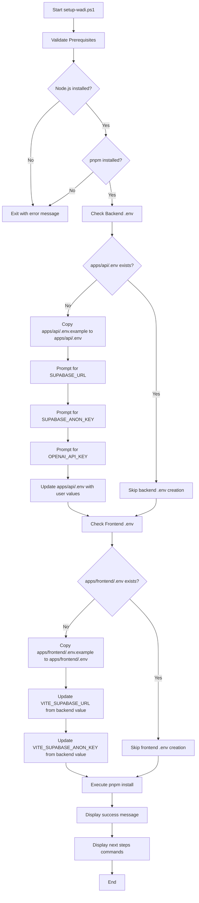

# Automatic WADI Setup Design

## Objective

Create an automated setup workflow for WADI on local development environments that streamlines the initial configuration process by validating prerequisites, managing environment variables, and guiding developers through the setup steps.

## Background

Currently, WADI Beta 1 requires manual configuration across multiple files and locations. Developers must:

- Manually copy `.env.example` files in both `apps/api` and `apps/frontend` directories
- Enter configuration values separately in multiple locations
- Manually verify Node.js and pnpm installation
- Remember and execute multiple commands in sequence

This manual process is error-prone and time-consuming, especially for new developers onboarding to the project.

## Scope

This design introduces an automated setup script and updated documentation without modifying WADI Beta 1's functional scope. The solution focuses exclusively on developer experience improvements for initial environment setup.

### In Scope

- PowerShell automation script creation
- Environment variable management
- Prerequisites validation
- README.md documentation updates
- User prompts for sensitive credentials

### Out of Scope

- Modifications to WADI Beta 1 features or functionality
- Database schema setup automation
- Supabase project creation automation
- Cross-platform setup scripts (Linux/macOS)
- Automated testing or validation of configured services

## Solution Design

### Component 1: PowerShell Automation Script

**File Location**: `setup-wadi.ps1` (project root)

**Purpose**: Automate the initial setup process by validating prerequisites, managing environment files, collecting user credentials, and installing dependencies.

#### Workflow



#### Script Structure

| Section                            | Responsibility                                                                 |
| ---------------------------------- | ------------------------------------------------------------------------------ |
| **Prerequisites Validation**       | Verify Node.js and pnpm are installed and accessible in PATH                   |
| **Environment File Management**    | Copy `.env.example` files only if `.env` does not exist                        |
| **User Input Collection**          | Prompt for SUPABASE_URL, SUPABASE_ANON_KEY, and OPENAI_API_KEY                 |
| **Environment Variable Injection** | Update `.env` files with user-provided values while preserving other variables |
| **Dependency Installation**        | Execute `pnpm install` in project root                                         |
| **User Guidance**                  | Display commands for starting backend and frontend services                    |

#### Prerequisites Validation Logic

The script validates tool availability by attempting to execute version commands:

**Validation Criteria**:

- Node.js: Command `node --version` must succeed
- pnpm: Command `pnpm --version` must succeed

**Failure Behavior**: If either tool is missing, the script displays an error message identifying the missing tool and exits with a non-zero status code.

#### Environment Variable Management Strategy

**Backend Environment File** (`apps/api/.env`):

| Variable             | Source                      | Notes                           |
| -------------------- | --------------------------- | ------------------------------- |
| PORT                 | Preserved from .env.example | Default: 4000                   |
| NODE_ENV             | Preserved from .env.example | Default: development            |
| SUPABASE_URL         | User input                  | Prompted during setup           |
| SUPABASE_ANON_KEY    | User input                  | Prompted during setup           |
| SUPABASE_SERVICE_KEY | Preserved as placeholder    | User must update manually later |
| OPENAI_API_KEY       | User input                  | Prompted during setup           |
| OPENAI_DEFAULT_MODEL | Preserved from .env.example | Default: gpt-3.5-turbo          |
| FRONTEND_URL         | Preserved from .env.example | Default: <http://localhost:5173>  |

**Frontend Environment File** (`apps/frontend/.env`):

| Variable               | Source                                 | Notes                          |
| ---------------------- | -------------------------------------- | ------------------------------ |
| VITE_SUPABASE_URL      | Derived from backend SUPABASE_URL      | Auto-populated from user input |
| VITE_SUPABASE_ANON_KEY | Derived from backend SUPABASE_ANON_KEY | Auto-populated from user input |
| VITE_API_URL           | Preserved from .env.example            | Default: <http://localhost:4000> |

**Update Strategy**:

- Read existing .env.example content
- Replace only the targeted variable values using regex pattern matching
- Preserve comments, formatting, and non-targeted variables
- Write updated content to .env file

#### User Input Flow

**Prompt Sequence**:

1. **SUPABASE_URL**
   - Message: "Enter your Supabase project URL (e.g., <https://yourproject.supabase.co>):"
   - Validation: None (user responsible for correct format)

2. **SUPABASE_ANON_KEY**
   - Message: "Enter your Supabase anon key:"
   - Validation: None (sensitive data, not displayed)

3. **OPENAI_API_KEY**
   - Message: "Enter your OpenAI API key (starts with sk-):"
   - Validation: None (sensitive data, not displayed)

**Input Handling**:

- Use PowerShell `Read-Host` for user input
- No masking for URL (visible)
- Consider masking for API keys if PowerShell version supports it
- Trim whitespace from all inputs

#### Dependency Installation

**Command**: `pnpm install`

**Execution Context**: Project root directory

**Behavior**:

- Execute in synchronous blocking mode
- Display installation output to console
- Check exit code to determine success/failure

#### Completion Messaging

**Success Output Template**:

```text
✔ WADI setup completed successfully!

Next steps:
1. Start the backend API:
   pnpm --filter api dev

2. Start the frontend (in a separate terminal):
   pnpm --filter frontend dev

3. Access the application:
   - Frontend: http://localhost:5173
   - API: http://localhost:4000

Note: You still need to configure your Supabase database schema.
See docs/database-schema.md for instructions.
```

### Component 2: README Documentation Update

**File**: `README.md` (project root)

**Change Type**: Additive (new section insertion)

**Section Title**: "Quick Setup"

**Placement**: Insert after the "Prerequisites" section and before the existing detailed "Setup Instructions" section

#### Content Structure

The new section will include:

**Introduction**: Brief explanation that the quick setup automates the manual process

**Step-by-Step Instructions**:

1. **Clone and Navigate**
   - Assumes user has already cloned the repository
   - Reference to navigating to project root

2. **Run Setup Script**
   - Command to execute: `.\setup-wadi.ps1`
   - Note about PowerShell execution policy if needed

3. **Provide Configuration Values**
   - List the three prompted values (SUPABASE_URL, SUPABASE_ANON_KEY, OPENAI_API_KEY)
   - Reference to Supabase dashboard for obtaining these values

4. **Start Development Services**
   - Commands for starting backend and frontend
   - Note about running in separate terminals

5. **Verify Installation**
   - Access URLs to test
   - Expected behavior description

6. **Complete Database Setup**
   - Reference to database schema documentation
   - Link to docs/database-schema.md

7. **Test the Application Flow**
   - Quick verification steps:
     - Register a new user account
     - Create a project
     - Execute a test run with OpenAI

**Relationship to Existing Documentation**:

- Position "Quick Setup" as the recommended path for new developers
- Retain existing detailed setup instructions for users who prefer manual configuration or need troubleshooting reference
- Add cross-reference from detailed instructions to quick setup

#### Documentation Tone and Style

- Concise and action-oriented
- Use imperative mood for instructions
- Include expected outcomes where helpful
- Maintain consistency with existing README formatting

## Technical Considerations

### PowerShell Compatibility

**Target Version**: PowerShell 5.1+ (Windows PowerShell) and PowerShell 7+ (PowerShell Core)

**Compatibility Approach**:

- Use cmdlets available in PowerShell 5.1
- Avoid platform-specific features
- Test on Windows 10/11 environments

### Error Handling

**Strategy**: Fail-fast with clear error messages

**Error Scenarios**:

| Scenario             | Handling                                                       |
| -------------------- | -------------------------------------------------------------- |
| Missing Node.js      | Display error message, exit with code 1                        |
| Missing pnpm         | Display error message with installation link, exit with code 1 |
| File system errors   | Display error with file path, exit with code 1                 |
| pnpm install failure | Display error output, exit with code 1                         |

### Security Considerations

**Sensitive Data Handling**:

- API keys and credentials entered via interactive prompts
- No logging or echoing of sensitive values
- Environment files (.env) should already be in .gitignore
- Script does not transmit any data externally

**Validation Limitations**:

- Script does not validate credential correctness
- User responsible for providing valid values
- Invalid credentials will be detected during application runtime

### File System Operations

**Safety Measures**:

- Check for existing .env files before overwriting
- Preserve existing .env files if present
- Use atomic write operations where possible

**Path Resolution**:

- Use relative paths from script location
- Handle spaces in directory names
- Use PowerShell's path joining cmdlets

## Implementation Notes

### Script Development Approach

1. Create script skeleton with section comments
2. Implement prerequisites validation
3. Implement environment file detection and copying
4. Implement user input prompts
5. Implement regex-based variable replacement
6. Implement dependency installation
7. Add error handling throughout
8. Test on clean environment

### Testing Strategy

**Manual Testing Checklist**:

- [ ] Script runs with Node.js and pnpm installed
- [ ] Script fails gracefully when Node.js is missing
- [ ] Script fails gracefully when pnpm is missing
- [ ] Script creates .env files when they don't exist
- [ ] Script preserves existing .env files
- [ ] User inputs correctly update backend .env
- [ ] Frontend .env correctly receives values from backend input
- [ ] pnpm install executes successfully
- [ ] Success message displays correct commands
- [ ] Backend starts with created .env
- [ ] Frontend starts with created .env

### Documentation Review Points

**README.md Review Criteria**:

- [ ] Quick Setup section is clear and concise
- [ ] Steps are in logical order
- [ ] Commands are copy-paste ready
- [ ] Links to additional resources are correct
- [ ] Formatting is consistent with existing sections
- [ ] Testing flow is actionable

## Risks and Mitigation

| Risk                                       | Impact | Mitigation                                                                             |
| ------------------------------------------ | ------ | -------------------------------------------------------------------------------------- |
| PowerShell execution policy blocks script  | High   | Document how to bypass for script execution                                            |
| User provides invalid credentials          | Medium | Include validation guidance in prompts; runtime errors will surface issues             |
| Regex replacement breaks .env format       | Medium | Thorough testing with various .env.example formats; use conservative patterns          |
| pnpm install fails due to network issues   | Low    | Display error output; user can re-run script or install manually                       |
| Cross-platform users attempt to use script | Low    | Clearly document Windows/PowerShell requirement; maintain existing manual instructions |

## Success Metrics

**Qualitative Indicators**:

- New developers can complete setup in under 5 minutes
- Setup-related support questions decrease
- README "Quick Setup" section is referenced in onboarding

**Validation Criteria**:

- Script successfully completes on clean Windows environment
- All environment files are correctly populated
- Applications start without configuration errors

## Dependencies

**External Dependencies**:

- Node.js (v18 or later) - Runtime environment
- pnpm (v10.21.0 or later) - Package manager
- PowerShell (5.1 or later) - Script execution environment

**Project Dependencies**:

- Existing `.env.example` files in `apps/api` and `apps/frontend`
- Valid `pnpm-workspace.yaml` configuration
- Package.json files in all workspace packages

**User-Provided Dependencies**:

- Supabase account and project (for URL and keys)
- OpenAI API account (for API key)

## Future Enhancements

**Not included in current scope but could be considered for future iterations**:

- Cross-platform support (Bash script for Linux/macOS)
- Validation of API key format and connectivity
- Interactive Supabase project creation
- Automated database schema deployment
- Configuration validation after setup completion
- Support for additional environment variables as WADI evolves
- Idempotent re-run capability with configuration updates

## Appendix

### PowerShell Script Pseudocode

```text
FUNCTION Validate-Prerequisites:
  IF node command not found:
    Display error: "Node.js is not installed"
    Exit with code 1
  IF pnpm command not found:
    Display error: "pnpm is not installed"
    Exit with code 1
  Display success: "Prerequisites validated"

FUNCTION Setup-Backend-Environment:
  SET backend_env_path = "apps/api/.env"
  SET backend_example_path = "apps/api/.env.example"

  IF backend_env_path exists:
    Display info: ".env already exists, skipping backend setup"
    RETURN

  Copy backend_example_path to backend_env_path

  PROMPT user for supabase_url
  PROMPT user for supabase_anon_key
  PROMPT user for openai_api_key

  READ backend_env_path content
  REPLACE "SUPABASE_URL=.*" with "SUPABASE_URL=" + supabase_url
  REPLACE "SUPABASE_ANON_KEY=.*" with "SUPABASE_ANON_KEY=" + supabase_anon_key
  REPLACE "OPENAI_API_KEY=.*" with "OPENAI_API_KEY=" + openai_api_key
  WRITE updated content to backend_env_path

  RETURN {supabase_url, supabase_anon_key}

FUNCTION Setup-Frontend-Environment(supabase_url, supabase_anon_key):
  SET frontend_env_path = "apps/frontend/.env"
  SET frontend_example_path = "apps/frontend/.env.example"

  IF frontend_env_path exists:
    Display info: ".env already exists, skipping frontend setup"
    RETURN

  Copy frontend_example_path to frontend_env_path

  READ frontend_env_path content
  REPLACE "VITE_SUPABASE_URL=.*" with "VITE_SUPABASE_URL=" + supabase_url
  REPLACE "VITE_SUPABASE_ANON_KEY=.*" with "VITE_SUPABASE_ANON_KEY=" + supabase_anon_key
  WRITE updated content to frontend_env_path

FUNCTION Install-Dependencies:
  Display info: "Installing dependencies..."
  EXECUTE "pnpm install" in root directory
  IF exit code is not 0:
    Display error: "Dependency installation failed"
    Exit with code 1
  Display success: "Dependencies installed"

FUNCTION Display-Next-Steps:
  Display message:
    """
    ✔ WADI setup completed successfully!

    Next steps:
    1. Start the backend API:
       pnpm --filter api dev

    2. Start the frontend (in a separate terminal):
       pnpm --filter frontend dev

    3. Access the application:
       - Frontend: http://localhost:5173
       - API: http://localhost:4000

    Note: You still need to configure your Supabase database schema.
    See docs/database-schema.md for instructions.
    """

MAIN:
  Display header: "WADI Automatic Setup"

  Validate-Prerequisites()

  credentials = Setup-Backend-Environment()

  IF credentials is not null:
    Setup-Frontend-Environment(credentials.supabase_url, credentials.supabase_anon_key)

  Install-Dependencies()

  Display-Next-Steps()

  Exit with code 0
```

### README.md Quick Setup Section Content

**Section Title**: Quick Setup

**Content**:

For a streamlined setup experience, use the automated setup script that handles environment configuration and dependency installation.

**Prerequisites**:

- Node.js (v18 or later) installed
- pnpm (v10.21.0 or later) installed
- Supabase account with a project created
- OpenAI API key

**Steps**:

1. Navigate to the project root directory

2. Run the setup script:

   ```powershell
   .\setup-wadi.ps1
   ```

   Note: If you encounter execution policy errors, you may need to run:

   ```powershell
   Set-ExecutionPolicy -Scope Process -ExecutionPolicy Bypass
   ```

3. When prompted, provide your configuration values:
   - **Supabase URL**: Found in your Supabase project settings under API (e.g., `https://yourproject.supabase.co`)
   - **Supabase Anon Key**: Found in the same location under "Project API keys"
   - **OpenAI API Key**: Obtain from <https://platform.openai.com/api-keys> (starts with `sk-`)

4. The script will automatically:
   - Create environment files for both backend and frontend
   - Install all project dependencies
   - Display next steps

5. Set up your Supabase database schema:
   - Go to your Supabase project's SQL Editor
   - Execute the schema from `docs/database-schema.md`

6. Start the development services in separate terminals:

   **Terminal 1 - Backend**:

   ```bash
   pnpm --filter api dev
   ```

   **Terminal 2 - Frontend**:

   ```bash
   pnpm --filter frontend dev
   ```

7. Access the application:
   - Frontend: <http://localhost:5173>
   - API: <http://localhost:4000>

8. Verify the setup by testing the application flow:
   - Register a new user account
   - Create a project
   - Execute a test run with an AI prompt

**Alternative**: If you prefer manual setup or encounter issues with the automated script, see the detailed "Setup Instructions" section below.**Validation Criteria**:
