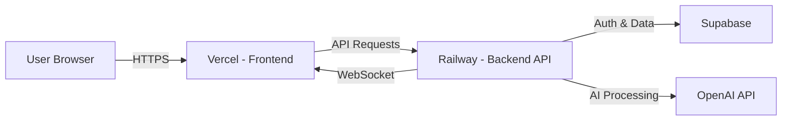
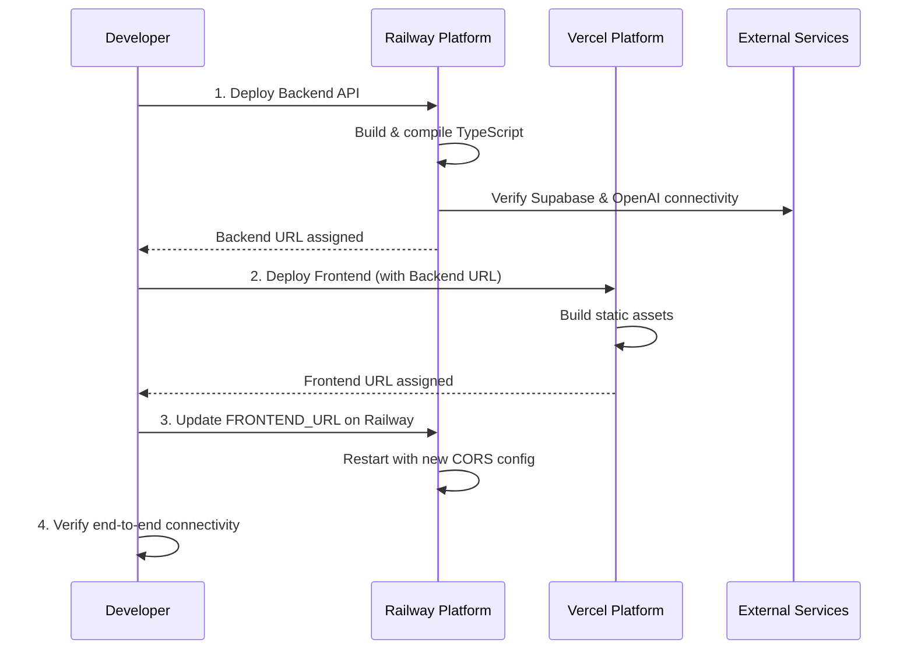

# Deploy Readiness Check - WADI Platform

## Objective

Verify that the WADI platform (frontend and backend) is fully prepared for production deployment to Vercel and Railway, and provide the exact deployment configurations and commands required for successful deployment.

## Deployment Architecture Overview

The WADI platform follows a decoupled architecture:

- **Frontend**: Static React application deployed to Vercel
- **Backend**: Node.js API service deployed to Railway
- **Database**: Supabase (already hosted, external service)
- **AI Service**: OpenAI API (already hosted, external service)



## Pre-Deployment Readiness Assessment

### Backend Readiness Checklist

| Component               | Status | Notes                                                   |
| ----------------------- | ------ | ------------------------------------------------------- |
| TypeScript compilation  | Ready  | tsconfig.json configured for CommonJS output            |
| Production dependencies | Ready  | All runtime dependencies in package.json                |
| Environment validation  | Ready  | Comprehensive env-validator.ts checks all required vars |
| Health check endpoint   | Ready  | /health endpoint with Supabase connection check         |
| CORS configuration      | Ready  | Dynamic FRONTEND_URL support                            |
| Security headers        | Ready  | Helmet middleware with CSP, HSTS                        |
| Rate limiting           | Ready  | Express rate limiter on /api routes                     |
| Error handling          | Ready  | Centralized error handler middleware                    |
| WebSocket support       | Ready  | WS server setup on HTTP server                          |
| PORT configuration      | Ready  | Dynamic PORT from env (Railway compatible)              |

### Frontend Readiness Checklist

| Component                  | Status | Notes                                        |
| -------------------------- | ------ | -------------------------------------------- |
| Production build           | Ready  | Vite build configuration present             |
| Environment variables      | Ready  | VITE\_ prefixed vars for runtime access      |
| Static asset optimization  | Ready  | Vite handles bundling and tree-shaking       |
| Routing configuration      | Ready  | React Router with SPA fallback in nginx.conf |
| API endpoint configuration | Ready  | VITE_API_URL for dynamic backend URL         |
| Nginx configuration        | Ready  | Gzip, caching, security headers configured   |
| Health check endpoint      | Ready  | /health route in nginx.conf                  |

### External Service Dependencies

| Service  | Configuration Required       | Status     |
| -------- | ---------------------------- | ---------- |
| Supabase | URL + ANON_KEY + SERVICE_KEY | Configured |
| OpenAI   | API_KEY + DEFAULT_MODEL      | Configured |

## Railway Backend Deployment Configuration

### Required Environment Variables

Railway will need these environment variables configured:

| Variable Name        | Description               | Example                  | Required              |
| -------------------- | ------------------------- | ------------------------ | --------------------- |
| SUPABASE_URL         | Supabase project URL      | https://xxx.supabase.co  | Yes                   |
| SUPABASE_ANON_KEY    | Supabase anonymous key    | eyJhbGci...              | Yes                   |
| SUPABASE_SERVICE_KEY | Supabase service role key | eyJhbGci...              | Yes                   |
| OPENAI_API_KEY       | OpenAI API key            | sk-...                   | Yes                   |
| OPENAI_DEFAULT_MODEL | OpenAI model to use       | gpt-3.5-turbo            | No (default provided) |
| FRONTEND_URL         | Frontend domain URL       | https://wadi.vercel.app  | Yes                   |
| NODE_ENV             | Environment mode          | production               | Yes                   |
| PORT                 | Server port               | Auto-assigned by Railway | No (Railway provides) |

### Railway Configuration File

Create file: `railway.json` in project root

```
Service Name: wadi-api
Root Directory: apps/api
Build Command: pnpm install --frozen-lockfile && pnpm --filter api tsc
Start Command: node dist/index.js
Health Check Path: /health
Health Check Timeout: 30 seconds
```

### Railway Deployment Strategy

**Build Process**:

1. Railway detects monorepo structure via pnpm-workspace.yaml
2. Installs all dependencies using pnpm
3. Compiles TypeScript from apps/api/src to apps/api/dist
4. Starts production server with compiled JavaScript

**Runtime Characteristics**:

- Auto-scaling based on HTTP traffic
- Persistent storage not required (stateless API)
- WebSocket support enabled
- Automatic HTTPS certificate provisioning
- Environment-based PORT assignment

## Vercel Frontend Deployment Configuration

### Required Environment Variables

Vercel will need these environment variables configured:

| Variable Name          | Description            | Example                      | Required |
| ---------------------- | ---------------------- | ---------------------------- | -------- |
| VITE_SUPABASE_URL      | Supabase project URL   | https://xxx.supabase.co      | Yes      |
| VITE_SUPABASE_ANON_KEY | Supabase anonymous key | eyJhbGci...                  | Yes      |
| VITE_API_URL           | Backend API base URL   | https://wadi-api.railway.app | Yes      |

### Vercel Configuration File

Create file: `vercel.json` in apps/frontend directory

```
Framework Preset: Vite
Build Command: pnpm build
Output Directory: dist
Install Command: pnpm install --frozen-lockfile
Root Directory: apps/frontend
Node Version: 20.x
```

### Vercel Deployment Strategy

**Build Process**:

1. Vercel detects Vite project
2. Installs dependencies using pnpm
3. Runs TypeScript compilation and Vite build
4. Outputs optimized static assets to dist/
5. Serves via Vercel's global CDN

**SPA Routing Configuration**:
Vercel must rewrite all routes to index.html for client-side routing to work properly.

**Caching Strategy**:

- Static assets (JS/CSS): Immutable, 1-year cache
- index.html: No cache, always fresh
- API requests: Not cached (proxied to Railway)

## Deployment Sequence

The deployment must follow this specific order to ensure service availability:



### Deployment Execution Commands

**Step 1: Deploy Backend to Railway**

```
Railway CLI commands:

# Login to Railway
railway login

# Link to project (or create new)
railway link

# Set environment variables
railway variables set SUPABASE_URL="[your-supabase-url]"
railway variables set SUPABASE_ANON_KEY="[your-anon-key]"
railway variables set SUPABASE_SERVICE_KEY="[your-service-key]"
railway variables set OPENAI_API_KEY="[your-openai-key]"
railway variables set OPENAI_DEFAULT_MODEL="gpt-3.5-turbo"
railway variables set NODE_ENV="production"
railway variables set FRONTEND_URL="https://placeholder-update-after-vercel.vercel.app"

# Deploy
railway up

# Get deployed URL
railway status
```

**Alternative: Railway Dashboard Deployment**

```
Manual steps:
1. Go to railway.app dashboard
2. Create new project
3. Connect GitHub repository
4. Select apps/api as root directory
5. Configure environment variables in dashboard
6. Set build command: pnpm install --frozen-lockfile && pnpm --filter api tsc
7. Set start command: node dist/index.js
8. Deploy
9. Note the generated Railway URL (e.g., https://wadi-api-production.railway.app)
```

**Step 2: Deploy Frontend to Vercel**

```
Vercel CLI commands:

# Login to Vercel
vercel login

# Navigate to frontend directory
cd apps/frontend

# Set environment variables (interactive)
vercel env add VITE_SUPABASE_URL production
vercel env add VITE_SUPABASE_ANON_KEY production
vercel env add VITE_API_URL production

# Deploy to production
vercel --prod

# Note the deployed URL
```

**Alternative: Vercel Dashboard Deployment**

```
Manual steps:
1. Go to vercel.com dashboard
2. Import Git repository
3. Configure project:
   - Framework Preset: Vite
   - Root Directory: apps/frontend
   - Build Command: pnpm build
   - Output Directory: dist
4. Add environment variables:
   - VITE_SUPABASE_URL
   - VITE_SUPABASE_ANON_KEY
   - VITE_API_URL (use Railway URL from Step 1)
5. Deploy
6. Note the generated Vercel URL (e.g., https://wadi.vercel.app)
```

**Step 3: Update Backend CORS Configuration**

```
Railway CLI command:

# Update FRONTEND_URL with actual Vercel URL
railway variables set FRONTEND_URL="[actual-vercel-url]"

# Trigger redeploy
railway up
```

**Alternative: Railway Dashboard**

```
Manual steps:
1. Go to Railway dashboard
2. Navigate to environment variables
3. Update FRONTEND_URL to actual Vercel URL
4. Railway will auto-redeploy
```

**Step 4: Verification**

```
Verification checklist:

# Test frontend availability
curl https://[vercel-url]/health
Expected: "healthy"

# Test backend health
curl https://[railway-url]/health
Expected: {"status":"ok","supabase":"connected"}

# Test CORS from browser
Navigate to https://[vercel-url]
Open DevTools Console
Verify no CORS errors when making API requests

# Test authentication flow
1. Register new user
2. Login
3. Create project
4. Verify data persists in Supabase
```

## Post-Deployment Configuration

### Domain Configuration (Optional)

If using custom domains:

**Frontend Custom Domain**:

1. Add custom domain in Vercel dashboard
2. Configure DNS CNAME record pointing to cname.vercel-dns.com
3. Update FRONTEND_URL on Railway to match custom domain

**Backend Custom Domain**:

1. Add custom domain in Railway dashboard
2. Configure DNS CNAME record pointing to Railway's endpoint
3. Update VITE_API_URL on Vercel to match custom domain
4. Redeploy frontend

### Environment Synchronization

Both platforms must have synchronized credentials:

| Variable          | Frontend (VITE\_)      | Backend           |
| ----------------- | ---------------------- | ----------------- |
| Supabase URL      | VITE_SUPABASE_URL      | SUPABASE_URL      |
| Supabase Anon Key | VITE_SUPABASE_ANON_KEY | SUPABASE_ANON_KEY |

**Mismatch Prevention**: Always update both platforms when rotating Supabase credentials.

### Monitoring Setup

**Railway Monitoring**:

- Enable built-in metrics dashboard
- Monitor: CPU usage, memory, request count, response times
- Set up alerts for downtime or errors

**Vercel Monitoring**:

- Enable Analytics in Vercel dashboard
- Monitor: Page views, build times, deployment status
- Configure deployment notifications

**External Monitoring**:

- Set up uptime monitoring (e.g., UptimeRobot, Better Uptime)
- Monitor both /health endpoints
- Alert on: 5xx errors, slow response times, downtime

## Rollback Strategy

### Backend Rollback (Railway)

```
Railway CLI rollback:

# List deployments
railway logs

# Rollback to previous deployment
railway rollback

Alternative via dashboard:
1. Go to Railway deployments tab
2. Select previous stable deployment
3. Click "Redeploy"
```

### Frontend Rollback (Vercel)

```
Vercel CLI rollback:

# List deployments
vercel ls

# Rollback to specific deployment
vercel rollback [deployment-url]

Alternative via dashboard:
1. Go to Vercel deployments tab
2. Find previous stable deployment
3. Click "Promote to Production"
```

## Pre-Deployment Testing Checklist

Execute these tests before deploying:

| Test Category  | Test Description                     | Pass Criteria                          |
| -------------- | ------------------------------------ | -------------------------------------- |
| Build          | Run pnpm --filter api tsc            | Compiles without errors                |
| Build          | Run pnpm --filter frontend build     | Builds without errors                  |
| Environment    | Verify all required env vars present | No validation errors                   |
| Health         | Start backend locally, curl /health  | Returns 200 OK with supabase:connected |
| Authentication | Login/Register flow                  | User can authenticate                  |
| CORS           | Frontend can call backend APIs       | No CORS errors in console              |
| WebSocket      | Real-time features work              | WS connection established              |
| Database       | Create/read/update/delete operations | Data persists correctly                |
| AI Features    | OpenAI integration functional        | AI responses generated                 |

## Known Issues and Mitigations

### Issue: WebSocket Connection on Railway

**Problem**: Some Railway regions may have WebSocket latency or connection issues.

**Mitigation**:

- Deploy to region closest to primary user base
- Implement WebSocket reconnection logic in frontend
- Add fallback to HTTP polling if WS fails

### Issue: Cold Starts on Railway

**Problem**: Railway may spin down services after inactivity, causing slow first request.

**Mitigation**:

- Upgrade to Railway Pro plan (no cold starts)
- Implement keep-alive ping from external monitor
- Add loading indicators for initial requests

### Issue: Environment Variable Visibility

**Problem**: Sensitive keys in .env files might be committed to git.

**Mitigation**:

- Verify .env is in .gitignore
- Use platform-specific secret management
- Rotate keys if accidentally exposed

### Issue: Monorepo Build Complexity

**Problem**: Railway/Vercel may not correctly detect monorepo structure.

**Mitigation**:

- Explicitly set root directory in platform configs
- Use full pnpm commands with --filter flags
- Verify pnpm-workspace.yaml is in repository root

## Success Criteria

Deployment is considered successful when:

1. Backend health endpoint returns 200 OK with Supabase connection confirmed
2. Frontend loads without errors in browser console
3. User authentication flow completes successfully
4. API requests from frontend receive valid responses
5. WebSocket connection establishes and maintains stability
6. Database operations (CRUD) function correctly
7. OpenAI integration produces expected AI responses
8. No CORS errors occur during cross-origin requests
9. Both services respond within acceptable latency (< 500ms p95)
10. Monitoring dashboards show green status on all metrics

## Security Considerations

### Environment Variable Protection

- Never commit .env files to version control
- Use platform-specific secret management (Railway Secrets, Vercel Environment Variables)
- Rotate API keys quarterly or after exposure
- Use different keys for development and production environments

### HTTPS Enforcement

- Both Railway and Vercel provide automatic HTTPS
- Ensure FRONTEND_URL uses https:// protocol
- Configure HSTS headers (already in helmet middleware)
- Verify mixed content warnings do not appear

### CORS Policy

- Restrict FRONTEND_URL to exact production domain
- Avoid wildcard (\*) CORS origins in production
- Verify credentials: true is only enabled for trusted origins

### API Key Security

- OPENAI_API_KEY and SUPABASE_SERVICE_KEY must remain backend-only
- Frontend only receives SUPABASE_ANON_KEY (limited permissions)
- Implement Supabase RLS policies to protect data access

## Maintenance and Updates

### Deployment Frequency

- Deploy bug fixes immediately to production
- Deploy new features weekly or bi-weekly
- Schedule major updates during low-traffic windows

### Update Process

1. Develop and test changes locally
2. Push to staging branch (if available)
3. Run automated tests
4. Deploy to production using same commands as initial deployment
5. Monitor error rates and performance metrics
6. Rollback if critical issues detected

### Database Migration Strategy

When Supabase schema changes are required:

1. Create migration SQL in Supabase dashboard
2. Test migration in Supabase development project
3. Apply migration to production Supabase
4. Deploy backend code changes that depend on new schema
5. Deploy frontend changes that use new data structures

**Important**: Deploy migrations before code changes to maintain backward compatibility during rollout.
