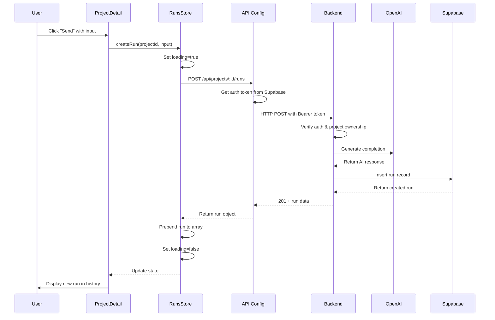
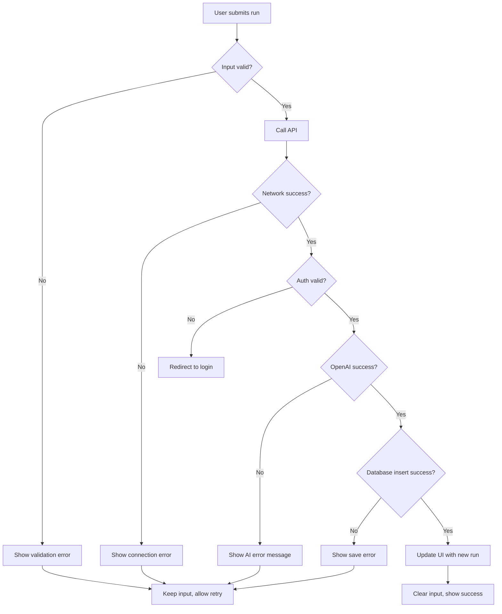
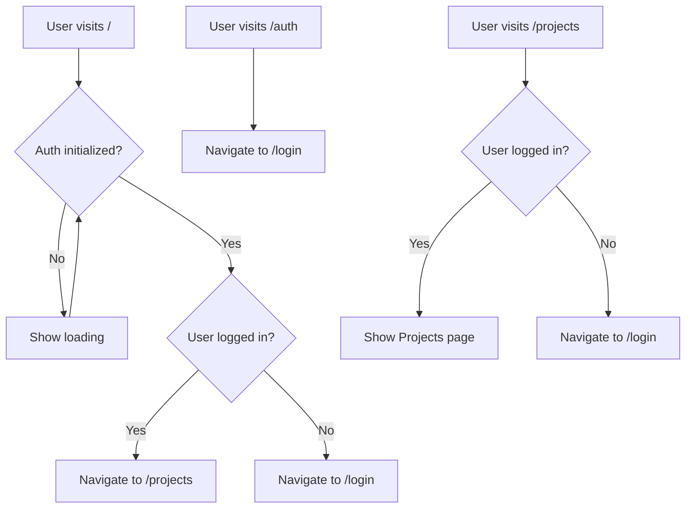

# WADI Beta 1 - UI Redesign & Functional Improvements

## Overview

This design document outlines the comprehensive improvements to WADI Beta 1, focusing on three critical areas: fixing the runs creation/listing flow, implementing proper routing behavior, and redesigning the UI with a modern, AI-focused aesthetic inspired by contemporary chatbot interfaces.

## Design Goals

1. Ensure runs are created, saved to Supabase, and displayed correctly in the UI
2. Implement proper routing with authentication-aware redirects
3. Create a cohesive, modern dark theme design system inspired by reference UI designs
4. Maintain all existing functionality while enhancing user experience
5. Provide clear error handling and user feedback throughout the application

## Current State Analysis

### Working Components

- User registration and authentication via Supabase
- Project creation and listing functionality
- Basic UI structure with dark theme
- API endpoints for runs exist and appear correctly structured
- Frontend store (runsStore) with proper state management

### Identified Issues

#### Issue 1: Runs Not Appearing After Creation

**Problem**: After submitting a new run via the "Send" button, the Run History remains empty showing "No runs yet" message.

**Root Cause Analysis**:
The backend controller (runsController.ts) and routes (runs.ts) appear properly configured. The frontend store (runsStore.ts) correctly adds new runs to state. The issue likely stems from one of the following:

- API URL configuration mismatch between frontend and backend
- Silent error handling masking actual failures
- Timing issues with state updates after creation

#### Issue 2: Routing Behavior

**Problem**: The root path "/" redirects to "/auth" for all users, regardless of authentication status.

**Current Behavior**:

- "/" → redirects to "/auth" (hardcoded)
- "/auth" → shows Login page
- Both authenticated and unauthenticated users land on login

**Desired Behavior**:

- Unauthenticated: "/" → "/login"
- Authenticated: "/" → "/projects"
- "/auth" → alias that redirects to "/login"

#### Issue 3: UI Inconsistency

**Problem**: Current UI lacks a cohesive design system. Styles are inline and scattered across components with no centralized theme management.

## Design Solutions

## 1. Runs Flow Correction

### Objective

Ensure that runs are successfully created via OpenAI, saved to Supabase, and immediately reflected in the UI with proper error handling.

### Strategy

#### Backend Verification

The backend implementation (runsController.ts) already contains proper logic:

- Authentication check via middleware
- Project ownership verification
- Input validation (required, max 5000 chars)
- OpenAI API call with error handling
- Database insertion with full field mapping
- Response with created run data

No backend changes are required unless API connectivity issues are discovered during testing.

#### Frontend Store Enhancement

**Error State Visibility**:
Currently, the runsStore sets an error state but the UI doesn't display it. The store needs to:

- Expose error messages to components
- Differentiate between loading, success, and error states
- Maintain error state until explicitly cleared

**Optimistic Update Refinement**:
The store already prepends new runs to the array, which is correct. However, error recovery should:

- Remove optimistically added runs if creation fails
- Re-fetch from server on successful creation to ensure data consistency

#### UI Component Updates (ProjectDetail.tsx)

**Error Display**:
Add visual error feedback when run creation fails:

- Display error banner/toast with specific error message
- Show different messages for different failure types:
  - Network errors: "Unable to connect to server"
  - OpenAI errors: "AI service temporarily unavailable"
  - Validation errors: "Invalid input"
  - Database errors: "Failed to save run"

**Loading States**:
Enhance loading feedback during run creation:

- Disable input during submission
- Show progress indicator
- Provide clear "Generating..." state on button

**Success Feedback**:
Provide confirmation when runs are successfully created:

- Brief success message or visual indicator
- Smooth scroll to newly created run
- Clear input field only on confirmed success

### Debugging Steps

To identify the exact failure point:

1. **Verify API URL Configuration**:
   - Check that VITE_API_URL in frontend .env matches backend PORT
   - Default: frontend expects "http://localhost:4000"
   - Backend runs on port 4000 by default
   - Ensure no CORS issues blocking requests

2. **Add Console Logging** (temporary, for diagnosis):
   - Log API request payload before sending
   - Log API response or error details
   - Log Supabase insert operation results
   - Log state updates in the store

3. **Network Inspection**:
   - Verify POST request to `/api/projects/:id/runs` is sent
   - Check request headers include Authorization token
   - Confirm response status (201 for success)
   - Examine response payload structure

4. **Database Verification**:
   - Directly query Supabase "runs" table after submission
   - Verify RLS is disabled as specified
   - Check if runs are being created but not returned
   - Validate foreign key constraints (project_id, user_id)

### Expected Data Flow



### Error Handling Flow



## 2. Routing & Navigation Redesign

### Objective

Implement authentication-aware routing that directs users to appropriate pages based on their login status.

### Current Router Structure

The router uses a `ProtectedRoute` wrapper that handles authentication checks. However, the root path unconditionally redirects to "/auth".

### Proposed Router Changes

#### Root Path Handler

Create a new component that intelligently redirects based on auth state:

**Component: RootRedirect**

- Check authentication state from authStore
- If loading: show loading indicator
- If authenticated (user exists): redirect to "/projects"
- If not authenticated: redirect to "/login"

This ensures the root path "/" serves as a smart entry point.

#### Route Aliases

- Keep "/login" as the primary login route
- Make "/auth" redirect to "/login" using React Router's Navigate component
- Both routes render the same Login component

### Updated Route Definitions

| Path          | Authenticated                  | Unauthenticated               |
| ------------- | ------------------------------ | ----------------------------- |
| /             | → /projects                    | → /login                      |
| /login        | Show login (can navigate away) | Show login                    |
| /auth         | → /login                       | → /login                      |
| /register     | Show registration              | Show registration             |
| /projects     | Show projects list             | → /login (via ProtectedRoute) |
| /projects/:id | Show project detail            | → /login (via ProtectedRoute) |

### Implementation Approach

**router.tsx modifications**:

1. Create `RootRedirect` component that uses `useAuthStore` hook
2. Handle loading state to prevent flash of wrong route
3. Use `<Navigate to="..." replace />` for seamless redirects
4. Maintain existing `ProtectedRoute` logic for authenticated routes
5. Update route configuration to use new root handler

### Navigation Flow



### Session Persistence

The authentication store already implements session persistence through Supabase's `getSession()` and `onAuthStateChange()`. The router will leverage this existing mechanism:

- On app load, authStore initializes and checks for existing session
- Loading state prevents premature redirects
- Once initialized, router reads user state and redirects accordingly
- Auth state changes trigger automatic re-routing via React Router

## 3. UI/UX Redesign

### Design Philosophy

Create a modern, sophisticated AI assistant interface with:

- Dark theme optimized for extended use
- Clear visual hierarchy with generous whitespace
- Chat-like interaction pattern for runs
- Subtle animations and transitions
- Consistent component styling
- Accessibility considerations (contrast, focus states)

### Design System Foundation

#### Color Palette

**Base Colors** (Dark Theme):

- Background Primary: #0A0E14 (deepest background)
- Background Secondary: #13171F (card backgrounds)
- Background Tertiary: #1A1F2B (input fields, elevated elements)
- Border Subtle: #252933 (default borders)
- Border Accent: #2D3340 (hover borders)

**Text Colors**:

- Text Primary: #E6E8EC (main text, highest contrast)
- Text Secondary: #9BA3B4 (secondary text, descriptions)
- Text Tertiary: #6B7280 (metadata, timestamps)

**Accent Colors** (inspired by reference designs):

- Primary Accent: #00D9A3 (mint/teal - primary actions, AI messages)
- Secondary Accent: #7C3AED (purple - highlights, links)
- Success: #10B981 (confirmations)
- Warning: #F59E0B (alerts)
- Error: #EF4444 (errors, destructive actions)

**Gradients**:

- Accent Gradient: linear-gradient(135deg, #00D9A3 0%, #00A67E 100%)
- Card Glow (subtle): linear-gradient(135deg, rgba(0, 217, 163, 0.05) 0%, rgba(124, 58, 237, 0.05) 100%)

#### Typography

**Font Family**:

- Primary: 'Inter', -apple-system, BlinkMacSystemFont, 'Segoe UI', sans-serif
- Monospace: 'JetBrains Mono', 'Fira Code', monospace (for code blocks if needed)

**Type Scale**:

- Display: 32px / 700 weight (page titles)
- Heading 1: 24px / 600 weight (section titles)
- Heading 2: 20px / 600 weight (subsections)
- Heading 3: 16px / 600 weight (card titles)
- Body Large: 15px / 400 weight (main content)
- Body: 14px / 400 weight (standard text)
- Body Small: 13px / 400 weight (secondary text)
- Caption: 12px / 500 weight (labels, metadata)

**Line Heights**:

- Headings: 1.2
- Body: 1.6
- Captions: 1.4

#### Spacing System

Consistent spacing scale based on 4px grid:

- xs: 4px
- sm: 8px
- md: 12px
- lg: 16px
- xl: 24px
- 2xl: 32px
- 3xl: 48px
- 4xl: 64px

#### Component Patterns

**Borders**:

- Radius Small: 8px (buttons, inputs)
- Radius Medium: 12px (cards)
- Radius Large: 16px (modals, panels)
- Border Width: 1px (default)

**Shadows**:

- Subtle: 0 1px 3px rgba(0, 0, 0, 0.2)
- Medium: 0 4px 12px rgba(0, 0, 0, 0.3)
- Strong: 0 8px 24px rgba(0, 0, 0, 0.4)
- Glow: 0 0 20px rgba(0, 217, 163, 0.15) (accent elements)

**Transitions**:

- Fast: 150ms ease-in-out (hover states)
- Medium: 250ms ease-in-out (layout changes)
- Slow: 350ms ease-in-out (page transitions)

### Layout Architecture

#### Sidebar Navigation

**Fixed Left Sidebar** (240px width):

- WADI logo/branding at top
- Navigation sections:
  - Projects (icon + label)
  - Settings (icon + label, placeholder for future)
  - User section at bottom with email and logout
- Active state indicator (accent color border/background)
- Hover states with subtle background change

**Sidebar Structure**:

```
┌─────────────────────┐
│ WADI Logo           │ (32px height + 24px padding)
├─────────────────────┤
│                     │
│ 📁 Projects        │ (Active highlight)
│ ⚙️  Settings       │ (Inactive)
│                     │
│                     │
│ (flex-grow space)  │
│                     │
├─────────────────────┤
│ User: email        │
│ [Logout Button]    │ (Bottom section)
└─────────────────────┘
```

**Visual Properties**:

- Background: Background Secondary (#13171F)
- Border Right: 1px solid Border Subtle (#252933)
- Fixed position, full height
- Z-index to stay above content on mobile (future consideration)

#### Main Content Area

**Layout**:

- Margin-left: 240px (sidebar width)
- Max-width: 1200px for readability
- Padding: 32px
- Centered content for narrower pages (login, project detail)

### Page-Specific Designs

#### 1. Login / Register Page

**Layout**:

- Full-screen centered card
- No sidebar (authentication pages are standalone)
- Background gradient or subtle pattern

**Card Design**:

- Max-width: 420px
- Background: Background Secondary with subtle border
- Padding: 48px
- Border-radius: 16px (large)
- Subtle shadow

**Elements**:

- WADI logo/title (centered or left-aligned)
- Welcome message (Text Secondary)
- Input fields with:
  - Clear labels above
  - Background: Background Tertiary
  - Border: Border Subtle (default), Primary Accent (focus)
  - Height: 44px for comfortable touch/click
  - Padding: 12px 16px
- Submit button:
  - Full width
  - Background: Accent Gradient
  - Height: 48px
  - Bold text (600 weight)
  - Hover: slight brightness increase
  - Disabled: reduced opacity + not-allowed cursor
- Sign up link:
  - Text: Primary Accent color
  - Underline on hover

**Error Display**:

- Background: rgba(239, 68, 68, 0.1)
- Border: 1px solid rgba(239, 68, 68, 0.3)
- Text: #EF4444
- Icon: warning/alert icon
- Padding: 12px 16px
- Border-radius: 8px

#### 2. Projects List Page

**Layout with Sidebar**:

- Sidebar on left (fixed)
- Main content area with padding
- Header section with title and action button
- Grid of project cards below

**Header**:

- Title: "My Projects" (Display size, 32px)
- Subtitle: Welcome message with user email (Text Secondary)
- Create button: positioned top-right or below title
  - Background: Primary Accent
  - Hover: slightly darker shade
  - Icon: "+" plus symbol
  - Shadow on hover

**Project Cards Grid**:

- Grid: auto-fill columns, min 280px, max 1fr
- Gap: 20px
- Card design:
  - Background: Background Secondary
  - Border: 1px solid Border Subtle
  - Border-radius: 12px
  - Padding: 24px
  - Transition: transform and border-color on hover
  - Hover: translate up 2px, border becomes Primary Accent
  - Cursor: pointer

**Card Content**:

- Project name (Heading 3, 16px/600)
- Description (Body Small, Text Secondary, line-clamp 2)
- Metadata row:
  - Created date (Caption, Text Tertiary)
  - Optional: run count badge

**Create Project Modal**:

- Overlay: rgba(0, 0, 0, 0.6) backdrop blur
- Modal:
  - Centered
  - Max-width: 500px
  - Background: Background Secondary
  - Border: Border Accent
  - Border-radius: 16px
  - Padding: 32px
  - Shadow: Strong
- Form fields follow same input pattern as login
- Action buttons: Cancel (secondary) + Create (primary accent)

#### 3. Project Runs Page (Chat-Style Interface)

**Layout**:

- Sidebar on left (fixed)
- Main content area divided into:
  - Header with back button + project title
  - Chat message area (scrollable, flex-grow)
  - Input box (fixed at bottom)

**Structure**:

```
┌────────────────────────────────────────┐
│ ← Back to Projects | Project Runs     │ (Header, 60px)
├────────────────────────────────────────┤
│                                        │
│  [User Message Bubble]            →   │
│                                        │
│  ←   [AI Response Bubble]             │
│                                        │
│  [User Message Bubble]            →   │
│                                        │
│  ←   [AI Response Bubble]             │
│                                        │
│  (scrollable area)                    │
│                                        │
├────────────────────────────────────────┤
│ [Text Input Field]  [Send Button]     │ (Fixed input, 80px)
└────────────────────────────────────────┘
```

**Message Bubbles**:

User Message (right-aligned):

- Max-width: 65% of container
- Margin-left: auto
- Background: Background Tertiary
- Border: 1px solid Border Accent
- Border-radius: 16px 16px 4px 16px (speech bubble effect)
- Padding: 14px 18px
- Text: Text Primary
- Margin-bottom: 8px for timestamp

AI Response (left-aligned):

- Max-width: 75% of container
- Margin-right: auto
- Background: linear-gradient or solid with accent tint
  - Option A: rgba(0, 217, 163, 0.08) with border rgba(0, 217, 163, 0.2)
  - Option B: Background Secondary with left accent border (3px solid Primary Accent)
- Border-radius: 16px 16px 16px 4px
- Padding: 14px 18px
- Text: Text Primary with slight tint toward accent

**Message Metadata**:

- Timestamp: Caption size, Text Tertiary
- Model name: (optional) small badge
- Position: below message bubble, aligned with bubble edge

**Empty State**:

- Centered icon (chat bubble or AI icon)
- Message: "No runs yet. Start a conversation with AI below!"
- Text Secondary color

**Input Box (Fixed Bottom)**:

- Full width of content area
- Background: Background Secondary
- Border-top: 1px solid Border Subtle
- Padding: 16px 24px
- Layout: flex row with gap

**Textarea**:

- Flex-grow: 1
- Background: Background Tertiary
- Border: 1px solid Border Subtle (focus: Primary Accent)
- Border-radius: 12px
- Padding: 12px 16px
- Resize: vertical
- Min-height: 48px
- Max-height: 120px
- Placeholder: "Type your message..."

**Send Button**:

- Background: Accent Gradient
- Width: 100px
- Height: 48px (matches textarea min-height)
- Border-radius: 12px
- Font-weight: 600
- Hover: brightness increase
- Disabled: gray background (#4B5563), reduced opacity
- Loading state: "Generating..." with subtle animation

**Character Counter**:

- Position: below textarea
- Text: Caption, Text Tertiary
- Format: "0 / 5000 characters"

### Visual Design Enhancements

#### Loading States

**Page Loading**:

- Centered spinner with WADI branding
- Background: Background Primary
- Spinner: Primary Accent color
- Smooth fade-in when content loads

**Inline Loading** (e.g., fetching runs):

- Skeleton cards with shimmer animation
- Match dimensions of actual content
- Subtle pulse effect

**Button Loading**:

- Text changes ("Send" → "Generating...")
- Optional: spinner icon next to text
- Cursor: not-allowed
- Reduced opacity

#### Interactive States

**Focus States** (Accessibility):

- 2px solid outline in Primary Accent
- Offset by 2px for visibility
- Applied to all interactive elements

**Hover States**:

- Buttons: slight brightness/opacity change (10-15%)
- Cards: transform translateY(-2px) + border color change
- Links: underline or color shift

**Active/Pressed**:

- Buttons: slight scale down (0.98)
- Cards: no transform (prevent jump)

#### Feedback Mechanisms

**Success Messages**:

- Toast notification (top-right)
- Background: rgba(16, 185, 129, 0.15)
- Border: 1px solid rgba(16, 185, 129, 0.3)
- Icon: checkmark
- Auto-dismiss after 3 seconds
- Slide-in animation

**Error Messages**:

- Banner (below header or above relevant section)
- Background: rgba(239, 68, 68, 0.1)
- Border-left: 4px solid #EF4444
- Icon: alert triangle
- Dismissible close button
- Text: specific error message

**Validation Feedback**:

- Inline below form fields
- Text: Error color (#EF4444)
- Caption size
- Appears immediately on blur or submit

### Responsive Considerations

While the primary target is desktop (laptop resolutions 1366x768, 1440x900), the design should gracefully handle smaller viewports:

**Breakpoints**:

- Desktop: 1024px and above (sidebar visible)
- Tablet: 768px - 1023px (collapsible sidebar, could be future enhancement)
- Mobile: below 768px (sidebar becomes drawer, future enhancement)

**Current Scope** (Desktop-first):

- Ensure layouts work at 1366px width
- Message bubbles should not exceed readable width
- Cards in grid should stack appropriately
- Sidebar is always visible on desktop

### Design System Implementation Structure

To maintain consistency and enable easy theme updates, create a centralized design tokens file:

**Location**: `apps/frontend/src/styles/theme.ts`

**Structure**:

```
Design Tokens Object
├── colors
│   ├── background (primary, secondary, tertiary)
│   ├── text (primary, secondary, tertiary)
│   ├── border (subtle, accent)
│   ├── accent (primary, secondary)
│   └── semantic (success, warning, error)
├── typography
│   ├── fontFamily (primary, mono)
│   ├── fontSize (display, h1, h2, h3, body, bodySmall, caption)
│   ├── fontWeight (normal, medium, semibold, bold)
│   └── lineHeight (tight, normal, relaxed)
├── spacing (xs, sm, md, lg, xl, 2xl, 3xl, 4xl)
├── borderRadius (small, medium, large)
├── shadows (subtle, medium, strong, glow)
├── transitions (fast, medium, slow)
└── layout (sidebarWidth, maxContentWidth, headerHeight)
```

**Usage Pattern**:
Components import theme tokens and apply them instead of hardcoded values. This allows:

- Single source of truth for design values
- Easy global theme adjustments
- Consistency across all components
- Future theme switching capability (if needed)

Alternative approaches if TypeScript object feels cumbersome:

- CSS custom properties (variables) defined in global CSS
- Styled-components or emotion theme provider
- Tailwind CSS with custom configuration

**Recommendation**: CSS custom properties for simplicity and standard compliance, or theme object for type safety.

### Migration Strategy

To implement the new design without breaking existing functionality:

1. **Create Design System Foundation**:
   - Define theme tokens file/CSS variables
   - Document color usage guidelines
   - Create reusable component utilities (buttons, inputs, cards)

2. **Refactor Page-by-Page**:
   - Start with Login (smallest surface area)
   - Then Projects list
   - Finally ProjectDetail (most complex)
   - Test authentication and data flow after each page

3. **Component Extraction**:
   - Create reusable components:
     - Button (primary, secondary, ghost variants)
     - Input / Textarea
     - Card
     - Sidebar / SidebarLink
     - MessageBubble (user/ai variants)
     - Modal
   - Place in `apps/frontend/src/components/` directory

4. **Testing Approach**:
   - Visual testing at each step
   - Functional testing (auth, CRUD operations)
   - Cross-browser testing (Chrome, Firefox, Edge)
   - Responsive testing at target resolutions

## Implementation Notes

### File Organization

**New Files**:

- `apps/frontend/src/styles/theme.ts` - Design system tokens
- `apps/frontend/src/components/Sidebar.tsx` - Shared navigation
- `apps/frontend/src/components/Button.tsx` - Reusable button component
- `apps/frontend/src/components/Input.tsx` - Reusable input component
- `apps/frontend/src/components/Card.tsx` - Reusable card component
- `apps/frontend/src/components/MessageBubble.tsx` - Chat message component
- `apps/frontend/src/components/Modal.tsx` - Modal wrapper component
- `apps/frontend/src/router.tsx` - Modified with new root redirect logic

**Modified Files**:

- `apps/frontend/src/pages/Login.tsx` - Apply new design
- `apps/frontend/src/pages/Register.tsx` - Apply new design
- `apps/frontend/src/pages/Projects.tsx` - Add sidebar, redesign cards
- `apps/frontend/src/pages/ProjectDetail.tsx` - Chat-style interface
- `apps/frontend/src/store/runsStore.ts` - Enhanced error handling
- `apps/frontend/src/index.css` - Global styles and CSS variables

### Environment Variables

No changes to environment variables required. Continue using:

- `VITE_API_URL` in frontend (defaults to http://localhost:4000)
- Backend runs on port 4000 by default
- Supabase configuration remains unchanged

### Supabase Schema

No schema changes required. Existing tables:

- `profiles` (user_id, display_name, created_at)
- `projects` (id, user_id, name, description, created_at)
- `runs` (id, project_id, user_id, input, output, model, created_at)

RLS remains disabled for development as specified.

### Testing Checklist

**Runs Functionality**:

- [ ] Create a run and verify it saves to Supabase
- [ ] Verify run appears immediately in UI after creation
- [ ] Refresh page and confirm run persists
- [ ] Test error handling: disconnect network, verify error message appears
- [ ] Test validation: submit empty input, verify validation message
- [ ] Test AI timeout: verify appropriate error message

**Routing**:

- [ ] Visit "/" while logged out → should redirect to "/login"
- [ ] Visit "/" while logged in → should redirect to "/projects"
- [ ] Visit "/auth" → should redirect to "/login"
- [ ] Protected routes while logged out → should redirect to "/login"
- [ ] Login successfully → should navigate to "/projects"
- [ ] Logout → should navigate to "/login"

**Design**:

- [ ] All colors match design system specification
- [ ] Typography is consistent across pages
- [ ] Spacing follows 4px grid system
- [ ] Hover states work on all interactive elements
- [ ] Focus states visible for keyboard navigation
- [ ] Message bubbles display correctly for user and AI
- [ ] Cards have proper hover effects
- [ ] Modal appears centered with proper overlay
- [ ] Responsive at 1366x768 resolution
- [ ] Responsive at 1440x900 resolution

## Future Enhancements

Items out of scope for this redesign but noted for future consideration:

1. **Settings Page**: Placeholder exists in sidebar but page not yet implemented
2. **Real-time Updates**: WebSocket support for live run updates
3. **Message Actions**: Copy, regenerate, edit previous messages
4. **Mobile Responsive**: Collapsible sidebar, mobile-optimized chat
5. **Themes**: Light mode or custom theme options
6. **Accessibility**: Full WCAG 2.1 AA compliance audit
7. **Animations**: More sophisticated transitions and micro-interactions
8. **Search**: Filter/search projects and runs
9. **Run Management**: Delete, edit, or favorite runs
10. **Project Settings**: Per-project model configuration

## Success Criteria

This design will be considered successful when:

1. Users can create runs that immediately appear in the UI and persist after refresh
2. Error messages clearly communicate what went wrong and how to fix it
3. Routing behaves intuitively based on authentication state
4. The UI has a cohesive, modern appearance consistent with reference designs
5. All existing functionality continues to work without regression
6. The design system is documented and easy to extend
7. Code is maintainable with reusable components and centralized styles

## References

**UI Inspiration**:

- Primary Reference: https://www.behance.net/gallery/234577369/AI-Chatbot-Mobile-App-UX-UI-Design
- Secondary Reference: https://www.behance.net/gallery/219412627/Chat-Bot-AI-Mobile-App-UI-Design-Concept

**Technical Documentation**:

- React Router: https://reactrouter.com/
- Zustand State Management: https://github.com/pmndrs/zustand
- Supabase Auth: https://supabase.com/docs/guides/auth
- OpenAI API: https://platform.openai.com/docs

**Design Resources**:

- Inter Font: https://fonts.google.com/specimen/Inter
- Color Contrast Checker: https://webaim.org/resources/contrastchecker/
