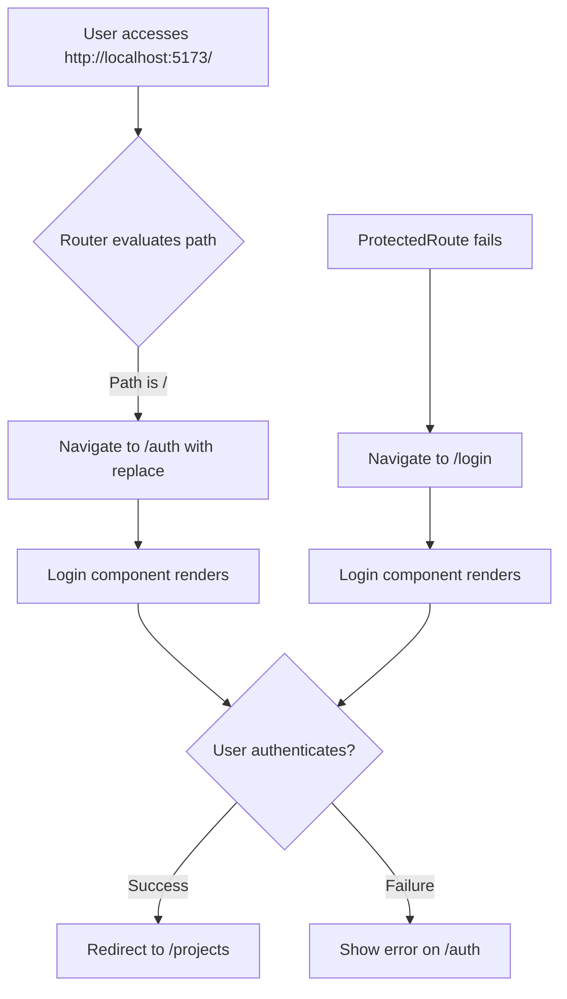

# Root Redirect to Auth - Design Document

## Objective

Modify the frontend routing configuration to redirect the root path `/` to the authentication page at `/auth` instead of the current redirect to `/projects`. Additionally, ensure the login functionality is accessible via the `/auth` route path.

## Context

Currently, when accessing `http://localhost:5173/`, users encounter a black screen. The application uses React Router v6, and the routing is configured in `apps/frontend/src/router.tsx`. The current root path `/` redirects to `/projects`, but the login page is served at `/login`. The requirement is to:

1. Redirect `/` to `/auth`
2. Make the login page accessible at `/auth`
3. Ensure a smooth user experience when landing on the application

## Scope

### In Scope
- Modify the root route redirect target from `/projects` to `/auth`
- Add or update the `/auth` route to serve the Login page
- Ensure backward compatibility with existing authentication flow

### Out of Scope
- Changes to the Login component UI or functionality
- Modifications to protected routes logic
- Changes to authentication store or business logic
- Updates to other route paths beyond `/` and `/auth`

## Design

### Route Configuration Changes

The routing table in `apps/frontend/src/router.tsx` will be modified as follows:

| Route Path | Current Behavior | New Behavior |
|------------|------------------|--------------|
| `/` | Redirects to `/projects` | Redirects to `/auth` |
| `/login` | Displays Login component | Remains unchanged (existing route) |
| `/auth` | Does not exist | Displays Login component (new route) |
| `/projects` | Protected route to Projects page | No change |
| `/projects/:id` | Protected route to ProjectDetail page | No change |

### Routing Strategy

**Primary Authentication Route**: `/auth` will become the primary authentication entry point.

**Backward Compatibility**: The `/login` route will be maintained to avoid breaking existing links, bookmarks, or redirects from the ProtectedRoute component (which currently redirects to `/login` when authentication fails).

**Root Behavior**: When a user navigates to the application root, they will be immediately redirected to `/auth` using React Router's `Navigate` component with the `replace` flag to prevent browser history pollution.

### Implementation Points

**File Modified**: `apps/frontend/src/router.tsx`

**Changes Required**:

1. Update the root route's redirect target
   - Change the `Navigate` component's `to` prop from `/projects` to `/auth`

2. Add new `/auth` route entry
   - Create a new route object with path `/auth`
   - Assign the Login component as the element
   - Position it alongside existing authentication routes

3. Maintain existing `/login` route
   - No modifications to the `/login` route entry
   - Preserves compatibility with ProtectedRoute redirects

### User Flow

### Route Structure

The updated router configuration will contain these route entries in sequence:

1. Root route: redirects to `/auth`
2. Auth route: serves Login component
3. Login route: serves Login component (legacy support)
4. Register route: serves Register component
5. Projects route: protected, serves Projects component
6. Project detail route: protected, serves ProjectDetail component

## Success Criteria

- Accessing `http://localhost:5173/` immediately displays the login screen via `/auth`
- No black screen or console errors occur on initial load
- URL changes from `/` to `/auth` in the browser address bar
- Existing authentication flow from `/login` continues to work
- Protected routes still redirect unauthenticated users appropriately
- Browser back button behavior remains intuitive (no redirect loops)
