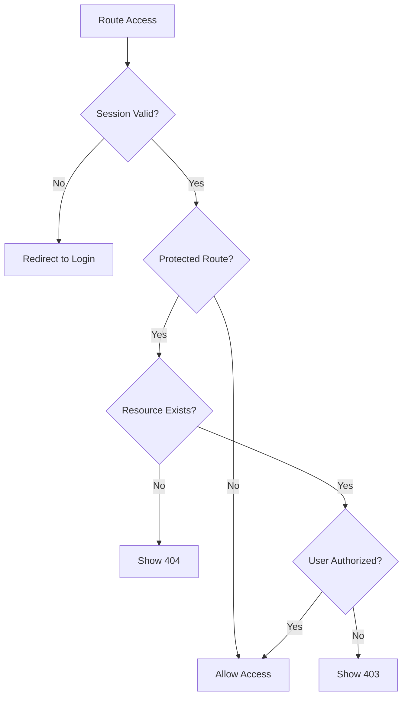
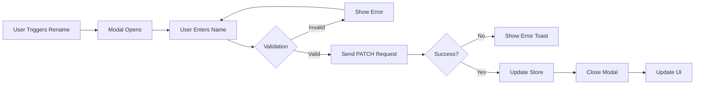
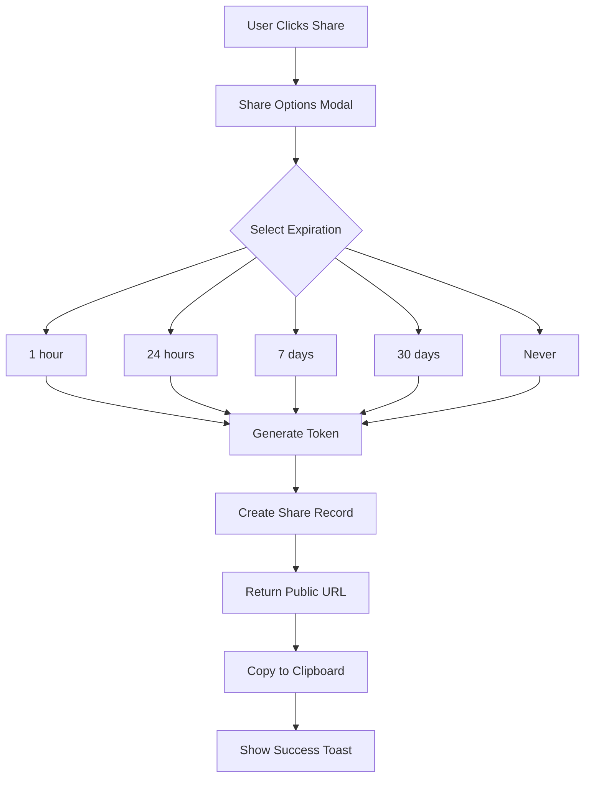
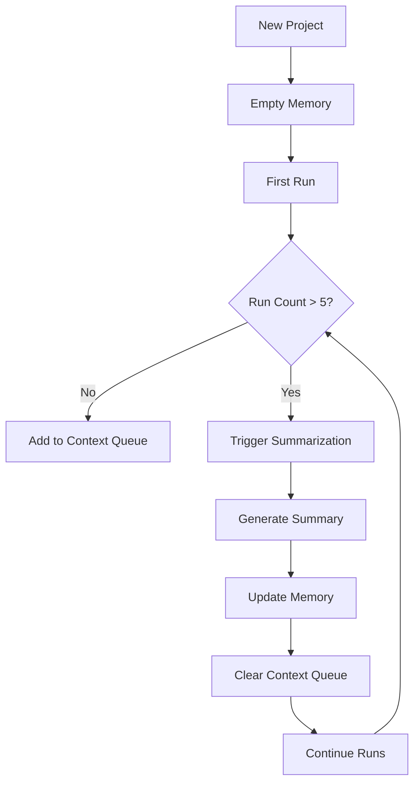
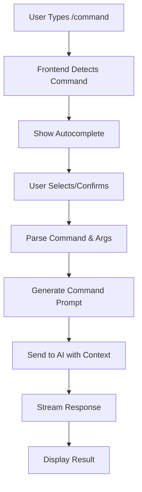

# WADI - Autonomous Sprint Plan Design

## Overview

This design document outlines the transformation of WADI from a basic AI project management tool into a feature-rich, production-ready application with advanced capabilities including session management, intelligent tagging, real-time AI interaction, memory systems, and enhanced user experience through Glass UI design and smooth animations.

The sprint is organized as an autonomous execution plan without dates or time estimates, focusing purely on logical execution order and dependencies.

---

## Current Architecture Assessment

### Existing System Components

**Backend (Node.js + Express + TypeScript)**

- Supabase integration for authentication and data persistence
- OpenAI service integration for AI completions
- RESTful API endpoints for projects and runs
- JWT-based authentication middleware

**Frontend (React + TypeScript + Vite)**

- Zustand state management
- React Router for navigation
- Component-based architecture with centralized theme system
- Supabase client for authentication

**Database (Supabase PostgreSQL)**

- Tables: profiles, projects, runs
- Row Level Security (RLS) policies enforced
- User-project-run relational structure

**Current Limitations**

- No centralized API client (scattered fetch logic)
- State management lacks granular loading states
- Route protection is basic and doesn't validate data integrity
- No session grouping or organizational hierarchy
- Limited metadata (no tags, no custom names)
- Static UI without animations or modern glass effects
- No export capabilities or sharing features
- AI interaction is basic request-response without context memory

---

## Sprint Execution Plan

### Phase 1: Foundation & Infrastructure

#### Epic 1.1: Centralized API Client

**Purpose**: Establish a robust, maintainable communication layer between frontend and backend.

**Core Capabilities**

- Unified request handling for all HTTP methods (GET, POST, PATCH, DELETE)
- Automatic token injection from Supabase session
- Centralized error handling with typed error responses
- Request/response logging for debugging and monitoring
- Request interceptors for global headers
- Response interceptors for error transformation
- Retry logic for transient failures
- Timeout configuration

**Data Structures**

| Field    | Type                   | Description              |
| -------- | ---------------------- | ------------------------ |
| endpoint | string                 | API endpoint path        |
| method   | HTTPMethod             | GET, POST, PATCH, DELETE |
| headers  | Record<string, string> | Custom headers           |
| body     | unknown                | Request payload          |
| timeout  | number                 | Request timeout in ms    |

**Error Response Format**

| Field     | Type   | Description                  |
| --------- | ------ | ---------------------------- |
| error     | string | Human-readable error message |
| code      | string | Error code identifier        |
| status    | number | HTTP status code             |
| timestamp | string | ISO timestamp                |

**Integration Points**

- Replace existing `api.ts` helper functions
- Update all store actions to use new client
- Add logging service integration
- Configure environment-based base URLs

**Success Criteria**

- All API calls use centralized client
- Error handling is consistent across application
- Logs capture request/response lifecycle
- No duplicate API configuration logic

---

#### Epic 1.2: State Management Refactoring

**Purpose**: Implement predictable, granular state management with clear action states.

**State Architecture Pattern**

Each store should follow this structure:

```
State Categories:
- Data State: entities (projects, runs, sessions, tags)
- Loading State: operation-specific flags
- Error State: operation-specific error messages
- UI State: selections, filters, pagination
```

**RunsStore Enhanced States**

| State Property   | Type           | Purpose                    |
| ---------------- | -------------- | -------------------------- |
| runs             | Run[]          | Run entities               |
| loadingState     | LoadingState   | Tracks specific operations |
| error            | ErrorState     | Operation-specific errors  |
| currentProjectId | string \| null | Active project context     |
| selectedRunId    | string \| null | Selected run for actions   |

**LoadingState Structure**

| Field     | Type    | Possible Values |
| --------- | ------- | --------------- |
| fetchRuns | boolean | true/false      |
| createRun | boolean | true/false      |
| updateRun | boolean | true/false      |
| deleteRun | boolean | true/false      |
| renameRun | boolean | true/false      |
| tagRun    | boolean | true/false      |

**ErrorState Structure**

| Field     | Type    | Description              |
| --------- | ------- | ------------------------ |
| operation | string  | Which operation failed   |
| message   | string  | Error description        |
| timestamp | number  | When error occurred      |
| retryable | boolean | Can operation be retried |

**Action Naming Convention**

- Data fetching: `fetch{Entity}`, `fetch{Entity}ById`
- Creation: `create{Entity}`
- Updates: `update{Entity}`, `rename{Entity}`, `tag{Entity}`
- Deletion: `delete{Entity}`, `remove{Entity}`
- State management: `set{Property}`, `clear{Property}`, `reset{Store}`

**Benefits**

- Eliminates ambiguous loading states
- Enables granular UI feedback (e.g., "Renaming..." vs "Loading...")
- Prevents race conditions
- Improves error recovery
- Facilitates optimistic updates

---

#### Epic 1.3: Unified Route Protection System

**Purpose**: Create a comprehensive routing guard that validates authentication, authorization, and data integrity.

**RootGuard Component Responsibilities**

1. **Authentication Validation**
   - Verify Supabase session exists
   - Check token validity and expiration
   - Handle token refresh flows
   - Redirect unauthenticated users to login

2. **Authorization Validation**
   - Verify user has access to requested resources
   - Validate project ownership before project detail access
   - Prevent unauthorized resource access

3. **Data Integrity Validation**
   - Verify referenced entities exist (e.g., projectId in URL)
   - Handle 404 scenarios gracefully
   - Prevent orphaned route states

4. **Session State Management**
   - Initialize auth state on mount
   - Handle session expiration
   - Manage logout flows

**Guard Decision Flow**



**Route Configuration**

| Route Pattern         | Protection Level           | Validation Required           |
| --------------------- | -------------------------- | ----------------------------- |
| `/login`, `/register` | Public                     | None                          |
| `/projects`           | Authenticated              | Session only                  |
| `/projects/:id`       | Authenticated + Authorized | Project existence + ownership |
| `/sessions/:id`       | Authenticated + Authorized | Session existence + ownership |
| `/share/:token`       | Public                     | Token validity                |

**Error Handling States**

| Scenario            | User Experience                          |
| ------------------- | ---------------------------------------- |
| No session          | Redirect to `/login` with return URL     |
| Session expired     | Show re-authentication modal             |
| Invalid projectId   | Redirect to `/projects` with error toast |
| Unauthorized access | Show 403 page with explanation           |
| Network failure     | Show retry UI                            |

---

### Phase 2: Core Feature Development

#### Epic 2.1: Sessions System

**Purpose**: Group related runs into sessions to provide organizational structure and improve navigation.

**Conceptual Model**

A Session represents a cohesive conversation or workflow within a project. Runs are chronologically grouped into sessions based on temporal proximity or explicit user action.

**Session Entity Model**

| Field       | Type      | Required | Description                 |
| ----------- | --------- | -------- | --------------------------- |
| id          | uuid      | Yes      | Unique identifier           |
| project_id  | uuid      | Yes      | Parent project              |
| user_id     | uuid      | Yes      | Owner                       |
| name        | string    | No       | User-defined session name   |
| description | string    | No       | Session purpose/context     |
| created_at  | timestamp | Yes      | Creation time               |
| updated_at  | timestamp | Yes      | Last activity               |
| run_count   | integer   | Yes      | Number of runs in session   |
| is_active   | boolean   | Yes      | Current active session flag |

**Run Entity Enhancement**

Add to existing Run model:

| Field      | Type | Required | Description              |
| ---------- | ---- | -------- | ------------------------ |
| session_id | uuid | Yes      | Parent session reference |

**Session Creation Logic**

Sessions are created:

1. **Automatically** - First run in a project creates a new session
2. **Time-based** - New session after 30 minutes of inactivity
3. **Manually** - User explicitly starts "New Session"

**API Endpoints**

| Method | Endpoint                            | Purpose             | Request Body              | Response                  |
| ------ | ----------------------------------- | ------------------- | ------------------------- | ------------------------- |
| GET    | `/api/projects/:projectId/sessions` | List sessions       | -                         | `{ sessions: Session[] }` |
| GET    | `/api/sessions/:id`                 | Get session details | -                         | `{ session: Session }`    |
| POST   | `/api/projects/:projectId/sessions` | Create session      | `{ name?, description? }` | `{ session: Session }`    |
| PATCH  | `/api/sessions/:id`                 | Update session      | `{ name?, description? }` | `{ session: Session }`    |
| DELETE | `/api/sessions/:id`                 | Delete session      | -                         | `{ success: boolean }`    |
| GET    | `/api/sessions/:id/runs`            | Get session runs    | -                         | `{ runs: Run[] }`         |

**Frontend UI Structure**

**Session List View**

- Display sessions in chronological order (newest first)
- Show session metadata: name, run count, last activity
- Visual indicator for active session
- Expand/collapse to show runs within session
- Quick actions: rename, delete

**Session Creation Flow**

1. User clicks "New Session" button
2. Optional: Modal prompts for session name
3. Session created with default or custom name
4. New runs automatically assigned to active session
5. Session becomes active session for project

**Visual Hierarchy**

```
Project Detail Page
├── Session Header (collapsible)
│   ├── Session Name
│   ├── Run Count Badge
│   ├── Last Activity Timestamp
│   └── Actions Menu (Rename, Delete)
└── Runs Container
    ├── Run 1 (AI Response)
    ├── Run 1 (User Input)
    ├── Run 2 (AI Response)
    └── Run 2 (User Input)
```

**Session State Management**

Add `SessionsStore`:

| State           | Type                 | Purpose                  |
| --------------- | -------------------- | ------------------------ |
| sessions        | Session[]            | Session entities         |
| activeSessionId | string \| null       | Currently active session |
| loadingStates   | SessionLoadingStates | Operation flags          |
| errors          | SessionErrorStates   | Operation errors         |

**Benefits**

- Organized conversation history
- Improved navigation for long-running projects
- Context preservation across time
- Better mental model for users

---

#### Epic 2.2: Run Renaming Feature

**Purpose**: Allow users to assign custom, descriptive names to runs for easier identification and reference.

**Feature Behavior**

**Trigger Mechanisms**

1. Right-click context menu on run
2. Three-dot menu button on run bubble
3. Keyboard shortcut (F2) when run is focused

**Rename Modal Specification**

| Element           | Specification                          |
| ----------------- | -------------------------------------- |
| Title             | "Rename Run"                           |
| Input Label       | "Run Name"                             |
| Input Placeholder | Current run name or "Enter name..."    |
| Max Length        | 100 characters                         |
| Validation        | Non-empty, trimmed                     |
| Actions           | Cancel (Esc), Save (Enter or button)   |
| Focus Behavior    | Auto-focus input, select existing text |

**Database Update**

Add to Run entity:

| Field       | Type   | Required | Description           |
| ----------- | ------ | -------- | --------------------- |
| custom_name | string | No       | User-defined run name |

**API Endpoint**

| Method | Endpoint        | Request Body              | Response       |
| ------ | --------------- | ------------------------- | -------------- |
| PATCH  | `/api/runs/:id` | `{ custom_name: string }` | `{ run: Run }` |

**Frontend Flow**



**Optimistic Update Strategy**

1. Update local state immediately
2. Send API request
3. On failure: revert local state, show error
4. On success: confirm state

**UI Display Logic**

Run name display priority:

1. If `custom_name` exists: show custom name
2. Else: show truncated input preview (first 50 chars)

Display format:

```
[Custom Name or Input Preview]
[Timestamp] • [Model]
```

**Store Integration**

Add to RunsStore:

| Action         | Parameters                      | Behavior           |
| -------------- | ------------------------------- | ------------------ |
| `renameRun`    | `(runId: string, name: string)` | Update run name    |
| `clearRunName` | `(runId: string)`               | Remove custom name |

---

#### Epic 2.3: Tagging System

**Purpose**: Enable flexible categorization and filtering through user-defined tags on projects and runs.

**Tag Entity Model**

| Field      | Type      | Required | Description       |
| ---------- | --------- | -------- | ----------------- |
| id         | uuid      | Yes      | Unique identifier |
| user_id    | uuid      | Yes      | Tag owner         |
| name       | string    | Yes      | Tag name          |
| color      | string    | Yes      | Hex color code    |
| created_at | timestamp | Yes      | Creation time     |

**Tag Association Tables**

**project_tags**

| Field      | Type      | Description          |
| ---------- | --------- | -------------------- |
| project_id | uuid      | Project reference    |
| tag_id     | uuid      | Tag reference        |
| created_at | timestamp | When tag was applied |

**run_tags**

| Field      | Type      | Description          |
| ---------- | --------- | -------------------- |
| run_id     | uuid      | Run reference        |
| tag_id     | uuid      | Tag reference        |
| created_at | timestamp | When tag was applied |

**Tag Component Specification**

**Visual Design**

- Chip-style display (rounded rectangle)
- Background: tag color at 20% opacity
- Border: tag color at 100% opacity
- Text: white or contrasting color
- Size: Small (20px height), Medium (24px height)
- Padding: 4px horizontal, 2px vertical
- Remove button: × icon on hover

**Tag Input Component**

| Feature              | Specification                |
| -------------------- | ---------------------------- |
| Type                 | Autocomplete dropdown        |
| Create New           | Type name + press Enter      |
| Select Existing      | Click or keyboard navigation |
| Color Picker         | Shown when creating new tag  |
| Max Tags             | 10 per entity                |
| Duplicate Prevention | Cannot add same tag twice    |

**Default Tag Colors**

| Color Name | Hex Code | Use Case          |
| ---------- | -------- | ----------------- |
| Mint       | #00D9A3  | Primary/Important |
| Purple     | #7C3AED  | Ideas/Creative    |
| Blue       | #3B82F6  | Technical         |
| Yellow     | #F59E0B  | Warning/Review    |
| Red        | #EF4444  | Bug/Issue         |
| Green      | #10B981  | Complete/Success  |
| Gray       | #6B7280  | General           |

**API Endpoints**

| Method | Endpoint                        | Purpose            | Request             | Response               |
| ------ | ------------------------------- | ------------------ | ------------------- | ---------------------- |
| GET    | `/api/tags`                     | List user's tags   | -                   | `{ tags: Tag[] }`      |
| POST   | `/api/tags`                     | Create tag         | `{ name, color }`   | `{ tag: Tag }`         |
| PATCH  | `/api/tags/:id`                 | Update tag         | `{ name?, color? }` | `{ tag: Tag }`         |
| DELETE | `/api/tags/:id`                 | Delete tag         | -                   | `{ success: boolean }` |
| POST   | `/api/projects/:id/tags`        | Add tag to project | `{ tag_id }`        | `{ success: boolean }` |
| DELETE | `/api/projects/:id/tags/:tagId` | Remove tag         | -                   | `{ success: boolean }` |
| POST   | `/api/runs/:id/tags`            | Add tag to run     | `{ tag_id }`        | `{ success: boolean }` |
| DELETE | `/api/runs/:id/tags/:tagId`     | Remove tag         | -                   | `{ success: boolean }` |

**Tag Management UI**

**Tag Editor Modal**

- List of all user tags
- Inline edit name/color
- Delete with confirmation
- Create new tag form
- Usage count per tag

**Tag Display Locations**

1. Project cards: show up to 3 tags, "+N more"
2. Run message bubbles: show all tags
3. Session headers: aggregate tags from runs
4. Sidebar project list: show 1-2 key tags

**Filtering Capabilities**

Users can filter by tags:

- Projects page: filter projects by tags
- Project detail: filter runs by tags
- Multi-tag filter: AND/OR logic toggle

**Store Integration**

Add `TagsStore`:

| State         | Type             | Purpose            |
| ------------- | ---------------- | ------------------ |
| tags          | Tag[]            | User's tag library |
| selectedTags  | string[]         | Active filter tags |
| loadingStates | TagLoadingStates | Operation flags    |

---

### Phase 3: Design & User Experience

#### Epic 3.1: Framer Motion Integration

**Purpose**: Add fluid, purposeful animations that enhance usability and provide visual feedback.

**Animation Principles**

1. **Purposeful**: Every animation serves a functional purpose
2. **Fast**: Animations should be quick (150-350ms)
3. **Smooth**: Use easing functions for natural motion
4. **Responsive**: Respect user's reduced motion preferences
5. **Consistent**: Same element types use same animation patterns

**Animation Catalog**

**Message Bubble Animations**

| Animation Type   | Trigger     | Configuration                         |
| ---------------- | ----------- | ------------------------------------- |
| Fade In          | Mount       | opacity: 0 → 1, duration: 250ms       |
| Slide In         | Mount       | translateY: 20px → 0, duration: 300ms |
| Scale In         | Mount       | scale: 0.95 → 1, duration: 200ms      |
| Streaming Appear | AI response | Character-by-character reveal         |

**Card Animations**

| Animation Type | Trigger     | Configuration                         |
| -------------- | ----------- | ------------------------------------- |
| Hover Lift     | Mouse enter | translateY: 0 → -4px, duration: 200ms |
| Hover Glow     | Mouse enter | boxShadow intensity increase          |
| Tap Scale      | Click       | scale: 1 → 0.98 → 1, duration: 150ms  |

**Sidebar Animations**

| Animation Type   | Trigger   | Configuration                           |
| ---------------- | --------- | --------------------------------------- |
| Slide In         | Mount     | translateX: -240px → 0, duration: 300ms |
| Item Stagger     | Mount     | Each item delays by 50ms                |
| Active Indicator | Selection | width: 0 → 3px, background flash        |

**Modal Animations**

| Animation Type | Trigger | Configuration                    |
| -------------- | ------- | -------------------------------- |
| Backdrop Fade  | Open    | opacity: 0 → 1, duration: 200ms  |
| Modal Scale    | Open    | scale: 0.9 → 1, duration: 250ms  |
| Exit Animation | Close   | Reverse of open, duration: 200ms |

**List Animations**

| Animation Type | Trigger  | Configuration                                 |
| -------------- | -------- | --------------------------------------------- |
| Stagger In     | Mount    | Each item delays by 40ms                      |
| Remove         | Deletion | scale: 1 → 0, opacity: 1 → 0, height collapse |
| Add            | Creation | scale: 0 → 1, opacity: 0 → 1                  |

**Loading Animations**

| Animation Type | Purpose            | Configuration                |
| -------------- | ------------------ | ---------------------------- |
| Skeleton Pulse | Content loading    | opacity: 0.5 → 1 → 0.5, loop |
| Spinner Rotate | Action in progress | rotate: 0deg → 360deg, loop  |
| Dots Bounce    | Waiting state      | translateY bounce sequence   |

**Implementation Strategy**

Use Framer Motion variants pattern:

```
Variants define animation states:
- initial: Starting state
- animate: Target state
- exit: Removal state
- hover: Hover state
- tap: Click state
```

**Accessibility Considerations**

Respect `prefers-reduced-motion`:

- Disable complex animations
- Keep critical state transitions (e.g., modal open/close)
- Reduce animation duration to instant (0ms)

---

#### Epic 3.2: Glass UI Design System

**Purpose**: Implement modern glassmorphism design for depth, elegance, and visual hierarchy.

**Glass Effect Specification**

**Base Glass Properties**

| Property        | Value                              | Purpose                |
| --------------- | ---------------------------------- | ---------------------- |
| backdrop-filter | blur(12px) saturate(180%)          | Glass blur effect      |
| background      | rgba(26, 31, 43, 0.7)              | Semi-transparent base  |
| border          | 1px solid rgba(255, 255, 255, 0.1) | Subtle edge definition |
| box-shadow      | 0 8px 32px rgba(0, 0, 0, 0.3)      | Floating depth         |

**Glass Variants**

| Variant | Use Case      | Background Opacity   | Blur Strength |
| ------- | ------------- | -------------------- | ------------- |
| Subtle  | Input fields  | 0.5                  | 8px           |
| Medium  | Cards         | 0.7                  | 12px          |
| Strong  | Modals        | 0.85                 | 16px          |
| Accent  | Active states | 0.3 with accent tint | 12px          |

**Component Applications**

**Glass Card**

- Background: Medium variant
- Hover: Increase glow, slight scale
- Border: Gradient (top-to-bottom, subtle)

**Glass Input**

- Background: Subtle variant
- Focus: Accent border glow
- Transition: All properties 200ms

**Glass Modal**

- Backdrop: rgba(0, 0, 0, 0.6) with blur(8px)
- Modal: Strong variant
- Border: Accent gradient

**Glass Navigation**

- Sidebar: Medium variant, fixed position
- Hover items: Accent tint overlay
- Active item: Accent left border + background

**Layering System**

Define z-index scale for proper glass stacking:

| Layer     | z-index | Components                  |
| --------- | ------- | --------------------------- |
| Base      | 0       | Background                  |
| Cards     | 1       | Project cards, run bubbles  |
| Sidebar   | 10      | Navigation sidebar          |
| Dropdowns | 20      | Tag selectors, menus        |
| Modals    | 30      | Rename modal, confirmations |
| Toasts    | 40      | Error/success notifications |

**Color Integration**

Glass works with theme colors:

| Element          | Color Treatment                                 |
| ---------------- | ----------------------------------------------- |
| Glass background | theme.colors.background.tertiary at 70% opacity |
| Glass border     | White at 10% opacity                            |
| Glass shadow     | Black at 30% opacity                            |
| Accent glass     | theme.colors.accent.primary at 30% opacity      |

**Performance Considerations**

Backdrop-filter is GPU-intensive:

- Limit nesting (max 2 levels)
- Use will-change: transform on animated glass
- Avoid on mobile if performance degrades

---

#### Epic 3.3: MessageBubble V2

**Purpose**: Create an advanced message component with rich features and enhanced visual design.

**Feature Set**

| Feature             | Description                                    |
| ------------------- | ---------------------------------------------- |
| Role-based styling  | Distinct colors for user vs AI                 |
| Tag display         | Show attached tags as chips                    |
| Export actions      | Quick export to Markdown/PDF                   |
| Streaming support   | Gradual text reveal for AI responses           |
| Syntax highlighting | Code block detection and highlighting          |
| Copy button         | Copy message content                           |
| Timestamp           | Formatted relative time                        |
| Model badge         | Show AI model used                             |
| Actions menu        | Three-dot menu for rename, tag, export, delete |

**Visual Design**

**User Message**

- Alignment: Right
- Background: Glass effect with tertiary background tint
- Border: Accent color at 40% opacity
- Border Radius: 16px 16px 4px 16px (tail on bottom-right)
- Max Width: 65% of container
- Text Color: Primary text color

**AI Message**

- Alignment: Left
- Background: Glass effect with accent tint (primary at 8%)
- Border: Accent color at 20% opacity
- Border Radius: 16px 16px 16px 4px (tail on bottom-left)
- Max Width: 75% of container
- Text Color: Primary text color
- Accent Glow: Subtle shadow in accent color

**Component Structure**

```
MessageBubble
├── Bubble Container (glass background)
│   ├── Content Area
│   │   ├── Tags Row (if tags exist)
│   │   ├── Message Text
│   │   └── Code Blocks (if present)
│   └── Actions Row
│       ├── Copy Button
│       ├── Export Button
│       └── More Menu (•••)
└── Metadata Footer
    ├── Timestamp
    ├── Model Badge (AI only)
    └── Status Indicator (streaming, error, etc.)
```

**Streaming Animation**

For AI responses:

1. Show typing indicator (3 animated dots)
2. Reveal text character-by-character or word-by-word
3. Smooth cursor animation at end of text
4. Fade out cursor when complete

**Code Block Handling**

Detect code blocks:

- Markdown fenced code blocks (```)
- Inline code (`text`)
- Automatic language detection
- Syntax highlighting using lightweight library

**Export Functionality**

**Export to Markdown**

- Generate markdown file
- Include metadata (timestamp, model)
- Preserve formatting
- Trigger download

**Export to PDF**

- Render styled content
- Include WADI branding header
- Footer with metadata
- Generate and download PDF

**Interaction States**

| State     | Visual Change                         |
| --------- | ------------------------------------- |
| Hover     | Slight scale (1.01), glow intensifies |
| Selected  | Accent border, background tint        |
| Copying   | Brief flash animation                 |
| Streaming | Pulsing glow                          |
| Error     | Red border pulse                      |

---

### Phase 4: Advanced Capabilities

#### Epic 4.1: Export System

**Purpose**: Enable users to export runs in portable, shareable formats.

**Supported Export Formats**

| Format   | Extension | Use Case                     |
| -------- | --------- | ---------------------------- |
| Markdown | .md       | Text editors, documentation  |
| PDF      | .pdf      | Presentations, archival      |
| JSON     | .json     | Data backup, API integration |

**Markdown Export Specification**

**File Structure**

```
# [Run Custom Name or Input Preview]

**Date:** [ISO Timestamp]
**Project:** [Project Name]
**Session:** [Session Name]
**Model:** [AI Model]
**Tags:** [Tag1, Tag2, ...]

---

## User Input

[User input content]

## AI Response

[AI output content]

---

*Exported from WADI*
```

**PDF Export Specification**

**Layout**

- Page size: A4
- Margins: 20mm all sides
- Font: Inter for body, JetBrains Mono for code
- Colors: Match theme (dark background option)

**Sections**

1. Header: WADI logo, export date
2. Metadata table: Project, session, timestamp, model, tags
3. Content: User input and AI response with clear separation
4. Footer: Page numbers, WADI attribution

**JSON Export Specification**

**Structure**

```
{
  "export_version": "1.0",
  "exported_at": "[ISO timestamp]",
  "run": {
    "id": "[uuid]",
    "custom_name": "[name or null]",
    "input": "[user input]",
    "output": "[AI response]",
    "model": "[model name]",
    "created_at": "[ISO timestamp]",
    "project": {
      "id": "[uuid]",
      "name": "[project name]"
    },
    "session": {
      "id": "[uuid]",
      "name": "[session name]"
    },
    "tags": [
      {
        "name": "[tag name]",
        "color": "[hex color]"
      }
    ]
  }
}
```

**Export Trigger Locations**

| Location               | Scope               | Formats                                   |
| ---------------------- | ------------------- | ----------------------------------------- |
| Run message bubble     | Single run          | Markdown, PDF, JSON                       |
| Session header         | All runs in session | Combined Markdown, PDF, ZIP of JSON files |
| Project detail actions | All runs in project | Combined formats                          |

**Frontend Implementation**

**Export Flow**

1. User clicks export button
2. Format selection modal (if multiple formats)
3. Generate export data
4. Client-side file creation
5. Trigger browser download
6. Success toast notification

**Libraries**

| Library     | Purpose                            |
| ----------- | ---------------------------------- |
| jsPDF       | PDF generation                     |
| html2canvas | HTML to image conversion (for PDF) |
| file-saver  | Cross-browser download trigger     |

---

#### Epic 4.2: Share Link System

**Purpose**: Generate read-only public URLs for sharing individual runs or sessions.

**Conceptual Model**

Share links provide temporary, read-only access to specific runs without requiring authentication.

**Share Token Entity**

| Field      | Type      | Required | Description                            |
| ---------- | --------- | -------- | -------------------------------------- |
| id         | uuid      | Yes      | Unique identifier                      |
| token      | string    | Yes      | URL-safe random token (32 chars)       |
| run_id     | uuid      | No       | Shared run (exclusive with session_id) |
| session_id | uuid      | No       | Shared session (exclusive with run_id) |
| created_by | uuid      | Yes      | User who created share                 |
| created_at | timestamp | Yes      | Creation time                          |
| expires_at | timestamp | Yes      | Expiration time                        |
| view_count | integer   | Yes      | Number of views                        |
| max_views  | integer   | No       | Optional view limit                    |
| is_active  | boolean   | Yes      | Enable/disable share                   |

**Share Link Generation Flow**



**Share URL Format**

```
https://[domain]/share/[token]
```

**API Endpoints**

| Method | Endpoint                  | Purpose               | Request                      | Response                            |
| ------ | ------------------------- | --------------------- | ---------------------------- | ----------------------------------- |
| POST   | `/api/runs/:id/share`     | Create share link     | `{ expires_in, max_views? }` | `{ token, url }`                    |
| POST   | `/api/sessions/:id/share` | Create session share  | `{ expires_in, max_views? }` | `{ token, url }`                    |
| GET    | `/api/share/:token`       | Access shared content | -                            | `{ run or session data }`           |
| DELETE | `/api/share/:token`       | Revoke share link     | -                            | `{ success }`                       |
| GET    | `/api/share/:token/stats` | Get share analytics   | -                            | `{ views, created_at, expires_at }` |

**Public Share Page**

**Layout**

- Clean, minimal design
- WADI branding header
- Content display (same MessageBubble V2 styling)
- Footer: "Create your own WADI project" CTA
- No navigation, no editing capabilities

**Security Considerations**

1. **Token Generation**: Cryptographically secure random strings
2. **Rate Limiting**: Limit share creation (5 per user per hour)
3. **Expiration Enforcement**: Auto-deactivate expired shares
4. **View Limits**: Optional max views before auto-expiration
5. **Revocation**: Owner can revoke anytime
6. **No Indexing**: Add `noindex` meta tag to prevent search engine indexing

**Share Management UI**

**Active Shares List** (in project/run actions menu)

- Show all active shares
- Display expiration, view count
- Actions: Copy link, Revoke, View stats

---

### Phase 5: AI Intelligence Layer

#### Epic 5.1: Real-Time AI Chat

**Purpose**: Transform the basic request-response model into a dynamic, conversational AI experience.

**Enhanced Interaction Flow**

**Current State**: User sends input → AI generates response → Both saved as single run

**Target State**: User sends message → AI streams response in real-time → Messages saved as conversation history

**Streaming Implementation**

**Backend Changes**

Modify OpenAI service to support streaming:

| Change          | Description                         |
| --------------- | ----------------------------------- |
| Stream mode     | Enable OpenAI stream parameter      |
| Chunk handling  | Process token chunks as they arrive |
| Response format | Server-Sent Events (SSE)            |
| Error recovery  | Handle mid-stream failures          |

**Server-Sent Events Endpoint**

| Method | Endpoint                        | Response Type     |
| ------ | ------------------------------- | ----------------- |
| POST   | `/api/projects/:id/runs/stream` | text/event-stream |

**Event Format**

```
event: token
data: {"content": "Hello"}

event: token
data: {"content": " world"}

event: done
data: {"run_id": "uuid", "total_tokens": 15}

event: error
data: {"error": "Rate limit exceeded"}
```

**Frontend Streaming Handler**

**Flow**

1. User sends message
2. Create user message run immediately
3. Open SSE connection to stream endpoint
4. Create placeholder AI message bubble
5. Update bubble content as tokens arrive
6. Show typing animation during gaps
7. On completion: save final AI run
8. Close SSE connection

**UI Indicators**

| State                | Visual Feedback                         |
| -------------------- | --------------------------------------- |
| Waiting for response | Animated typing indicator (3 dots)      |
| Streaming            | Text appearing character-by-character   |
| Complete             | Static message, no animation            |
| Error                | Red border, error message, retry button |

**Conversation Continuity**

**Context Preservation**

- Send previous N messages as context (N configurable, default 5)
- Include session metadata
- Apply token limits to prevent context overflow

**Context Structure**

```
{
  "messages": [
    {"role": "user", "content": "..."},
    {"role": "assistant", "content": "..."}
  ],
  "session_context": {
    "session_id": "uuid",
    "project_name": "...",
    "tags": ["tag1", "tag2"]
  }
}
```

---

#### Epic 5.2: Project Memory System

**Purpose**: Enable AI to maintain long-term context and continuity within projects through intelligent memory management.

**Memory Conceptual Model**

Memory is a dynamic, evolving summary of a project's context that the AI references to provide relevant, contextual responses.

**Memory Entity Model**

| Field       | Type      | Required | Description           |
| ----------- | --------- | -------- | --------------------- |
| id          | uuid      | Yes      | Unique identifier     |
| project_id  | uuid      | Yes      | Parent project        |
| content     | text      | Yes      | Memory content        |
| created_at  | timestamp | Yes      | Initial creation      |
| updated_at  | timestamp | Yes      | Last update           |
| token_count | integer   | Yes      | Approximate tokens    |
| version     | integer   | Yes      | Memory version number |

**Memory Lifecycle**



**Summarization Strategy**

**Trigger Conditions** (any of):

- Every 5 runs
- Every 24 hours of activity
- Memory token count < 50% of max context window
- Manual user trigger

**Summarization Prompt Template**

```
You are a memory manager for a project assistant.

Project: [Project Name]
Existing Memory: [Current memory content or "None"]

Recent Interactions:
[Last 5-10 run pairs]

Generate a concise, updated memory summary that:
1. Preserves key facts, decisions, and context
2. Identifies patterns and recurring themes
3. Notes user preferences and goals
4. Maintains chronological continuity
5. Stays under 500 tokens

Return ONLY the updated memory text.
```

**Memory Integration in AI Requests**

When sending AI request:

1. Retrieve current project memory
2. Prepend memory to conversation context
3. Include as system message or context block
4. Format: "Project Context: [memory content]"

**API Endpoints**

| Method | Endpoint                             | Purpose               | Request       | Response             |
| ------ | ------------------------------------ | --------------------- | ------------- | -------------------- |
| GET    | `/api/projects/:id/memory`           | Get project memory    | -             | `{ memory: Memory }` |
| POST   | `/api/projects/:id/memory/summarize` | Trigger summarization | -             | `{ memory: Memory }` |
| PATCH  | `/api/projects/:id/memory`           | Manual memory edit    | `{ content }` | `{ memory: Memory }` |
| DELETE | `/api/projects/:id/memory`           | Reset memory          | -             | `{ success }`        |

**UI Visibility**

**Memory Viewer** (accessible from project detail)

- Display current memory content
- Show last updated timestamp
- View version history
- Manual edit capability
- Trigger manual summarization

**Memory Indicator**

- Badge on project card showing memory exists
- Icon in project detail header
- Tooltip showing memory preview

---

#### Epic 5.3: Slash Commands System

**Purpose**: Provide quick, keyboard-driven shortcuts for common AI operations.

**Command Catalog**

| Command      | Description                  | Parameters        | AI Behavior                              |
| ------------ | ---------------------------- | ----------------- | ---------------------------------------- |
| `/resume`    | Summarize session or project | None              | Generate concise summary of conversation |
| `/tasks`     | Extract action items         | None              | List actionable tasks from conversation  |
| `/improve`   | Suggest improvements         | Target (optional) | Provide enhancement suggestions          |
| `/explain`   | Explain concept              | Topic             | Detailed explanation of topic            |
| `/refactor`  | Code refactoring             | None              | Suggest code improvements                |
| `/debug`     | Debug assistance             | Error (optional)  | Help troubleshoot issues                 |
| `/translate` | Translate text               | Language          | Translate to specified language          |

**Command Detection**

**Frontend**

- Listen for "/" as first character in input
- Show autocomplete dropdown with available commands
- Display command description and parameters
- Highlight command in input (different color)
- Auto-complete on Tab or Enter

**Backend**

- Parse command from input
- Execute command-specific logic
- Append command context to AI prompt

**Command Execution Flow**



**Command Prompt Templates**

**`/resume`**

```
Analyze the following conversation and provide a concise summary:
- Key topics discussed
- Main conclusions or decisions
- Outstanding questions or next steps

Conversation: [session runs]

Provide summary in 3-5 bullet points.
```

**`/tasks`**

```
Extract all actionable tasks and to-dos from the following conversation:

Conversation: [session runs]

Return a numbered list of tasks. For each task, specify:
1. What needs to be done
2. Any mentioned deadline or priority
3. Who is responsible (if mentioned)
```

**`/improve [target]`**

```
Review the following [target or "conversation"] and suggest improvements:

Content: [relevant content]

Provide specific, actionable suggestions for:
- Clarity and structure
- Completeness
- Best practices
- Potential issues
```

**UI Components**

**Command Autocomplete Dropdown**

- Appears below input when "/" typed
- Filter commands as user types
- Keyboard navigation (arrow keys)
- Shows command syntax and description
- Dismisses on Esc or click outside

**Command Chip in Input**

- Visually distinguish command from rest of input
- Background: Accent color at 20% opacity
- Border: Accent color
- Monospace font

**Command History**

- Store recently used commands
- Show in autocomplete with star icon
- Persist in localStorage

---

#### Epic 5.4: Assistant Modes

**Purpose**: Allow users to select specialized AI personas optimized for different tasks.

**Mode Catalog**

| Mode      | Icon | Persona                  | Use Case               | Behavior Characteristics                 |
| --------- | ---- | ------------------------ | ---------------------- | ---------------------------------------- |
| Developer | 💻   | Senior software engineer | Code help, debugging   | Technical, concise, code-focused         |
| Branding  | 🎨   | Brand strategist         | Marketing, messaging   | Creative, persuasive, audience-aware     |
| Tutor     | 📚   | Patient teacher          | Learning, explanations | Detailed, encouraging, step-by-step      |
| Code-Fix  | 🔧   | Debugging expert         | Error resolution       | Analytical, solution-focused, diagnostic |
| Writer    | ✍️   | Content writer           | Document creation      | Articulate, structured, polished         |
| Analyst   | 📊   | Data analyst             | Insights, patterns     | Logical, data-driven, thorough           |

**Mode Configuration**

Each mode defines:

| Property        | Type   | Description            |
| --------------- | ------ | ---------------------- |
| id              | string | Unique mode identifier |
| name            | string | Display name           |
| icon            | string | Emoji or icon          |
| description     | string | Mode purpose           |
| system_prompt   | string | AI system instruction  |
| temperature     | number | AI creativity (0-1)    |
| suggested_model | string | Optimal model for mode |

**System Prompt Templates**

**Developer Mode**

```
You are a senior software engineer with expertise in modern development practices.
Your responses should be:
- Technically precise
- Code-focused with examples
- Reference best practices
- Concise but complete
- Include error handling considerations
```

**Tutor Mode**

```
You are a patient, encouraging teacher. Your goal is to help the user learn and understand.
Your responses should:
- Explain concepts from first principles
- Use analogies and examples
- Break down complex topics into steps
- Check for understanding
- Encourage questions
- Avoid jargon unless necessary
```

**Mode Selection UI**

**Mode Picker Component**

- Located in project detail header
- Dropdown or horizontal scrollable list
- Shows mode icon, name, description
- Highlights active mode
- Persists selection per project

**Visual Indicators**

- Active mode badge in input area
- Color-coded border on input (each mode has color)
- Mode icon next to AI responses
- Tag-like chip showing mode

**Metadata Storage**

Add to Run entity:

| Field          | Type   | Description            |
| -------------- | ------ | ---------------------- |
| assistant_mode | string | Mode used for this run |

Add to Project entity:

| Field        | Type   | Description                       |
| ------------ | ------ | --------------------------------- |
| default_mode | string | User's preferred mode for project |

**API Integration**

When creating run:

```
Request body includes:
{
  "input": "...",
  "mode": "developer",
  "model": "gpt-4"
}

Backend:
1. Retrieve mode configuration
2. Prepend system_prompt to messages
3. Set temperature parameter
4. Execute AI request
5. Save mode in run record
```

**Mode Switching Behavior**

- Mode applies to new runs only
- Does not retroactively affect history
- Can be changed anytime
- Each run remembers its mode for reference

---

### Phase 6: Quality Assurance & Stabilization

#### Epic 6.1: End-to-End Verification

**Purpose**: Ensure all features work correctly in isolation and as an integrated system.

**Testing Matrix**

| Feature Area         | Test Scenarios                                  | Success Criteria                                            |
| -------------------- | ----------------------------------------------- | ----------------------------------------------------------- |
| **Run Creation**     | Create run, verify storage, verify display      | Run appears in UI, saved to DB, contains input and output   |
| **Session Grouping** | Create multiple runs, verify session assignment | Runs grouped correctly, new session after inactivity        |
| **Tag CRUD**         | Create, apply, remove, filter by tags           | Tags persist, filter works, tags display correctly          |
| **Rename**           | Rename run, refresh page                        | Custom name persists, displays in UI                        |
| **Export**           | Export to Markdown, PDF, JSON                   | Files download, contain correct data, formatting is correct |
| **Share Link**       | Generate link, access in incognito              | Content displays, no auth required, expires correctly       |
| **AI Chat**          | Send message, receive streaming response        | Response streams, saves correctly, context maintained       |
| **Memory**           | Create runs, trigger summarization              | Memory updates, used in subsequent runs                     |
| **Commands**         | Use each slash command                          | Commands execute, produce expected AI responses             |
| **Modes**            | Switch modes, create runs                       | Mode affects AI behavior, persists correctly                |
| **Animations**       | Trigger each animated component                 | Animations smooth, respect reduced motion                   |
| **Glass UI**         | Verify all glass components                     | Effects render correctly, no performance issues             |

**Error Scenario Testing**

| Scenario                     | Expected Behavior                           |
| ---------------------------- | ------------------------------------------- |
| Network timeout              | Show retry UI, maintain local state         |
| 401 Unauthorized             | Redirect to login, preserve return URL      |
| 404 Project not found        | Redirect to projects list, show error toast |
| 429 Rate limit               | Show rate limit message, suggest wait time  |
| OpenAI API failure           | Display AI service error, allow retry       |
| Invalid tag color            | Validate on frontend, show validation error |
| Expired share link           | Show "Link expired" message, suggest owner  |
| Memory summarization failure | Log error, preserve old memory, notify user |

**Cross-Browser Testing**

Test on:

- Chrome (latest)
- Firefox (latest)
- Safari (latest)
- Edge (latest)

Verify:

- Glass effects render correctly
- Animations are smooth
- SSE streaming works
- File downloads function

**Performance Benchmarks**

| Metric                | Target              | Measurement Method |
| --------------------- | ------------------- | ------------------ |
| Initial page load     | < 2s                | Lighthouse         |
| Time to interactive   | < 3s                | Lighthouse         |
| Run creation response | < 1s (excluding AI) | Network tab        |
| AI streaming start    | < 2s                | Manual timing      |
| Tag filter response   | < 200ms             | Performance API    |
| Animation frame rate  | 60 FPS              | Chrome DevTools    |

---

#### Epic 6.2: Console Error Elimination

**Purpose**: Ensure application runs without silent errors or warnings that degrade user experience.

**Error Categories to Address**

**React Errors**

- Key prop missing in lists
- Memory leaks from unmounted components
- State updates on unmounted components
- Unhandled promise rejections
- Deprecated lifecycle methods

**Network Errors**

- Uncaught fetch failures
- CORS issues
- Timeout errors without handling
- Retry logic missing

**TypeScript Errors**

- Type assertions that hide bugs
- `any` types that bypass type safety
- Null/undefined access errors
- Missing error boundaries

**Third-Party Library Warnings**

- Framer Motion warnings
- Zustand DevTools warnings
- React Router warnings
- Supabase client warnings

**Monitoring Strategy**

**Development**

- Enable React Strict Mode
- Use ESLint strict rules
- Enable TypeScript strict mode
- Monitor console continuously

**Production**

- Implement error boundary components
- Log errors to monitoring service (e.g., Sentry)
- Track error rates and patterns
- Alert on error spikes

**Error Boundary Implementation**

Wrap key sections:

- Root app boundary
- Route-level boundaries
- Complex feature boundaries (AI chat, sessions)

Fallback UI shows:

- Friendly error message
- Option to retry
- Option to report issue
- Navigation to safety (home)

---

#### Epic 6.3: UI Consistency Verification

**Purpose**: Ensure all UI elements follow design system tokens and provide cohesive experience.

**Design Token Audit**

Verify all components use theme tokens for:

| Category      | Token Set              | Verification Method                      |
| ------------- | ---------------------- | ---------------------------------------- |
| Colors        | `theme.colors.*`       | Search codebase for hardcoded hex values |
| Spacing       | `theme.spacing.*`      | Search for hardcoded px values           |
| Typography    | `theme.typography.*`   | Verify font families, sizes, weights     |
| Border Radius | `theme.borderRadius.*` | Check all rounded elements               |
| Transitions   | `theme.transitions.*`  | Verify animation durations               |
| Shadows       | `theme.shadows.*`      | Check all elevated elements              |

**Component Library Audit**

Ensure consistent component usage:

| Component Type | Verification                                    |
| -------------- | ----------------------------------------------- |
| Buttons        | All use Button component, not custom buttons    |
| Inputs         | All use Input component with consistent styling |
| Cards          | All use Card component or shared card styles    |
| Modals         | All use Modal component with same behavior      |
| Tags           | All use Tag/Chip component                      |
| MessageBubbles | All use MessageBubble V2                        |

**Spacing Consistency**

Verify consistent spacing patterns:

- Card padding: `theme.spacing.xl`
- Section gaps: `theme.spacing['2xl']`
- Input margins: `theme.spacing.md`
- Button padding: `theme.spacing.lg` horizontal, `theme.spacing.md` vertical

**Typography Hierarchy**

Ensure text follows hierarchy:

| Level   | Font Size | Weight   | Use Case        |
| ------- | --------- | -------- | --------------- |
| Display | 32px      | Semibold | Page titles     |
| H1      | 24px      | Semibold | Section headers |
| H2      | 20px      | Medium   | Subsections     |
| H3      | 16px      | Medium   | Card titles     |
| Body    | 14px      | Normal   | Main content    |
| Caption | 12px      | Normal   | Metadata        |

**Responsive Behavior**

Test layouts at breakpoints:

- Mobile: 320px - 767px
- Tablet: 768px - 1023px
- Desktop: 1024px+

Verify:

- Sidebar collapses to hamburger on mobile
- Card grids adjust columns
- Message bubbles maintain max-width percentages
- Inputs remain usable

---

## Non-Functional Requirements

### Security

**Authentication & Authorization**

- All API endpoints validate JWT tokens
- RLS policies enforce data isolation
- Share tokens use cryptographic randomness
- Session expiration handled gracefully

**Data Protection**

- Sensitive data (API keys) stored in environment variables
- No logging of user content
- HTTPS enforced in production
- CORS configured to allowed origins only

**Input Validation**

- Client-side validation for immediate feedback
- Server-side validation for security
- SQL injection prevention via parameterized queries (Supabase handles)
- XSS prevention via React's built-in escaping

### Performance

**Frontend**

- Code splitting by route
- Lazy loading for heavy components
- Memoization for expensive computations
- Virtualization for long lists (if needed)

**Backend**

- Database indexing on frequently queried columns (user_id, project_id)
- Pagination for large result sets
- Caching for memory summaries
- Rate limiting on AI endpoints

**Network**

- Compress API responses (gzip)
- CDN for static assets in production
- Optimize bundle size (tree shaking)
- Efficient WebSocket/SSE for streaming

### Accessibility

**Keyboard Navigation**

- All interactive elements keyboard accessible
- Logical tab order
- Visible focus indicators
- Keyboard shortcuts documented

**Screen Readers**

- Semantic HTML
- ARIA labels where needed
- Alt text for icons
- Meaningful link text

**Visual Accessibility**

- Sufficient color contrast (WCAG AA)
- Text resizable without breaking layout
- No information conveyed by color alone
- Respect user's reduced motion preference

### Scalability

**Data Growth**

- Pagination prevents loading all runs at once
- Archive old sessions (future consideration)
- Memory size limits to prevent unbounded growth
- Database query optimization

**User Growth**

- Stateless API design for horizontal scaling
- Connection pooling for database
- Rate limiting per user
- Caching strategies

---

## Implementation Dependencies

### Execution Order

The epics must be completed in this sequence due to dependencies:

**Prerequisites for All Work**

- Phase 1 (Foundation) must complete first

**Phase 1 Dependencies**

- Epic 1.1 (API Client) → No dependencies
- Epic 1.2 (State Refactoring) → Requires 1.1
- Epic 1.3 (Route Protection) → Requires 1.2

**Phase 2 Dependencies**

- Epic 2.1 (Sessions) → Requires Phase 1
- Epic 2.2 (Renaming) → Requires Phase 1
- Epic 2.3 (Tagging) → Requires Phase 1
- All Phase 2 epics can be parallelized after Phase 1

**Phase 3 Dependencies**

- Epic 3.1 (Framer Motion) → Requires Phase 1
- Epic 3.2 (Glass UI) → Requires Phase 1
- Epic 3.3 (MessageBubble V2) → Requires 2.2, 2.3, 3.1, 3.2
- Epics 3.1 and 3.2 can be parallel
- Epic 3.3 must come last in Phase 3

**Phase 4 Dependencies**

- Epic 4.1 (Export) → Requires 2.1, 2.2, 2.3, 3.3
- Epic 4.2 (Share Links) → Requires 2.1, 3.3
- Epics 4.1 and 4.2 can be parallelized

**Phase 5 Dependencies**

- Epic 5.1 (Real-Time Chat) → Requires Phase 1, 3.3
- Epic 5.2 (Memory) → Requires 2.1, 5.1
- Epic 5.3 (Slash Commands) → Requires 5.1
- Epic 5.4 (Assistant Modes) → Requires 5.1
- Epic 5.1 must complete first
- Epics 5.2, 5.3, 5.4 can be parallelized after 5.1

**Phase 6 Dependencies**

- All Phase 6 epics require all previous phases complete
- Phase 6 epics can run in parallel

### Technology Additions

New packages required:

**Frontend**
| Package | Purpose | Phase |
|---------|---------|-------|
| framer-motion | Animations | 3.1 |
| jspdf | PDF generation | 4.1 |
| html2canvas | HTML to image for PDF | 4.1 |
| file-saver | File downloads | 4.1 |
| prism-react-renderer | Syntax highlighting | 3.3 |

**Backend**
| Package | Purpose | Phase |
|---------|---------|-------|
| crypto (Node.js built-in) | Secure token generation | 4.2 |
| express-rate-limit | Rate limiting | 4.2, 5.1 |

---

## Success Criteria Summary

The sprint is considered successful when:

1. **Foundation Solid**
   - ✅ All API calls go through centralized client
   - ✅ All stores use granular loading states
   - ✅ Route protection handles all edge cases
   - ✅ No console errors in development

2. **Features Complete**
   - ✅ Sessions group runs logically
   - ✅ Runs can be renamed with persistence
   - ✅ Tags work on projects and runs with filtering
   - ✅ Export produces valid Markdown, PDF, JSON
   - ✅ Share links provide read-only access

3. **AI Enhanced**
   - ✅ AI responses stream in real-time
   - ✅ Memory system maintains context
   - ✅ Slash commands execute correctly
   - ✅ Assistant modes change AI behavior

4. **UX Polished**
   - ✅ Animations are smooth and purposeful
   - ✅ Glass UI renders correctly
   - ✅ MessageBubble V2 shows all features
   - ✅ Design tokens used consistently

5. **Quality Assured**
   - ✅ All test scenarios pass
   - ✅ No console errors in production build
   - ✅ Performance benchmarks met
   - ✅ Accessibility standards met
   - ✅ Cross-browser compatibility verified

---

## Risk Assessment & Mitigation

### Technical Risks

| Risk                                | Impact | Probability | Mitigation                                             |
| ----------------------------------- | ------ | ----------- | ------------------------------------------------------ |
| OpenAI streaming API complexity     | High   | Medium      | Prototype early, implement fallback to non-streaming   |
| Glass UI performance on mobile      | Medium | Medium      | Test early, use simpler effects on mobile              |
| Memory summarization quality        | Medium | Medium      | Iterate on prompts, allow manual override              |
| Share link security vulnerabilities | High   | Low         | Security review, rate limiting, expiration enforcement |
| State management complexity         | Medium | Medium      | Thorough testing, clear documentation                  |

### User Experience Risks

| Risk                              | Impact | Probability | Mitigation                                        |
| --------------------------------- | ------ | ----------- | ------------------------------------------------- |
| Feature overload confusion        | Medium | Medium      | Progressive disclosure, onboarding tooltips       |
| Slow AI response perception       | Medium | High        | Streaming provides immediate feedback             |
| Tag management becomes cumbersome | Low    | Medium      | Limit tag count, provide bulk operations          |
| Export format incompatibility     | Low    | Low         | Test with popular tools, provide multiple formats |

---

## Future Considerations

Features intentionally deferred:

- **Collaborative Projects**: Multi-user access to projects
- **Run Comparisons**: Side-by-side comparison of AI responses
- **Custom AI Models**: User-provided model endpoints
- **Voice Input**: Speech-to-text for run creation
- **Mobile App**: Native iOS/Android applications
- **Advanced Analytics**: Usage statistics, AI performance metrics
- **Template System**: Pre-defined prompt templates
- **API Access**: Public API for third-party integrations
- **Plugin System**: Extensibility for custom features
- **Offline Mode**: PWA with local storage sync
