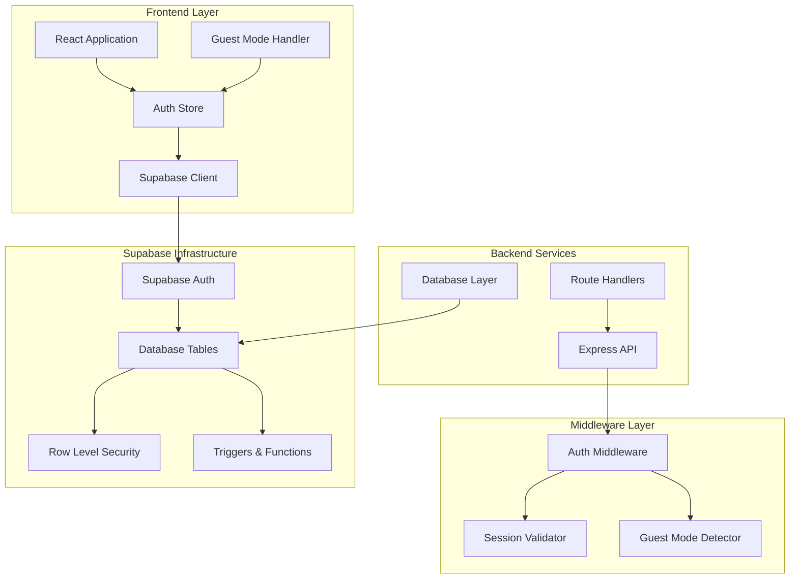
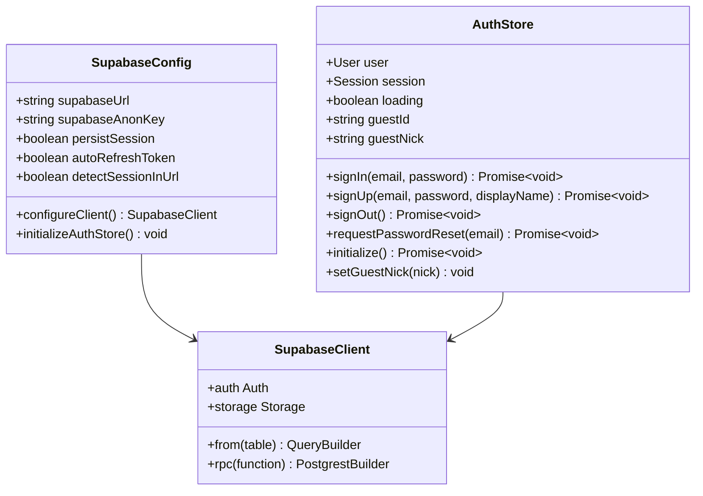
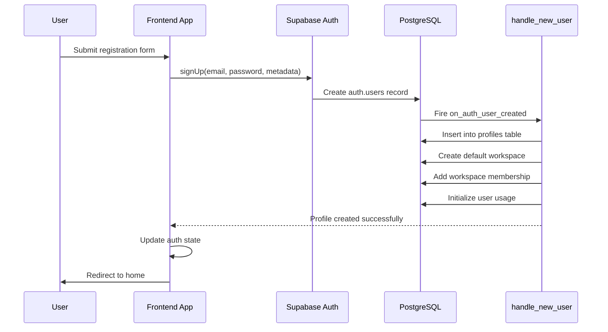
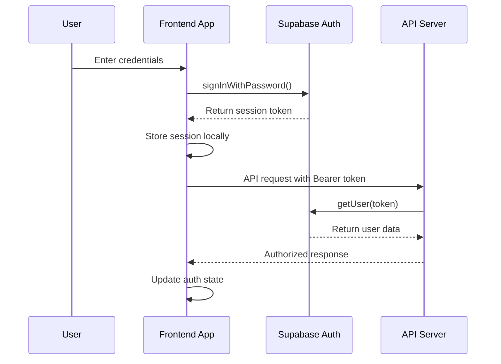
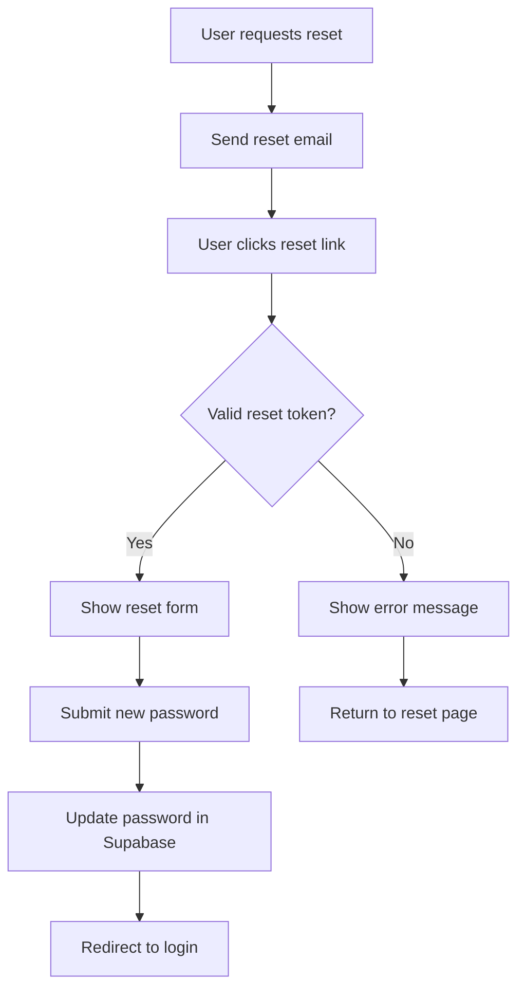
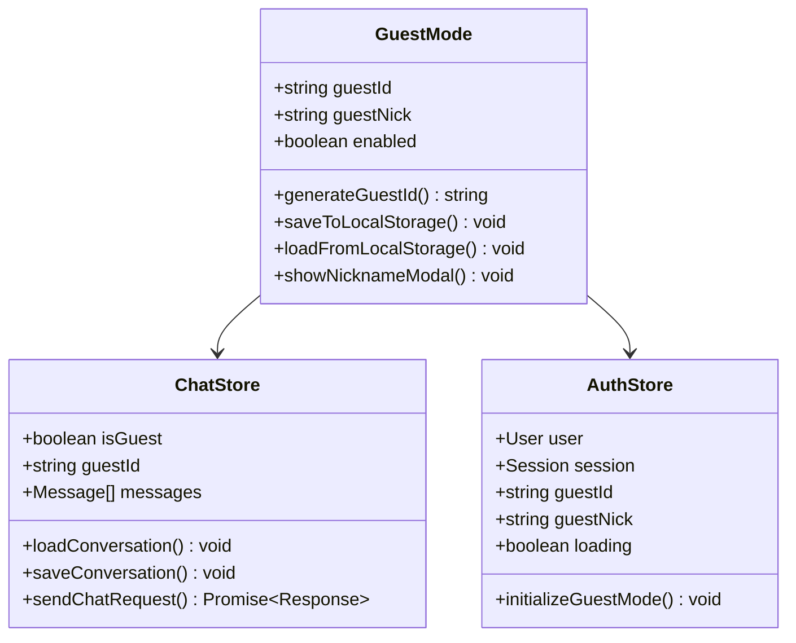
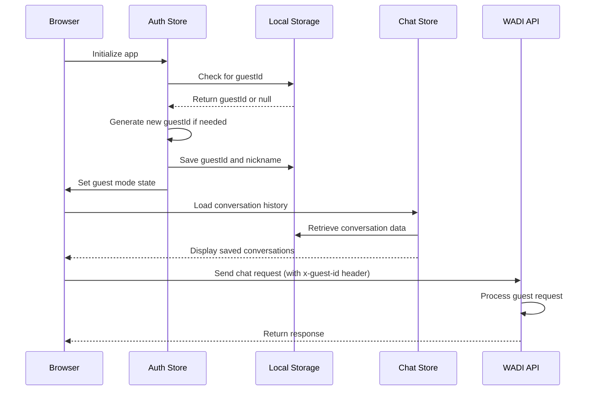
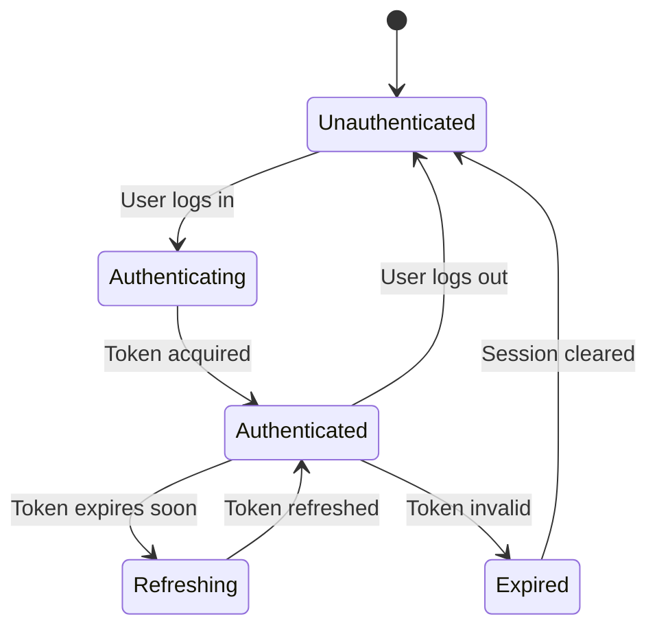
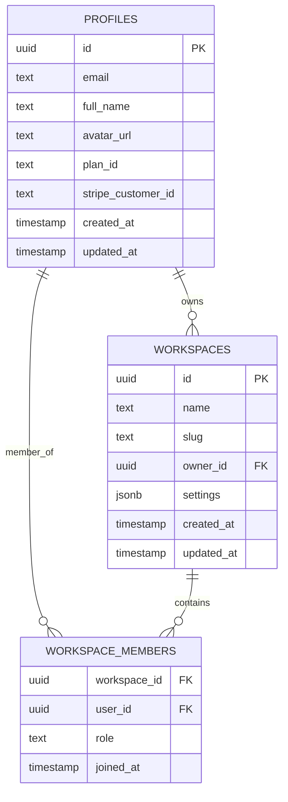
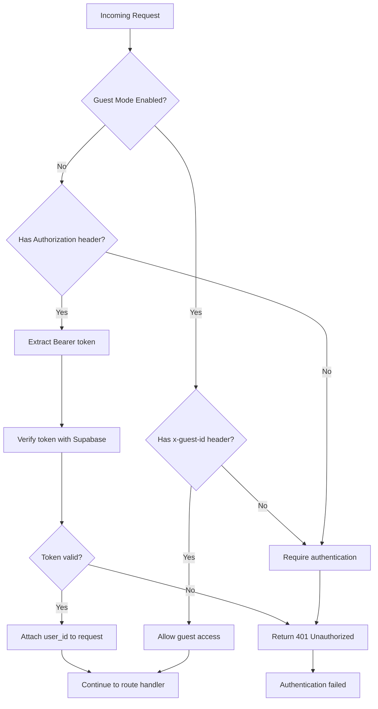

# Authentication & Authorization

<cite>
**Referenced Files in This Document**
- [supabase.ts](file://apps/frontend/src/config/supabase.ts)
- [authStore.ts](file://apps/frontend/src/store/authStore.ts)
- [auth.ts](file://apps/api/src/middleware/auth.ts)
- [supabase.ts](file://apps/api/src/config/supabase.ts)
- [Login.tsx](file://apps/frontend/src/pages/Login.tsx)
- [Register.tsx](file://apps/frontend/src/pages/Register.tsx)
- [ForgotPassword.tsx](file://apps/frontend/src/pages/ForgotPassword.tsx)
- [ResetPassword.tsx](file://apps/frontend/src/pages/ResetPassword.tsx)
- [AuthLayout.tsx](file://apps/frontend/src/layouts/AuthLayout.tsx)
- [GuestNicknameModal.tsx](file://apps/frontend/src/components/GuestNicknameModal.tsx)
- [RootGuard.tsx](file://apps/frontend/src/components/RootGuard.tsx)
- [router.tsx](file://apps/frontend/src/router.tsx)
- [Home.tsx](file://apps/frontend/src/pages/Home.tsx)
- [api.ts](file://apps/frontend/src/config/api.ts)
- [supabase_schema.sql](file://supabase_schema.sql)
- [fix_auth_trigger_v3.sql](file://fix_auth_trigger_v3.sql)
- [fix_auth_trigger.sql](file://fix_auth_trigger.sql)
- [GUEST_MODE_IMPLEMENTATION.md](file://GUEST_MODE_IMPLEMENTATION.md)
</cite>

## Table of Contents

1. [Introduction](#introduction)
2. [System Architecture](#system-architecture)
3. [Supabase Integration](#supabase-integration)
4. [Authentication Flows](#authentication-flows)
5. [Guest Mode Implementation](#guest-mode-implementation)
6. [Session Management](#session-management)
7. [Authorization & Access Control](#authorization--access-control)
8. [Security Features](#security-features)
9. [Configuration & Environment Setup](#configuration--environment-setup)
10. [Best Practices](#best-practices)
11. [Troubleshooting](#troubleshooting)

## Introduction

WADI implements a comprehensive authentication and authorization system built on Supabase Auth, providing both traditional user authentication and innovative guest mode functionality. The system supports secure user registration, login, session management, and role-based access control while maintaining flexibility for different user scenarios.

The authentication infrastructure consists of two main components:

- **Traditional Authentication**: Full user accounts with profiles, workspaces, and permissions
- **Guest Mode**: Anonymous access with temporary session management and local storage persistence

This dual approach enables WADI to serve both casual users exploring the platform and committed users building long-term AI workflows.

## System Architecture

WADI's authentication system follows a modern, layered architecture that separates concerns between frontend authentication state management, backend API security, and database-level access control.

**Diagram sources**

- [authStore.ts](file://apps/frontend/src/store/authStore.ts#L1-L151)
- [auth.ts](file://apps/api/src/middleware/auth.ts#L1-L82)
- [supabase.ts](file://apps/frontend/src/config/supabase.ts#L1-L27)

**Section sources**

- [authStore.ts](file://apps/frontend/src/store/authStore.ts#L1-L151)
- [auth.ts](file://apps/api/src/middleware/auth.ts#L1-L82)

## Supabase Integration

WADI leverages Supabase Auth as its primary authentication foundation, utilizing its robust features for user management, session handling, and security.

### Frontend Supabase Configuration

The frontend Supabase client is configured with intelligent session persistence and automatic token refresh capabilities:

**Diagram sources**

- [supabase.ts](file://apps/frontend/src/config/supabase.ts#L16-L26)
- [authStore.ts](file://apps/frontend/src/store/authStore.ts#L6-L21)

### Backend Supabase Integration

The backend maintains a separate Supabase client configuration optimized for server-side operations:

**Section sources**

- [supabase.ts](file://apps/frontend/src/config/supabase.ts#L1-L27)
- [supabase.ts](file://apps/api/src/config/supabase.ts#L1-L29)

## Authentication Flows

WADI implements comprehensive authentication flows for both registered users and guest access, with seamless transitions between authentication states.

### User Registration Flow

The registration process combines Supabase Auth with automatic profile creation through database triggers:

**Diagram sources**

- [authStore.ts](file://apps/frontend/src/store/authStore.ts#L49-L91)
- [fix_auth_trigger_v3.sql](file://fix_auth_trigger_v3.sql#L16-L56)

### Login Process

User login involves token validation and session restoration:

**Diagram sources**

- [Login.tsx](file://apps/frontend/src/pages/Login.tsx#L25-L39)
- [auth.ts](file://apps/api/src/middleware/auth.ts#L42-L74)

### Password Recovery Flow

WADI supports comprehensive password recovery with email verification:

**Diagram sources**

- [ForgotPassword.tsx](file://apps/frontend/src/pages/ForgotPassword.tsx#L20-L34)
- [ResetPassword.tsx](file://apps/frontend/src/pages/ResetPassword.tsx#L22-L47)

**Section sources**

- [Login.tsx](file://apps/frontend/src/pages/Login.tsx#L1-L216)
- [Register.tsx](file://apps/frontend/src/pages/Register.tsx#L1-L207)
- [ForgotPassword.tsx](file://apps/frontend/src/pages/ForgotPassword.tsx#L1-L181)
- [ResetPassword.tsx](file://apps/frontend/src/pages/ResetPassword.tsx#L1-L140)

## Guest Mode Implementation

Guest mode provides anonymous access to WADI's core functionality while maintaining user experience continuity through local storage persistence and automatic nickname assignment.

### Guest Mode Architecture

**Diagram sources**

- [GuestNicknameModal.tsx](file://apps/frontend/src/components/GuestNicknameModal.tsx#L1-L145)
- [authStore.ts](file://apps/frontend/src/store/authStore.ts#L110-L138)

### Guest Session Management

Guest sessions are managed entirely client-side with automatic persistence:

**Diagram sources**

- [authStore.ts](file://apps/frontend/src/store/authStore.ts#L110-L138)
- [GUEST_MODE_IMPLEMENTATION.md](file://GUEST_MODE_IMPLEMENTATION.md#L22-L192)

### Guest Mode Benefits

Guest mode provides several advantages for users:

- **Zero friction access**: No account creation required
- **Temporary access**: Perfect for exploration and evaluation
- **Local persistence**: Conversations saved per browser session
- **Seamless transition**: Easy upgrade to full account when ready
- **Privacy protection**: No personal data collection required

**Section sources**

- [GuestNicknameModal.tsx](file://apps/frontend/src/components/GuestNicknameModal.tsx#L1-L145)
- [GUEST_MODE_IMPLEMENTATION.md](file://GUEST_MODE_IMPLEMENTATION.md#L22-L192)

## Session Management

WADI implements sophisticated session management with automatic token refresh, persistence controls, and security-aware session handling.

### Token Lifecycle Management

### Frontend Token Management

The frontend handles token refresh automatically with intelligent expiration detection:

**Section sources**

- [api.ts](file://apps/frontend/src/config/api.ts#L51-L100)
- [authStore.ts](file://apps/frontend/src/store/authStore.ts#L110-L138)

## Authorization & Access Control

WADI implements a multi-layered authorization system combining Supabase Row Level Security (RLS) with custom middleware for comprehensive access control.

### Database-Level Security

The PostgreSQL database enforces strict access controls through Row Level Security policies:

**Diagram sources**

- [supabase_schema.sql](file://supabase_schema.sql#L8-L140)

### Role-Based Access Control

WADI implements a hierarchical role system for workspace access control:

| Role   | Permissions      | Description                                |
| ------ | ---------------- | ------------------------------------------ |
| Owner  | Full control     | Can manage workspace, members, and billing |
| Admin  | Administrative   | Can manage members and workspace settings  |
| Member | Standard access  | Can participate in workspace activities    |
| Viewer | Read-only access | Can view workspace content                 |

### Middleware Authorization

The backend authentication middleware provides comprehensive request validation:

**Diagram sources**

- [auth.ts](file://apps/api/src/middleware/auth.ts#L26-L74)

**Section sources**

- [auth.ts](file://apps/api/src/middleware/auth.ts#L1-L82)
- [supabase_schema.sql](file://supabase_schema.sql#L102-L117)

## Security Features

WADI implements multiple layers of security to protect user data and maintain system integrity.

### Authentication Security

- **JWT Token Validation**: All API requests require valid Supabase JWT tokens
- **Automatic Token Refresh**: Seamless token renewal before expiration
- **Secure Session Storage**: Configurable session persistence (localStorage/sessionStorage)
- **Password Policies**: Minimum length requirements and strength indicators
- **Rate Limiting**: Protection against brute force attacks

### Guest Mode Security

- **Anonymous Access**: No personal data collection for guest users
- **Local Storage Isolation**: Guest data stored separately from authenticated users
- **Session Cleanup**: Automatic cleanup of expired guest sessions
- **Cross-Browser Isolation**: Guest data persists per browser, not across devices

### Data Protection

- **Encryption**: All data transmitted over HTTPS
- **Input Validation**: Comprehensive form validation and sanitization
- **SQL Injection Prevention**: Parameterized queries and RLS policies
- **Cross-Site Scripting (XSS) Protection**: Content security policies and input sanitization

**Section sources**

- [supabase.ts](file://apps/frontend/src/config/supabase.ts#L16-L26)
- [auth.ts](file://apps/api/src/middleware/auth.ts#L42-L74)

## Configuration & Environment Setup

Proper configuration is essential for WADI's authentication system to function securely and effectively.

### Environment Variables

| Variable                 | Purpose              | Example Value                      |
| ------------------------ | -------------------- | ---------------------------------- |
| `VITE_SUPABASE_URL`      | Supabase project URL | `https://your-project.supabase.co` |
| `VITE_SUPABASE_ANON_KEY` | Public API key       | `eyJhbGciOiJIUzI1NiIs...`          |
| `SUPABASE_URL`           | Backend Supabase URL | Same as frontend                   |
| `SUPABASE_ANON_KEY`      | Backend API key      | Same as frontend                   |
| `VITE_GUEST_MODE`        | Enable guest mode    | `true` or `false`                  |

### Supabase Configuration

Configure Supabase with the appropriate authentication settings:

1. **Email/Password Authentication**: Enable in Supabase dashboard
2. **JWT Configuration**: Set appropriate token expiration times
3. **Email Templates**: Customize password reset and welcome emails
4. **Rate Limits**: Configure API rate limiting for security

### Database Setup

Execute the Supabase schema to establish the required tables and policies:

**Section sources**

- [supabase.ts](file://apps/frontend/src/config/supabase.ts#L1-L27)
- [supabase.ts](file://apps/api/src/config/supabase.ts#L1-L29)
- [supabase_schema.sql](file://supabase_schema.sql#L1-L140)

## Best Practices

### For Developers

1. **Always Use Authentication Middleware**: Protect all sensitive routes with the auth middleware
2. **Handle Authentication Errors Gracefully**: Provide meaningful error messages for authentication failures
3. **Implement Proper Logout**: Clear both frontend and backend session state
4. **Use Type Safety**: Leverage TypeScript interfaces for authentication state
5. **Monitor Authentication Events**: Track login/logout events for analytics

### For Users

1. **Enable Two-Factor Authentication**: Enhance account security with 2FA
2. **Use Strong Passwords**: Implement complex passwords with special characters
3. **Regularly Review Active Sessions**: Monitor and terminate suspicious sessions
4. **Keep Software Updated**: Ensure latest security patches are applied
5. **Be Cautious with Guest Mode**: Understand limitations of anonymous access

### For Deployment

1. **Secure Environment Variables**: Never commit secrets to version control
2. **Implement CORS Policies**: Restrict API access to authorized domains
3. **Monitor Authentication Logs**: Track suspicious authentication attempts
4. **Regular Security Audits**: Conduct periodic security assessments
5. **Backup Authentication Data**: Ensure secure backups of user data

## Troubleshooting

### Common Issues and Solutions

#### Authentication Failures

**Problem**: Users cannot log in or register
**Solution**:

1. Verify Supabase environment variables are correctly configured
2. Check network connectivity to Supabase endpoints
3. Validate email/password combination
4. Review Supabase dashboard for service status

#### Guest Mode Not Working

**Problem**: Guest mode fails to initialize
**Solution**:

1. Verify `VITE_GUEST_MODE=true` is set in environment
2. Check browser console for initialization errors
3. Ensure localStorage is available in browser
4. Review guest mode implementation in auth store

#### Session Expiration

**Problem**: Users frequently logged out
**Solution**:

1. Adjust token expiration settings in Supabase
2. Implement proper session persistence configuration
3. Check for conflicting authentication state management
4. Verify automatic token refresh is functioning

#### Permission Denied Errors

**Problem**: Users receive 403 Forbidden errors
**Solution**:

1. Verify user roles and workspace memberships
2. Check Row Level Security policies
3. Review database trigger functions
4. Validate user authentication state

### Debugging Tools

1. **Browser Developer Console**: Monitor authentication events and API calls
2. **Supabase Dashboard**: View authentication logs and user activity
3. **Network Tab**: Inspect API requests and responses
4. **Database Queries**: Monitor database operations and triggers
5. **Authentication State**: Use React DevTools to inspect auth store state

**Section sources**

- [authStore.ts](file://apps/frontend/src/store/authStore.ts#L110-L138)
- [auth.ts](file://apps/api/src/middleware/auth.ts#L23-L81)
