# Supabase Integration

<cite>
**Referenced Files in This Document**   
- [supabase.ts](file://apps/frontend/src/config/supabase.ts)
- [authStore.ts](file://apps/frontend/src/store/authStore.ts)
- [Login.tsx](file://apps/frontend/src/pages/Login.tsx)
- [Register.tsx](file://apps/frontend/src/pages/Register.tsx)
- [ForgotPassword.tsx](file://apps/frontend/src/pages/ForgotPassword.tsx)
- [ResetPassword.tsx](file://apps/frontend/src/pages/ResetPassword.tsx)
- [auth.ts](file://apps/api/src/middleware/auth.ts)
- [supabase_schema.sql](file://supabase_schema.sql)
- [fix_auth_trigger.sql](file://fix_auth_trigger.sql)
</cite>

## Table of Contents
1. [Introduction](#introduction)
2. [Authentication Architecture Overview](#authentication-architecture-overview)
3. [Frontend Authentication Implementation](#frontend-authentication-implementation)
4. [Supabase Configuration and Initialization](#supabase-configuration-and-initialization)
5. [User Registration Flow](#user-registration-flow)
6. [Login and Session Management](#login-and-session-management)
7. [Password Recovery Process](#password-recovery-process)
8. [Zustand Auth Store Integration](#zustand-auth-store-integration)
9. [Backend Authentication Middleware](#backend-authentication-middleware)
10. [User Profile Creation and Database Triggers](#user-profile-creation-and-database-triggers)
11. [Security Considerations and Best Practices](#security-considerations-and-best-practices)
12. [Error Handling and Common Issues](#error-handling-and-common-issues)
13. [Configuration Guidelines](#configuration-guidelines)

## Introduction
This document provides a comprehensive analysis of the Supabase authentication integration within the WADI application. It details the implementation of user authentication infrastructure including registration, login, session management, and token verification processes. The documentation covers both frontend and backend components, focusing on the interaction between the Zustand auth store and Supabase's client SDK, session persistence mechanisms, and state synchronization patterns. The analysis includes concrete implementation examples, security considerations, and configuration requirements for a robust authentication system.

## Authentication Architecture Overview

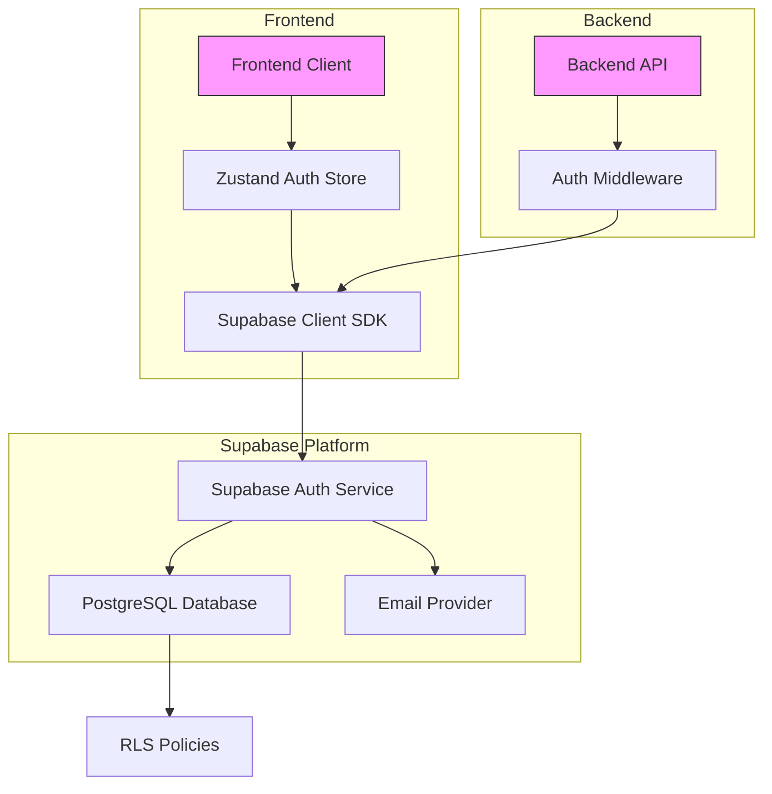

**Diagram sources**
- [supabase.ts](file://apps/frontend/src/config/supabase.ts)
- [authStore.ts](file://apps/frontend/src/store/authStore.ts)
- [auth.ts](file://apps/api/src/middleware/auth.ts)

**Section sources**
- [supabase.ts](file://apps/frontend/src/config/supabase.ts)
- [authStore.ts](file://apps/frontend/src/store/authStore.ts)
- [auth.ts](file://apps/api/src/middleware/auth.ts)

## Frontend Authentication Implementation

The frontend authentication implementation in WADI follows a state management pattern using Zustand for maintaining user authentication state across the application. The system provides a seamless user experience for registration, login, and password recovery workflows through dedicated React components that interact with the Supabase client SDK.

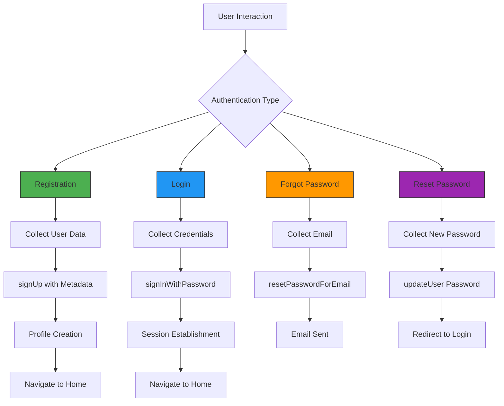

**Diagram sources**
- [Login.tsx](file://apps/frontend/src/pages/Login.tsx)
- [Register.tsx](file://apps/frontend/src/pages/Register.tsx)
- [ForgotPassword.tsx](file://apps/frontend/src/pages/ForgotPassword.tsx)
- [ResetPassword.tsx](file://apps/frontend/src/pages/ResetPassword.tsx)

**Section sources**
- [Login.tsx](file://apps/frontend/src/pages/Login.tsx)
- [Register.tsx](file://apps/frontend/src/pages/Register.tsx)
- [ForgotPassword.tsx](file://apps/frontend/src/pages/ForgotPassword.tsx)
- [ResetPassword.tsx](file://apps/frontend/src/pages/ResetPassword.tsx)

## Supabase Configuration and Initialization

The Supabase client is configured with essential authentication settings to ensure proper session management and token handling. The configuration includes environment variable validation, session persistence settings, and automatic token refresh capabilities.

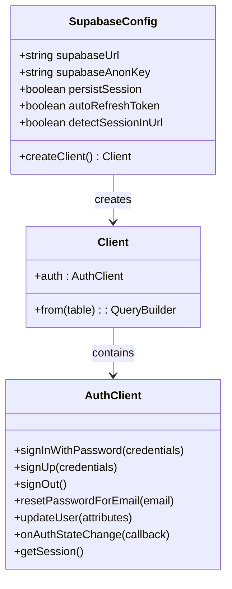

**Diagram sources**
- [supabase.ts](file://apps/frontend/src/config/supabase.ts)

**Section sources**
- [supabase.ts](file://apps/frontend/src/config/supabase.ts)

## User Registration Flow

The user registration process in WADI implements a robust flow that creates user accounts in Supabase while ensuring profile data is properly initialized. The implementation includes metadata handling during signup and redundant profile creation mechanisms to guarantee data consistency.

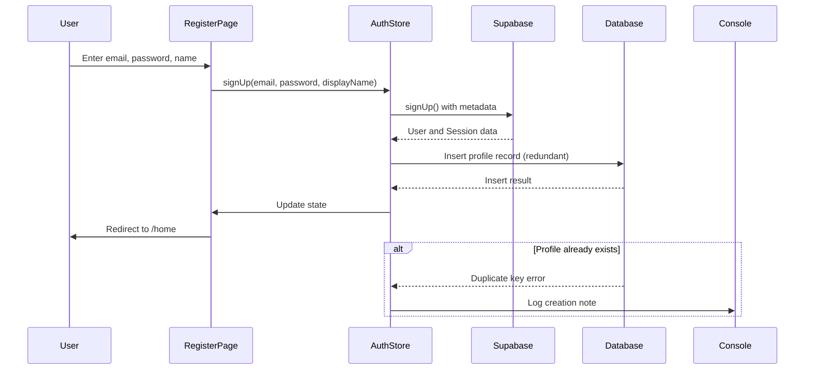

**Diagram sources**
- [Register.tsx](file://apps/frontend/src/pages/Register.tsx)
- [authStore.ts](file://apps/frontend/src/store/authStore.ts)

**Section sources**
- [Register.tsx](file://apps/frontend/src/pages/Register.tsx)
- [authStore.ts](file://apps/frontend/src/store/authStore.ts)

## Login and Session Management

The login and session management system in WADI provides secure authentication with proper session handling and state synchronization. The implementation clears existing sessions before authentication and maintains user state through the Zustand store.

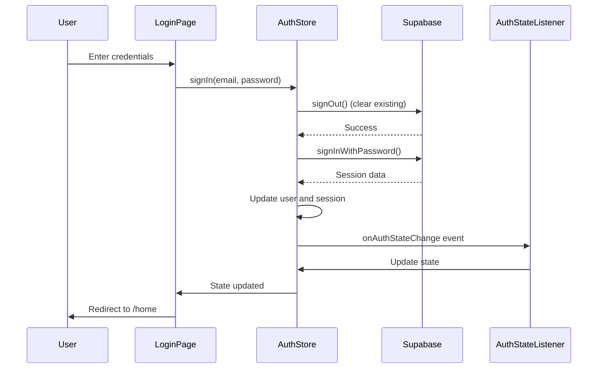

**Diagram sources**
- [Login.tsx](file://apps/frontend/src/pages/Login.tsx)
- [authStore.ts](file://apps/frontend/src/store/authStore.ts)

**Section sources**
- [Login.tsx](file://apps/frontend/src/pages/Login.tsx)
- [authStore.ts](file://apps/frontend/src/store/authStore.ts)

## Password Recovery Process

The password recovery process implements a standard email-based reset flow with proper error handling and user feedback. The system guides users through the recovery process with clear success and error states.

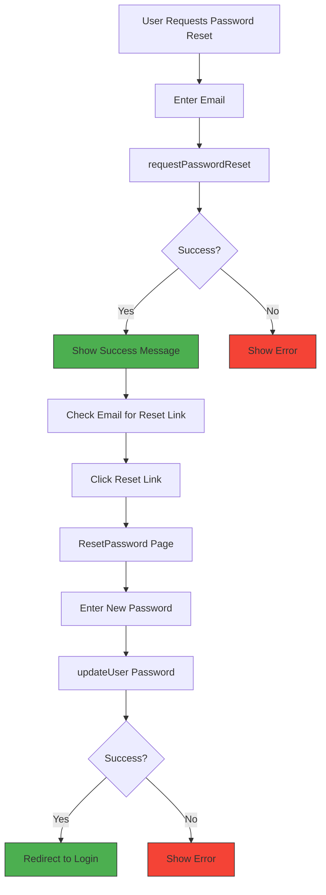

**Diagram sources**
- [ForgotPassword.tsx](file://apps/frontend/src/pages/ForgotPassword.tsx)
- [ResetPassword.tsx](file://apps/frontend/src/pages/ResetPassword.tsx)
- [authStore.ts](file://apps/frontend/src/store/authStore.ts)

**Section sources**
- [ForgotPassword.tsx](file://apps/frontend/src/pages/ForgotPassword.tsx)
- [ResetPassword.tsx](file://apps/frontend/src/pages/ResetPassword.tsx)
- [authStore.ts](file://apps/frontend/src/store/authStore.ts)

## Zustand Auth Store Integration

The Zustand auth store serves as the central state management system for authentication data in the WADI frontend. It provides a persistent store for user sessions, handles authentication operations, and synchronizes state across the application.

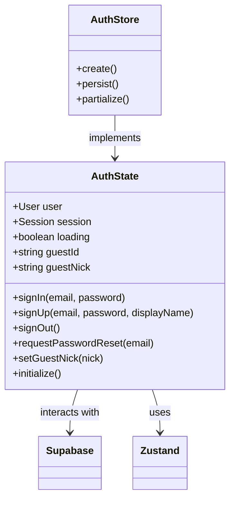

**Diagram sources**
- [authStore.ts](file://apps/frontend/src/store/authStore.ts)

**Section sources**
- [authStore.ts](file://apps/frontend/src/store/authStore.ts)

## Backend Authentication Middleware

The backend authentication middleware validates Supabase JWT tokens and attaches user identifiers to incoming requests. The system supports both authenticated users and guest mode access, providing flexible authentication options for different application scenarios.

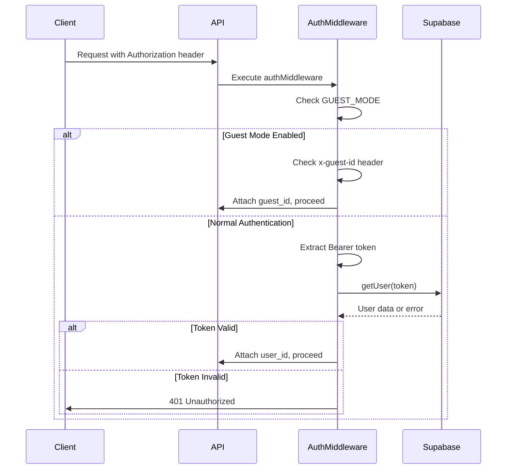

**Diagram sources**
- [auth.ts](file://apps/api/src/middleware/auth.ts)

**Section sources**
- [auth.ts](file://apps/api/src/middleware/auth.ts)

## User Profile Creation and Database Triggers

The user profile creation system implements a dual approach with both database triggers and manual inserts to ensure profile data consistency. The `handle_new_user` trigger automatically creates profiles, workspaces, and initializes user data upon registration.

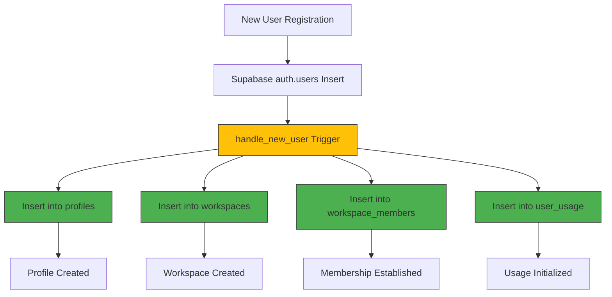

**Diagram sources**
- [supabase_schema.sql](file://supabase_schema.sql)
- [fix_auth_trigger.sql](file://fix_auth_trigger.sql)

**Section sources**
- [supabase_schema.sql](file://supabase_schema.sql)
- [fix_auth_trigger.sql](file://fix_auth_trigger.sql)

## Security Considerations and Best Practices

The authentication implementation follows security best practices including secure session storage, proper error handling, and protection against common vulnerabilities. The system uses Supabase's built-in security features along with application-level safeguards.

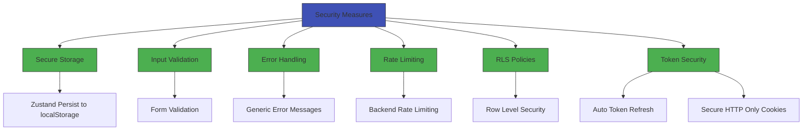

**Section sources**
- [supabase.ts](file://apps/frontend/src/config/supabase.ts)
- [authStore.ts](file://apps/frontend/src/store/authStore.ts)
- [auth.ts](file://apps/api/src/middleware/auth.ts)
- [supabase_schema.sql](file://supabase_schema.sql)

## Error Handling and Common Issues

The authentication system implements comprehensive error handling for common issues such as session expiration, invalid credentials, and network connectivity problems. The frontend provides user-friendly error messages while logging detailed information for debugging.

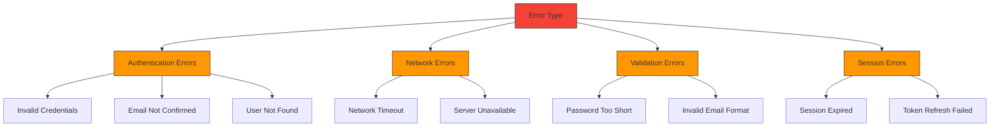

**Section sources**
- [authStore.ts](file://apps/frontend/src/store/authStore.ts)
- [Login.tsx](file://apps/frontend/src/pages/Login.tsx)
- [Register.tsx](file://apps/frontend/src/pages/Register.tsx)
- [auth.ts](file://apps/api/src/middleware/auth.ts)

## Configuration Guidelines

Proper configuration of the Supabase integration requires setting environment variables, configuring RLS policies, and initializing the Supabase project with the correct schema. The following guidelines ensure a secure and functional authentication system.

```mermaid
flowchart TD
A[Configuration Steps] --> B[Environment Variables]
A --> C[Supabase Project Setup]
A --> D[RLS Policies]
A --> E[Database Schema]
A --> F[Authentication Settings]
B --> G[VITE_SUPABASE_URL]
B --> H[VITE_SUPABASE_ANON_KEY]
B --> I[GUEST_MODE]
C --> J[Enable Email Authentication]
C --> K[Configure Email Templates]
C --> L[Set Redirect URLs]
D --> M[profiles Table Policies]
D --> N[workspaces Table Policies]
D --> O[workspace_members Policies]
E --> P[Run supabase_schema.sql]
E --> Q[Apply fix_auth_trigger.sql]
F --> R[Session Persistence]
F --> S[Token Refresh]
F --> T[Password Strength]
style A fill:#2196F3,stroke:#333
style B fill:#4CAF50,stroke:#333
style C fill:#4CAF50,stroke:#333
style D fill:#4CAF50,stroke:#333
style E fill:#4CAF50,stroke:#333
style F fill:#4CAF50,stroke:#333
```

**Section sources**
- [supabase.ts](file://apps/frontend/src/config/supabase.ts)
- [supabase_schema.sql](file://supabase_schema.sql)
- [fix_auth_trigger.sql](file://fix_auth_trigger.sql)