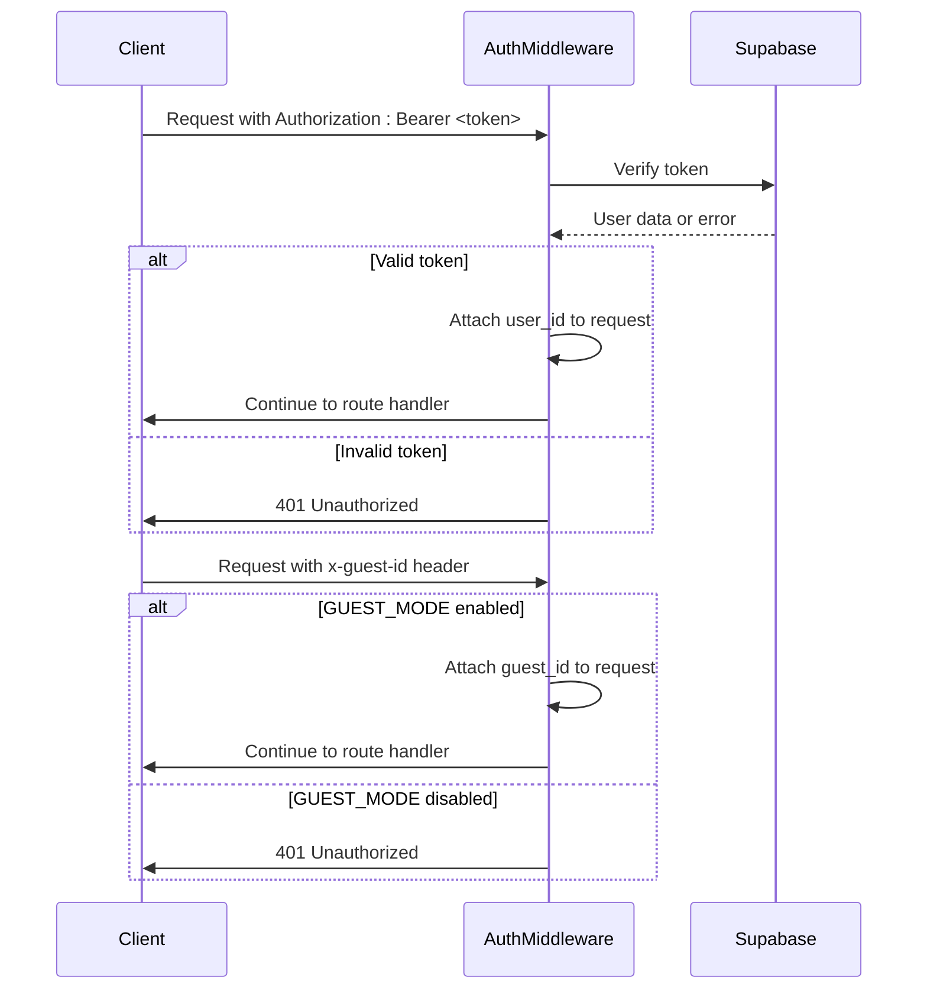
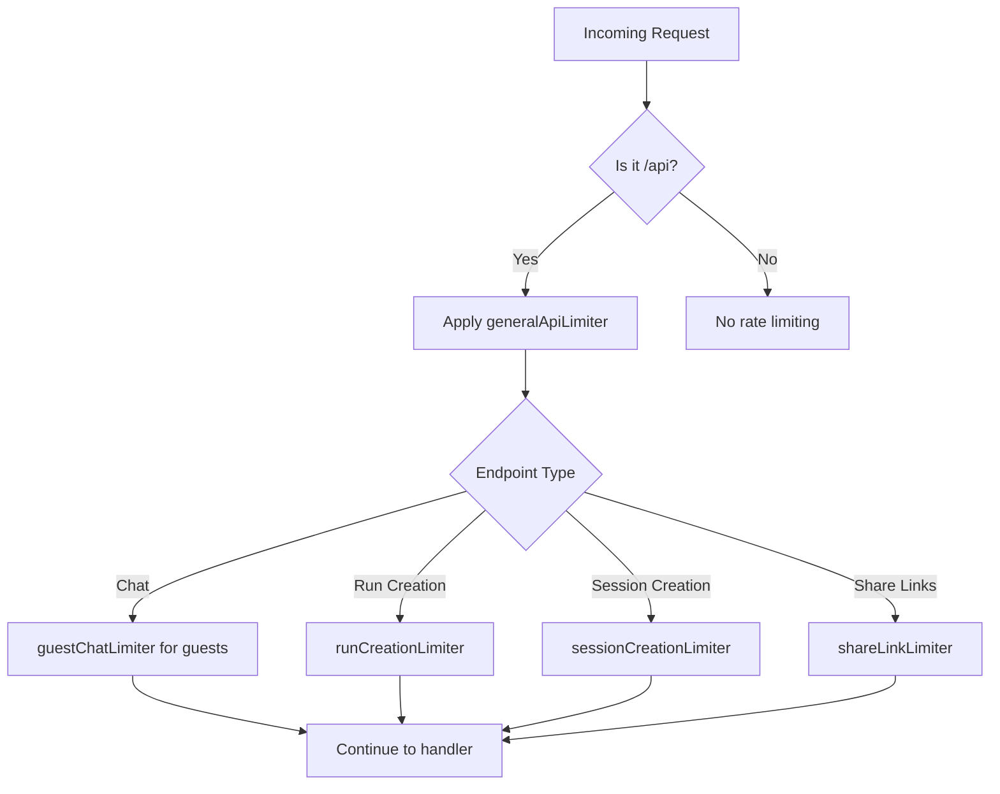

# API Endpoints Reference

<cite>
**Referenced Files in This Document**   
- [chatController.ts](file://apps/api/src/controllers/chatController.ts)
- [filesController.ts](file://apps/api/src/controllers/filesController.ts)
- [memoryController.ts](file://apps/api/src/controllers/memoryController.ts)
- [streamController.ts](file://apps/api/src/controllers/streamController.ts)
- [chat.ts](file://apps/api/src/routes/chat.ts)
- [files.ts](file://apps/api/src/routes/files.ts)
- [memory.ts](file://apps/api/src/routes/memory.ts)
- [index.ts](file://apps/api/src/index.ts)
- [auth.ts](file://apps/api/src/middleware/auth.ts)
- [rateLimit.ts](file://apps/api/src/middleware/rateLimit.ts)
- [errorHandler.ts](file://apps/api/src/middleware/errorHandler.ts)
- [openai.ts](file://apps/api/src/services/openai.ts)
</cite>

## Table of Contents
1. [Introduction](#introduction)
2. [Routing Architecture](#routing-architecture)
3. [Authentication and Security](#authentication-and-security)
4. [Rate Limiting](#rate-limiting)
5. [Error Response Format](#error-response-format)
6. [Chat Endpoints](#chat-endpoints)
7. [File Management Endpoints](#file-management-endpoints)
8. [Memory Operations Endpoints](#memory-operations-endpoints)
9. [Streaming Endpoint](#streaming-endpoint)
10. [Health Check Endpoint](#health-check-endpoint)

## Introduction
This document provides comprehensive reference documentation for all public RESTful endpoints in the WADI backend API. The API is built using Express.js and follows REST principles with JSON request and response payloads. Endpoints are organized by functionality including chat interactions, file management, user memory operations, and streaming capabilities. All endpoints require authentication via JWT tokens, with support for guest mode through the `x-guest-id` header. The API uses Supabase for database operations and Groq for AI model inference.

## Routing Architecture
The WADI backend API uses Express Router to organize endpoints by functionality. The main application entry point in `index.ts` registers all route handlers under the `/api` prefix. Each feature has its own router file in the `routes` directory that maps to corresponding controller functions. The routing pattern follows a clean separation of concerns with routes importing controllers and middleware as needed.

```mermaid
graph TB
A[Client Request] --> B[Express App]
B --> C[/api/workspaces]
B --> D[/api/billing]
B --> E[/api/presets]
B --> F[/api/files]
B --> G[/api/projects]
B --> H[/api/chat]
B --> I[/api/memory]
C --> J[workspacesController]
D --> K[billingController]
E --> L[presetsController]
F --> M[filesController]
G --> N[projectsController]
H --> O[chatController]
I --> P[memoryController]
B --> Q[errorHandler]
style A fill:#f9f,stroke:#333
style B fill:#bbf,stroke:#333,color:#fff
style Q fill:#f96,stroke:#333,color:#fff
```

**Diagram sources**
- [index.ts](file://apps/api/src/index.ts#L7-L27)
- [chat.ts](file://apps/api/src/routes/chat.ts#L2-L33)

**Section sources**
- [index.ts](file://apps/api/src/index.ts#L1-L144)
- [chat.ts](file://apps/api/src/routes/chat.ts#L1-L34)

## Authentication and Security
All API endpoints require authentication through the `authMiddleware` which validates JWT tokens from the Authorization header. For guest users, the system supports guest mode when the `GUEST_MODE` environment variable is enabled and an `x-guest-id` header is provided. The middleware attaches the `user_id` to the request object for authenticated users, while guest requests have `guest_id` attached instead.



**Diagram sources**
- [auth.ts](file://apps/api/src/middleware/auth.ts#L18-L82)

**Section sources**
- [auth.ts](file://apps/api/src/middleware/auth.ts#L1-L82)
- [chatController.ts](file://apps/api/src/controllers/chatController.ts#L22-L23)

## Rate Limiting
The API implements rate limiting using express-rate-limit to prevent abuse and ensure fair usage. Different endpoints have different rate limits based on their resource requirements. The general API limiter applies to all endpoints, while specific limiters target high-impact operations. Guest users are subject to stricter limits on chat endpoints to prevent abuse.



**Diagram sources**
- [rateLimit.ts](file://apps/api/src/middleware/rateLimit.ts#L4-L39)

**Section sources**
- [rateLimit.ts](file://apps/api/src/middleware/rateLimit.ts#L1-L39)
- [chat.ts](file://apps/api/src/routes/chat.ts#L19)

## Error Response Format
The API uses a standardized error response format through the `errorHandler` middleware. All errors return a JSON object with consistent fields including error message, code, retryability, and timestamp. The error codes are defined in the `ErrorCodes` enum and provide specific information about the error type. This consistent format enables clients to handle errors programmatically.

```mermaid
erDiagram
ERROR_RESPONSE {
string error
string code
boolean retryable
string timestamp
object details
}
ERROR_RESPONSE ||--o{ AUTH_ERROR : "authentication"
ERROR_RESPONSE ||--o{ RESOURCE_ERROR : "resource"
ERROR_RESPONSE ||--o{ VALIDATION_ERROR : "validation"
ERROR_RESPONSE ||--o{ RATE_LIMIT_ERROR : "rate_limit"
class AUTH_ERROR {
AUTH_MISSING
AUTH_INVALID
AUTH_EXPIRED
AUTH_USER_NOT_FOUND
}
class RESOURCE_ERROR {
PROJECT_NOT_FOUND
SESSION_NOT_FOUND
RUN_NOT_FOUND
TASK_NOT_FOUND
RESOURCE_NOT_FOUND
}
class VALIDATION_ERROR {
INVALID_INPUT
INVALID_PROJECT_NAME
INVALID_EMAIL
WEAK_PASSWORD
}
class RATE_LIMIT_ERROR {
RATE_LIMIT_EXCEEDED
}
```

**Diagram sources**
- [errorHandler.ts](file://apps/api/src/middleware/errorHandler.ts#L6-L36)

**Section sources**
- [errorHandler.ts](file://apps/api/src/middleware/errorHandler.ts#L1-L201)

## Chat Endpoints
The chat endpoints provide core conversational AI functionality, allowing users to send messages, retrieve conversation history, and manage conversations. These endpoints use the Groq API for AI inference and store conversation data in Supabase. The system supports both authenticated users and guest mode, with different data persistence strategies for each.

### POST /api/chat
Sends a message and receives an AI response. Creates or uses an existing conversation and returns the conversation ID, user message, and assistant response.

**Request Parameters**
- **Method**: POST
- **URL**: /api/chat
- **Headers**: 
  - Authorization: Bearer <token> (for authenticated users)
  - x-guest-id: <guest-id> (for guest mode)
- **Body**:
  - message: string (required) - User's message content
  - conversationId?: string (optional) - Existing conversation ID
  - messages?: array (optional) - Message history (for guest mode)

**Response Schema**
```json
{
  "ok": boolean,
  "data": {
    "conversationId": string,
    "userMessage": object,
    "assistantMessage": object,
    "reply": string,
    "model": string,
    "thought": object
  }
}
```

**Authentication**: Required (user token or guest ID)  
**Rate Limiting**: Applies `guestChatLimiter` for guest users  
**Section sources**
- [chatController.ts](file://apps/api/src/controllers/chatController.ts#L20-L253)
- [chat.ts](file://apps/api/src/routes/chat.ts#L19)

### GET /api/chat
Retrieves all conversations for the authenticated user, ordered by most recently updated.

**Request Parameters**
- **Method**: GET
- **URL**: /api/chat
- **Headers**: Authorization: Bearer <token>

**Response Schema**
```json
{
  "ok": boolean,
  "data": [
    {
      "id": string,
      "user_id": string,
      "title": string,
      "created_at": string,
      "updated_at": string
    }
  ]
}
```

**Authentication**: Required  
**Section sources**
- [chatController.ts](file://apps/api/src/controllers/chatController.ts#L372-L405)
- [chat.ts](file://apps/api/src/routes/chat.ts#L22)

### GET /api/chat/:conversationId
Retrieves a specific conversation and all its messages by conversation ID.

**Request Parameters**
- **Method**: GET
- **URL**: /api/chat/{conversationId}
- **Headers**: Authorization: Bearer <token>
- **Path Parameters**:
  - conversationId: string - The ID of the conversation to retrieve

**Response Schema**
```json
{
  "ok": boolean,
  "data": {
    "conversation": object,
    "messages": [
      {
        "id": string,
        "conversation_id": string,
        "role": string,
        "content": string,
        "created_at": string,
        "model": string
      }
    ]
  }
}
```

**Authentication**: Required  
**Section sources**
- [chatController.ts](file://apps/api/src/controllers/chatController.ts#L314-L366)
- [chat.ts](file://apps/api/src/routes/chat.ts#L25)

### DELETE /api/chat/:conversationId
Deletes a conversation and all its associated messages.

**Request Parameters**
- **Method**: DELETE
- **URL**: /api/chat/{conversationId}
- **Headers**: Authorization: Bearer <token>
- **Path Parameters**:
  - conversationId: string - The ID of the conversation to delete

**Response Schema**
```json
{
  "ok": boolean
}
```

**Authentication**: Required  
**Section sources**
- [chatController.ts](file://apps/api/src/controllers/chatController.ts#L411-L456)
- [chat.ts](file://apps/api/src/routes/chat.ts#L28)

### GET /api/chat/summary
Retrieves a summary of the user's chat activity including total conversations and recent conversations.

**Request Parameters**
- **Method**: GET
- **URL**: /api/chat/summary
- **Headers**: Authorization: Bearer <token>

**Response Schema**
```json
{
  "ok": boolean,
  "data": {
    "total_conversations": number,
    "total_messages": number,
    "recent_conversations": [
      {
        "id": string,
        "user_id": string,
        "title": string,
        "created_at": string,
        "updated_at": string
      }
    ]
  }
}
```

**Authentication**: Required  
**Section sources**
- [chatController.ts](file://apps/api/src/controllers/chatController.ts#L259-L308)
- [chat.ts](file://apps/api/src/routes/chat.ts#L31)

## File Management Endpoints
The file management endpoints handle user file uploads, downloads, and metadata retrieval. Files are stored in Supabase Storage with metadata tracked in the database. The system supports associating files with conversations and messages, enabling rich chat experiences with file attachments.

### POST /api/files/upload
Uploads a file to storage and saves metadata to the database.

**Request Parameters**
- **Method**: POST
- **URL**: /api/files/upload
- **Headers**: 
  - Authorization: Bearer <token>
  - Content-Type: multipart/form-data
- **Form Data**:
  - file: File - The file to upload
  - conversationId?: string - Associated conversation ID
  - messageId?: string - Associated message ID

**Response Schema**
```json
{
  "ok": boolean,
  "data": {
    "id": string,
    "user_id": string,
    "filename": string,
    "original_filename": string,
    "file_type": string,
    "file_size": number,
    "mime_type": string,
    "storage_path": string,
    "processing_status": string,
    "created_at": string,
    "updated_at": string
  }
}
```

**Authentication**: Required  
**Section sources**
- [filesController.ts](file://apps/api/src/controllers/filesController.ts#L11-L125)
- [files.ts](file://apps/api/src/routes/files.ts#L17)

### GET /api/files/:fileId
Retrieves metadata for a specific file.

**Request Parameters**
- **Method**: GET
- **URL**: /api/files/{fileId}
- **Headers**: Authorization: Bearer <token>
- **Path Parameters**:
  - fileId: string - The ID of the file to retrieve

**Response Schema**
```json
{
  "ok": boolean,
  "data": {
    "id": string,
    "user_id": string,
    "filename": string,
    "original_filename": string,
    "file_type": string,
    "file_size": number,
    "mime_type": string,
    "storage_path": string,
    "processing_status": string,
    "created_at": string,
    "updated_at": string
  }
}
```

**Authentication**: Required  
**Section sources**
- [filesController.ts](file://apps/api/src/controllers/filesController.ts#L132-L159)
- [files.ts](file://apps/api/src/routes/files.ts#L20)

### GET /api/files/:fileId/download
Downloads the content of a specific file.

**Request Parameters**
- **Method**: GET
- **URL**: /api/files/{fileId}/download
- **Headers**: Authorization: Bearer <token>
- **Path Parameters**:
  - fileId: string - The ID of the file to download

**Response**: File content with appropriate Content-Type and Content-Disposition headers

**Authentication**: Required  
**Section sources**
- [filesController.ts](file://apps/api/src/controllers/filesController.ts#L165-L208)
- [files.ts](file://apps/api/src/routes/files.ts#L21)

### DELETE /api/files/:fileId
Deletes a file and its metadata from storage and database.

**Request Parameters**
- **Method**: DELETE
- **URL**: /api/files/{fileId}
- **Headers**: Authorization: Bearer <token>
- **Path Parameters**:
  - fileId: string - The ID of the file to delete

**Response Schema**
```json
{
  "ok": boolean,
  "message": string
}
```

**Authentication**: Required  
**Section sources**
- [filesController.ts](file://apps/api/src/controllers/filesController.ts#L214-L253)
- [files.ts](file://apps/api/src/routes/files.ts#L22)

### GET /api/files/conversation/:conversationId
Retrieves all files associated with a specific conversation.

**Request Parameters**
- **Method**: GET
- **URL**: /api/files/conversation/{conversationId}
- **Headers**: Authorization: Bearer <token>
- **Path Parameters**:
  - conversationId: string - The ID of the conversation

**Response Schema**
```json
{
  "ok": boolean,
  "data": [
    {
      "id": string,
      "user_id": string,
      "conversation_id": string,
      "filename": string,
      "original_filename": string,
      "file_type": string,
      "file_size": number,
      "mime_type": string,
      "storage_path": string,
      "processing_status": string,
      "created_at": string,
      "updated_at": string
    }
  ]
}
```

**Authentication**: Required  
**Section sources**
- [filesController.ts](file://apps/api/src/controllers/filesController.ts#L259-L286)
- [files.ts](file://apps/api/src/routes/files.ts#L25)

## Memory Operations Endpoints
The memory endpoints manage user-specific memory data that personalizes AI interactions. Memory entries store user preferences, facts, and context that the AI can reference during conversations. This enables persistent personalization across sessions.

### GET /api/memory
Retrieves all active memory entries for the authenticated user.

**Request Parameters**
- **Method**: GET
- **URL**: /api/memory
- **Headers**: Authorization: Bearer <token>

**Response Schema**
```json
{
  "ok": boolean,
  "data": [
    {
      "id": string,
      "user_id": string,
      "key": string,
      "value": string,
      "memory_type": string,
      "category": string,
      "source": string,
      "confidence": number,
      "metadata": object,
      "created_at": string,
      "updated_at": string
    }
  ]
}
```

**Authentication**: Required  
**Section sources**
- [memoryController.ts](file://apps/api/src/controllers/memoryController.ts#L8-L33)
- [memory.ts](file://apps/api/src/routes/memory.ts#L9)

### POST /api/memory
Creates or updates a memory entry for the authenticated user.

**Request Parameters**
- **Method**: POST
- **URL**: /api/memory
- **Headers**: Authorization: Bearer <token>
- **Body**:
  - key: string (required) - Memory key identifier
  - value: string (required) - Memory value content
  - type: string (required) - Memory type (e.g., "preference", "fact")
  - category?: string - Memory category
  - source?: string - Source of the memory
  - confidence?: number - Confidence level (0-1)
  - metadata?: object - Additional metadata

**Response Schema**
```json
{
  "ok": boolean,
  "data": {
    "id": string,
    "user_id": string,
    "key": string,
    "value": string,
    "memory_type": string,
    "category": string,
    "source": string,
    "confidence": number,
    "metadata": object,
    "created_at": string,
    "updated_at": string
  }
}
```

**Authentication**: Required  
**Section sources**
- [memoryController.ts](file://apps/api/src/controllers/memoryController.ts#L39-L80)
- [memory.ts](file://apps/api/src/routes/memory.ts#L10)

### DELETE /api/memory/:memoryId
Deletes a specific memory entry by ID.

**Request Parameters**
- **Method**: DELETE
- **URL**: /api/memory/{memoryId}
- **Headers**: Authorization: Bearer <token>
- **Path Parameters**:
  - memoryId: string - The ID of the memory entry to delete

**Response Schema**
```json
{
  "ok": boolean,
  "message": string
}
```

**Authentication**: Required  
**Section sources**
- [memoryController.ts](file://apps/api/src/controllers/memoryController.ts#L86-L116)
- [memory.ts](file://apps/api/src/routes/memory.ts#L11)

### GET /api/memory/context
Retrieves formatted memory context for use in AI conversations.

**Request Parameters**
- **Method**: GET
- **URL**: /api/memory/context
- **Headers**: Authorization: Bearer <token>

**Response Schema**
```json
{
  "ok": boolean,
  "data": {
    "raw": array,
    "formatted": string,
    "by_category": object
  }
}
```

**Authentication**: Required  
**Section sources**
- [memoryController.ts](file://apps/api/src/controllers/memoryController.ts#L122-L184)

## Streaming Endpoint
The streaming endpoint provides real-time AI responses using Server-Sent Events (SSE). This enables progressive rendering of AI responses as they are generated, improving perceived performance and user experience.

### POST /api/projects/:id/runs/stream
Streams AI responses in real-time for a specific project.

**Request Parameters**
- **Method**: POST
- **URL**: /api/projects/{id}/runs/stream
- **Headers**: Authorization: Bearer <token>
- **Path Parameters**:
  - id: string - Project ID
- **Body**:
  - input: string (required) - User input
  - model?: string - AI model to use

**Response**: Text/event-stream with JSON-encoded events containing:
- type: "chunk" - Partial response text
- type: "complete" - Complete run data
- type: "error" - Error information

**Authentication**: Required  
**Section sources**
- [streamController.ts](file://apps/api/src/controllers/streamController.ts#L5-L117)

## Health Check Endpoint
The health check endpoint monitors the status of external dependencies including Supabase and Groq (LLM provider). This endpoint is used by infrastructure to determine service availability.

### GET /api/health
Checks the health status of the API and its dependencies.

**Request Parameters**
- **Method**: GET
- **URL**: /api/health

**Response Schema**
```json
{
  "status": string,
  "supabase": string,
  "openai": string,
  "timestamp": string
}
```

**Authentication**: Not required  
**Section sources**
- [index.ts](file://apps/api/src/index.ts#L95-L108)