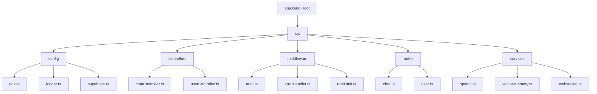
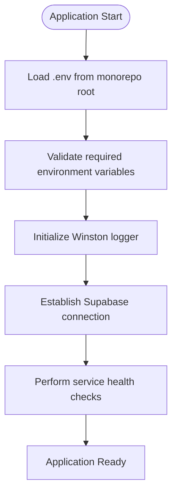
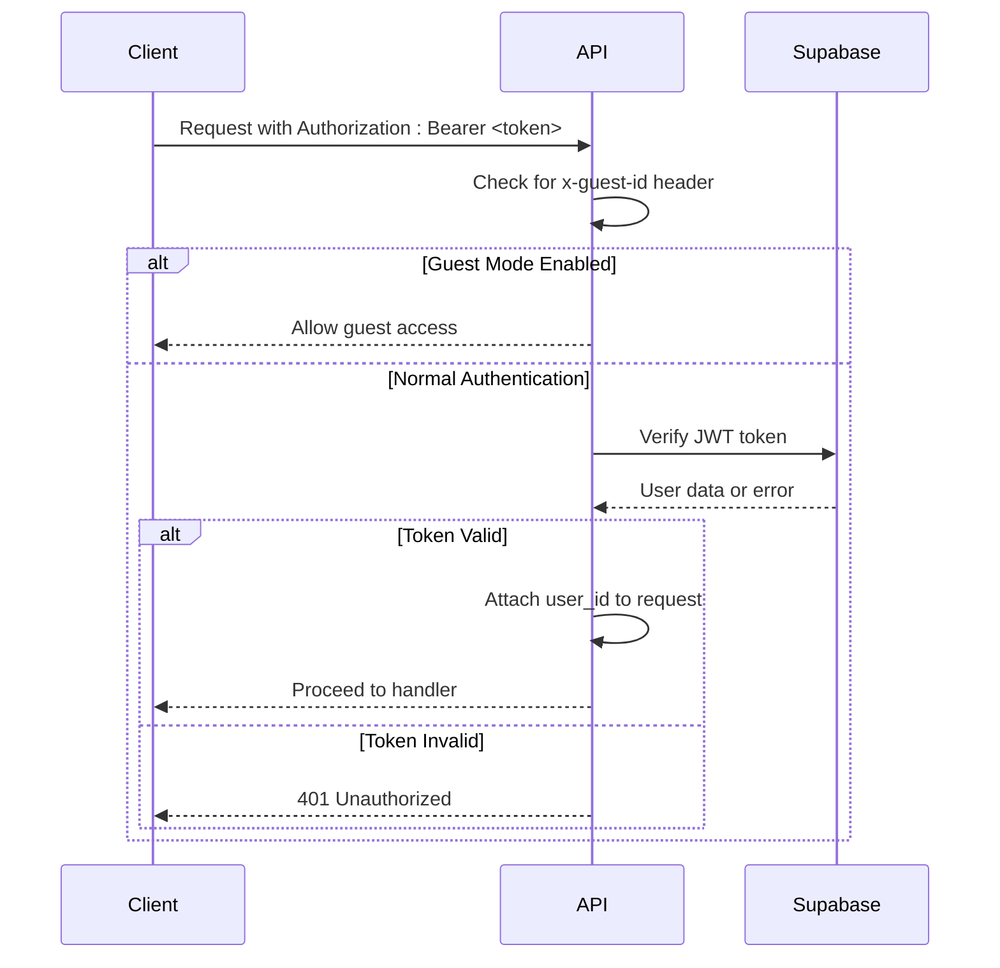
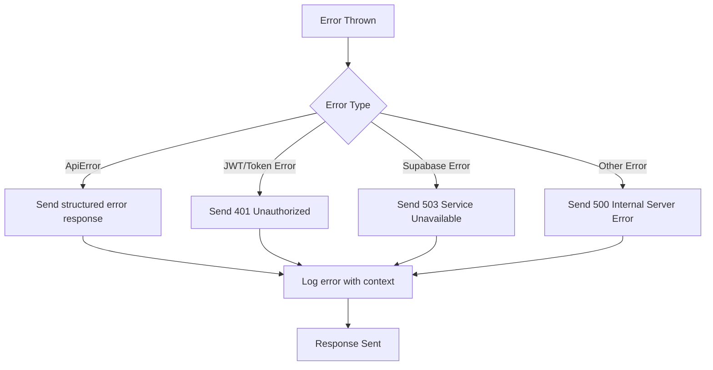
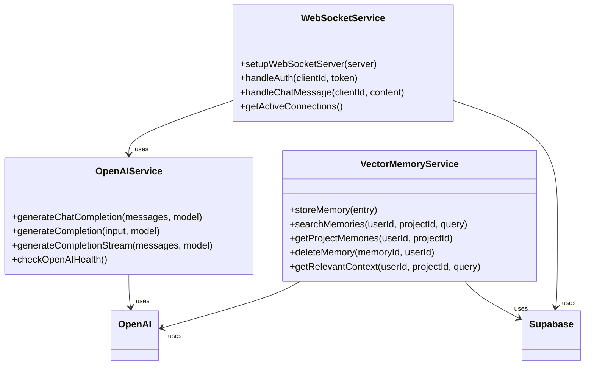
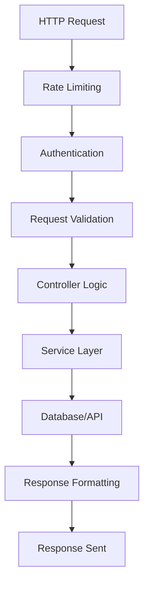
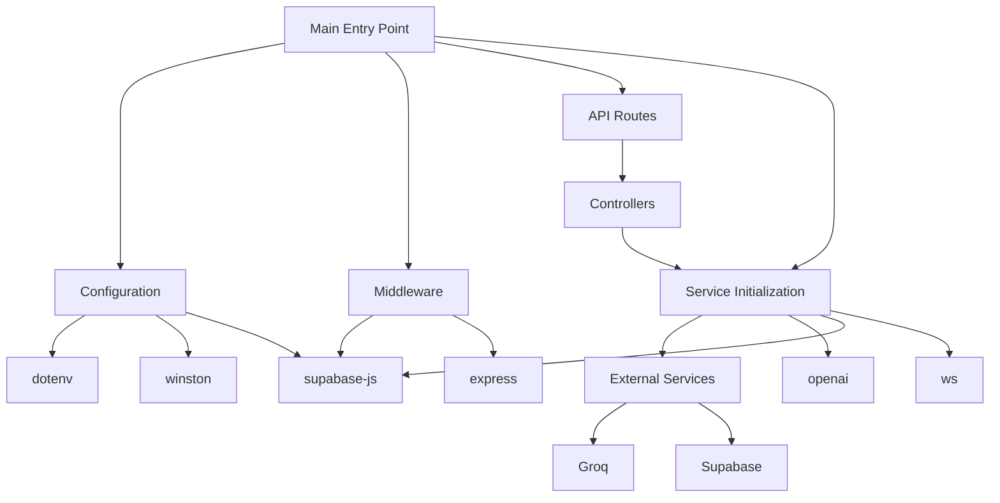

# Backend Architecture

<cite>
**Referenced Files in This Document**   
- [env.ts](file://apps/api/src/config/env.ts)
- [logger.ts](file://apps/api/src/config/logger.ts)
- [supabase.ts](file://apps/api/src/config/supabase.ts)
- [auth.ts](file://apps/api/src/middleware/auth.ts)
- [errorHandler.ts](file://apps/api/src/middleware/errorHandler.ts)
- [index.ts](file://apps/api/src/index.ts)
- [openai.ts](file://apps/api/src/services/openai.ts)
- [vector-memory.ts](file://apps/api/src/services/vector-memory.ts)
- [websocket.ts](file://apps/api/src/services/websocket.ts)
- [chat.ts](file://apps/api/src/routes/chat.ts)
</cite>

## Table of Contents
1. [Introduction](#introduction)
2. [Project Structure](#project-structure)
3. [Core Components](#core-components)
4. [Architecture Overview](#architecture-overview)
5. [Detailed Component Analysis](#detailed-component-analysis)
6. [Dependency Analysis](#dependency-analysis)
7. [Performance Considerations](#performance-considerations)
8. [Troubleshooting Guide](#troubleshooting-guide)
9. [Conclusion](#conclusion)

## Introduction
The backend architecture of the WADI application is built on Express.js and follows a modular, service-oriented design pattern. It provides RESTful APIs for managing user interactions, AI-powered chat functionality, data storage via Supabase, and real-time communication through WebSockets. The system integrates with external LLM providers (primarily Groq with OpenAI compatibility) and implements robust security, logging, error handling, and rate-limiting mechanisms. This document details the high-level design, component interactions, technical decisions, and operational considerations for the backend layer.

## Project Structure

The backend resides in the `apps/api` directory and follows a clean, organized structure that separates concerns across configuration, routing, middleware, controllers, and services.



**Diagram sources**
- [env.ts](file://apps/api/src/config/env.ts)
- [logger.ts](file://apps/api/src/config/logger.ts)
- [supabase.ts](file://apps/api/src/config/supabase.ts)
- [auth.ts](file://apps/api/src/middleware/auth.ts)
- [errorHandler.ts](file://apps/api/src/middleware/errorHandler.ts)
- [openai.ts](file://apps/api/src/services/openai.ts)
- [vector-memory.ts](file://apps/api/src/services/vector-memory.ts)
- [websocket.ts](file://apps/api/src/services/websocket.ts)

**Section sources**
- [env.ts](file://apps/api/src/config/env.ts)
- [logger.ts](file://apps/api/src/config/logger.ts)
- [supabase.ts](file://apps/api/src/config/supabase.ts)

## Core Components

The backend consists of several core components that work together to deliver functionality: configuration management, authentication, logging, error handling, API routing, service integration, and real-time communication. These components are designed to be loosely coupled and independently maintainable, enabling scalability and ease of development.

**Section sources**
- [index.ts](file://apps/api/src/index.ts)
- [env.ts](file://apps/api/src/config/env.ts)
- [logger.ts](file://apps/api/src/config/logger.ts)
- [supabase.ts](file://apps/api/src/config/supabase.ts)

## Architecture Overview

The backend follows a layered architecture with clear separation between presentation (routes), business logic (controllers), and data/service integration (services). It uses Express.js as the web framework and leverages Supabase for authentication and database operations, while integrating with Groq (OpenAI-compatible) for LLM capabilities.

```mermaid
graph TD
Client[Frontend Client] --> API[Express.js API]
API --> Auth[Supabase Auth]
API --> DB[(Supabase Database)]
API --> LLM[LLM Provider<br>(Groq/OpenAI)]
API --> WS[WebSocket Server]
subgraph Backend
API
Auth
DB
LLM
WS
end
API --> |REST| Auth
API --> |REST| DB
API --> |REST| LLM
API --> |WebSocket| WS
WS --> |Stream| LLM
```

**Diagram sources**
- [index.ts](file://apps/api/src/index.ts)
- [supabase.ts](file://apps/api/src/config/supabase.ts)
- [openai.ts](file://apps/api/src/services/openai.ts)
- [websocket.ts](file://apps/api/src/services/websocket.ts)

## Detailed Component Analysis

### Configuration Management
Handles environment variables, logging setup, and external service configuration.

#### Configuration Loader


**Diagram sources**
- [env.ts](file://apps/api/src/config/env.ts)
- [logger.ts](file://apps/api/src/config/logger.ts)
- [supabase.ts](file://apps/api/src/config/supabase.ts)

### Authentication and Authorization
Implements JWT-based authentication using Supabase with support for guest mode.

#### Authentication Flow


**Diagram sources**
- [auth.ts](file://apps/api/src/middleware/auth.ts)
- [supabase.ts](file://apps/api/src/config/supabase.ts)

### Error Handling
Provides centralized error handling with standardized response formats and logging.

#### Error Handling Pipeline


**Diagram sources**
- [errorHandler.ts](file://apps/api/src/middleware/errorHandler.ts)

### Service Layer Organization
Encapsulates business logic and external service integrations in dedicated service modules.

#### Service Architecture


**Diagram sources**
- [openai.ts](file://apps/api/src/services/openai.ts)
- [vector-memory.ts](file://apps/api/src/services/vector-memory.ts)
- [websocket.ts](file://apps/api/src/services/websocket.ts)

### REST API Structure
Organized around resource-based endpoints with consistent patterns across controllers.

#### API Endpoint Structure


**Diagram sources**
- [chat.ts](file://apps/api/src/routes/chat.ts)
- [auth.ts](file://apps/api/src/middleware/auth.ts)
- [errorHandler.ts](file://apps/api/src/middleware/errorHandler.ts)

## Dependency Analysis

The backend has well-defined dependencies on external services and internal modules, with clear separation of concerns.



**Diagram sources**
- [index.ts](file://apps/api/src/index.ts)
- [package.json](file://apps/api/package.json)

**Section sources**
- [index.ts](file://apps/api/src/index.ts)
- [package.json](file://apps/api/package.json)

## Performance Considerations

The architecture includes several performance optimizations:
- Rate limiting to prevent abuse
- Connection pooling through Supabase client reuse
- Efficient memory management in vector search
- Streaming responses for chat completions to reduce latency
- Caching strategies in vector memory service
- Health checks to avoid routing traffic to unhealthy instances

The system is designed to scale horizontally, with stateless API instances that can be load balanced. The WebSocket service maintains connection state but can be scaled with proper session affinity or a shared message broker in production deployments.

## Troubleshooting Guide

Common issues and their solutions:

**Section sources**
- [errorHandler.ts](file://apps/api/src/middleware/errorHandler.ts)
- [logger.ts](file://apps/api/src/config/logger.ts)
- [supabase.ts](file://apps/api/src/config/supabase.ts)

### Authentication Failures
- Verify `SUPABASE_URL` and `SUPABASE_ANON_KEY` are correctly set
- Check JWT token validity and expiration
- Ensure Supabase authentication service is operational

### LLM Integration Issues
- Confirm `GROQ_API_KEY` is properly configured
- Check network connectivity to Groq API endpoint
- Verify model names are supported and correctly mapped

### Database Connection Problems
- Validate Supabase project URL and credentials
- Check database schema and table permissions
- Monitor connection limits and performance

### WebSocket Connectivity
- Ensure proper CORS configuration for WebSocket connections
- Verify authentication token is sent during WebSocket handshake
- Check server resource usage under high connection loads

## Conclusion

The WADI backend architecture demonstrates a well-structured, maintainable design using Express.js with clear separation of concerns. It effectively integrates with Supabase for authentication and data persistence while leveraging Groq (OpenAI-compatible) for LLM capabilities. The system incorporates robust error handling, comprehensive logging, and real-time communication features. The modular design allows for easy extension and maintenance, while the use of environment variables and configuration files enables smooth deployment across different environments. Future enhancements could include distributed caching, message queuing for background processing, and enhanced monitoring capabilities.