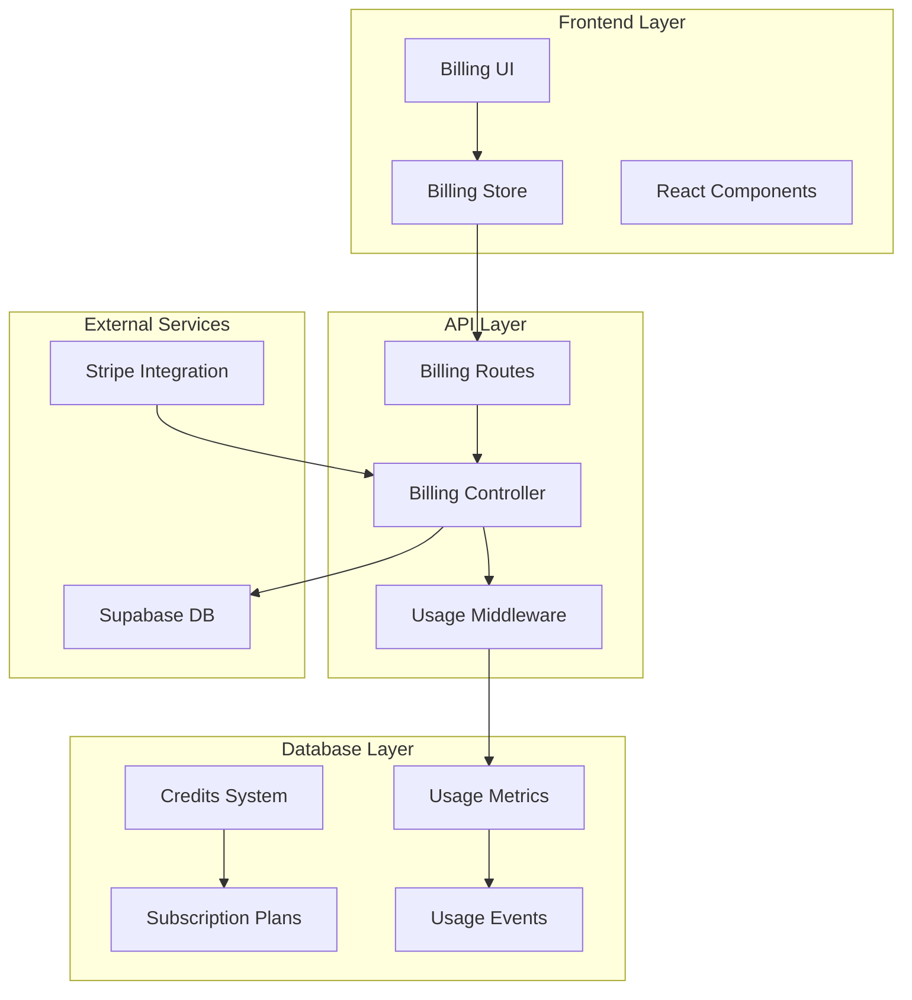
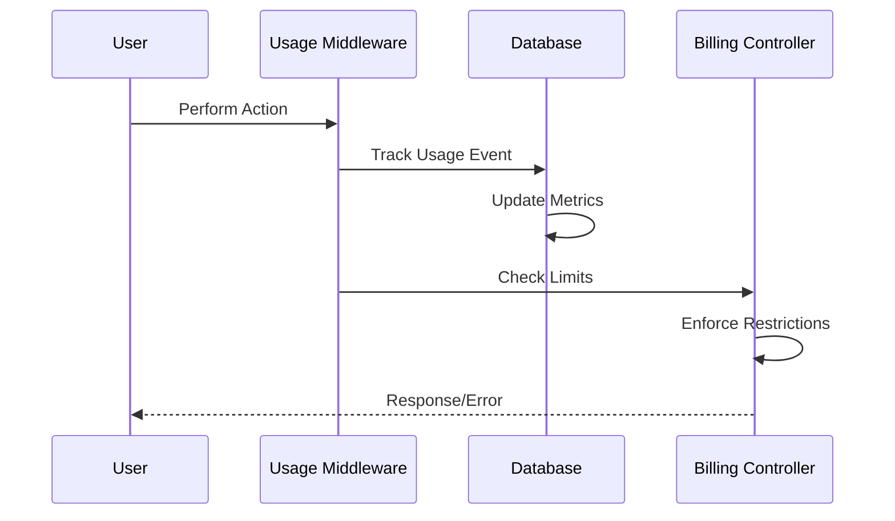
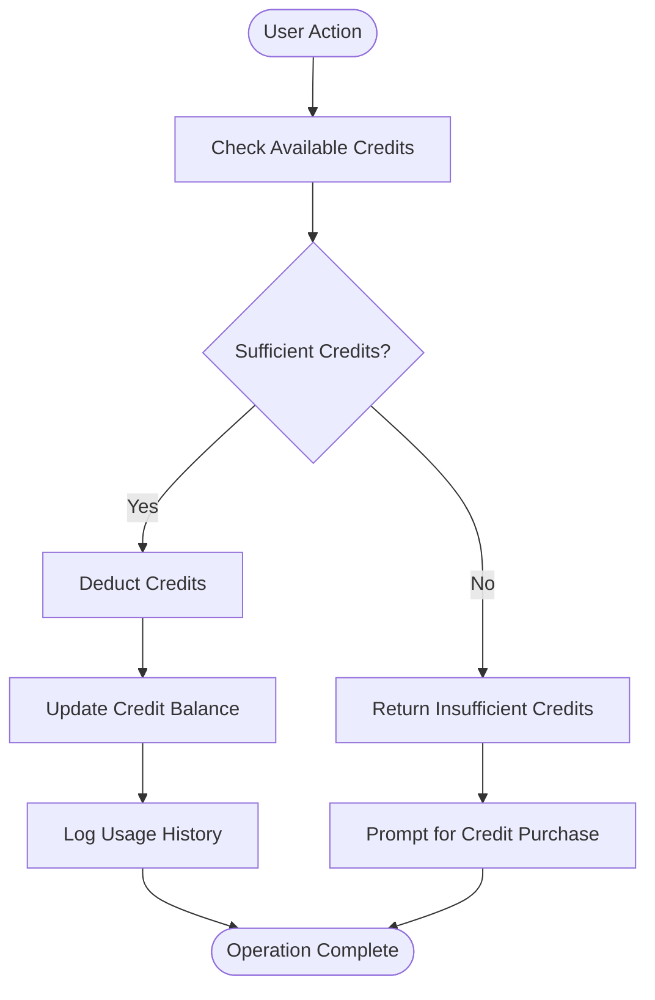
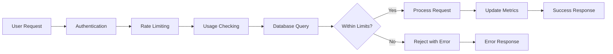
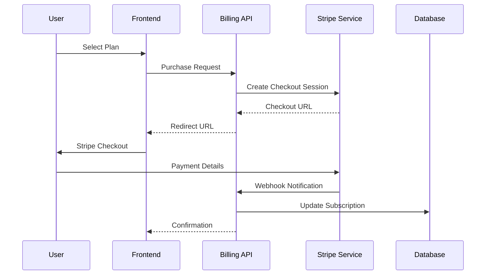
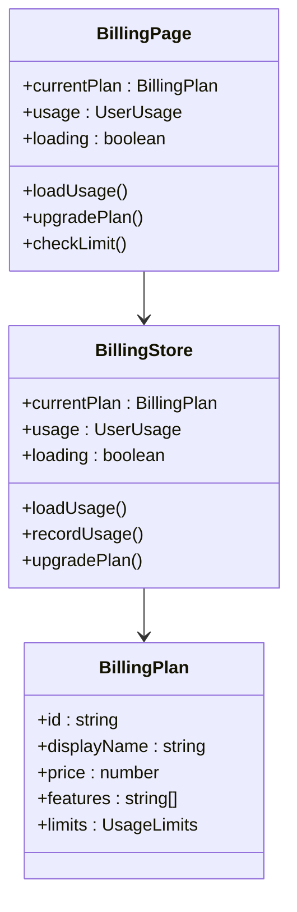
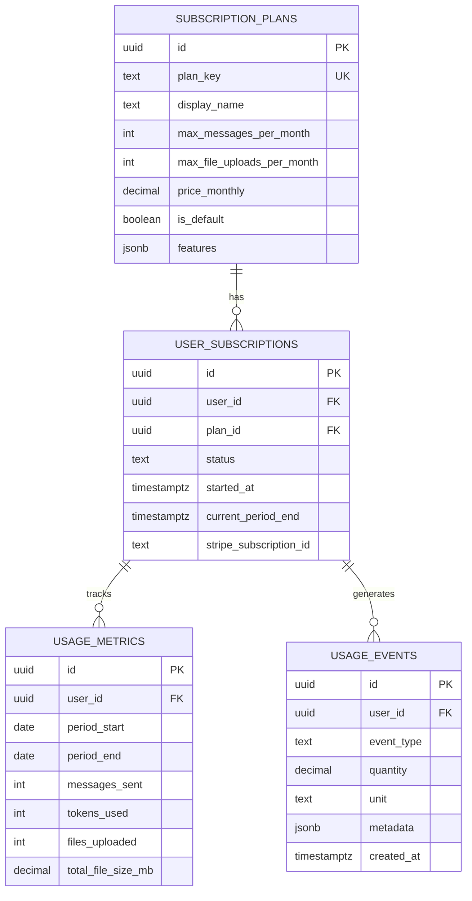
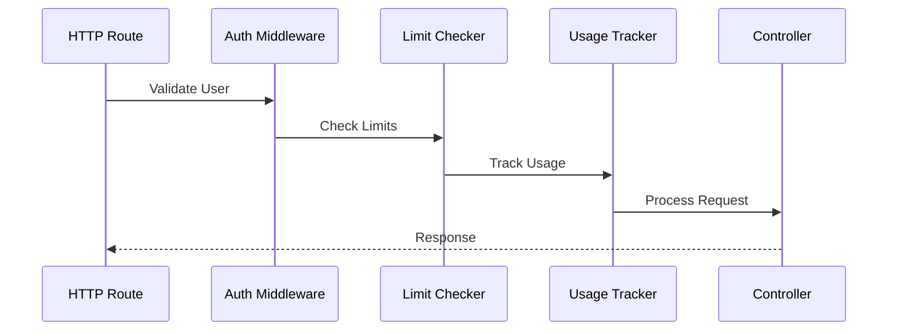

# Billing & Monetization

<cite>
**Referenced Files in This Document**
- [billingController.ts](file://apps/api/src/controllers/billingController.ts)
- [billing.ts](file://apps/api/src/routes/billing.ts)
- [Billing.tsx](file://apps/frontend/src/pages/Billing.tsx)
- [billingStore.ts](file://apps/frontend/src/store/billingStore.ts)
- [005_monetization.sql](file://apps/api/migrations/005_monetization.sql)
- [usage-tracking.ts](file://apps/api/src/middleware/usage-tracking.ts)
- [limit-check.ts](file://apps/api/src/middleware/limit-check.ts)
- [billing.ts](file://apps/frontend/src/types/billing.ts)
- [chatController.ts](file://apps/api/src/controllers/chatController.ts)
- [supabase.ts](file://apps/api/src/config/supabase.ts)
</cite>

## Table of Contents
1. [Introduction](#introduction)
2. [System Architecture](#system-architecture)
3. [Subscription Plans](#subscription-plans)
4. [Usage Tracking System](#usage-tracking-system)
5. [Credit-Based Billing](#credit-based-billing)
6. [Limit Enforcement](#limit-enforcement)
7. [Payment Processing](#payment-processing)
8. [Frontend Implementation](#frontend-implementation)
9. [Database Schema](#database-schema)
10. [Integration Patterns](#integration-patterns)
11. [Security Considerations](#security-considerations)
12. [Best Practices](#best-practices)
13. [Troubleshooting](#troubleshooting)

## Introduction

WADI implements a sophisticated billing and monetization system built around a credit-based model with tiered subscription plans. The system provides granular usage tracking, automatic limit enforcement, and seamless payment processing capabilities. This infrastructure supports both freemium and premium user experiences while maintaining real-time usage monitoring and financial transaction management.

The billing system operates on two primary models:
- **Subscription-based**: Monthly/yearly plans with feature access controls
- **Pay-per-use**: Credit-based consumption for flexible pricing

## System Architecture

The billing system follows a microservice architecture with clear separation between frontend presentation, backend API logic, and database persistence.

**Diagram sources**
- [billing.ts](file://apps/api/src/routes/billing.ts#L1-L28)
- [billingController.ts](file://apps/api/src/controllers/billingController.ts#L1-L279)
- [billingStore.ts](file://apps/frontend/src/store/billingStore.ts#L1-L144)

**Section sources**
- [billing.ts](file://apps/api/src/routes/billing.ts#L1-L28)
- [billingController.ts](file://apps/api/src/controllers/billingController.ts#L1-L279)

## Subscription Plans

WADI offers three distinct subscription tiers, each with specific feature sets and usage limits designed to cater to different user needs and revenue models.

### Plan Structure

| Feature | Free | Pro | Business |
|---------|------|-----|----------|
| **Monthly Messages** | 100 | 10,000 | Unlimited |
| **Daily Messages** | 10 | 500 | Unlimited |
| **Max File Size** | 5 MB | 50 MB | 100 MB |
| **Workspaces** | 1 | 10 | Unlimited |
| **Priority Support** | ❌ | ✅ | ✅ |
| **Advanced AI Models** | ❌ | ✅ | ✅ |
| **API Access** | ❌ | ❌ | ✅ |
| **Custom Branding** | ❌ | ✅ | ✅ |
| **Price** | $0 | $19.99/mo | $29.99/mo |

### Plan Implementation Details

The system automatically assigns default plans to new users and provides seamless plan upgrades through Stripe integration. Each plan includes:

- **Feature Flags**: Boolean indicators for premium features
- **Usage Limits**: Monthly and daily quotas for resources
- **Access Controls**: Automatic enforcement of plan restrictions
- **Upgrade Paths**: Seamless transitions between tiers

**Section sources**
- [005_monetization.sql](file://apps/api/migrations/005_monetization.sql#L55-L126)
- [billing.ts](file://apps/frontend/src/types/billing.ts#L46-L100)

## Usage Tracking System

The usage tracking system provides comprehensive monitoring of user activity across multiple dimensions, enabling precise limit enforcement and billing calculations.

### Tracking Mechanisms

**Diagram sources**
- [usage-tracking.ts](file://apps/api/src/middleware/usage-tracking.ts#L1-L108)
- [limit-check.ts](file://apps/api/src/middleware/limit-check.ts#L1-L198)

### Supported Usage Types

The system tracks four primary usage categories:

1. **Message Sent**: Tracks AI conversation interactions
2. **File Upload**: Monitors file size and count limits
3. **Workspace Creation**: Controls workspace quota enforcement
4. **Voice Input**: Tracks voice-enabled feature usage

### Token Estimation

For AI interactions, the system estimates token usage based on text length:
- **English Text**: ~1 token per 4 characters
- **Spanish Text**: ~1 token per 3.5 characters

**Section sources**
- [usage-tracking.ts](file://apps/api/src/middleware/usage-tracking.ts#L1-L108)
- [005_monetization.sql](file://apps/api/migrations/005_monetization.sql#L168-L240)

## Credit-Based Billing

WADI implements a flexible credit system that allows users to purchase usage credits independently of subscription plans, providing pay-as-you-go flexibility.

### Credit Operations

**Diagram sources**
- [billingController.ts](file://apps/api/src/controllers/billingController.ts#L102-L161)

### Credit Management Functions

The system provides atomic credit operations through PostgreSQL functions:

- **use_credits()**: Deducts credits with atomic guarantees
- **add_credits()**: Adds credits through purchases
- **renew_monthly_credits()**: Automatic monthly renewal
- **create_billing_info_for_new_user()**: Initial setup

### Usage History Tracking

Each credit transaction maintains detailed audit trails:

| Field | Description | Example |
|-------|-------------|---------|
| **Amount** | Credit quantity changed | 50, -25 |
| **Reason** | Transaction purpose | "Message sent", "Purchase" |
| **Metadata** | Additional context | `{tokens: 120, model: "gpt-3.5"}` |
| **Timestamp** | Transaction time | `2024-01-15T10:30:00Z` |

**Section sources**
- [billingController.ts](file://apps/api/src/controllers/billingController.ts#L102-L219)
- [005_monetization.sql](file://apps/api/migrations/005_monetization.sql#L168-L240)

## Limit Enforcement

The system implements multi-layered limit enforcement to prevent resource abuse while providing clear feedback to users.

### Enforcement Architecture

**Diagram sources**
- [limit-check.ts](file://apps/api/src/middleware/limit-check.ts#L1-L198)

### Per-Resource Limits

The system enforces limits on multiple resources:

1. **Message Limits**: Daily and monthly quotas
2. **File Upload Limits**: Count and size restrictions
3. **Workspace Limits**: Creation and maintenance quotas
4. **Storage Limits**: Total space consumption

### Graceful Degradation

When limits are reached, the system provides:
- **Clear Error Messages**: Informative limit violation responses
- **Upgrade Suggestions**: Direct links to billing pages
- **Remaining Calculations**: Quantities still available
- **Alternative Actions**: Suggestions for resolution

**Section sources**
- [limit-check.ts](file://apps/api/src/middleware/limit-check.ts#L1-L198)

## Payment Processing

WADI integrates with Stripe for secure payment processing, though the current implementation simulates transactions for development purposes.

### Payment Flow

**Diagram sources**
- [billingController.ts](file://apps/api/src/controllers/billingController.ts#L168-L219)

### Payment Integration Points

The system provides several payment-related endpoints:

- **GET /api/billing**: Retrieve billing information
- **POST /api/billing/purchase**: Add credits through payment
- **PATCH /api/billing/plan**: Upgrade/downgrade subscription plans
- **GET /api/billing/history**: View credit usage history

### Security Measures

Payment processing incorporates multiple security layers:
- **Token Validation**: Secure authentication for all requests
- **Webhook Verification**: Stripe webhook signature validation
- **Transaction Logging**: Complete audit trail for compliance
- **Error Handling**: Graceful failure scenarios

**Section sources**
- [billingController.ts](file://apps/api/src/controllers/billingController.ts#L168-L219)

## Frontend Implementation

The frontend billing interface provides intuitive user experience with real-time usage monitoring and seamless plan management.

### Component Architecture

**Diagram sources**
- [Billing.tsx](file://apps/frontend/src/pages/Billing.tsx#L1-L152)
- [billingStore.ts](file://apps/frontend/src/store/billingStore.ts#L1-L144)

### Usage Monitoring

The frontend continuously monitors usage patterns and provides:
- **Real-time Updates**: Live usage statistics
- **Visual Indicators**: Progress bars and counters
- **Limit Warnings**: Early notifications of approaching limits
- **Upgrade Prompts**: Strategic suggestions for plan improvements

### Responsive Design

The billing interface adapts to various screen sizes:
- **Mobile-first**: Optimized for smartphones and tablets
- **Desktop Support**: Full feature availability on larger screens
- **Touch-friendly**: Intuitive gesture controls
- **Accessibility**: Screen reader support and keyboard navigation

**Section sources**
- [Billing.tsx](file://apps/frontend/src/pages/Billing.tsx#L1-L152)
- [billingStore.ts](file://apps/frontend/src/store/billingStore.ts#L1-L144)

## Database Schema

The billing system relies on a comprehensive database schema that supports usage tracking, subscription management, and financial operations.

### Core Tables

**Diagram sources**
- [005_monetization.sql](file://apps/api/migrations/005_monetization.sql#L8-L240)

### Database Functions

The system includes several PostgreSQL functions for billing operations:

1. **get_or_create_current_usage()**: Manages monthly usage periods
2. **get_user_active_subscription()**: Retrieves active subscription details
3. **check_usage_limit()**: Validates resource usage against limits
4. **track_usage_event()**: Logs individual usage events
5. **use_credits()**: Handles credit deduction operations

### Index Strategy

Database performance optimization through strategic indexing:
- **Composite Indexes**: Multi-column indexes for frequently queried combinations
- **Partial Indexes**: Conditional indexes for filtered queries
- **Functional Indexes**: Expression-based indexes for computed values
- **Maintenance Planning**: Regular vacuum and analyze operations

**Section sources**
- [005_monetization.sql](file://apps/api/migrations/005_monetization.sql#L1-L472)

## Integration Patterns

WADI's billing system integrates seamlessly with other application components through well-defined patterns and middleware.

### Middleware Integration

**Diagram sources**
- [limit-check.ts](file://apps/api/src/middleware/limit-check.ts#L1-L198)
- [usage-tracking.ts](file://apps/api/src/middleware/usage-tracking.ts#L1-L108)

### Chat Integration

The billing system integrates with AI chat functionality through usage tracking:

- **Message Tracking**: Each AI conversation counts toward message limits
- **Token Estimation**: Rough token calculation for billing accuracy
- **Limit Enforcement**: Prevents excessive AI usage during free tiers
- **Credit Deduction**: Automatic credit consumption for paid features

### Authentication Integration

Billing operations require user authentication:
- **User ID Extraction**: Secure user identification from JWT tokens
- **Authorization Checks**: Permission validation for billing operations
- **Session Management**: Persistent user context across requests
- **Guest Mode Handling**: Alternative flow for anonymous users

**Section sources**
- [chatController.ts](file://apps/api/src/controllers/chatController.ts#L1-L200)
- [limit-check.ts](file://apps/api/src/middleware/limit-check.ts#L1-L198)

## Security Considerations

The billing system implements multiple security layers to protect user data and financial transactions.

### Data Protection

- **Encryption**: All sensitive data encrypted at rest and in transit
- **Access Control**: Role-based permissions for billing operations
- **Audit Logging**: Comprehensive logging of all financial transactions
- **Data Retention**: Automated cleanup of old usage data

### Fraud Prevention

- **Rate Limiting**: Protection against abuse and spam
- **Transaction Validation**: Double-checking all financial operations
- **Anomaly Detection**: Monitoring for unusual usage patterns
- **Two-Factor Authentication**: Optional additional security layer

### Compliance

- **GDPR Ready**: User data protection and deletion capabilities
- **PCI Compliance**: Secure payment processing standards
- **Financial Regulations**: Adherence to billing industry standards
- **Audit Trails**: Complete transaction histories for compliance

## Best Practices

### Development Guidelines

1. **Atomic Operations**: Use database transactions for critical billing operations
2. **Error Handling**: Implement graceful failure modes for all billing operations
3. **Testing**: Comprehensive unit and integration testing for billing flows
4. **Monitoring**: Real-time alerting for billing system anomalies

### Performance Optimization

1. **Caching**: Intelligent caching of subscription and usage data
2. **Batch Processing**: Group usage updates for improved throughput
3. **Index Optimization**: Regular review and optimization of database indexes
4. **Connection Pooling**: Efficient database connection management

### User Experience

1. **Progressive Disclosure**: Show relevant billing information progressively
2. **Clear Communication**: Transparent pricing and usage information
3. **Seamless Upgrades**: Smooth transition between subscription tiers
4. **Graceful Degradation**: Maintain functionality during billing system issues

## Troubleshooting

### Common Issues

**Insufficient Credits Error**
- Verify user has adequate credit balance
- Check recent credit usage and expiration dates
- Confirm payment processing completion

**Limit Exceeded Responses**
- Review user's current plan limits
- Check usage tracking accuracy
- Verify limit enforcement middleware activation

**Payment Processing Failures**
- Validate Stripe integration configuration
- Check webhook endpoint accessibility
- Verify payment method validity

### Diagnostic Tools

1. **Usage Analytics**: Monitor usage patterns and trends
2. **Error Logging**: Comprehensive error tracking and reporting
3. **Performance Metrics**: Database and API performance monitoring
4. **User Support**: Clear error messages and support resources

### Recovery Procedures

1. **Manual Credit Adjustment**: Administrative override for special cases
2. **Usage Reset**: Periodic reset of monthly usage counters
3. **Subscription Correction**: Manual intervention for subscription issues
4. **Payment Reconciliation**: Automated and manual payment verification