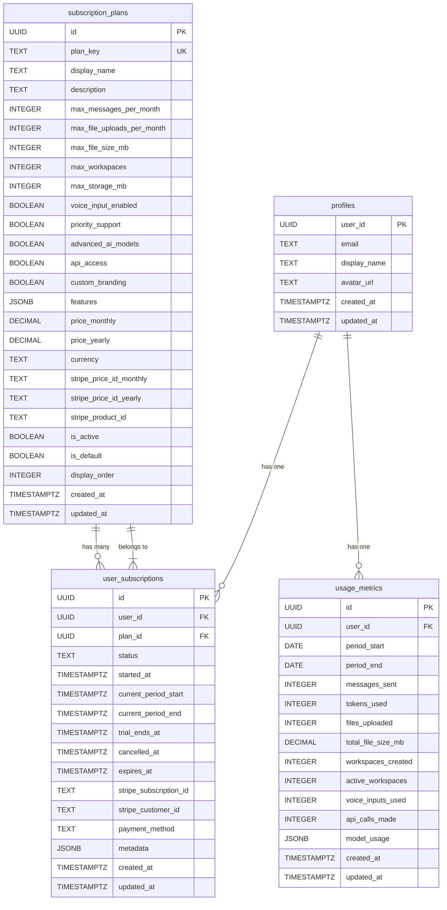
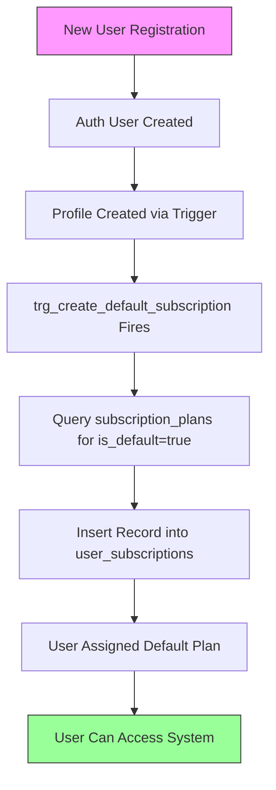

# Subscription Plans

<cite>
**Referenced Files in This Document**   
- [005_monetization.sql](file://apps/api/migrations/005_monetization.sql)
- [limit-check.ts](file://apps/api/src/middleware/limit-check.ts)
- [usage-tracking.ts](file://apps/api/src/middleware/usage-tracking.ts)
- [billingController.ts](file://apps/api/src/controllers/billingController.ts)
- [fix_auth_trigger_v3.sql](file://fix_auth_trigger_v3.sql)
</cite>

## Table of Contents

1. [Introduction](#introduction)
2. [Data Model Overview](#data-model-overview)
3. [Subscription Plans Table](#subscription-plans-table)
4. [Field Definitions](#field-definitions)
5. [Plan Hierarchies and Default Assignment](#plan-hierarchies-and-default-assignment)
6. [Entity Relationships](#entity-relationships)
7. [Data Validation and Constraints](#data-validation-and-constraints)
8. [Usage Tracking and Limit Enforcement](#usage-tracking-and-limit-enforcement)
9. [Integration with User Subscriptions](#integration-with-user-subscriptions)
10. [Handling Unlimited Limits](#handling-unlimited-limits)
11. [Business Rules](#business-rules)

## Introduction

The subscription_plans table is a core component of WADI's monetization system, designed to manage different user tiers and their associated capabilities. This documentation provides a comprehensive overview of the data model, including entity relationships, field definitions, business rules, and integration points. The system supports a tiered subscription model with free, pro, and business plans, each with specific limits and feature sets. The documentation covers the complete lifecycle of plan assignment, from default plan assignment for new users through database triggers to plan changes and their impact on user capabilities.

**Section sources**

- [005_monetization.sql](file://apps/api/migrations/005_monetization.sql#L8-L49)

## Data Model Overview

The monetization system consists of three primary tables that work together to manage user subscriptions and usage: subscription_plans, user_subscriptions, and usage_metrics. The subscription_plans table defines the available subscription tiers with their associated limits and features. The user_subscriptions table tracks which plan each user is currently on, while the usage_metrics table records user activity against their plan limits. This structure enables flexible plan management, accurate usage tracking, and enforcement of subscription limits across the application.



**Diagram sources**

- [005_monetization.sql](file://apps/api/migrations/005_monetization.sql#L8-L127)
- [005_monetization.sql](file://apps/api/migrations/005_monetization.sql#L133-L161)
- [005_monetization.sql](file://apps/api/migrations/005_monetization.sql#L171-L203)
- [fix_auth_trigger_v3.sql](file://fix_auth_trigger_v3.sql#L34-L49)

## Subscription Plans Table

The subscription_plans table defines the available subscription tiers in the WADI monetization system. Each plan is uniquely identified by a plan_key and includes comprehensive information about limits, features, pricing, and display properties. The table supports both current and future monetization needs, with fields for Stripe integration and future pricing models. The system is designed with extensibility in mind, allowing for the addition of new plans and features without requiring schema changes.

The table includes three predefined plans: free, pro, and business, each with increasing levels of capabilities and limits. The free plan serves as the default for new users, providing basic functionality to encourage adoption. The pro plan offers enhanced capabilities for individual power users, while the business plan provides unlimited resources for teams and professional users. The table structure supports easy querying and filtering through indexes on the is_active and display_order columns.

**Section sources**

- [005_monetization.sql](file://apps/api/migrations/005_monetization.sql#L8-L49)

## Field Definitions

The subscription_plans table contains a comprehensive set of fields that define each subscription tier. These fields can be categorized into identification, limits, features, pricing, and metadata.

### Plan Identification

- **id**: UUID primary key, automatically generated
- **plan_key**: Unique text identifier for the plan (e.g., 'free', 'pro', 'business')
- **display_name**: User-friendly name for the plan
- **description**: Detailed description of the plan's benefits

### Limits

- **max_messages_per_month**: Maximum number of messages allowed per month (-1 for unlimited)
- **max_file_uploads_per_month**: Maximum number of file uploads allowed per month (-1 for unlimited)
- **max_file_size_mb**: Maximum size of individual files in megabytes
- **max_workspaces**: Maximum number of workspaces a user can create (-1 for unlimited)
- **max_storage_mb**: Maximum total storage in megabytes (-1 for unlimited)

### Features

- **voice_input_enabled**: Boolean indicating if voice input is available
- **priority_support**: Boolean indicating if priority support is included
- **advanced_ai_models**: Boolean indicating access to advanced AI models
- **api_access**: Boolean indicating API access availability
- **custom_branding**: Boolean indicating custom branding capabilities
- **features**: JSONB array containing descriptive text of included features

### Pricing

- **price_monthly**: Monthly price in decimal format
- **price_yearly**: Yearly price in decimal format
- **currency**: Currency code (default: USD)

### Stripe Integration

- **stripe_price_id_monthly**: Stripe price ID for monthly billing
- **stripe_price_id_yearly**: Stripe price ID for yearly billing
- **stripe_product_id**: Stripe product ID

### Status and Metadata

- **is_active**: Boolean indicating if the plan is currently available
- **is_default**: Boolean indicating if this is the default plan for new users
- **display_order**: Integer for ordering plans in UI displays
- **created_at**: Timestamp of record creation
- **updated_at**: Timestamp of last update

**Section sources**

- [005_monetization.sql](file://apps/api/migrations/005_monetization.sql#L11-L48)

## Plan Hierarchies and Default Assignment

The subscription system implements a hierarchical plan structure with three distinct tiers: free, pro, and business. These plans are ordered by increasing capabilities and value, with the free plan serving as the entry point and the business plan representing the premium offering. The hierarchy is enforced through the display_order field, which determines the visual ordering of plans in the user interface.

The system automatically assigns the default plan to new users through a database trigger. When a new user is created in the profiles table, the trg_create_default_subscription trigger fires and creates a corresponding entry in the user_subscriptions table with the default plan. This ensures that all users have a valid subscription from the moment they sign up, without requiring additional application logic.

The default plan assignment is determined by the is_default field in the subscription_plans table. Currently, the free plan has is_default set to true, making it the automatic choice for new users. This design allows for flexibility in changing the default plan without modifying application code. The system also includes a one-time initialization script that ensures all existing users have a subscription, preventing any edge cases where users might not have a plan assigned.



**Diagram sources**

- [005_monetization.sql](file://apps/api/migrations/005_monetization.sql#L453-L471)
- [fix_auth_trigger_v3.sql](file://fix_auth_trigger_v3.sql#L60-L63)

## Entity Relationships

The subscription_plans table is central to the monetization system and has well-defined relationships with other key entities in the database. The primary relationship is with the user_subscriptions table, which links users to their current subscription plan. This one-to-many relationship allows each plan to be assigned to multiple users while ensuring each user has exactly one active subscription.

The user_subscriptions table serves as a junction between the subscription_plans and profiles tables. It contains foreign keys to both the plan_id in subscription_plans and the user_id in profiles, creating a complete link between users and their subscription plans. This design enables efficient querying of user subscription information and plan details.

The usage_metrics table is indirectly related to subscription_plans through the user_subscriptions table. When checking usage limits, the system joins these tables to determine a user's current plan and compare their usage against the plan's limits. This relationship is critical for enforcing subscription limits and providing accurate usage information to users.

The entity relationships support the business requirements of the monetization system by enabling:

- Accurate tracking of user subscriptions
- Efficient enforcement of usage limits
- Clear separation between plan definitions and user assignments
- Flexible plan management and updates

**Section sources**

- [005_monetization.sql](file://apps/api/migrations/005_monetization.sql#L135-L136)
- [005_monetization.sql](file://apps/api/migrations/005_monetization.sql#L34-L35)

## Data Validation and Constraints

The subscription_plans table implements several data validation rules and constraints to ensure data integrity and consistency. These constraints are defined at the database level to provide reliable enforcement regardless of the application layer.

The most important constraint is the UNIQUE constraint on the plan_key field, which ensures that each plan has a unique identifier. This prevents duplicate plans with the same key and enables reliable plan lookups throughout the application. The plan_key field is also NOT NULL, requiring every plan to have an identifier.

For the status field in the related user_subscriptions table, a CHECK constraint ensures that only valid status values are allowed: 'active', 'cancelled', 'expired', 'past_due', and 'trialing'. This constraint prevents invalid subscription states and ensures consistent status management across the system.

The is_active and is_default fields have DEFAULT values of true and false respectively, providing sensible defaults when creating new plans. The display_order field has a DEFAULT value of 0, ensuring that plans have a defined order even if not explicitly set.

Additional constraints include:

- NOT NULL constraints on critical fields like plan_key and display_name
- Foreign key constraints between user_subscriptions and both subscription_plans and profiles tables
- ON DELETE CASCADE on the user_id foreign key, ensuring that when a user is deleted, their subscription is also removed

These constraints work together to maintain data integrity and prevent common data entry errors, ensuring the reliability of the monetization system.

**Section sources**

- [005_monetization.sql](file://apps/api/migrations/005_monetization.sql#L14-L15)
- [005_monetization.sql](file://apps/api/migrations/005_monetization.sql#L140-L141)
- [005_monetization.sql](file://apps/api/migrations/005_monetization.sql#L43-L45)

## Usage Tracking and Limit Enforcement

The system implements comprehensive usage tracking and limit enforcement through a combination of database functions, middleware, and application logic. The core of this system is the check_usage_limit function, which determines whether a user is within their plan limits for various resources.

The check_usage_limit function takes a user_id, limit_type (messages, files, or workspaces), and an optional increment value. It first retrieves the user's active subscription, defaulting to the free plan if no subscription exists. It then retrieves the user's current usage from the usage_metrics table and compares it against the plan's limits. When a limit value is -1, it is treated as unlimited, allowing unrestricted usage.

This function is exposed to the application through a Supabase RPC call and is used by middleware functions in the API layer. The limit-check.ts middleware contains three primary functions: checkMessageLimit, checkFileLimit, and checkWorkspaceLimit. These functions intercept relevant requests and verify that the user is within their limits before allowing the operation to proceed.

If a user exceeds their limit, the middleware returns a 429 Too Many Requests response with details about the limit, current usage, and remaining allowance. This provides clear feedback to the user and encourages upgrading to a higher-tier plan. The response also includes an upgrade_url to facilitate plan changes.

Usage is tracked through the track_usage_event function, which logs individual usage events and updates the aggregated metrics in the usage_metrics table. This two-level tracking system provides both detailed event history and efficient aggregated data for limit checking.

**Section sources**

- [005_monetization.sql](file://apps/api/migrations/005_monetization.sql#L309-L372)
- [limit-check.ts](file://apps/api/src/middleware/limit-check.ts#L7-L162)
- [usage-tracking.ts](file://apps/api/src/middleware/usage-tracking.ts#L6-L107)

## Integration with User Subscriptions

The subscription_plans table is tightly integrated with the user_subscriptions table to manage user subscriptions and plan assignments. This integration is achieved through a foreign key relationship where user_subscriptions.plan_id references subscription_plans.id, ensuring referential integrity between the tables.

When a user signs up for WADI, the system automatically creates a subscription record through the trg_create_default_subscription trigger. This trigger fires after a new profile is created and inserts a record into user_subscriptions with the default plan. This ensures that all users have a valid subscription from the moment they join the platform.

The system also includes a one-time initialization script that runs after the migration to ensure all existing users have a subscription. This script queries the profiles table for users without a corresponding user_subscriptions record and creates subscriptions for them using the default plan. This prevents any edge cases where users might not have a plan assigned.

Plan changes are managed through the billingController.ts, which handles updates to a user's subscription. When a user upgrades or downgrades their plan, the controller updates the plan_id in their user_subscriptions record. This change immediately affects the user's capabilities and limits, as subsequent requests will use the new plan's limits for enforcement.

The integration between these tables enables several key features:

- Automatic plan assignment for new users
- Seamless plan upgrades and downgrades
- Accurate billing and usage tracking
- Consistent enforcement of plan limits

**Section sources**

- [005_monetization.sql](file://apps/api/migrations/005_monetization.sql#L429-L447)
- [005_monetization.sql](file://apps/api/migrations/005_monetization.sql#L453-L471)
- [billingController.ts](file://apps/api/src/controllers/billingController.ts#L226-L251)

## Handling Unlimited Limits

The system handles unlimited limits through a specific convention: using the value -1 to represent unlimited resources. This approach is applied consistently across all limit fields in the subscription_plans table, including max_messages_per_month, max_file_uploads_per_month, max_workspaces, and max_storage_mb.

When the check_usage_limit function encounters a limit value of -1, it immediately returns that the user is within limits, regardless of their current usage. This is implemented in the function's logic with a specific check:

```sql
-- -1 means unlimited
IF v_limit = -1 THEN
  RETURN QUERY SELECT true, v_current, v_limit, -1;
  RETURN;
END IF;
```

This design choice provides several benefits:

- Simplicity: A single value (-1) represents unlimited across all limit types
- Efficiency: The check is performed early in the function, avoiding unnecessary calculations
- Clarity: The meaning of -1 is documented in code comments
- Flexibility: Individual limits can be unlimited while others remain restricted

For example, the business plan has -1 for message limits, file upload limits, workspace limits, and storage limits, providing truly unlimited resources in these categories. However, it still has a finite limit on max_file_size_mb (100 MB), demonstrating how unlimited and limited resources can coexist in the same plan.

The frontend also respects this convention, displaying unlimited limits appropriately in the user interface. When a user is on a plan with unlimited resources, the UI reflects this status, often using phrases like "Unlimited" instead of numerical values.

This approach to unlimited limits ensures a consistent user experience across all plan tiers and simplifies both database queries and application logic.

**Section sources**

- [005_monetization.sql](file://apps/api/migrations/005_monetization.sql#L17-L21)
- [005_monetization.sql](file://apps/api/migrations/005_monetization.sql#L355-L358)

## Business Rules

The subscription system implements several key business rules that govern plan assignment, usage enforcement, and user experience. These rules are designed to balance user needs with business objectives, encouraging adoption while providing clear upgrade paths.

The primary business rule is the automatic assignment of the default plan to new users. This rule ensures that all users can immediately start using the platform without requiring a payment method or subscription decision. The free plan serves as a gateway, providing basic functionality to demonstrate value before asking users to upgrade.

Another key rule is the hierarchical nature of plans, where each tier includes all features of lower tiers plus additional capabilities. This creates a clear progression path: free → pro → business. Users can upgrade at any time, and downgrades take effect at the end of the current billing period, protecting revenue while maintaining user satisfaction.

Usage limits are enforced at the API level through middleware, providing real-time feedback when users approach or exceed their limits. When a user hits a limit, they receive a clear error message with information about upgrading, creating a natural conversion opportunity. The system distinguishes between hard limits (which block functionality) and soft limits (which provide warnings), optimizing the user experience.

The system also implements a graceful degradation model for plan changes. When a user downgrades, they retain access to resources they've already created, even if they exceed the new plan's limits. However, they cannot create new resources that would exceed the limits. This prevents disruption to existing work while enforcing the new plan's constraints for future usage.

Finally, the system is designed with extensibility in mind, allowing for the addition of new plans, features, and pricing models without requiring significant changes to the core architecture. This flexibility supports future business needs and market adaptations.

**Section sources**

- [005_monetization.sql](file://apps/api/migrations/005_monetization.sql#L73-L126)
- [limit-check.ts](file://apps/api/src/middleware/limit-check.ts#L7-L162)
