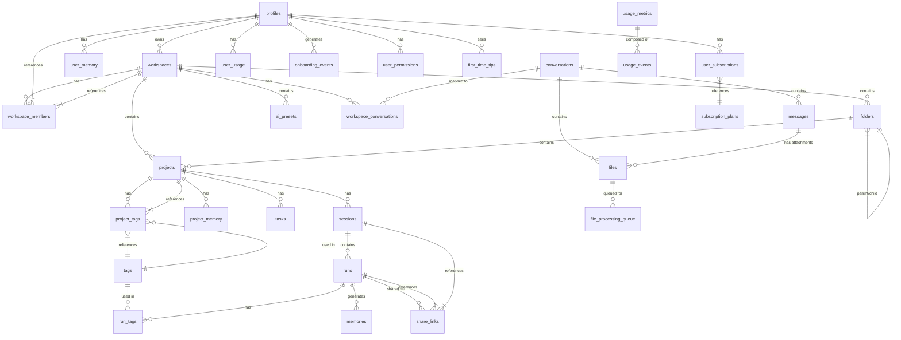

# Data Models & Database Schema

<cite>
**Referenced Files in This Document**   
- [supabase_schema.sql](file://supabase_schema.sql)
- [apps/api/migrations/001_workspace_enhancements.sql](file://apps/api/migrations/001_workspace_enhancements.sql)
- [apps/api/migrations/002_files_and_storage.sql](file://apps/api/migrations/002_files_and_storage.sql)
- [apps/api/migrations/003_user_memory.sql](file://apps/api/migrations/003_user_memory.sql)
- [apps/api/migrations/004_onboarding.sql](file://apps/api/migrations/004_onboarding.sql)
- [apps/api/migrations/005_monetization.sql](file://apps/api/migrations/005_monetization.sql)
- [apps/api/migrations/006_global_search.sql](file://apps/api/migrations/006_global_search.sql)
- [docs/database-schema-memory.sql](file://docs/database-schema-memory.sql)
- [docs/database-schema-phase1.sql](file://docs/database-schema-phase1.sql)
- [docs/database-schema-sessions.sql](file://docs/database-schema-sessions.sql)
- [docs/database-schema-share-links.sql](file://docs/database-schema-share-links.sql)
- [docs/database-schema-tags.sql](file://docs/database-schema-tags.sql)
- [security_hardening.sql](file://security_hardening.sql)
</cite>

## Table of Contents

1. [Introduction](#introduction)
2. [Core Entity Relationships](#core-entity-relationships)
3. [Entity Definitions and Field Specifications](#entity-definitions-and-field-specifications)
4. [Database Schema Diagram](#database-schema-diagram)
5. [Data Validation and Business Rules](#data-validation-and-business-rules)
6. [Row Level Security (RLS) Policies](#row-level-security-rls-policies)
7. [Data Access Patterns and Performance Considerations](#data-access-patterns-and-performance-considerations)
8. [Data Lifecycle and Retention Policies](#data-lifecycle-and-retention-policies)
9. [Data Migration Strategy](#data-migration-strategy)
10. [Sample Data and Usage Patterns](#sample-data-and-usage-patterns)

## Introduction

The WADI application employs a comprehensive PostgreSQL database schema hosted on Supabase, designed to support a sophisticated AI-powered workspace platform. The data model centers around user collaboration, project management, AI interactions, and usage analytics. The schema implements Row Level Security (RLS) to ensure data isolation between users and workspaces, with a focus on scalability and performance for AI-driven features like file processing, user memory, and global search. The database structure has evolved through a series of migrations, reflecting the phased development of the application from core user and workspace management to advanced features like monetization, global search, and session-based organization of AI runs.

**Section sources**

- [supabase_schema.sql](file://supabase_schema.sql#L1-L162)
- [LEGAL.md](file://LEGAL.md#L13-L20)

## Core Entity Relationships

The WADI data model is built around a hierarchical relationship structure that begins with the `profiles` table, which extends Supabase's authentication system. Each user (profile) can own multiple `workspaces`, which serve as the primary organizational unit for all other entities. Within a workspace, users can create `projects`, `folders`, and `tags` to further organize their work. The core AI interaction is captured in the `conversations` and `messages` tables, which are linked to a workspace. Files uploaded by users are stored in the `files` table and can be attached to messages or conversations. The system also tracks user preferences and learned behaviors in the `user_memory` table, which is scoped to individual users. For monetization, the `user_subscriptions` and `usage_metrics` tables track plan details and resource consumption. Sessions and runs are organized under projects, with share links providing controlled public access to specific runs or sessions.

**Diagram sources**

- [supabase_schema.sql](file://supabase_schema.sql#L1-L162)
- [apps/api/migrations/001_workspace_enhancements.sql](file://apps/api/migrations/001_workspace_enhancements.sql#L1-L200)
- [apps/api/migrations/002_files_and_storage.sql](file://apps/api/migrations/002_files_and_storage.sql#L1-L180)
- [apps/api/migrations/003_user_memory.sql](file://apps/api/migrations/003_user_memory.sql#L1-L212)
- [apps/api/migrations/005_monetization.sql](file://apps/api/migrations/005_monetization.sql#L1-L472)
- [docs/database-schema-memory.sql](file://docs/database-schema-memory.sql#L1-L49)
- [docs/database-schema-phase1.sql](file://docs/database-schema-phase1.sql#L1-L181)
- [docs/database-schema-sessions.sql](file://docs/database-schema-sessions.sql#L1-L127)
- [docs/database-schema-share-links.sql](file://docs/database-schema-share-links.sql#L1-L95)
- [docs/database-schema-tags.sql](file://docs/database-schema-tags.sql#L1-L154)

## Entity Definitions and Field Specifications

### profiles

The `profiles` table extends the Supabase `auth.users` table to store user-specific information. It serves as the central identity for all user-related data.

| Field                | Type                     | Constraints              | Description                                  |
| :------------------- | :----------------------- | :----------------------- | :------------------------------------------- |
| id                   | uuid                     | PK, FK to auth.users(id) | Primary key, references the auth.users table |
| email                | text                     |                          | User's email address                         |
| full_name            | text                     |                          | User's full name                             |
| avatar_url           | text                     |                          | URL to the user's profile picture            |
| plan_id              | text                     | DEFAULT 'free'           | Current subscription plan identifier         |
| stripe_customer_id   | text                     |                          | Stripe customer ID for billing               |
| created_at           | timestamp with time zone | DEFAULT now()            | Timestamp of profile creation                |
| updated_at           | timestamp with time zone | DEFAULT now()            | Timestamp of last update                     |
| onboarding_completed | boolean                  | DEFAULT false            | Whether the user has completed onboarding    |
| onboarding_step      | integer                  | DEFAULT 0                | Current step in the onboarding process       |
| first_login_at       | timestamptz              |                          | Timestamp of the user's first login          |
| last_login_at        | timestamptz              |                          | Timestamp of the user's last login           |
| login_count          | integer                  | DEFAULT 0                | Total number of times the user has logged in |

**Section sources**

- [supabase_schema.sql](file://supabase_schema.sql#L8-L17)
- [apps/api/migrations/004_onboarding.sql](file://apps/api/migrations/004_onboarding.sql#L8-L14)

### workspaces

The `workspaces` table represents the primary organizational unit for user activities. Each workspace is owned by a single user but can have multiple members.

| Field           | Type                     | Constraints                    | Description                                                        |
| :-------------- | :----------------------- | :----------------------------- | :----------------------------------------------------------------- |
| id              | uuid                     | PK, DEFAULT uuid_generate_v4() | Primary key                                                        |
| name            | text                     | NOT NULL                       | Name of the workspace                                              |
| slug            | text                     | NOT NULL, UNIQUE               | URL-friendly identifier for the workspace                          |
| owner_id        | uuid                     | NOT NULL, FK to profiles(id)   | ID of the user who owns the workspace                              |
| settings        | jsonb                    | DEFAULT '{}'::jsonb            | JSON object for storing workspace-specific settings                |
| created_at      | timestamp with time zone | DEFAULT now()                  | Timestamp of workspace creation                                    |
| updated_at      | timestamp with time zone | DEFAULT now()                  | Timestamp of last update                                           |
| is_auto_created | boolean                  | DEFAULT false                  | True if the workspace was created automatically by topic detection |
| detected_topic  | text                     |                                | AI-detected topic that triggered auto-creation                     |
| message_count   | integer                  | DEFAULT 0                      | Cached count of messages in this workspace                         |
| last_message_at | timestamptz              |                                | Timestamp of the last message in the workspace                     |
| is_archived     | boolean                  | DEFAULT false                  | Whether the workspace is archived                                  |
| archived_at     | timestamptz              |                                | Timestamp when the workspace was archived                          |

**Section sources**

- [supabase_schema.sql](file://supabase_schema.sql#L20-L28)
- [apps/api/migrations/001_workspace_enhancements.sql](file://apps/api/migrations/001_workspace_enhancements.sql#L8-L14)

### workspace_members

The `workspace_members` table manages the many-to-many relationship between users and workspaces, defining their roles within each workspace.

| Field                   | Type                     | Constraints                                                              | Description                                  |
| :---------------------- | :----------------------- | :----------------------------------------------------------------------- | :------------------------------------------- |
| workspace_id            | uuid                     | NOT NULL, FK to workspaces(id), ON DELETE CASCADE                        | ID of the workspace                          |
| user_id                 | uuid                     | NOT NULL, FK to profiles(id), ON DELETE CASCADE                          | ID of the user                               |
| role                    | text                     | CHECK (role in ('owner', 'admin', 'member', 'viewer')), DEFAULT 'member' | User's role in the workspace                 |
| joined_at               | timestamp with time zone | DEFAULT now()                                                            | Timestamp when the user joined the workspace |
| (workspace_id, user_id) |                          | PRIMARY KEY                                                              | Composite primary key                        |

**Section sources**

- [supabase_schema.sql](file://supabase_schema.sql#L31-L37)

### projects

The `projects` table represents individual projects within a workspace, which can be organized into folders and tagged for categorization.

| Field        | Type                     | Constraints                                       | Description                                       |
| :----------- | :----------------------- | :------------------------------------------------ | :------------------------------------------------ |
| id           | uuid                     | PK, DEFAULT uuid_generate_v4()                    | Primary key                                       |
| name         | text                     | NOT NULL                                          | Name of the project                               |
| description  | text                     |                                                   | Description of the project                        |
| workspace_id | uuid                     | NOT NULL, FK to workspaces(id), ON DELETE CASCADE | ID of the workspace this project belongs to       |
| folder_id    | uuid                     | FK to folders(id), ON DELETE SET NULL             | ID of the folder this project is in               |
| status       | text                     | DEFAULT 'active'                                  | Status of the project (e.g., active, completed)   |
| priority     | text                     | DEFAULT 'medium'                                  | Priority level of the project                     |
| settings     | jsonb                    | DEFAULT '{}'::jsonb                               | JSON object for storing project-specific settings |
| created_at   | timestamp with time zone | DEFAULT now()                                     | Timestamp of project creation                     |
| updated_at   | timestamp with time zone | DEFAULT now()                                     | Timestamp of last update                          |

**Section sources**

- [supabase_schema.sql](file://supabase_schema.sql#L49-L60)

### files

The `files` table stores metadata and processing results for user-uploaded files, which can be attached to messages or conversations.

| Field             | Type        | Constraints                                                                                      | Description                                         |
| :---------------- | :---------- | :----------------------------------------------------------------------------------------------- | :-------------------------------------------------- |
| id                | UUID        | PRIMARY KEY, DEFAULT uuid_generate_v4()                                                          | Primary key                                         |
| user_id           | UUID        | NOT NULL, REFERENCES profiles(user_id) ON DELETE CASCADE                                         | ID of the user who uploaded the file                |
| conversation_id   | UUID        | REFERENCES conversations(id) ON DELETE CASCADE                                                   | ID of the conversation this file is associated with |
| message_id        | UUID        | REFERENCES messages(id) ON DELETE SET NULL                                                       | ID of the message this file is attached to          |
| filename          | TEXT        | NOT NULL                                                                                         | Sanitized filename for storage                      |
| original_filename | TEXT        | NOT NULL                                                                                         | Original name from the user                         |
| file_type         | TEXT        | NOT NULL, CHECK (file_type IN ('pdf', 'image', 'text', 'docx', 'other'))                         | Type of the file                                    |
| file_size         | INTEGER     | NOT NULL                                                                                         | Size of the file in bytes                           |
| mime_type         | TEXT        | NOT NULL                                                                                         | MIME type of the file                               |
| storage_path      | TEXT        | NOT NULL                                                                                         | Path in the storage bucket where the file is stored |
| storage_provider  | TEXT        | DEFAULT 'supabase', CHECK (storage_provider IN ('supabase', 's3'))                               | Storage provider used                               |
| storage_bucket    | TEXT        | DEFAULT 'user-files'                                                                             | Name of the storage bucket                          |
| extracted_text    | TEXT        |                                                                                                  | Full text content extracted from the file           |
| summary           | TEXT        |                                                                                                  | AI-generated summary of the file content            |
| key_points        | JSONB       |                                                                                                  | Array of key points extracted from the file         |
| metadata          | JSONB       | DEFAULT '{}'                                                                                     | Additional metadata (page count, dimensions, etc.)  |
| processing_status | TEXT        | DEFAULT 'pending', CHECK (processing_status IN ('pending', 'processing', 'completed', 'failed')) | Current status of file processing                   |
| processing_error  | TEXT        |                                                                                                  | Error message if processing failed                  |
| processed_at      | TIMESTAMPTZ |                                                                                                  | Timestamp when processing was completed             |
| created_at        | TIMESTAMPTZ | DEFAULT now()                                                                                    | Timestamp of file upload                            |
| updated_at        | TIMESTAMPTZ | DEFAULT now()                                                                                    | Timestamp of last update                            |

**Section sources**

- [apps/api/migrations/002_files_and_storage.sql](file://apps/api/migrations/002_files_and_storage.sql#L8-L40)

### user_memory

The `user_memory` table stores learned preferences, facts, and context about users to personalize their interactions with the AI.

| Field                        | Type        | Constraints                                                                                  | Description                                            |
| :--------------------------- | :---------- | :------------------------------------------------------------------------------------------- | :----------------------------------------------------- |
| id                           | UUID        | PRIMARY KEY, DEFAULT uuid_generate_v4()                                                      | Primary key                                            |
| user_id                      | UUID        | NOT NULL, REFERENCES profiles(user_id) ON DELETE CASCADE                                     | ID of the user this memory belongs to                  |
| memory_type                  | TEXT        | NOT NULL, CHECK (memory_type IN ('preference', 'fact', 'style', 'context', 'skill', 'goal')) | Type of memory                                         |
| category                     | TEXT        |                                                                                              | Category of the memory (e.g., 'tone', 'format')        |
| key                          | TEXT        | NOT NULL                                                                                     | Unique identifier for this memory                      |
| value                        | TEXT        | NOT NULL                                                                                     | The actual content of the memory                       |
| metadata                     | JSONB       | DEFAULT '{}'                                                                                 | Additional structured data                             |
| source                       | TEXT        | DEFAULT 'explicit', CHECK (source IN ('explicit', 'inferred', 'feedback', 'system'))         | How this memory was acquired                           |
| confidence                   | FLOAT       | DEFAULT 1.0, CHECK (confidence >= 0 AND confidence <= 1)                                     | Confidence level in the accuracy of this memory        |
| derived_from_conversation_id | UUID        | REFERENCES conversations(id)                                                                 | ID of the conversation that led to this memory         |
| examples                     | JSONB       |                                                                                              | Array of example interactions that support this memory |
| times_referenced             | INTEGER     | DEFAULT 0                                                                                    | Number of times this memory has been used              |
| last_used_at                 | TIMESTAMPTZ |                                                                                              | Timestamp of last usage                                |
| is_active                    | BOOLEAN     | DEFAULT true                                                                                 | Whether this memory is currently active                |
| expires_at                   | TIMESTAMPTZ |                                                                                              | Optional expiration date for temporary context         |
| created_at                   | TIMESTAMPTZ | DEFAULT now()                                                                                | Timestamp of memory creation                           |
| updated_at                   | TIMESTAMPTZ | DEFAULT now()                                                                                | Timestamp of last update                               |
| (user_id, key)               |             | UNIQUE                                                                                       | Ensures unique keys per user                           |

**Section sources**

- [apps/api/migrations/003_user_memory.sql](file://apps/api/migrations/003_user_memory.sql#L8-L46)

### subscription_plans

The `subscription_plans` table defines the available subscription tiers, including their features and limits.

| Field                      | Type          | Constraints                             | Description                                                         |
| :------------------------- | :------------ | :-------------------------------------- | :------------------------------------------------------------------ |
| id                         | UUID          | PRIMARY KEY, DEFAULT uuid_generate_v4() | Primary key                                                         |
| plan_key                   | TEXT          | UNIQUE, NOT NULL                        | Unique identifier for the plan (e.g., 'free', 'pro')                |
| display_name               | TEXT          | NOT NULL                                | Human-readable name of the plan                                     |
| description                | TEXT          |                                         | Detailed description of the plan                                    |
| max_messages_per_month     | INTEGER       |                                         | Maximum number of messages allowed per month (-1 for unlimited)     |
| max_file_uploads_per_month | INTEGER       |                                         | Maximum number of file uploads allowed per month (-1 for unlimited) |
| max_file_size_mb           | INTEGER       |                                         | Maximum size of a single file upload in MB                          |
| max_workspaces             | INTEGER       |                                         | Maximum number of workspaces a user can create (-1 for unlimited)   |
| max_storage_mb             | INTEGER       |                                         | Maximum total storage allowed in MB (-1 for unlimited)              |
| voice_input_enabled        | BOOLEAN       | DEFAULT false                           | Whether voice input is enabled for this plan                        |
| priority_support           | BOOLEAN       | DEFAULT false                           | Whether priority support is included                                |
| advanced_ai_models         | BOOLEAN       | DEFAULT false                           | Whether access to advanced AI models is included                    |
| api_access                 | BOOLEAN       | DEFAULT false                           | Whether API access is included                                      |
| custom_branding            | BOOLEAN       | DEFAULT false                           | Whether custom branding is allowed                                  |
| features                   | JSONB         | DEFAULT '[]'                            | Array of feature descriptions                                       |
| price_monthly              | DECIMAL(10,2) |                                         | Monthly price of the plan                                           |
| price_yearly               | DECIMAL(10,2) |                                         | Yearly price of the plan                                            |
| currency                   | TEXT          | DEFAULT 'USD'                           | Currency for pricing                                                |
| stripe_price_id_monthly    | TEXT          |                                         | Stripe price ID for monthly subscription                            |
| stripe_price_id_yearly     | TEXT          |                                         | Stripe price ID for yearly subscription                             |
| stripe_product_id          | TEXT          |                                         | Stripe product ID                                                   |
| is_active                  | BOOLEAN       | DEFAULT true                            | Whether the plan is currently available                             |
| is_default                 | BOOLEAN       | DEFAULT false                           | Whether this is the default plan for new users                      |
| display_order              | INTEGER       | DEFAULT 0                               | Order in which the plan should be displayed                         |
| created_at                 | TIMESTAMPTZ   | DEFAULT now()                           | Timestamp of plan creation                                          |
| updated_at                 | TIMESTAMPTZ   | DEFAULT now()                           | Timestamp of last update                                            |

**Section sources**

- [apps/api/migrations/005_monetization.sql](file://apps/api/migrations/005_monetization.sql#L8-L49)

### user_subscriptions

The `user_subscriptions` table tracks the current subscription status of each user.

| Field                  | Type        | Constraints                                                                                    | Description                                    |
| :--------------------- | :---------- | :--------------------------------------------------------------------------------------------- | :--------------------------------------------- |
| id                     | UUID        | PRIMARY KEY, DEFAULT uuid_generate_v4()                                                        | Primary key                                    |
| user_id                | UUID        | NOT NULL, REFERENCES profiles(user_id) ON DELETE CASCADE                                       | ID of the user                                 |
| plan_id                | UUID        | NOT NULL, REFERENCES subscription_plans(id)                                                    | ID of the subscription plan                    |
| status                 | TEXT        | DEFAULT 'active', CHECK (status IN ('active', 'cancelled', 'expired', 'past_due', 'trialing')) | Current status of the subscription             |
| started_at             | TIMESTAMPTZ | DEFAULT now()                                                                                  | Timestamp when the subscription started        |
| current_period_start   | TIMESTAMPTZ | DEFAULT now()                                                                                  | Start of the current billing period            |
| current_period_end     | TIMESTAMPTZ |                                                                                                | End of the current billing period              |
| trial_ends_at          | TIMESTAMPTZ |                                                                                                | Timestamp when the trial period ends           |
| cancelled_at           | TIMESTAMPTZ |                                                                                                | Timestamp when the subscription was cancelled  |
| expires_at             | TIMESTAMPTZ |                                                                                                | Timestamp when the subscription expires        |
| stripe_subscription_id | TEXT        |                                                                                                | Stripe subscription ID                         |
| stripe_customer_id     | TEXT        |                                                                                                | Stripe customer ID                             |
| payment_method         | TEXT        |                                                                                                | Payment method used (e.g., 'stripe', 'paypal') |
| metadata               | JSONB       | DEFAULT '{}'                                                                                   | Additional metadata                            |
| created_at             | TIMESTAMPTZ | DEFAULT now()                                                                                  | Timestamp of subscription creation             |
| updated_at             | TIMESTAMPTZ | DEFAULT now()                                                                                  | Timestamp of last update                       |

**Section sources**

- [apps/api/migrations/005_monetization.sql](file://apps/api/migrations/005_monetization.sql#L133-L161)

### usage_metrics

The `usage_metrics` table aggregates usage data for each user on a monthly basis.

| Field                   | Type          | Constraints                                              | Description                                                                         |
| :---------------------- | :------------ | :------------------------------------------------------- | :---------------------------------------------------------------------------------- |
| id                      | UUID          | PRIMARY KEY, DEFAULT uuid_generate_v4()                  | Primary key                                                                         |
| user_id                 | UUID          | NOT NULL, REFERENCES profiles(user_id) ON DELETE CASCADE | ID of the user                                                                      |
| period_start            | DATE          | NOT NULL                                                 | Start date of the usage period                                                      |
| period_end              | DATE          | NOT NULL                                                 | End date of the usage period                                                        |
| messages_sent           | INTEGER       | DEFAULT 0                                                | Number of messages sent during the period                                           |
| tokens_used             | INTEGER       | DEFAULT 0                                                | Estimated number of OpenAI tokens used                                              |
| files_uploaded          | INTEGER       | DEFAULT 0                                                | Number of files uploaded during the period                                          |
| total_file_size_mb      | DECIMAL(10,2) | DEFAULT 0                                                | Total size of uploaded files in MB                                                  |
| workspaces_created      | INTEGER       | DEFAULT 0                                                | Number of workspaces created during the period                                      |
| active_workspaces       | INTEGER       | DEFAULT 0                                                | Number of active workspaces at the end of the period                                |
| voice_inputs_used       | INTEGER       | DEFAULT 0                                                | Number of voice inputs used during the period                                       |
| api_calls_made          | INTEGER       | DEFAULT 0                                                | Number of API calls made during the period                                          |
| model_usage             | JSONB         | DEFAULT '{}'                                             | JSON object with breakdown of model usage (e.g., {"gpt-3.5-turbo": 45, "gpt-4": 5}) |
| created_at              | TIMESTAMPTZ   | DEFAULT now()                                            | Timestamp of record creation                                                        |
| updated_at              | TIMESTAMPTZ   | DEFAULT now()                                            | Timestamp of last update                                                            |
| (user_id, period_start) |               | UNIQUE                                                   | Ensures one record per user per period                                              |

**Section sources**

- [apps/api/migrations/005_monetization.sql](file://apps/api/migrations/005_monetization.sql#L171-L203)

### sessions

The `sessions` table organizes runs into conversational sessions within projects.

| Field       | Type        | Constraints                                           | Description                                                       |
| :---------- | :---------- | :---------------------------------------------------- | :---------------------------------------------------------------- |
| id          | UUID        | PRIMARY KEY, DEFAULT gen_random_uuid()                | Primary key                                                       |
| project_id  | UUID        | NOT NULL, REFERENCES projects(id) ON DELETE CASCADE   | ID of the project this session belongs to                         |
| user_id     | UUID        | NOT NULL, REFERENCES auth.users(id) ON DELETE CASCADE | ID of the user who created the session                            |
| name        | TEXT        |                                                       | User-defined name for the session                                 |
| description | TEXT        |                                                       | Optional description of the session                               |
| created_at  | TIMESTAMPTZ | NOT NULL, DEFAULT NOW()                               | Timestamp of session creation                                     |
| updated_at  | TIMESTAMPTZ | NOT NULL, DEFAULT NOW()                               | Timestamp of last update                                          |
| run_count   | INTEGER     | NOT NULL, DEFAULT 0                                   | Auto-calculated count of runs in this session                     |
| is_active   | BOOLEAN     | NOT NULL, DEFAULT false                               | Indicates if this is the currently active session for the project |

**Section sources**

- [docs/database-schema-sessions.sql](file://docs/database-schema-sessions.sql#L8-L18)

### runs

The `runs` table represents individual AI interactions within a session or project.

| Field                                                     | Type | Constraints                                | Description                           |
| :-------------------------------------------------------- | :--- | :----------------------------------------- | :------------------------------------ |
| id                                                        | UUID | PRIMARY KEY, DEFAULT gen_random_uuid()     | Primary key                           |
| session_id                                                | UUID | REFERENCES sessions(id) ON DELETE SET NULL | ID of the session this run belongs to |
| custom_name                                               | TEXT |                                            | User-defined custom name for the run  |
| (additional fields not fully defined in provided context) |      |                                            |                                       |

**Section sources**

- [docs/database-schema-sessions.sql](file://docs/database-schema-sessions.sql#L24-L32)

### share_links

The `share_links` table enables public sharing of individual runs or entire sessions.

| Field                | Type        | Constraints                                           | Description                                                     |
| :------------------- | :---------- | :---------------------------------------------------- | :-------------------------------------------------------------- |
| id                   | UUID        | PRIMARY KEY, DEFAULT gen_random_uuid()                | Primary key                                                     |
| user_id              | UUID        | NOT NULL, REFERENCES auth.users(id) ON DELETE CASCADE | ID of the user who created the share link                       |
| run_id               | UUID        | REFERENCES runs(id) ON DELETE CASCADE                 | ID of the run being shared (mutually exclusive with session_id) |
| session_id           | UUID        | REFERENCES sessions(id) ON DELETE CASCADE             | ID of the session being shared (mutually exclusive with run_id) |
| token                | TEXT        | NOT NULL, UNIQUE                                      | Unique URL-safe token for accessing the share                   |
| expires_at           | TIMESTAMPTZ |                                                       | When the share link expires (NULL for never)                    |
| password_hash        | TEXT        |                                                       | Optional bcrypt password hash for protected shares              |
| view_count           | INTEGER     | NOT NULL, DEFAULT 0                                   | Number of times the share link has been accessed                |
| max_views            | INTEGER     |                                                       | Maximum number of views allowed (NULL for unlimited)            |
| created_at           | TIMESTAMPTZ | NOT NULL, DEFAULT NOW()                               | Timestamp of share link creation                                |
| last_accessed_at     | TIMESTAMPTZ |                                                       | Timestamp of last access                                        |
| (run_id, session_id) |             | CHECK constraint                                      | Ensures exactly one of run_id or session_id is set              |

**Section sources**

- [docs/database-schema-share-links.sql](file://docs/database-schema-share-links.sql#L5-L29)

## Database Schema Diagram

The following diagram provides a comprehensive overview of the WADI database schema, illustrating the relationships between the core entities. The model is designed with a strong emphasis on user data isolation through Row Level Security (RLS), with most tables ultimately linked back to a user profile. Workspaces serve as the primary container for collaborative work, while projects, sessions, and runs provide a hierarchical structure for organizing AI interactions. The monetization system is fully integrated, with subscription plans, user subscriptions, and detailed usage metrics tracked over time. Advanced features like file processing, user memory, and global search are supported by dedicated tables and indexes.

**Diagram sources**

- [supabase_schema.sql](file://supabase_schema.sql#L1-L162)
- [apps/api/migrations/001_workspace_enhancements.sql](file://apps/api/migrations/001_workspace_enhancements.sql#L1-L200)
- [apps/api/migrations/002_files_and_storage.sql](file://apps/api/migrations/002_files_and_storage.sql#L1-L180)
- [apps/api/migrations/003_user_memory.sql](file://apps/api/migrations/003_user_memory.sql#L1-L212)
- [apps/api/migrations/005_monetization.sql](file://apps/api/migrations/005_monetization.sql#L1-L472)
- [docs/database-schema-memory.sql](file://docs/database-schema-memory.sql#L1-L49)
- [docs/database-schema-phase1.sql](file://docs/database-schema-phase1.sql#L1-L181)
- [docs/database-schema-sessions.sql](file://docs/database-schema-sessions.sql#L1-L127)
- [docs/database-schema-share-links.sql](file://docs/database-schema-share-links.sql#L1-L95)
- [docs/database-schema-tags.sql](file://docs/database-schema-tags.sql#L1-L154)

## Data Validation and Business Rules

The WADI database schema implements a comprehensive set of data validation rules and business logic through SQL constraints, triggers, and functions. These rules ensure data integrity, enforce business policies, and automate common operations.

**Field-Level Constraints**: The schema uses standard SQL constraints to validate data at the field level. For example, the `role` field in the `workspace_members` table is constrained to a specific set of values ('owner', 'admin', 'member', 'viewer') using a CHECK constraint. Similarly, the `file_type` field in the `files` table is restricted to a predefined list of types. The `subscription_plans` table uses constraints to ensure that price values are non-negative and that the `status` field in `user_subscriptions` contains only valid states.

**Unique Constraints**: To prevent duplicate data, the schema employs UNIQUE constraints in several places. The `profiles` table has a primary key on the `id` field, which is also a foreign key to `auth.users`. The `workspace_members` table uses a composite primary key of `(workspace_id, user_id)` to ensure a user can only be a member of a workspace once. The `share_links` table has a unique constraint on the `token` field to ensure each share link has a distinct URL.

**Triggers and Functions**: A significant portion of the business logic is implemented through database triggers and functions. For example, the `handle_new_user()` function is triggered after a new user is inserted into the `auth.users` table. This function automatically creates a profile, a default workspace, adds the user as a member of that workspace, and initializes their usage metrics. This ensures a consistent onboarding experience for all new users. Another example is the `update_workspace_stats()` function, which is called by a trigger whenever a new message is inserted. This function updates the `message_count` and `last_message_at` fields in the `workspaces` table, providing denormalized data for efficient querying.

**Data Integrity Rules**: The schema enforces referential integrity through foreign key constraints with appropriate ON DELETE actions. For instance, when a workspace is deleted, all its members are automatically removed due to the `ON DELETE CASCADE` clause in the `workspace_members` table. However, when a folder is deleted, the projects within it have their `folder_id` set to NULL rather than being deleted, preserving the project data.

**Business Logic**: The monetization system includes sophisticated business rules for tracking usage and enforcing limits. The `check_usage_limit()` function determines whether a user is within their plan's limits for messages, files, or workspaces. This function considers the user's active subscription and the current usage metrics, returning a boolean indicating whether the action is allowed. The `track_usage_event()` function logs detailed usage events and updates the aggregated metrics in the `usage_metrics` table, providing a complete audit trail of resource consumption.

**Section sources**

- [supabase_schema.sql](file://supabase_schema.sql#L118-L157)
- [apps/api/migrations/001_workspace_enhancements.sql](file://apps/api/migrations/001_workspace_enhancements.sql#L66-L87)
- [apps/api/migrations/005_monetization.sql](file://apps/api/migrations/005_monetization.sql#L309-L368)

## Row Level Security (RLS) Policies

Row Level Security (RLS) is a fundamental component of the WADI data model, ensuring that users can only access data they are authorized to see. All core tables have RLS enabled, with policies defined to enforce data isolation at the row level.

**Profiles Table**: The `profiles` table has two policies. The "Users can see own profile" policy allows a user to SELECT their own profile data by checking that the `auth.uid()` matches the `id` field. The "Users can update own profile" policy allows a user to UPDATE their own profile using the same condition.

**Workspaces Table**: The "Members can view workspace" policy allows a user to SELECT a workspace if they are a member of it. This is determined by checking for the existence of a record in the `workspace_members` table where the `workspace_id` matches the workspace being accessed and the `user_id` matches the current user.

**Workspace Members Table**: This table has two policies. The "Members can view other members" policy allows a user to SELECT members of a workspace if they are also a member of that workspace. The "Owners can manage members" policy restricts INSERT, UPDATE, and DELETE operations to users who are owners of the workspace, ensuring that only workspace owners can modify membership.

**Projects Table**: The "Members can view projects" policy allows a user to SELECT a project if they are a member of the workspace that contains the project. This policy uses a subquery to check the `workspace_members` table for the user's membership.

**Files Table**: The RLS policies for the `files` table ensure that users can only access files they have uploaded. The SELECT policy checks that the `user_id` field matches the current user's ID. The INSERT, UPDATE, and DELETE policies use the same condition to restrict modifications to the file's owner.

**User Memory Table**: The `user_memory` table has policies that restrict access to a user's own memories. The SELECT policy allows a user to view their memories, while the INSERT, UPDATE, and DELETE policies ensure that only the memory's owner can modify it.

**Share Links Table**: The `share_links` table has policies that allow users to manage their own share links. The SELECT policy allows a user to view their share links, while the INSERT, UPDATE, and DELETE policies restrict modifications to the link's creator. Notably, the `getSharedContent` endpoint in the `shareLinksController.ts` file bypasses RLS to allow public access to shared content, verifying access through the token, password, and expiration checks instead.

**Section sources**

- [supabase_schema.sql](file://supabase_schema.sql#L103-L115)
- [security_hardening.sql](file://security_hardening.sql#L4-L38)
- [apps/api/migrations/003_user_memory.sql](file://apps/api/migrations/003_user_memory.sql#L24-L46)
- [apps/api/migrations/004_onboarding.sql](file://apps/api/migrations/004_onboarding.sql#L56-L77)
- [docs/database-schema-share-links.sql](file://docs/database-schema-share-links.sql#L39-L60)
- [apps/api/src/controllers/shareLinksController.ts](file://apps/api/src/controllers/shareLinksController.ts#L146-L196)

## Data Access Patterns and Performance Considerations

The WADI database schema is designed with performance in mind, incorporating indexes, materialized views, and optimized query patterns to support the application's core use cases.

**Indexing Strategy**: The schema employs a comprehensive indexing strategy to accelerate common queries. Most tables have indexes on their foreign key columns to speed up JOIN operations. For example, the `files` table has indexes on `user_id`, `conversation_id`, and `message_id`. The `workspaces` table has indexes on `is_archived` and `last_message_at` to support filtering and sorting in the UI. The `messages` table has a GIN index on the `content` column using `to_tsvector('spanish')` to enable fast full-text search in Spanish.

**Global Search**: The `global_search.sql` migration implements a sophisticated global search capability. It creates a materialized view called `search_index` that aggregates searchable content from messages, conversations, and workspaces. This view includes a `search_vector` column that combines the text from these entities, allowing for efficient full-text search across the entire user's data. The `global_search()` function uses this materialized view to return relevant results with a calculated relevance score and highlighted snippets.

**Denormalization for Performance**: To avoid expensive JOINs in frequently accessed queries, the schema includes denormalized data. For example, the `workspaces` table includes the `message_count` and `last_message_at` fields, which are updated by the `update_workspace_stats()` function whenever a new message is added. This allows the UI to display workspace statistics without having to query the `messages` table directly.

**Caching Strategies**: While the database schema itself does not implement caching, the application leverages the database's capabilities to support caching at the application level. The materialized `search_index` view can be considered a form of database-level caching, as it pre-computes the search data. The use of JSONB columns for settings and metadata allows the application to store complex data structures that can be cached in memory.

**Query Optimization**: The schema includes several features to optimize query performance. The `get_conversation_file_context()` function returns a formatted string of the most recent files in a conversation, which can be used to provide context to the AI without requiring multiple queries. The `get_message_context()` function returns a target message along with surrounding messages, enabling the UI to display a conversation thread efficiently.

**Section sources**

- [apps/api/migrations/001_workspace_enhancements.sql](file://apps/api/migrations/001_workspace_enhancements.sql#L17-L19)
- [apps/api/migrations/002_files_and_storage.sql](file://apps/api/migrations/002_files_and_storage.sql#L49-L50)
- [apps/api/migrations/006_global_search.sql](file://apps/api/migrations/006_global_search.sql#L44-L82)
- [apps/api/migrations/006_global_search.sql](file://apps/api/migrations/006_global_search.sql#L98-L154)

## Data Lifecycle and Retention Policies

The WADI application implements a structured approach to data lifecycle management, with clear policies for data retention, archiving, and deletion.

**Workspace Archiving**: Workspaces can be archived by setting the `is_archived` field to `true` and recording the `archived_at` timestamp. This allows users to remove inactive workspaces from their primary view without permanently deleting the data. Archived workspaces can be restored at a later time.

**File Processing Lifecycle**: Uploaded files go through a defined processing lifecycle. When a file is uploaded, its `processing_status` is set to 'pending'. It is then added to the `file_processing_queue` for asynchronous processing. Once processing begins, the status changes to 'processing'. If successful, the status becomes 'completed', and the `processed_at` timestamp is set. If processing fails, the status is set to 'failed', and the `processing_error` field is populated with details.

**Subscription Lifecycle**: User subscriptions have a well-defined lifecycle with multiple states: 'active', 'cancelled', 'expired', 'past_due', and 'trialing'. When a subscription is cancelled, the `cancelled_at` timestamp is recorded. The `current_period_end` field determines when the subscription benefits expire. Users in the 'trialing' state have access to premium features for a limited time, after which they revert to their default plan.

**Share Link Expiration**: Share links can be configured with expiration policies. The `expires_at` field specifies when a share link becomes invalid, and the `max_views` field limits the number of times it can be accessed. The `cleanup_expired_share_links()` function can be run periodically to remove expired share links from the database.

**Data Deletion**: When a user deletes their account, the `ON DELETE CASCADE` constraints ensure that all their data is automatically removed. For example, deleting a profile will cascade to delete all their workspaces, projects, files, and other associated data. This maintains referential integrity and prevents orphaned records.

**Section sources**

- [apps/api/migrations/001_workspace_enhancements.sql](file://apps/api/migrations/001_workspace_enhancements.sql#L13-L14)
- [apps/api/migrations/002_files_and_storage.sql](file://apps/api/migrations/002_files_and_storage.sql#L32-L34)
- [apps/api/migrations/005_monetization.sql](file://apps/api/migrations/005_monetization.sql#L144-L149)
- [docs/database-schema-share-links.sql](file://docs/database-schema-share-links.sql#L15-L18)
- [supabase_schema.sql](file://supabase_schema.sql#L9-L10)

## Data Migration Strategy

The WADI application uses a structured migration strategy to evolve its database schema over time. Migrations are stored in the `apps/api/migrations/` directory and are executed in numerical order.

**Migration Files**: Each migration is a SQL file with a sequential number prefix (e.g., `001_workspace_enhancements.sql`). The filename includes a descriptive title of the migration's purpose. The migrations are designed to be idempotent, using `IF NOT EXISTS` clauses to prevent errors if the migration is run multiple times.

**Phased Development**: The migrations reflect the phased development of the application. The early migrations (001-003) focus on core features like workspaces, files, and user memory. Later migrations (004-006) add more advanced features like onboarding, monetization, and global search. This approach allows the team to develop and deploy features incrementally.

**Data Migration**: In addition to schema changes, migrations often include data migration scripts. For example, the `001_workspace_enhancements.sql` migration includes a DO block that creates default workspaces for existing users who don't have one and migrates their conversations to the new workspace structure. Similarly, the `005_monetization.sql` migration includes a script to initialize default subscriptions for existing users.

**Function and Trigger Management**: Migrations carefully manage database functions and triggers. When a function is updated, the migration uses `CREATE OR REPLACE FUNCTION` to modify it. Triggers are dropped and recreated using `DROP TRIGGER IF EXISTS` and `CREATE TRIGGER` to ensure they are associated with the latest version of the function.

**Index Management**: Migrations add indexes to support new query patterns. For example, the `006_global_search.sql` migration creates multiple indexes on the `search_index` materialized view to optimize search performance. The migrations also include comments to document the purpose of each index.

**Section sources**

- [apps/api/migrations/001_workspace_enhancements.sql](file://apps/api/migrations/001_workspace_enhancements.sql)
- [apps/api/migrations/002_files_and_storage.sql](file://apps/api/migrations/002_files_and_storage.sql)
- [apps/api/migrations/003_user_memory.sql](file://apps/api/migrations/003_user_memory.sql)
- [apps/api/migrations/004_onboarding.sql](file://apps/api/migrations/004_onboarding.sql)
- [apps/api/migrations/005_monetization.sql](file://apps/api/migrations/005_monetization.sql)
- [apps/api/migrations/006_global_search.sql](file://apps/api/migrations/006_global_search.sql)

## Sample Data and Usage Patterns

The WADI data model supports a variety of usage patterns, from simple AI conversations to complex project management workflows. The following examples illustrate typical data configurations.

**New User Onboarding**: When a new user signs up, the `handle_new_user()` trigger creates a `profiles` record, a default `workspaces` record named "Mi Espacio", a `workspace_members` record with the 'owner' role, and a `user_usage` record. This provides a consistent starting point for all users.

**Project Creation**: A user creates a new project within a workspace. The `projects` table receives a new record with the `workspace_id` set to the workspace's ID. The user can then add `tags` to the project by creating records in the `project_tags` junction table.

**AI Conversation with File Upload**: A user starts a conversation, uploads a PDF file, and asks the AI to summarize it. The `files` table receives a new record with `processing_status` set to 'pending'. The file is added to the `file_processing_queue`. Once processed, the `extracted_text`, `summary`, and `key_points` are populated, and the status changes to 'completed'. The user's message referencing the file is stored in the `messages` table, and the `attachment_count` is updated.

**Monetization and Usage Tracking**: A user on the 'pro' plan sends 100 messages and uploads 5 files in a month. The `usage_metrics` table for that month shows `messages_sent` as 100 and `files_uploaded` as 5. The `usage_events` table contains 105 individual records, one for each message and file. The `check_usage_limit()` function is called before each action to ensure the user is within their plan limits.

**Global Search**: A user searches for "budget report" in their workspace. The `global_search()` function queries the `search_index` materialized view, using `to_tsquery('spanish', 'budget report')` to find matching messages, conversations, and workspaces. The results are returned with relevance scores and highlighted snippets.

**Session Management**: A user working on a project creates a new `sessions` record. They then perform multiple AI `runs` within that session. The `run_count` in the session is automatically incremented by the `update_session_run_count()` trigger. The user can later rename a run using the `custom_name` field.

**Section sources**

- [supabase_schema.sql](file://supabase_schema.sql#L118-L157)
- [apps/api/migrations/001_workspace_enhancements.sql](file://apps/api/migrations/001_workspace_enhancements.sql#L167-L198)
- [apps/api/migrations/005_monetization.sql](file://apps/api/migrations/005_monetization.sql#L429-L447)
- [docs/database-schema-sessions.sql](file://docs/database-schema-sessions.sql#L109-L114)
