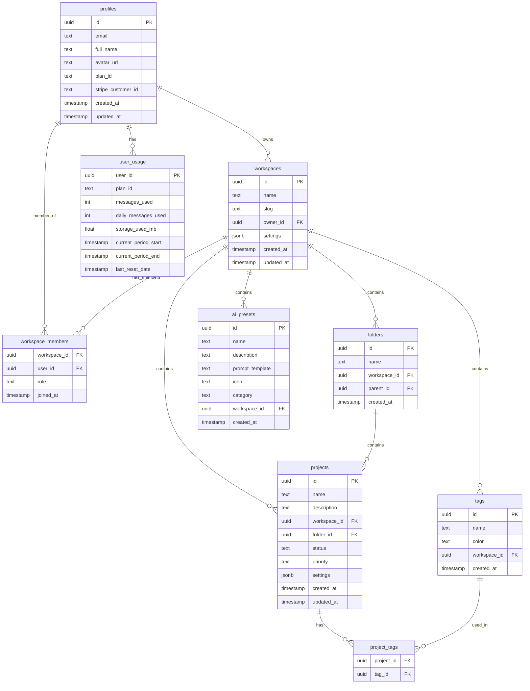
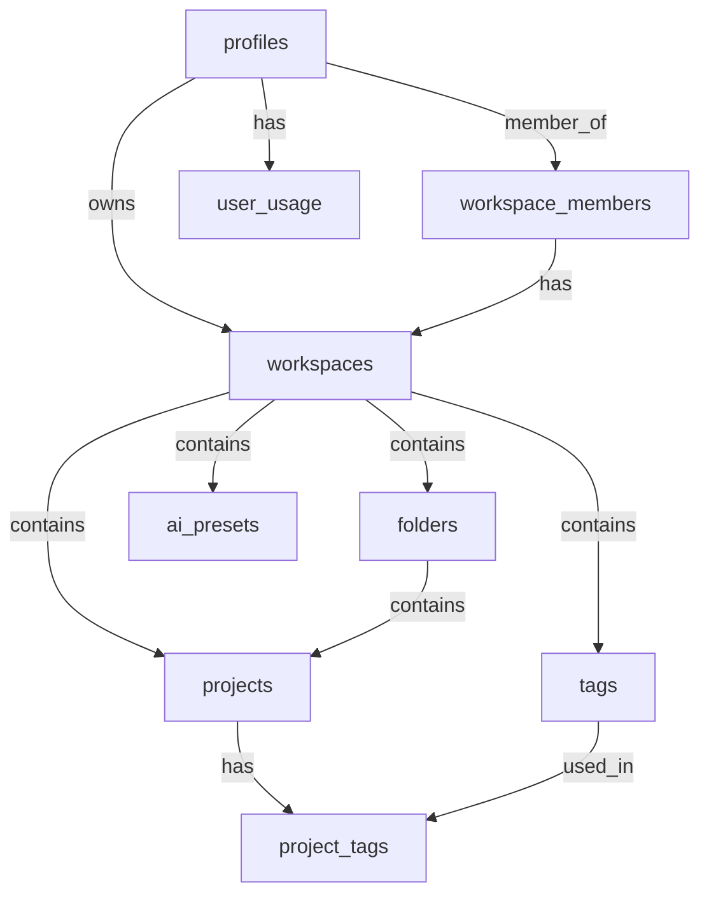

# Supabase Tables

<cite>
**Referenced Files in This Document**   
- [supabase_schema.sql](file://supabase_schema.sql)
- [apps/api/migrations/001_workspace_enhancements.sql](file://apps/api/migrations/001_workspace_enhancements.sql)
- [apps/api/migrations/005_monetization.sql](file://apps/api/migrations/005_monetization.sql)
- [apps/api/migrations/004_onboarding.sql](file://apps/api/migrations/004_onboarding.sql)
- [docs/database-schema-sessions.sql](file://docs/database-schema-sessions.sql)
- [docs/database-schema-tags.sql](file://docs/database-schema-tags.sql)
- [docs/database-schema-share-links.sql](file://docs/database-schema-share-links.sql)
</cite>

## Table of Contents
1. [Introduction](#introduction)
2. [Core Data Model](#core-data-model)
3. [Table Definitions](#table-definitions)
   - [profiles](#profiles)
   - [workspaces](#workspaces)
   - [workspace_members](#workspace_members)
   - [folders](#folders)
   - [projects](#projects)
   - [tags](#tags)
   - [project_tags](#project_tags)
   - [ai_presets](#ai_presets)
   - [user_usage](#user_usage)
4. [Relationships and Constraints](#relationships-and-constraints)
5. [JSONB Fields and Flexible Schema Design](#jsonb-fields-and-flexible-schema-design)
6. [Sample Data Entries](#sample-data-entries)
7. [Performance Considerations](#performance-considerations)
8. [Extending Tables Safely](#extending-tables-safely)
9. [Conclusion](#conclusion)

## Introduction

The WADI application utilizes a Supabase backend to manage user data, workspace organization, project management, and AI interactions. This document provides comprehensive documentation for the core Supabase tables used in the WADI application, focusing on the entities specified in the documentation objective: profiles, workspaces, workspace_members, folders, projects, tags, project_tags, ai_presets, and user_usage.

The data model is designed to support a collaborative workspace environment where users can organize their AI interactions into structured projects and workspaces. The schema incorporates modern database practices including Row Level Security (RLS) for data isolation, UUID primary keys for distributed systems, and JSONB fields for flexible schema design. The relationships between tables enable rich functionality such as team collaboration, project tagging, and personalized AI presets.

This documentation will detail each table's structure, field definitions, constraints, and relationships, providing a complete reference for developers and database administrators working with the WADI application.

**Section sources**
- [supabase_schema.sql](file://supabase_schema.sql)

## Core Data Model

The WADI application's data model centers around users and their workspaces, with a hierarchical structure that organizes projects into folders within workspaces. At the foundation is the profiles table, which extends Supabase Auth users to store additional user information. Each user can create multiple workspaces, which serve as containers for their projects and AI interactions.

Workspaces can have multiple members with different roles (owner, admin, member, viewer), enabling team collaboration. Within each workspace, users can organize projects into folders, creating a nested structure for better organization. Projects can be tagged with multiple tags through the many-to-many relationship managed by the project_tags junction table, allowing for flexible categorization and filtering.

The model also includes ai_presets, which allow users to save and reuse AI prompt templates, and user_usage, which tracks usage metrics for billing and rate limiting purposes. The schema is designed with extensibility in mind, using JSONB fields for settings and metadata, allowing for additional attributes to be added without schema migrations.

This core data model supports the application's key features including collaborative workspaces, organized project management, customizable AI interactions, and usage-based monetization.



**Diagram sources**
- [supabase_schema.sql](file://supabase_schema.sql)

## Table Definitions

### profiles

The profiles table extends the Supabase Auth users table to store additional user information. It serves as the foundation for the application's data model, with other tables referencing it to establish ownership and permissions.

| Field | Type | Constraints | Default | Description |
|-------|------|-------------|---------|-------------|
| id | uuid | PRIMARY KEY, REFERENCES auth.users(id) ON DELETE CASCADE | - | User ID, references the auth.users table |
| email | text | - | - | User's email address |
| full_name | text | - | - | User's full name |
| avatar_url | text | - | - | URL to user's avatar image |
| plan_id | text | - | 'free' | User's subscription plan |
| stripe_customer_id | text | - | - | Stripe customer ID for billing |
| created_at | timestamp with time zone | - | timezone('utc'::text, now()) | Timestamp when profile was created |
| updated_at | timestamp with time zone | - | timezone('utc'::text, now()) | Timestamp when profile was last updated |

The profiles table is linked to the auth.users table through the id field, which is a foreign key that cascades on delete. This ensures that when a user is deleted from the authentication system, their profile is automatically removed. The table includes basic user information and fields for subscription management.

**Section sources**
- [supabase_schema.sql](file://supabase_schema.sql#L8-L17)

### workspaces

The workspaces table represents collaborative spaces where users can organize their projects and AI interactions. Each workspace is owned by a user and can have multiple members with different roles.

| Field | Type | Constraints | Default | Description |
|-------|------|-------------|---------|-------------|
| id | uuid | PRIMARY KEY | uuid_generate_v4() | Unique workspace identifier |
| name | text | NOT NULL | - | Workspace name |
| slug | text | NOT NULL, UNIQUE | - | URL-friendly identifier for the workspace |
| owner_id | uuid | REFERENCES profiles(id) NOT NULL | - | ID of the user who owns the workspace |
| settings | jsonb | - | '{}'::jsonb | JSON object storing workspace settings |
| created_at | timestamp with time zone | NOT NULL | timezone('utc'::text, now()) | Timestamp when workspace was created |
| updated_at | timestamp with time zone | NOT NULL | timezone('utc'::text, now()) | Timestamp when workspace was last updated |

The workspaces table establishes the container concept in the application, allowing users to create separate spaces for different projects or teams. The slug field provides a human-readable identifier that can be used in URLs. The settings field uses JSONB to store flexible workspace configuration options without requiring schema changes.

**Section sources**
- [supabase_schema.sql](file://supabase_schema.sql#L20-L28)

### workspace_members

The workspace_members table manages the many-to-many relationship between users and workspaces, allowing multiple users to collaborate within a single workspace with different roles.

| Field | Type | Constraints | Default | Description |
|-------|------|-------------|---------|-------------|
| workspace_id | uuid | REFERENCES workspaces(id) ON DELETE CASCADE, NOT NULL | - | ID of the workspace |
| user_id | uuid | REFERENCES profiles(id) ON DELETE CASCADE, NOT NULL | - | ID of the user |
| role | text | CHECK (role in ('owner', 'admin', 'member', 'viewer')), DEFAULT 'member' | 'member' | User's role in the workspace |
| joined_at | timestamp with time zone | NOT NULL | timezone('utc'::text, now()) | Timestamp when user joined the workspace |

The table uses a composite primary key consisting of workspace_id and user_id, ensuring that a user can only be a member of a workspace once. The role field is constrained to specific values that define the user's permissions within the workspace. This table enables the collaborative features of the application by tracking which users have access to which workspaces and their respective roles.

**Section sources**
- [supabase_schema.sql](file://supabase_schema.sql#L31-L37)

### folders

The folders table provides a hierarchical organization system within workspaces, allowing users to group related projects together.

| Field | Type | Constraints | Default | Description |
|-------|------|-------------|---------|-------------|
| id | uuid | PRIMARY KEY | uuid_generate_v4() | Unique folder identifier |
| name | text | NOT NULL | - | Folder name |
| workspace_id | uuid | REFERENCES workspaces(id) ON DELETE CASCADE, NOT NULL | - | ID of the workspace containing the folder |
| parent_id | uuid | REFERENCES folders(id) ON DELETE CASCADE | - | ID of the parent folder (for nested folders) |
| created_at | timestamp with time zone | NOT NULL | timezone('utc'::text, now()) | Timestamp when folder was created |

Folders are contained within workspaces and can be nested within other folders through the parent_id field, which references the id field of the same table. This self-referencing relationship enables a tree-like structure for organizing projects. The ON DELETE CASCADE constraint ensures that when a workspace is deleted, all its folders are automatically removed.

**Section sources**
- [supabase_schema.sql](file://supabase_schema.sql#L40-L46)

### projects

The projects table represents individual projects within workspaces, serving as containers for AI interactions, runs, and sessions.

| Field | Type | Constraints | Default | Description |
|-------|------|-------------|---------|-------------|
| id | uuid | PRIMARY KEY | uuid_generate_v4() | Unique project identifier |
| name | text | NOT NULL | - | Project name |
| description | text | - | - | Project description |
| workspace_id | uuid | REFERENCES workspaces(id) ON DELETE CASCADE, NOT NULL | - | ID of the workspace containing the project |
| folder_id | uuid | REFERENCES folders(id) ON DELETE SET NULL | - | ID of the folder containing the project |
| status | text | - | 'active' | Project status (e.g., active, archived) |
| priority | text | - | 'medium' | Project priority level |
| settings | jsonb | - | '{}'::jsonb | JSON object storing project settings |
| created_at | timestamp with time zone | NOT NULL | timezone('utc'::text, now()) | Timestamp when project was created |
| updated_at | timestamp with time zone | NOT NULL | timezone('utc'::text, now()) | Timestamp when project was last updated |

Projects are the primary organizational unit for AI interactions in the application. They belong to a workspace and can optionally be placed in a folder for additional organization. The settings field uses JSONB to store flexible project configuration options. The status and priority fields allow users to track and filter projects based on their current state and importance.

**Section sources**
- [supabase_schema.sql](file://supabase_schema.sql#L49-L60)

### tags

The tags table stores user-defined tags that can be applied to projects for categorization and filtering.

| Field | Type | Constraints | Default | Description |
|-------|------|-------------|---------|-------------|
| id | uuid | PRIMARY KEY | uuid_generate_v4() | Unique tag identifier |
| name | text | NOT NULL | - | Tag name |
| color | text | - | '#64748B' | Color associated with the tag (hex code) |
| workspace_id | uuid | REFERENCES workspaces(id) ON DELETE CASCADE, NOT NULL | - | ID of the workspace where the tag is defined |
| created_at | timestamp with time zone | NOT NULL | timezone('utc'::text, now()) | Timestamp when tag was created |

Tags are scoped to workspaces, meaning each workspace can have its own set of tags. The color field stores a hex color code that is used when displaying the tag in the UI. This allows for visual differentiation of tags. Tags are not user-specific but workspace-specific, enabling consistent tagging across all members of a workspace.

**Section sources**
- [supabase_schema.sql](file://supabase_schema.sql#L63-L69)

### project_tags

The project_tags table is a junction table that implements the many-to-many relationship between projects and tags, allowing multiple tags to be associated with a single project and multiple projects to share the same tag.

| Field | Type | Constraints | Default | Description |
|-------|------|-------------|---------|-------------|
| project_id | uuid | REFERENCES projects(id) ON DELETE CASCADE, NOT NULL | - | ID of the project |
| tag_id | uuid | REFERENCES tags(id) ON DELETE CASCADE, NOT NULL | - | ID of the tag |

The table uses a composite primary key consisting of project_id and tag_id, ensuring that a specific tag can only be associated with a project once. The ON DELETE CASCADE constraints ensure that when a project or tag is deleted, the corresponding entries in this table are automatically removed. This maintains referential integrity and prevents orphaned records.

**Section sources**
- [supabase_schema.sql](file://supabase_schema.sql#L72-L76)

### ai_presets

The ai_presets table stores reusable AI prompt templates that users can apply to their interactions.

| Field | Type | Constraints | Default | Description |
|-------|------|-------------|---------|-------------|
| id | uuid | PRIMARY KEY | uuid_generate_v4() | Unique preset identifier |
| name | text | NOT NULL | - | Preset name |
| description | text | - | - | Preset description |
| prompt_template | text | NOT NULL | - | The actual prompt template with placeholders |
| icon | text | - | - | Icon identifier for the preset |
| category | text | NOT NULL | - | Category classification for the preset |
| workspace_id | uuid | REFERENCES workspaces(id) ON DELETE CASCADE | - | ID of the workspace where the preset is defined (NULL for system presets) |
| created_at | timestamp with time zone | NOT NULL | timezone('utc'::text, now()) | Timestamp when preset was created |

AI presets allow users to save frequently used prompt templates, improving efficiency and consistency in their AI interactions. The workspace_id field can be NULL, which indicates that the preset is a system-wide preset available to all users. When a workspace_id is specified, the preset is only available to members of that workspace. This enables both global and workspace-specific prompt templates.

**Section sources**
- [supabase_schema.sql](file://supabase_schema.sql#L79-L88)

### user_usage

The user_usage table tracks usage metrics for each user, which is essential for implementing rate limiting and subscription-based features.

| Field | Type | Constraints | Default | Description |
|-------|------|-------------|---------|-------------|
| user_id | uuid | PRIMARY KEY, REFERENCES profiles(id) ON DELETE CASCADE | - | ID of the user |
| plan_id | text | - | 'free' | Current subscription plan |
| messages_used | int | - | 0 | Total number of messages used in the current period |
| daily_messages_used | int | - | 0 | Number of messages used today |
| storage_used_mb | float | - | 0 | Amount of storage used in megabytes |
| current_period_start | timestamp with time zone | - | timezone('utc'::text, now()) | Start of the current billing/usage period |
| current_period_end | timestamp with time zone | - | timezone('utc'::text, now() + interval '1 month') | End of the current billing/usage period |
| last_reset_date | timestamp with time zone | - | timezone('utc'::text, now()) | Date when usage counters were last reset |

This table is crucial for the application's monetization strategy, as it tracks key metrics that are limited by subscription plans. The usage counters are reset periodically (typically monthly) to align with subscription billing cycles. The table has a one-to-one relationship with the profiles table, ensuring each user has exactly one usage record.

**Section sources**
- [supabase_schema.sql](file://supabase_schema.sql#L91-L100)

## Relationships and Constraints

The WADI application's data model implements several important relationships and constraints to maintain data integrity and support the application's functionality.

The primary relationship pattern is one-to-many, where a single record in a parent table can have multiple related records in a child table. For example, a workspace can have multiple projects, folders, tags, and AI presets. This is implemented through foreign key constraints where the child table contains a reference to the parent table's primary key.

Many-to-many relationships are implemented using junction tables. The most prominent example is between projects and tags, which uses the project_tags table to associate multiple tags with a single project and multiple projects with a single tag. This design allows for flexible categorization of projects without duplicating data.

Ownership relationships are established through the profiles table, which extends the Supabase Auth users table. Most entities in the system (workspaces, projects, etc.) have an owner_id field that references the profiles table, establishing clear ownership and enabling permission checks.

The schema includes several constraints to ensure data validity:
- Check constraints limit fields to specific values (e.g., role in workspace_members)
- Unique constraints prevent duplicate entries (e.g., slug in workspaces)
- Not null constraints ensure required fields are populated
- Primary key constraints ensure record uniqueness
- Foreign key constraints with ON DELETE actions maintain referential integrity

Row Level Security (RLS) policies are implemented to ensure users can only access data they are authorized to view. These policies use the auth.uid() function to compare the current user's ID with ownership fields in the tables.



**Diagram sources**
- [supabase_schema.sql](file://supabase_schema.sql)

## JSONB Fields and Flexible Schema Design

The WADI application leverages PostgreSQL's JSONB data type in several tables to enable flexible schema design and accommodate evolving requirements without requiring frequent database migrations.

The primary use of JSONB fields is in the settings columns of the workspaces and projects tables. These fields store configuration options as JSON objects, allowing for the addition of new settings without altering the table structure. For example, workspace settings might include UI preferences, notification configurations, or integration settings, while project settings could include AI model preferences, output formats, or custom workflows.

The flexible nature of JSONB fields provides several advantages:
- New settings can be added dynamically through application code
- Different workspaces or projects can have different sets of settings
- Settings can be nested in a hierarchical structure
- The data remains queryable using PostgreSQL's JSON operators

This approach follows the "extension" pattern, where the core schema remains stable while additional functionality is added through flexible fields. It reduces the need for schema migrations and allows for rapid iteration on features.

When using JSONB fields, the application should validate the structure of the data at the application level to ensure consistency. Indexes can be created on specific JSON fields to improve query performance when filtering or sorting by JSON attributes.

The use of JSONB fields represents a balance between the rigidity of traditional relational design and the flexibility of NoSQL approaches, providing the benefits of both paradigms.

**Section sources**
- [supabase_schema.sql](file://supabase_schema.sql)

## Sample Data Entries

The following examples illustrate typical data entries for the core tables in the WADI application:

**profiles table:**
```json
{
  "id": "a1b2c3d4-e5f6-7890-g1h2-i3j4k5l6m7n8",
  "email": "user@example.com",
  "full_name": "John Doe",
  "avatar_url": "https://example.com/avatars/john.jpg",
  "plan_id": "pro",
  "stripe_customer_id": "cus_123456789",
  "created_at": "2023-01-15T10:30:00Z",
  "updated_at": "2023-01-15T10:30:00Z"
}
```

**workspaces table:**
```json
{
  "id": "b2c3d4e5-f6g7-8901-h2i3-j4k5l6m7n8o9",
  "name": "Marketing Team",
  "slug": "marketing-team",
  "owner_id": "a1b2c3d4-e5f6-7890-g1h2-i3j4k5l6m7n8",
  "settings": {
    "theme": "dark",
    "notifications": {
      "email": true,
      "push": false
    }
  },
  "created_at": "2023-01-15T10:35:00Z",
  "updated_at": "2023-01-15T10:35:00Z"
}
```

**workspace_members table:**
```json
{
  "workspace_id": "b2c3d4e5-f6g7-8901-h2i3-j4k5l6m7n8o9",
  "user_id": "a1b2c3d4-e5f6-7890-g1h2-i3j4k5l6m7n8",
  "role": "owner",
  "joined_at": "2023-01-15T10:35:00Z"
}
```

**projects table:**
```json
{
  "id": "c3d4e5f6-g7h8-9012-i3j4-k5l6m7n8o9p0",
  "name": "Q1 Campaign",
  "description": "Marketing campaign for first quarter",
  "workspace_id": "b2c3d4e5-f6g7-8901-h2i3-j4k5l6m7n8o9",
  "folder_id": null,
  "status": "active",
  "priority": "high",
  "settings": {
    "model": "gpt-4",
    "temperature": 0.7
  },
  "created_at": "2023-01-15T10:40:00Z",
  "updated_at": "2023-01-15T10:40:00Z"
}
```

**tags table:**
```json
{
  "id": "d4e5f6g7-h8i9-0123-j4k5-l6m7n8o9p0q1",
  "name": "Urgent",
  "color": "#ef4444",
  "workspace_id": "b2c3d4e5-f6g7-8901-h2i3-j4k5l6m7n8o9",
  "created_at": "2023-01-15T10:45:00Z"
}
```

**project_tags table:**
```json
{
  "project_id": "c3d4e5f6-g7h8-9012-i3j4-k5l6m7n8o9p0",
  "tag_id": "d4e5f6g7-h8i9-0123-j4k5-l6m7n8o9p0q1"
}
```

These sample entries demonstrate typical usage patterns, showing how a user creates a workspace, adds members, creates projects, and applies tags for organization.

**Section sources**
- [supabase_schema.sql](file://supabase_schema.sql)

## Performance Considerations

The WADI application's database schema incorporates several performance optimization strategies to ensure responsive user experiences even as data volumes grow.

Indexing is a critical aspect of the performance strategy. The schema includes indexes on all foreign key columns to speed up JOIN operations, such as indexes on workspace_id in the projects table and user_id in various tables. Additionally, indexes are created on columns frequently used in WHERE clauses, such as the slug column in the workspaces table for fast workspace lookups.

For text search operations, the application uses PostgreSQL's full-text search capabilities with GIN indexes. These are particularly important for the global search functionality, allowing users to quickly find messages, conversations, and workspaces based on content. The search_index materialized view aggregates searchable content for even faster query performance.

The schema also employs denormalization in strategic places to avoid expensive JOIN operations. For example, the workspace_members table includes direct references to both workspace_id and user_id, allowing for efficient membership checks without additional table lookups.

Query patterns in the application code are designed to be efficient, typically following these principles:
- Using specific WHERE clauses to limit result sets
- Selecting only required columns rather than using SELECT *
- Implementing pagination for large result sets
- Using batch operations when appropriate
- Caching frequently accessed data at the application level

The use of UUIDs as primary keys, while providing benefits for distributed systems, requires consideration for index performance. The random nature of UUIDs can lead to less efficient index page utilization compared to sequential integers. However, this is mitigated by PostgreSQL's efficient handling of UUID indexes and the overall benefits of using UUIDs in a distributed application.

**Section sources**
- [supabase_schema.sql](file://supabase_schema.sql)
- [apps/api/migrations/006_global_search.sql](file://apps/api/migrations/006_global_search.sql)

## Extending Tables Safely

When extending the WADI application's tables, it's essential to maintain referential integrity and follow established patterns to ensure data consistency and application stability.

To add new columns to existing tables, use ALTER TABLE statements with appropriate constraints. For example, to add a new field to the projects table:

```sql
ALTER TABLE projects 
ADD COLUMN IF NOT EXISTS new_field TEXT DEFAULT 'default_value';
```

When adding new tables that reference existing ones, ensure proper foreign key constraints with appropriate ON DELETE actions. For tables that should be deleted when their parent is deleted, use ON DELETE CASCADE. For tables where the child records should remain when the parent is deleted, use ON DELETE SET NULL or ON DELETE RESTRICT.

For many-to-many relationships, create junction tables following the pattern of project_tags, with composite primary keys and foreign keys to both related tables. Include timestamps for audit purposes and consider adding indexes on both foreign key columns for performance.

When modifying existing constraints or indexes, carefully consider the impact on application functionality and data integrity. Use transactions to ensure changes are atomic, and test thoroughly in a development environment before applying to production.

The application's use of JSONB fields provides a flexible way to add new functionality without schema changes. When possible, consider using JSONB fields to store new attributes rather than adding multiple new columns, especially for settings or metadata that may vary between records.

Always update the Row Level Security (RLS) policies when creating new tables to ensure proper data access controls. Follow the existing patterns for policies, typically allowing users to read, create, update, and delete their own records.

**Section sources**
- [supabase_schema.sql](file://supabase_schema.sql)

## Conclusion

The Supabase tables in the WADI application form a robust and flexible data model that supports the application's core functionality. The schema is thoughtfully designed with clear relationships between entities, appropriate constraints for data integrity, and performance optimizations for responsive user experiences.

Key strengths of the data model include:
- Clear ownership and collaboration patterns through the profiles, workspaces, and workspace_members tables
- Flexible organization with hierarchical folders and tag-based categorization
- Extensible design using JSONB fields for settings and metadata
- Comprehensive usage tracking for monetization and rate limiting
- Security through Row Level Security policies

The relationships between tables enable rich functionality while maintaining data integrity. The one-to-many relationships between workspaces and their contained entities provide a natural organizational structure, while the many-to-many relationship between projects and tags allows for flexible categorization.

The use of modern PostgreSQL features like UUIDs, JSONB, and full-text search indexing demonstrates a sophisticated approach to database design that balances relational integrity with the flexibility needed for an evolving application.

This comprehensive documentation provides a solid foundation for understanding, maintaining, and extending the WADI application's data model.

**Section sources**
- [supabase_schema.sql](file://supabase_schema.sql)