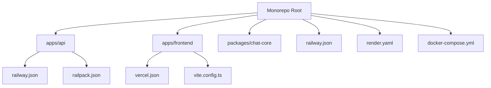
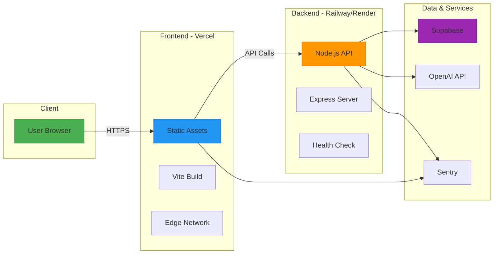
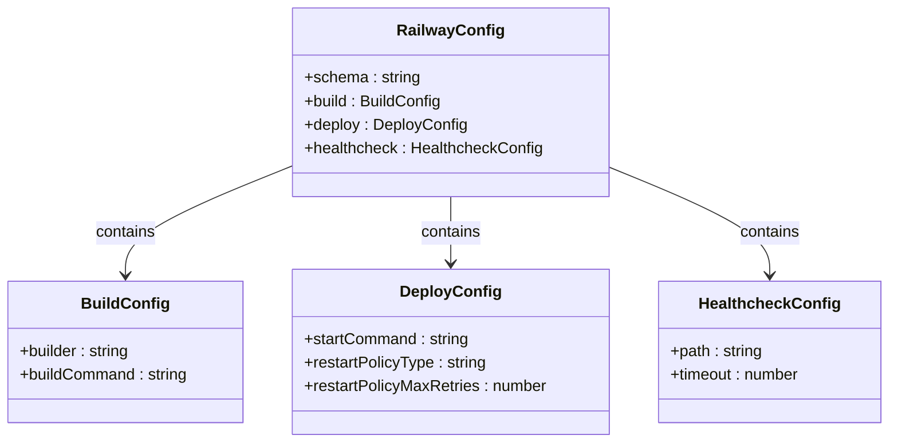
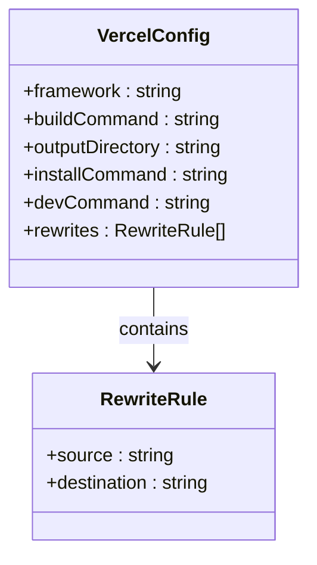
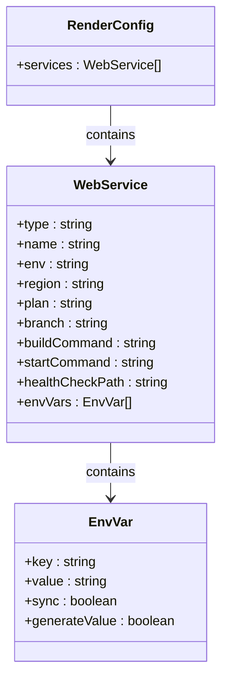
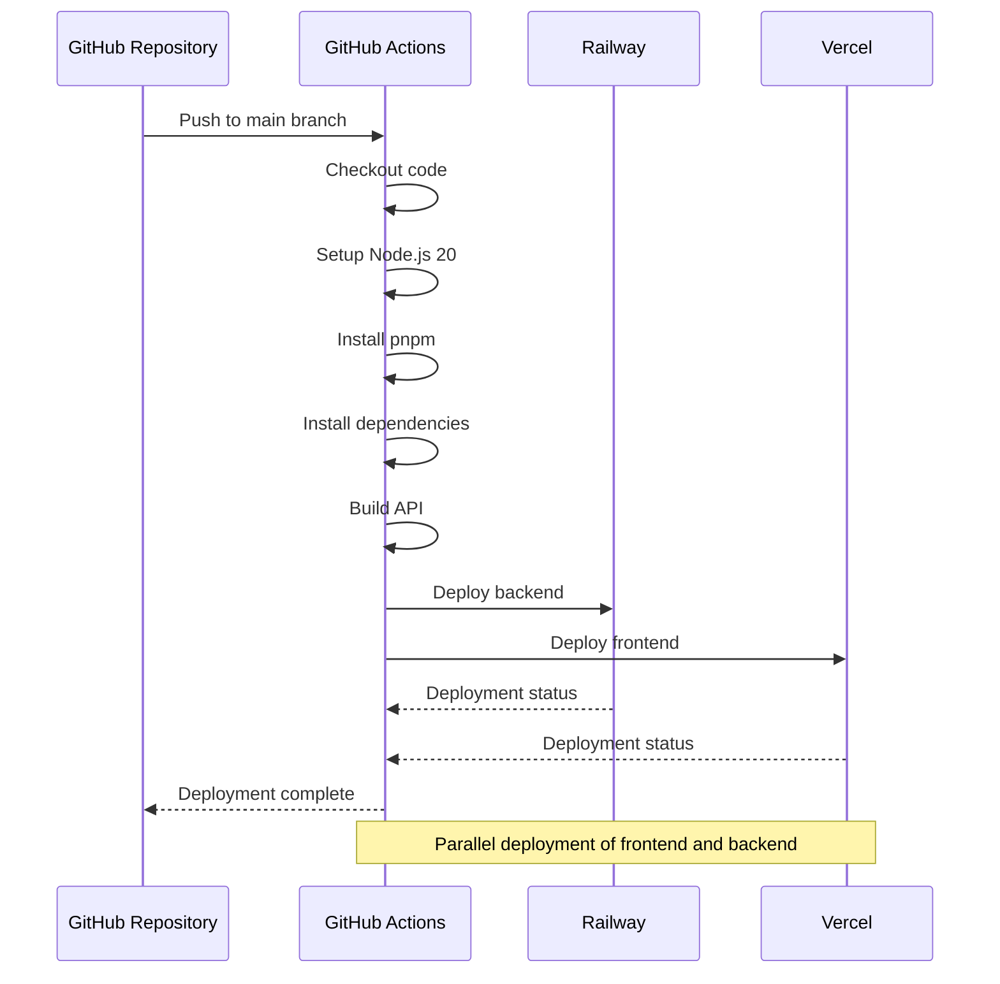
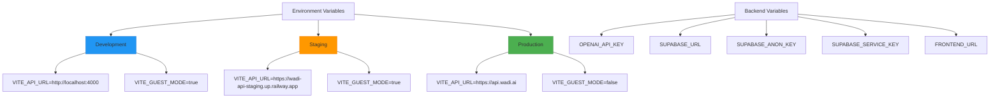

# Deployment Architecture

<cite>
**Referenced Files in This Document**   
- [DEPLOYMENT_GUIDE.md](file://DEPLOYMENT_GUIDE.md)
- [DEPLOYMENT_CHECKLIST.md](file://DEPLOYMENT_CHECKLIST.md)
- [railway.json](file://railway.json)
- [render.yaml](file://render.yaml)
- [vercel.json](file://apps/frontend/vercel.json)
- [docker-compose.yml](file://docker-compose.yml)
- [package.json](file://apps/api/package.json)
- [package.json](file://apps/frontend/package.json)
- [railpack.json](file://apps/api/railpack.json)
- [vite.config.ts](file://apps/frontend/vite.config.ts)
- [tsconfig.json](file://apps/api/tsconfig.json)
- [railway.toml](file://railway.toml)
</cite>

## Table of Contents
1. [Introduction](#introduction)
2. [Project Structure](#project-structure)
3. [Core Components](#core-components)
4. [Architecture Overview](#architecture-overview)
5. [Detailed Component Analysis](#detailed-component-analysis)
6. [Dependency Analysis](#dependency-analysis)
7. [Performance Considerations](#performance-considerations)
8. [Troubleshooting Guide](#troubleshooting-guide)
9. [Conclusion](#conclusion)

## Introduction
This document provides comprehensive architectural documentation for WADI's deployment infrastructure. It details the multi-platform deployment strategy across Vercel, Railway, and Render, covering configuration files, environment management, CI/CD pipelines, and operational procedures. The documentation explains technical decisions behind platform selection, scalability considerations, and disaster recovery planning for the full-stack application.

**Section sources**
- [DEPLOYMENT_GUIDE.md](file://DEPLOYMENT_GUIDE.md#L1-L553)
- [DEPLOYMENT_CHECKLIST.md](file://DEPLOYMENT_CHECKLIST.md#L1-L312)

## Project Structure
The WADI project follows a monorepo structure with multiple deployment targets. The architecture separates frontend and backend applications while maintaining shared components through the packages directory. The deployment configuration is distributed across platform-specific files in their respective application directories and at the root level.

The project is organized into:
- `apps/api`: Backend API service with Node.js/Express
- `apps/frontend`: Frontend application built with React/Vite
- `packages/chat-core`: Shared TypeScript package
- Root-level configuration files for Railway, Render, and Vercel

**Diagram sources**
- [railway.json](file://railway.json#L1-L16)
- [render.yaml](file://render.yaml#L1-L30)
- [vercel.json](file://apps/frontend/vercel.json#L1-L13)

**Section sources**
- [railway.json](file://railway.json#L1-L16)
- [render.yaml](file://render.yaml#L1-L30)
- [vercel.json](file://apps/frontend/vercel.json#L1-L13)

## Core Components
The deployment architecture centers around three core components: the frontend application hosted on Vercel, the backend API service deployed on Railway, and the shared chat-core package. The system leverages Supabase for database and authentication services, with OpenAI providing AI capabilities.

Key deployment components include:
- Platform-specific configuration files (railway.json, vercel.json, render.yaml)
- Docker configuration for containerized deployment
- Environment variable management across platforms
- CI/CD pipeline configuration

**Section sources**
- [DEPLOYMENT_GUIDE.md](file://DEPLOYMENT_GUIDE.md#L1-L553)
- [DEPLOYMENT_CHECKLIST.md](file://DEPLOYMENT_CHECKLIST.md#L1-L312)
- [docker-compose.yml](file://docker-compose.yml#L1-L100)

## Architecture Overview
WADI employs a multi-cloud deployment strategy that leverages the strengths of different platforms. The frontend is deployed on Vercel for optimal static site delivery and edge network performance, while the backend API runs on Railway for robust Node.js application hosting. Render provides an alternative deployment option for the API service.

The architecture follows a microservices-inspired pattern with clear separation between frontend and backend, communicating via REST APIs. Third-party services like Supabase handle database and authentication, allowing the core application to focus on business logic.

**Diagram sources**
- [DEPLOYMENT_GUIDE.md](file://DEPLOYMENT_GUIDE.md#L13-L94)
- [DEPLOYMENT_GUIDE.md](file://DEPLOYMENT_GUIDE.md#L55-L93)
- [railway.json](file://railway.json#L1-L16)
- [vercel.json](file://apps/frontend/vercel.json#L1-L13)

## Detailed Component Analysis

### Deployment Configuration Analysis
The deployment configuration is distributed across multiple files that define platform-specific settings. Each platform has its own configuration format and requirements, allowing WADI to maintain flexibility in deployment options.

#### Railway Configuration

**Diagram sources**
- [railway.json](file://railway.json#L1-L16)
- [apps/api/railway.json](file://apps/api/railway.json#L1-L11)
- [railway.toml](file://railway.toml#L1-L2)

#### Vercel Configuration

**Diagram sources**
- [vercel.json](file://apps/frontend/vercel.json#L1-L13)

#### Render Configuration

**Diagram sources**
- [render.yaml](file://render.yaml#L1-L30)

### CI/CD Pipeline Analysis
The CI/CD pipeline automates deployment across platforms, ensuring consistent and reliable releases. The workflow triggers on main branch pushes and deploys both frontend and backend components.

**Diagram sources**
- [DEPLOYMENT_GUIDE.md](file://DEPLOYMENT_GUIDE.md#L341-L387)

### Environment Management Analysis
The environment management system handles configuration across different deployment stages, ensuring secure and consistent variable handling.

**Diagram sources**
- [DEPLOYMENT_GUIDE.md](file://DEPLOYMENT_GUIDE.md#L123-L144)
- [DEPLOYMENT_CHECKLIST.md](file://DEPLOYMENT_CHECKLIST.md#L15-L30)

**Section sources**
- [DEPLOYMENT_GUIDE.md](file://DEPLOYMENT_GUIDE.md#L123-L144)
- [DEPLOYMENT_CHECKLIST.md](file://DEPLOYMENT_CHECKLIST.md#L15-L30)

## Dependency Analysis
The deployment architecture relies on several external platforms and services, creating a distributed dependency graph. The system is designed to minimize vendor lock-in while leveraging platform-specific optimizations.

```mermaid
graph TD
A[WADI Deployment] --> B[Vercel]
A --> C[Railway]
A --> D[Render]
A --> E[Supabase]
A --> F[OpenAI]
A --> G[GitHub]
B --> H[Vercel Edge Network]
B --> I[Vercel Analytics]
C --> J[Railway Builder]
C --> K[Railway Deploy]
D --> L[Render Web Service]
E --> M[Supabase Database]
E --> N[Supabase Auth]
F --> O[OpenAI API]
G --> P[GitHub Actions]
style A fill:#3F51B5,stroke:#303F9F
style B fill:#000000,stroke:#000000
style C fill:#0D5F48,stroke:#0A4B38
style D fill:#4A154B,stroke:#3A113B
```

**Diagram sources**
- [DEPLOYMENT_GUIDE.md](file://DEPLOYMENT_GUIDE.md#L13-L94)
- [DEPLOYMENT_GUIDE.md](file://DEPLOYMENT_GUIDE.md#L55-L93)
- [DEPLOYMENT_GUIDE.md](file://DEPLOYMENT_GUIDE.md#L104-L119)

## Performance Considerations
The deployment architecture incorporates several performance optimizations across platforms. Vercel's edge network ensures low-latency content delivery for the frontend, while Railway provides scalable compute resources for the backend API. The configuration includes resource limits and reservations to ensure consistent performance.

The frontend build process implements code splitting through Vite's rollupOptions, creating optimized chunks for different vendor libraries. This reduces initial load time by allowing parallel downloading of smaller bundles. The nginx configuration includes gzip compression and caching headers for static assets, further improving performance.

The backend deployment includes health checks and restart policies to maintain service availability. Railway's restart policy with ON_FAILURE and maximum retries ensures service recovery from transient issues.

**Section sources**
- [vite.config.ts](file://apps/frontend/vite.config.ts#L1-L34)
- [nginx.conf](file://apps/frontend/nginx.conf#L1-L288)
- [railway.json](file://railway.json#L1-L16)

## Troubleshooting Guide
The deployment system includes comprehensive troubleshooting procedures for common issues. The documentation provides specific solutions for connectivity problems, authentication errors, and deployment failures.

Common issues and solutions include:
- API connectivity problems: Verify VITE_API_URL in frontend and FRONTEND_URL in backend for CORS configuration
- OpenAI API errors: Validate OPENAI_API_KEY in Railway environment variables
- Deployment failures: Ensure deployment from repository root when using Vercel with subdirectory configuration
- CORS errors: Confirm exact URL matching including https:// prefix and no trailing slash

The system includes health check endpoints (/health) on the backend to verify service status and database connectivity. Monitoring is implemented through Sentry for error tracking and Vercel Analytics for user behavior insights.

**Section sources**
- [DEPLOYMENT_GUIDE.md](file://DEPLOYMENT_GUIDE.md#L476-L498)
- [DEPLOYMENT_CHECKLIST.md](file://DEPLOYMENT_CHECKLIST.md#L220-L249)
- [DEPLOYMENT_GUIDE.md](file://DEPLOYMENT_GUIDE.md#L306-L327)

## Conclusion
WADI's deployment architecture demonstrates a thoughtful multi-platform strategy that leverages the strengths of Vercel, Railway, and Render. The system balances developer experience with production reliability, providing multiple deployment options while maintaining consistent configuration patterns.

The architecture effectively separates concerns between frontend and backend, allowing independent scaling and deployment. Environment management is robust, with clear separation between development, staging, and production configurations. The CI/CD pipeline automation reduces deployment friction and ensures consistent releases.

Future considerations might include implementing blue-green deployments for zero-downtime updates, enhancing monitoring with custom metrics, and exploring additional deployment platforms for geographic redundancy. The current architecture provides a solid foundation for scaling and maintaining the application in production environments.