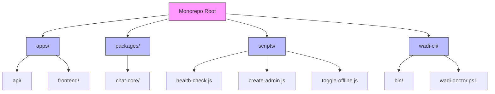
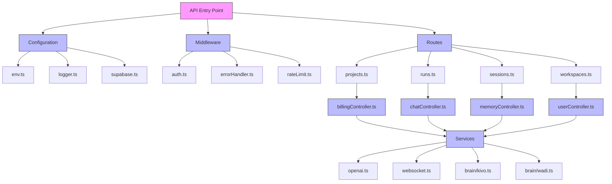
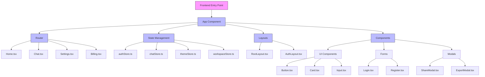
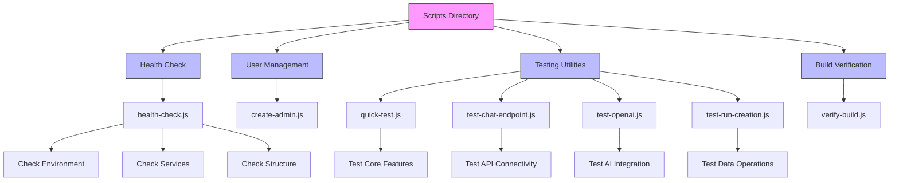
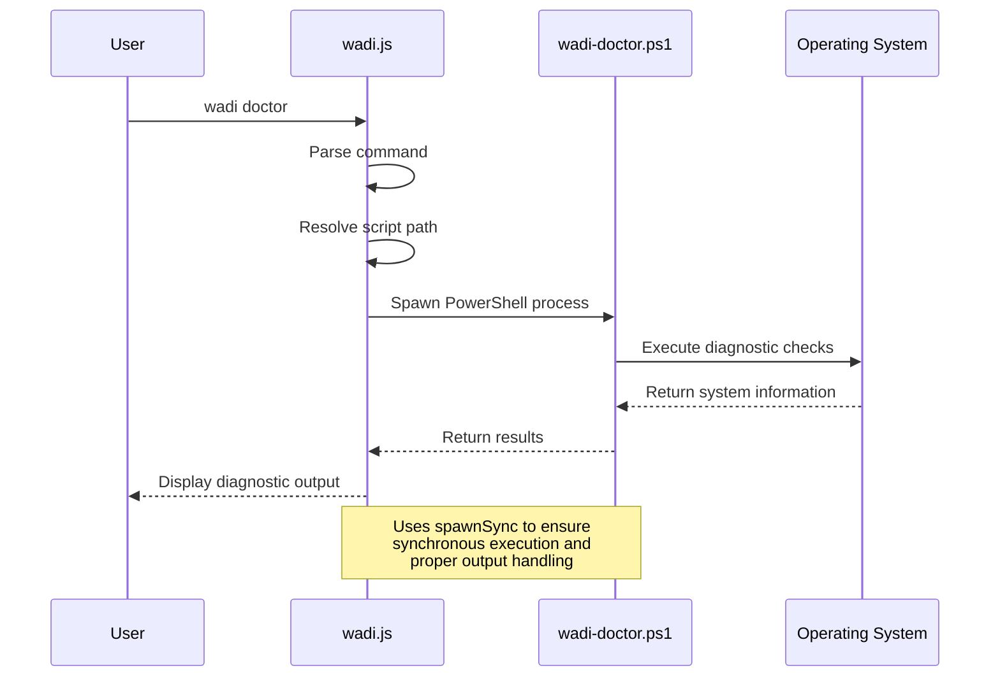
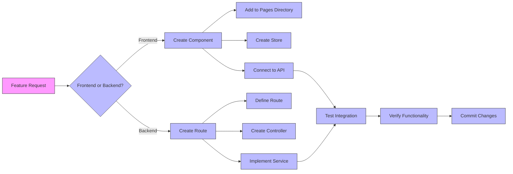

# Directory Structure

<cite>
**Referenced Files in This Document**   
- [README.md](file://README.md)
- [package.json](file://package.json)
- [pnpm-workspace.yaml](file://pnpm-workspace.yaml)
- [apps/api/package.json](file://apps/api/package.json)
- [apps/frontend/package.json](file://apps/frontend/package.json)
- [apps/api/src/index.ts](file://apps/api/src/index.ts)
- [apps/frontend/src/main.tsx](file://apps/frontend/src/main.tsx)
- [packages/chat-core/index.ts](file://packages/chat-core/index.ts)
- [apps/api/railpack.json](file://apps/api/railpack.json)
- [apps/frontend/vite.config.ts](file://apps/frontend/vite.config.ts)
- [scripts/health-check.js](file://scripts/health-check.js)
- [wadi-cli/bin/wadi.js](file://wadi-cli/bin/wadi.js)
- [apps/api/migrations/001_workspace_enhancements.sql](file://apps/api/migrations/001_workspace_enhancements.sql)
</cite>

## Table of Contents

1. [Introduction](#introduction)
2. [Top-Level Directory Overview](#top-level-directory-overview)
3. [Application Structure](#application-structure)
4. [Shared Code Organization](#shared-code-organization)
5. [Utility Scripts and Tools](#utility-scripts-and-tools)
6. [Command Line Interface](#command-line-interface)
7. [Navigation and Development Workflow](#navigation-and-development-workflow)
8. [Architectural Patterns and Design Principles](#architectural-patterns-and-design-principles)
9. [Conclusion](#conclusion)

## Introduction

The WADI monorepo follows a well-structured organization that separates concerns while maintaining cohesion across the full-stack application. This document provides a comprehensive guide to the directory structure, explaining the purpose of each top-level directory and the internal organization of key components. The structure supports WADI's dual-brain architecture (Kivo + Wadi) and facilitates efficient development workflows for both frontend and backend systems.

**Section sources**

- [README.md](file://README.md#L123-L149)

## Top-Level Directory Overview

The WADI monorepo is organized into several top-level directories that serve distinct purposes in the application ecosystem:

- **apps/**: Contains the main application codebases, including both frontend and backend applications
- **packages/**: Houses shared code packages that can be consumed across multiple applications
- **scripts/**: Includes utility scripts for development, testing, and deployment operations
- **wadi-cli/**: Contains the command line interface tools for WADI operations

This monorepo structure, managed by pnpm workspaces, enables independent development of applications while promoting code reuse through shared packages. The organization follows industry best practices for full-stack JavaScript/TypeScript applications, making it easy for developers to navigate and contribute to different parts of the system.



**Diagram sources**

- [README.md](file://README.md#L123-L149)
- [package.json](file://package.json#L4)
- [pnpm-workspace.yaml](file://pnpm-workspace.yaml#L1-L3)

**Section sources**

- [README.md](file://README.md#L123-L149)
- [package.json](file://package.json#L4)
- [pnpm-workspace.yaml](file://pnpm-workspace.yaml#L1-L3)

## Application Structure

### Backend Application (apps/api/)

The backend application, located in `apps/api/`, follows a clean, modular structure based on the Express framework. The source code is organized into several key directories that implement separation of concerns:

- **config/**: Contains configuration files for environment variables, logging, and Supabase integration
- **controllers/**: Implements route handlers that process HTTP requests and responses
- **middleware/**: Provides reusable request processing functions for authentication, error handling, and rate limiting
- **routes/**: Defines API endpoints and maps them to controller functions
- **services/**: Contains business logic and integrations with external systems like OpenAI and Supabase
- **migrations/**: Stores database migration scripts for schema evolution

The backend's entry point is `src/index.ts`, which initializes the Express application, configures middleware, sets up routes, and starts the server. This structure follows the MVC (Model-View-Controller) pattern adapted for API development, making it easy to locate and modify specific functionality.



**Diagram sources**

- [apps/api/src/index.ts](file://apps/api/src/index.ts#L1-L144)
- [apps/api/package.json](file://apps/api/package.json#L1-L42)

**Section sources**

- [apps/api/src/index.ts](file://apps/api/src/index.ts#L1-L144)
- [apps/api/package.json](file://apps/api/package.json#L1-L42)

### Frontend Application (apps/frontend/)

The frontend application, located in `apps/frontend/`, is built with React and Vite, following modern React patterns and best practices. The source structure is organized to separate concerns and promote reusability:

- **components/**: Contains UI components, including both presentational components and reusable UI elements
- **pages/**: Implements page-level components that represent different views in the application
- **store/**: Manages application state using Zustand, with separate stores for different domains
- **hooks/**: Contains custom React hooks for reusable logic
- **layouts/**: Defines layout components that wrap pages with common UI elements
- **config/**: Stores configuration for API endpoints and Supabase integration
- **utils/**: Includes utility functions for validation, error handling, and other cross-cutting concerns
- **types/**: Defines TypeScript interfaces and types used throughout the application
- **locales/**: Contains internationalization files for multi-language support

The frontend's entry point is `src/main.tsx`, which renders the root App component. The application uses React Router for navigation and follows a component-based architecture that makes it easy to understand the UI hierarchy and data flow.



**Diagram sources**

- [apps/frontend/src/main.tsx](file://apps/frontend/src/main.tsx#L1-L9)
- [apps/frontend/package.json](file://apps/frontend/package.json#L1-L48)

**Section sources**

- [apps/frontend/src/main.tsx](file://apps/frontend/src/main.tsx#L1-L9)
- [apps/frontend/package.json](file://apps/frontend/package.json#L1-L48)

## Shared Code Organization

The `packages/` directory contains shared code that can be reused across multiple applications within the monorepo. Currently, the primary shared package is `chat-core/`, which exports core functionality used by both frontend and backend applications.

The `chat-core/` package follows a clean structure with:

- **index.ts**: The main entry point that re-exports all public APIs
- **kivo.ts**: Implements the Kivo brain functionality
- **wadi.ts**: Implements the Wadi brain functionality
- **types.ts**: Defines shared TypeScript types and interfaces

This shared package implements WADI's dual-brain architecture, where Kivo handles reasoning and Wadi handles execution. By centralizing this core logic in a shared package, both the frontend and backend can leverage consistent AI functionality while maintaining separation of concerns.

```mermaid
classDiagram
class ChatCore {
+index.ts
+kivo.ts
+wadi.ts
+types.ts
}
class Kivo {
+processInput(input) Response
+analyzeContext(context) Analysis
+generateResponse(prompt) string
}
class Wadi {
+executeAction(action) Result
+manageState(state) State
+handleIntegration(service) Response
}
class Types {
+Request
+Response
+Context
+State
+Action
}
ChatCore --> Kivo : "exports"
ChatCore --> Wadi : "exports"
ChatCore --> Types : "exports"
Kivo --> Types : "uses"
Wadi --> Types : "uses"
note right of ChatCore
Shared package used by both
frontend and backend applications
end note
```

**Diagram sources**

- [packages/chat-core/index.ts](file://packages/chat-core/index.ts#L1-L4)
- [apps/api/package.json](file://apps/api/package.json#L17)
- [apps/frontend/package.json](file://apps/frontend/package.json#L20)

**Section sources**

- [packages/chat-core/index.ts](file://packages/chat-core/index.ts#L1-L4)
- [apps/api/package.json](file://apps/api/package.json#L17)
- [apps/frontend/package.json](file://apps/frontend/package.json#L20)

## Utility Scripts and Tools

The `scripts/` directory contains various utility scripts that support development, testing, and deployment workflows. These scripts are designed to automate common tasks and ensure consistency across development environments.

Key scripts include:

- **health-check.js**: Verifies that all required services and configurations are in place
- **create-admin.js**: Creates administrative users in the system
- **quick-test.js**: Runs quick validation tests on core functionality
- **test-chat-endpoint.js**: Tests the chat API endpoint connectivity
- **test-openai.js**: Validates OpenAI API integration
- **test-run-creation.js**: Tests run creation functionality
- **toggle-offline.js**: Toggles offline mode for testing
- **verify-build.js**: Verifies the build process completes successfully

These scripts follow a consistent pattern of using Node.js with appropriate dependencies to perform their tasks, and they are designed to be run from the project root using pnpm scripts defined in the root package.json.



**Diagram sources**

- [scripts/health-check.js](file://scripts/health-check.js#L1-L164)
- [package.json](file://package.json#L25-L28)

**Section sources**

- [scripts/health-check.js](file://scripts/health-check.js#L1-L164)
- [package.json](file://package.json#L25-L28)

## Command Line Interface

The `wadi-cli/` directory contains the command line interface tools for WADI operations. This CLI provides a convenient way to perform common administrative and diagnostic tasks without needing to remember complex command sequences.

The CLI is implemented as a Node.js script (`bin/wadi.js`) that uses child process spawning to execute PowerShell scripts. Currently, the primary command is `doctor`, which runs the `wadi-doctor.ps1` script to diagnose and fix common issues in the development environment.

This CLI structure follows Node.js CLI conventions, with the executable script in the bin directory and supporting scripts in the main directory. The use of PowerShell scripts allows for robust system-level operations on Windows environments while maintaining cross-platform compatibility through Node.js.



**Diagram sources**

- [wadi-cli/bin/wadi.js](file://wadi-cli/bin/wadi.js#L1-L27)
- [wadi-cli/wadi-doctor.ps1](file://wadi-cli/wadi-doctor.ps1)

**Section sources**

- [wadi-cli/bin/wadi.js](file://wadi-cli/bin/wadi.js#L1-L27)

## Navigation and Development Workflow

Navigating the WADI monorepo follows a logical pattern based on the separation of concerns and the full-stack nature of the application. Developers can quickly locate functionality by understanding the relationship between frontend and backend components.

For example, to understand the chat functionality:

1. Start with the frontend page component (`apps/frontend/src/pages/Chat.tsx`)
2. Examine the associated state store (`apps/frontend/src/store/chatStore.ts`)
3. Trace API calls to the backend route definition (`apps/api/src/routes/chat.ts`)
4. Follow the route to its controller (`apps/api/src/controllers/chatController.ts`)
5. Explore the underlying service logic (`apps/api/src/services/openai.ts`)

This clear separation makes it easy to debug issues, add new features, and understand data flow through the system. The use of consistent naming conventions across frontend and backend components further enhances discoverability.

When adding new features, developers should:

- Place UI components in the appropriate frontend directory (`components/`, `pages/`, etc.)
- Implement state management in the `store/` directory using Zustand
- Create new API endpoints in `apps/api/src/routes/` and `controllers/`
- Implement business logic in `services/` when appropriate
- Add shared functionality to `packages/` if it will be used across applications



**Diagram sources**

- [README.md](file://README.md#L90-L101)
- [package.json](file://package.json#L7-L10)

**Section sources**

- [README.md](file://README.md#L90-L101)
- [package.json](file://package.json#L7-L10)

## Architectural Patterns and Design Principles

The WADI monorepo structure embodies several key architectural patterns and design principles that contribute to its maintainability and scalability:

1. **Monorepo Organization**: Using pnpm workspaces to manage multiple packages and applications in a single repository, enabling shared dependencies and consistent tooling.

2. **Separation of Concerns**: Clear division between frontend and backend applications, with well-defined interfaces between them.

3. **Modular Design**: Both frontend and backend applications are organized into modules that encapsulate specific functionality.

4. **Shared Core Logic**: Centralizing core AI functionality in the `chat-core` package to ensure consistency across the application.

5. **Configuration Management**: Proper separation of configuration from code, with environment-specific settings managed through `.env` files.

6. **Database Migrations**: Using SQL migration files to manage database schema evolution in a controlled and versioned manner.

7. **API Design**: RESTful API design with clear endpoint organization and consistent error handling.

8. **State Management**: Using Zustand for frontend state management, providing a simple and scalable solution for application state.

The structure also supports WADI's dual-brain architecture, with the Kivo brain handling reasoning and the Wadi brain handling execution. This architectural pattern is reflected in the code organization, with clear separation between cognitive processing and operational execution components.

```mermaid
graph TD
A[Architectural Principles] --> B[Monorepo]
A --> C[Separation of Concerns]
A --> D[Modular Design]
A --> E[Shared Core]
A --> F[Configuration Management]
A --> G[Database Migrations]
A --> H[API Design]
A --> I[State Management]
B --> B1[pnpm workspaces]
B --> B2[Shared dependencies]
C --> C1[Frontend/Backend split]
C --> C2[Clear interfaces]
D --> D1[Feature modules]
D --> D2[Reusable components]
E --> E1[chat-core package]
E --> E2[Dual-brain architecture]
F --> F1[.env files]
F --> F2[Configuration validation]
G --> G1[SQL migration files]
G --> G2[Schema versioning]
H --> H1[RESTful endpoints]
H --> H2[Consistent error handling]
I --> I1[Zustand stores]
I --> I2[State organization]
style A fill:#f9f,stroke:#333
style B fill:#bbf,stroke:#333
style C fill:#bbf,stroke:#333
style D fill:#bbf,stroke:#333
style E fill:#bbf,stroke:#333
style F fill:#bbf,stroke:#333
style G fill:#bbf,stroke:#333
style H fill:#bbf,stroke:#333
style I fill:#bbf,stroke:#333
```



**Diagram sources**

- [apps/api/migrations/001_workspace_enhancements.sql](file://apps/api/migrations/001_workspace_enhancements.sql#L1-L200)
- [README.md](file://README.md#L26-L35)
- [apps/api/src/index.ts](file://apps/api/src/index.ts#L1-L144)

**Section sources**

- [apps/api/migrations/001_workspace_enhancements.sql](file://apps/api/migrations/001_workspace_enhancements.sql#L1-L200)
- [README.md](file://README.md#L26-L35)
- [apps/api/src/index.ts](file://apps/api/src/index.ts#L1-L144)

## Conclusion

The WADI monorepo structure is thoughtfully designed to support a full-stack AI application with clear separation of concerns, reusable components, and scalable architecture. The organization into `apps/`, `packages/`, `scripts/`, and `wadi-cli/` directories provides a logical framework for development that accommodates both frontend and backend systems while promoting code reuse and maintainability.

The backend application follows a clean Express-based structure with separation between routes, controllers, and services, making it easy to understand and modify API functionality. The frontend application uses a modern React architecture with component-based design and Zustand for state management. Shared core functionality is centralized in the `chat-core` package, ensuring consistency across the application.

This structure supports efficient development workflows, making it easy for developers to navigate the codebase, locate specific functionality, and add new features. The use of standardized patterns and conventions throughout the codebase enhances readability and maintainability, while the monorepo approach enables shared tooling and dependencies.

By following this well-organized structure, WADI maintains a high degree of code quality and developer productivity, providing a solid foundation for ongoing development and enhancement of the AI conversational assistant.

[No sources needed since this section summarizes without analyzing specific files]
