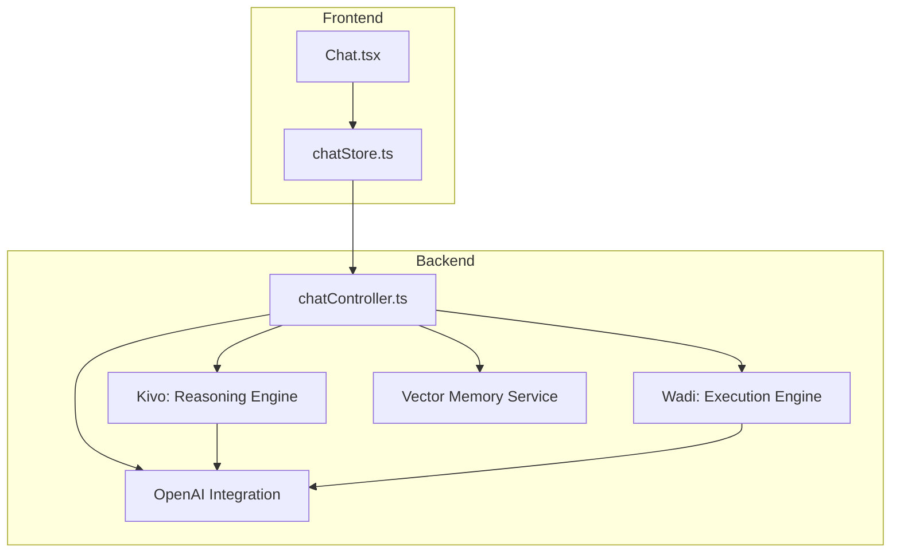
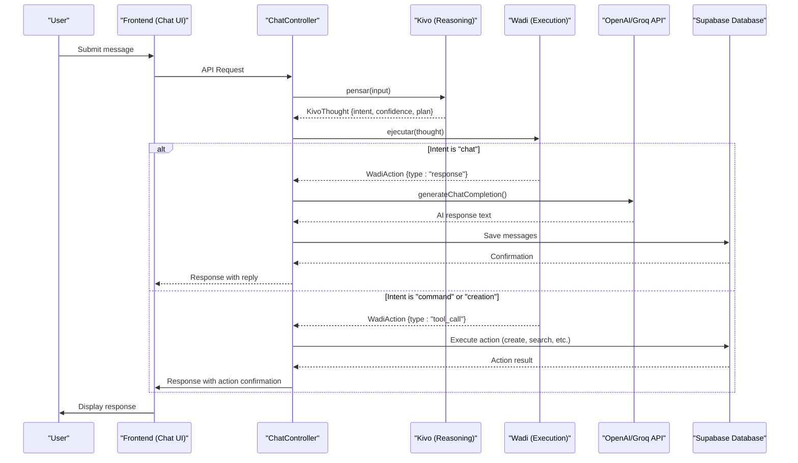
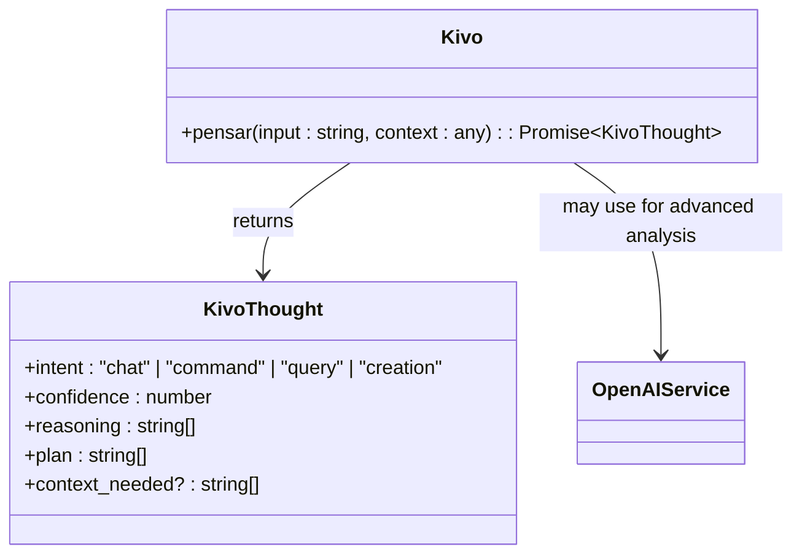
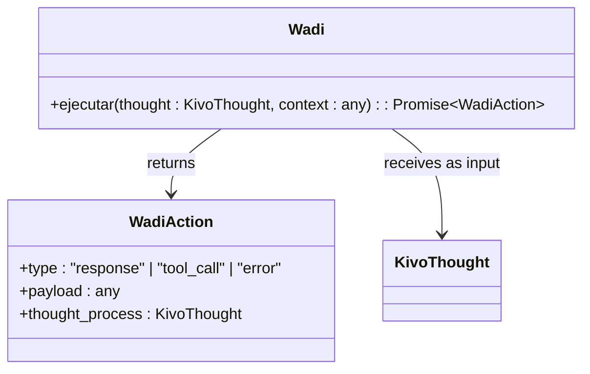
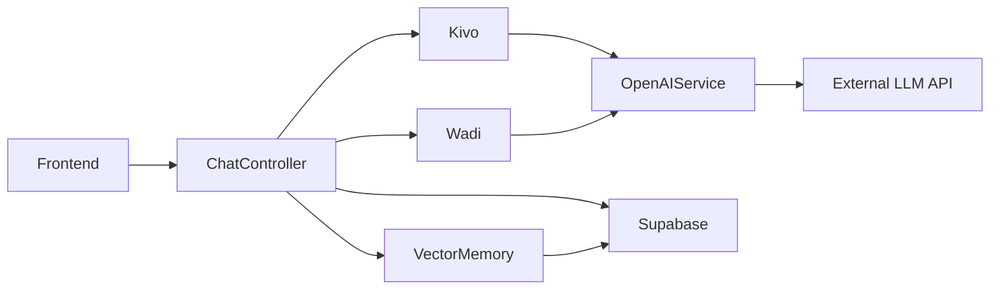

# Dual-Brain AI System

<cite>
**Referenced Files in This Document**   
- [kivo.ts](file://apps/api/src/services/brain/kivo.ts)
- [wadi.ts](file://apps/api/src/services/brain/wadi.ts)
- [types.ts](file://apps/api/src/services/brain/types.ts)
- [chatController.ts](file://apps/api/src/controllers/chatController.ts)
- [openai.ts](file://apps/api/src/services/openai.ts)
- [Chat.tsx](file://apps/frontend/src/pages/Chat.tsx)
- [chatStore.ts](file://apps/frontend/src/store/chatStore.ts)
- [chat.ts](file://apps/api/src/routes/chat.ts)
- [vector-memory.ts](file://apps/api/src/services/vector-memory.ts)
</cite>

## Table of Contents
1. [Introduction](#introduction)
2. [Project Structure](#project-structure)
3. [Core Components](#core-components)
4. [Architecture Overview](#architecture-overview)
5. [Detailed Component Analysis](#detailed-component-analysis)
6. [Dependency Analysis](#dependency-analysis)
7. [Performance Considerations](#performance-considerations)
8. [Troubleshooting Guide](#troubleshooting-guide)
9. [Conclusion](#conclusion)

## Introduction
The Dual-Brain AI System is a cognitive architecture inspired by human cognition, implementing a dual-processing model with two distinct components: Kivo for reasoning (System 2 thinking) and Wadi for execution (System 1 thinking). This architecture enables the system to analyze user input, determine intent, create action plans, and execute responses in a structured manner. The system is designed to handle both conversational interactions and command-based operations, with a clear separation between cognitive analysis and action execution. This documentation provides a comprehensive overview of the system's design, implementation, and integration patterns.

## Project Structure
The Dual-Brain AI System is organized within a monorepo structure with clear separation between frontend and backend components. The core brain logic resides in the API services directory, while shared components are available in the chat-core package. The system follows a modular architecture with distinct layers for controllers, services, and data access.



**Diagram sources**
- [Chat.tsx](file://apps/frontend/src/pages/Chat.tsx)
- [chatStore.ts](file://apps/frontend/src/store/chatStore.ts)
- [chatController.ts](file://apps/api/src/controllers/chatController.ts)
- [kivo.ts](file://apps/api/src/services/brain/kivo.ts)
- [wadi.ts](file://apps/api/src/services/brain/wadi.ts)
- [openai.ts](file://apps/api/src/services/openai.ts)
- [vector-memory.ts](file://apps/api/src/services/vector-memory.ts)

**Section sources**
- [Chat.tsx](file://apps/frontend/src/pages/Chat.tsx)
- [chatStore.ts](file://apps/frontend/src/store/chatStore.ts)
- [chatController.ts](file://apps/api/src/controllers/chatController.ts)

## Core Components
The Dual-Brain AI System consists of two primary components: Kivo (the reasoning engine) and Wadi (the execution engine). Kivo analyzes user input to determine intent, confidence, reasoning, and action plans, while Wadi takes these cognitive outputs and executes appropriate actions. These components work in tandem to process user requests, with Kivo handling the analytical aspects and Wadi managing the execution flow. The system also includes integration with the OpenAI API for generating natural language responses and a vector memory service for maintaining context across interactions.

**Section sources**
- [kivo.ts](file://apps/api/src/services/brain/kivo.ts)
- [wadi.ts](file://apps/api/src/services/brain/wadi.ts)
- [types.ts](file://apps/api/src/services/brain/types.ts)

## Architecture Overview
The Dual-Brain AI System implements a cognitive architecture that mimics human dual-process theory, with System 1 (fast, intuitive thinking) represented by Wadi and System 2 (slow, analytical thinking) represented by Kivo. When a user submits input, the request flows through the chat controller, which first invokes Kivo to analyze the input and determine intent. Based on Kivo's analysis, the controller then invokes Wadi to execute the appropriate action, whether that's generating a chat response or performing a specific task. The system maintains conversation state and context through Supabase database storage and enhances long-term memory capabilities through vector embeddings.



**Diagram sources**
- [chatController.ts](file://apps/api/src/controllers/chatController.ts)
- [kivo.ts](file://apps/api/src/services/brain/kivo.ts)
- [wadi.ts](file://apps/api/src/services/brain/wadi.ts)
- [openai.ts](file://apps/api/src/services/openai.ts)

## Detailed Component Analysis

### Kivo Reasoning Engine Analysis
The Kivo component serves as the System 2 thinking module, responsible for analyzing user input to determine intent, assess confidence, generate reasoning, and create action plans. It implements a heuristic-based approach to classify input into categories such as chat, command, query, or creation. For each classification, Kivo generates a structured thought process that includes the identified intent, confidence level, reasoning steps, and a plan for execution. This cognitive analysis enables the system to handle complex requests by breaking them down into actionable steps.



**Diagram sources**
- [kivo.ts](file://apps/api/src/services/brain/kivo.ts)
- [types.ts](file://apps/api/src/services/brain/types.ts)

### Wadi Execution Engine Analysis
The Wadi component functions as the System 1 thinking module, responsible for executing actions based on Kivo's cognitive analysis. It receives a KivoThought object and determines the appropriate action type (response, tool_call, or error). For chat intents, Wadi generates natural language responses, while for command or creation intents, it initiates tool calls to perform specific operations. The execution engine serves as the bridge between cognitive analysis and practical action, ensuring that the system's responses are aligned with the user's intent.



**Diagram sources**
- [wadi.ts](file://apps/api/src/services/brain/wadi.ts)
- [types.ts](file://apps/api/src/services/brain/types.ts)

### Chat Processing Flow Analysis
The chat processing flow begins with user input from the frontend, which is transmitted to the chat controller via API. The controller orchestrates the dual-brain processing by first invoking Kivo for cognitive analysis and then Wadi for action execution. Throughout this process, the system maintains conversation context by retrieving message history from the database and storing new interactions. For authenticated users, all messages are persisted in Supabase, while guest users maintain temporary sessions in local storage.

```mermaid
flowchart TD
A[User Input] --> B{Authenticated?}
B --> |Yes| C[Save to Supabase]
B --> |No| D[Use Local Storage]
C --> E[Retrieve Conversation History]
D --> E
E --> F[Invoke Kivo.pensar()]
F --> G[Analyze Intent & Plan]
G --> H{Intent Type?}
H --> |Chat| I[Generate Response via OpenAI]
H --> |Command| J[Execute Tool Call]
H --> |Creation| K[Initiate Creation Flow]
I --> L[Save Assistant Message]
J --> L
K --> L
L --> M[Return Response to Frontend]
M --> N[Update UI]
```

**Diagram sources**
- [chatController.ts](file://apps/api/src/controllers/chatController.ts)
- [chatStore.ts](file://apps/frontend/src/store/chatStore.ts)

**Section sources**
- [chatController.ts](file://apps/api/src/controllers/chatController.ts)
- [chatStore.ts](file://apps/frontend/src/store/chatStore.ts)

## Dependency Analysis
The Dual-Brain AI System has a well-defined dependency structure with clear separation of concerns. The frontend components depend on the chat controller API, which in turn depends on the Kivo and Wadi services. Both brain components may utilize the OpenAI service for advanced language processing, while the chat controller also depends on the vector memory service for context management. The system uses Supabase for persistent storage of conversations and user data, with the database schema designed to support efficient retrieval of conversation history and user preferences.



**Diagram sources**
- [chatController.ts](file://apps/api/src/controllers/chatController.ts)
- [kivo.ts](file://apps/api/src/services/brain/kivo.ts)
- [wadi.ts](file://apps/api/src/services/brain/wadi.ts)
- [vector-memory.ts](file://apps/api/src/services/vector-memory.ts)
- [openai.ts](file://apps/api/src/services/openai.ts)

## Performance Considerations
The Dual-Brain AI System is designed with performance and scalability in mind. The separation of cognitive analysis (Kivo) and action execution (Wadi) allows for independent optimization of each component. The system implements rate limiting for guest users to prevent abuse, and uses efficient database queries with proper indexing to ensure fast retrieval of conversation history. The vector memory service includes pruning mechanisms to prevent unbounded growth of stored memories. For production deployment, the system can be scaled horizontally by deploying multiple API instances behind a load balancer, with the database and LLM API serving as shared resources.

## Troubleshooting Guide
Common issues with the Dual-Brain AI System typically relate to API connectivity, authentication, or rate limiting. When the system fails to generate responses, the first step is to verify the LLM API connection and check the API key configuration. For users experiencing slow responses, the issue may be related to rate limiting, especially for guest users. Conversation history issues can often be resolved by checking database connectivity and verifying that the Supabase configuration is correct. The system includes comprehensive error handling with specific error codes for different failure modes, making it easier to diagnose and resolve issues.

**Section sources**
- [chatController.ts](file://apps/api/src/controllers/chatController.ts)
- [openai.ts](file://apps/api/src/services/openai.ts)
- [vector-memory.ts](file://apps/api/src/services/vector-memory.ts)

## Conclusion
The Dual-Brain AI System represents a sophisticated cognitive architecture that effectively separates reasoning from execution, enabling more intelligent and context-aware interactions. By implementing a dual-processing model inspired by human cognition, the system can handle both simple conversational requests and complex command-based operations with appropriate levels of analysis and response. The modular design allows for independent development and optimization of the Kivo and Wadi components, while the integration with external LLM APIs provides advanced language capabilities. This architecture provides a solid foundation for building increasingly intelligent AI assistants that can understand user intent and respond appropriately across a wide range of scenarios.