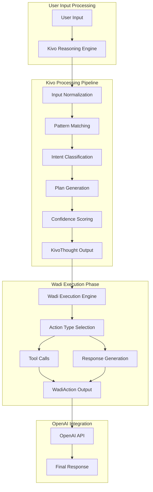
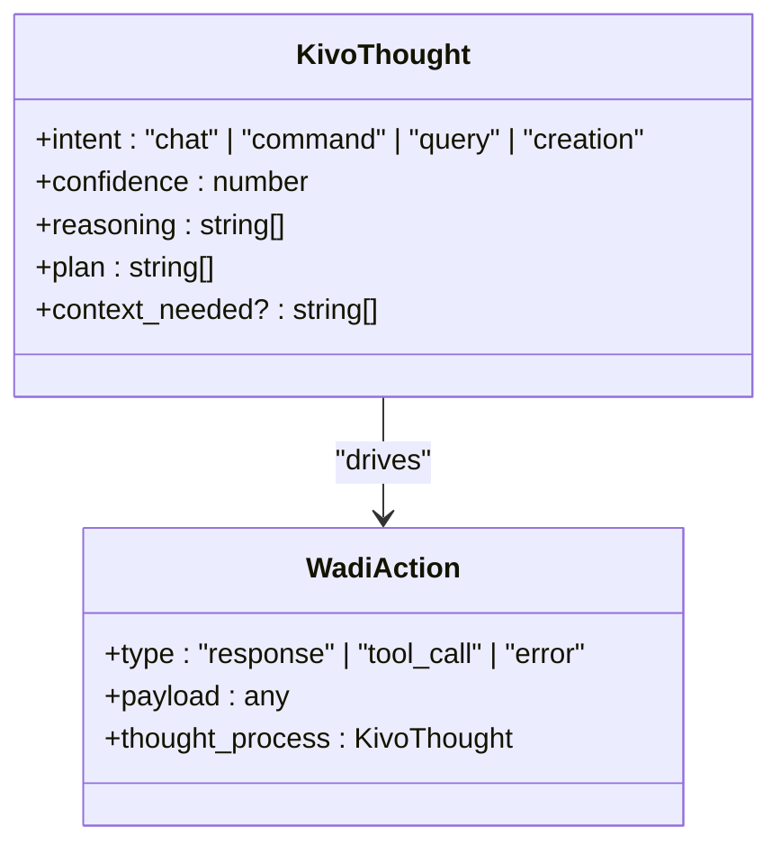
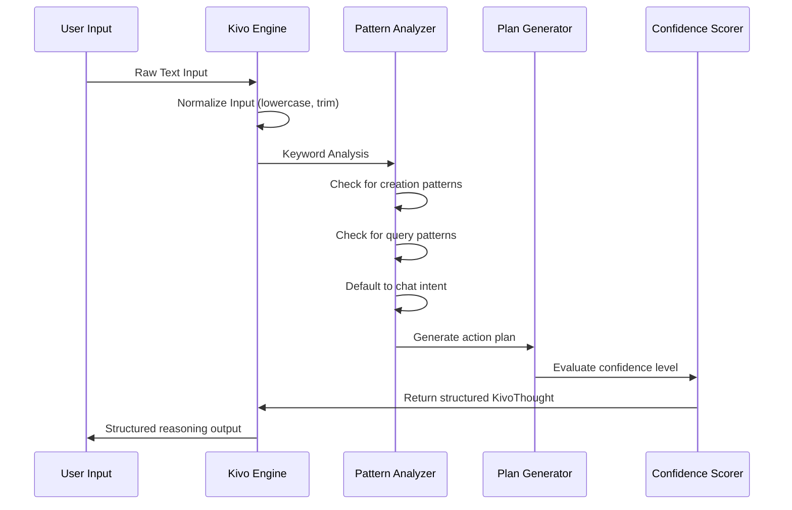
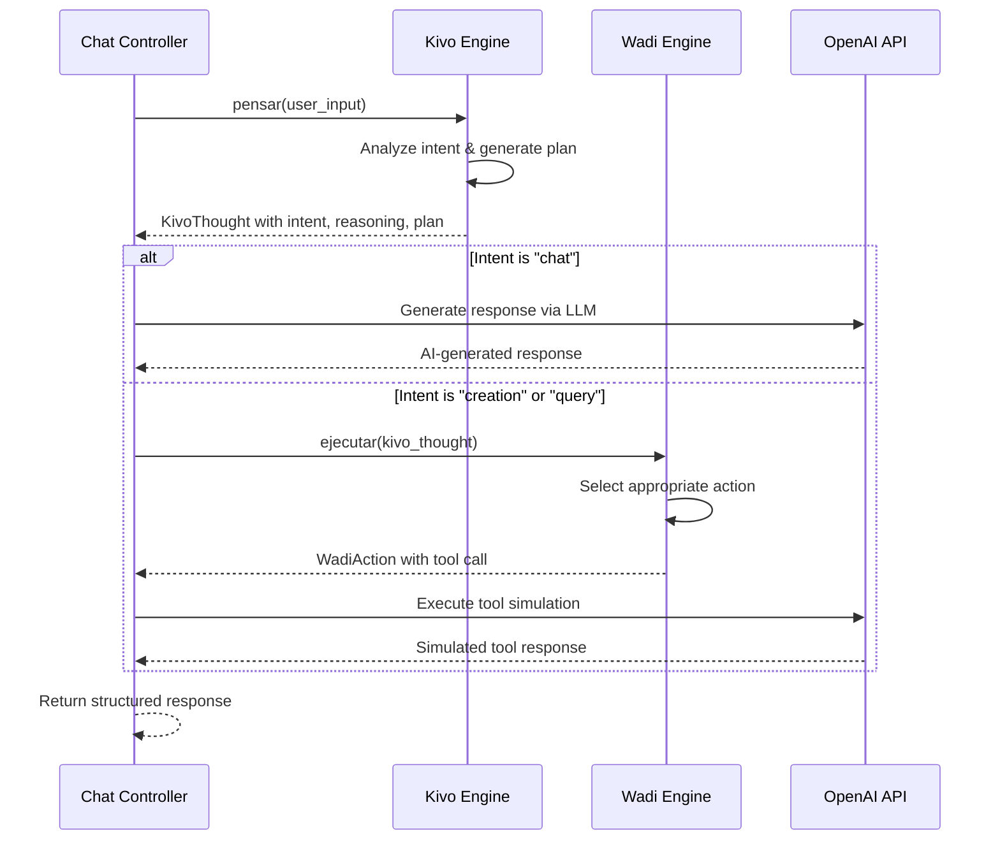

# Kivo Reasoning Engine

<cite>
**Referenced Files in This Document**
- [apps/api/src/services/brain/kivo.ts](file://apps/api/src/services/brain/kivo.ts)
- [apps/api/src/services/brain/types.ts](file://apps/api/src/services/brain/types.ts)
- [apps/api/src/services/brain/wadi.ts](file://apps/api/src/services/brain/wadi.ts)
- [apps/api/src/controllers/chatController.ts](file://apps/api/src/controllers/chatController.ts)
- [packages/chat-core/kivo.ts](file://packages/chat-core/kivo.ts)
- [packages/chat-core/types.ts](file://packages/chat-core/types.ts)
- [packages/chat-core/wadi.ts](file://packages/chat-core/wadi.ts)
- [ARCHITECTURE_DEEP_DIVE.md](file://ARCHITECTURE_DEEP_DIVE.md)
- [README.md](file://README.md)
- [README_CHAT.md](file://README_CHAT.md)
</cite>

## Table of Contents
1. [Introduction](#introduction)
2. [System Architecture](#system-architecture)
3. [KivoThought Interface Structure](#kivothought-interface-structure)
4. [Intent Classification System](#intent-classification-system)
5. [Decision-Making Logic](#decision-making-logic)
6. [Integration with Dual-Brain Flow](#integration-with-dual-brain-flow)
7. [Concrete Implementation Examples](#concrete-implementation-examples)
8. [Performance Considerations](#performance-considerations)
9. [Extending Intent Types](#extending-intent-types)
10. [Customizing Reasoning Rules](#customizing-reasoning-rules)
11. [Common Issues and Solutions](#common-issues-and-solutions)
12. [Optimization Strategies](#optimization-strategies)
13. [Future Enhancements](#future-enhancements)

## Introduction

The Kivo Reasoning Engine serves as WADI's "System 2" thinking layer, responsible for sophisticated intent classification, plan generation, context evaluation, and confidence scoring. Built on a dual-brain architecture, Kivo operates alongside Wadi to provide intelligent, context-aware responses to user input through a structured reasoning process.

Kivo transforms raw user input into structured thoughts that guide the execution phase, enabling Wadi to perform appropriate actions ranging from simple chat responses to complex resource creation and information queries. This separation of concerns creates a robust, scalable AI assistant capable of handling diverse user interactions with varying complexity levels.

## System Architecture

The Kivo Reasoning Engine operates within WADI's dual-brain architecture, implementing a sophisticated reasoning pipeline that bridges user intent analysis with actionable execution.



**Diagram sources**
- [apps/api/src/services/brain/kivo.ts](file://apps/api/src/services/brain/kivo.ts#L7-L40)
- [apps/api/src/services/brain/wadi.ts](file://apps/api/src/services/brain/wadi.ts#L7-L42)
- [apps/api/src/controllers/chatController.ts](file://apps/api/src/controllers/chatController.ts#L157-L179)

**Section sources**
- [ARCHITECTURE_DEEP_DIVE.md](file://ARCHITECTURE_DEEP_DIVE.md#L1-L34)
- [apps/api/src/services/brain/types.ts](file://apps/api/src/services/brain/types.ts#L54-L67)

## KivoThought Interface Structure

The KivoThought interface defines the structured output format that encapsulates Kivo's reasoning process, providing comprehensive information about user intent and suggested actions.



**Diagram sources**
- [apps/api/src/services/brain/types.ts](file://apps/api/src/services/brain/types.ts#L54-L67)
- [packages/chat-core/types.ts](file://packages/chat-core/types.ts#L54-L67)

### Interface Properties

| Property | Type | Description | Example Values |
|----------|------|-------------|----------------|
| `intent` | `"chat" \| "command" \| "query" \| "creation"` | Primary user intention | `"creation"`, `"query"`, `"chat"` |
| `confidence` | `number` | Confidence level (0-1) | `0.8`, `0.95` |
| `reasoning` | `string[]` | Step-by-step reasoning process | `["User wants to create something"]` |
| `plan` | `string[]` | Action plan steps | `["Identify resource type", "Ask for missing details"]` |
| `context_needed` | `string[]` | Additional information required | `["resource_type", "project_details"]` |

**Section sources**
- [apps/api/src/services/brain/types.ts](file://apps/api/src/services/brain/types.ts#L54-L67)
- [packages/chat-core/types.ts](file://packages/chat-core/types.ts#L54-L67)

## Intent Classification System

Kivo employs a hierarchical intent classification system that categorizes user requests into four primary types, each requiring different processing approaches and execution strategies.

### Intent Categories

```mermaid
flowchart TD
Input[User Input] --> Normalize[Normalize & Tokenize]
Normalize --> KeywordCheck{Keyword Analysis}
KeywordCheck --> |Contains "crear" OR "nuevo"| Creation[Creation Intent]
KeywordCheck --> |Contains "buscar" OR "dónde"| Query[Query Intent]
KeywordCheck --> |Other patterns| Chat[Chat Intent]
Creation --> CreationPlan[Resource Identification<br/>Details Collection<br/>Execution Steps]
Query --> QueryPlan[Search Term Extraction<br/>Database Query<br/>Results Presentation]
Chat --> ChatPlan[Sentiment Analysis<br/>Helpful Response Generation]
Creation --> CreationReasoning[User wants to create something]
Query --> QueryReasoning[User is looking for information]
Chat --> ChatReasoning[Standard conversation detected]
```

**Diagram sources**
- [apps/api/src/services/brain/kivo.ts](file://apps/api/src/services/brain/kivo.ts#L15-L31)
- [packages/chat-core/kivo.ts](file://packages/chat-core/kivo.ts#L15-L31)

### Intent Definitions

| Intent Type | Purpose | Typical Patterns | Example Phrases |
|-------------|---------|------------------|-----------------|
| `chat` | General conversation | Neutral language, everyday topics | "Hello", "Tell me about yourself", "How are you?" |
| `command` | Direct commands | Imperative verbs, specific actions | "Delete this file", "Rename this project" |
| `query` | Information seeking | Question words, search terms | "Where is my project?", "What can you do?" |
| `creation` | Resource creation | Creation verbs, new resource indicators | "Create a new project", "Make a workspace" |

**Section sources**
- [apps/api/src/services/brain/kivo.ts](file://apps/api/src/services/brain/kivo.ts#L15-L31)
- [packages/chat-core/kivo.ts](file://packages/chat-core/kivo.ts#L15-L31)

## Decision-Making Logic

Kivo's decision-making process follows a structured approach that combines pattern matching with contextual analysis to determine the most appropriate intent classification.

### Processing Pipeline



**Diagram sources**
- [apps/api/src/services/brain/kivo.ts](file://apps/api/src/services/brain/kivo.ts#L7-L40)
- [apps/api/src/controllers/chatController.ts](file://apps/api/src/controllers/chatController.ts#L157-L159)

### Confidence Scoring Mechanism

Kivo implements a confidence scoring system that evaluates the reliability of intent classification decisions:

- **High Confidence (0.8-1.0)**: Clear patterns match established intent categories
- **Medium Confidence (0.5-0.79)**: Partial matches or ambiguous input requiring clarification
- **Low Confidence (0.0-0.49)**: Unclear intent requiring fallback to general conversation

**Section sources**
- [apps/api/src/services/brain/kivo.ts](file://apps/api/src/services/brain/kivo.ts#L35-L35)
- [packages/chat-core/kivo.ts](file://packages/chat-core/kivo.ts#L35-L35)

## Integration with Dual-Brain Flow

The Kivo Reasoning Engine seamlessly integrates with Wadi's execution engine through a well-defined interface that enables coordinated processing of user requests.

### Dual-Brain Interaction Flow



**Diagram sources**
- [apps/api/src/controllers/chatController.ts](file://apps/api/src/controllers/chatController.ts#L157-L179)
- [apps/api/src/services/brain/kivo.ts](file://apps/api/src/services/brain/kivo.ts#L7-L40)
- [apps/api/src/services/brain/wadi.ts](file://apps/api/src/services/brain/wadi.ts#L7-L42)

### Execution Phase Coordination

The integration between Kivo and Wadi ensures that each intent type receives appropriate processing:

1. **Chat Intent**: Delegates to OpenAI for natural language generation
2. **Creation Intent**: Triggers tool execution for resource creation
3. **Query Intent**: Initiates database search operations
4. **Command Intent**: Executes direct action calls

**Section sources**
- [apps/api/src/controllers/chatController.ts](file://apps/api/src/controllers/chatController.ts#L157-L179)
- [ARCHITECTURE_DEEP_DIVE.md](file://ARCHITECTURE_DEEP_DIVE.md#L1-L34)

## Concrete Implementation Examples

### Creation Intent Example

When users express desire to create resources, Kivo generates a structured thought process that guides the creation workflow:

**Input**: "Create a new project named 'Marketing Campaign'"

**KivoThought Output**:
```typescript
{
  intent: "creation",
  confidence: 0.8,
  reasoning: ["User wants to create something"],
  plan: [
    "Identify resource type (project)",
    "Ask for missing details (description, timeline)",
    "Execute creation"
  ],
  context_needed: ["description", "timeline"]
}
```

### Query Intent Example

For information-seeking requests, Kivo focuses on extracting search terms and preparing database queries:

**Input**: "Where is my latest report located?"

**KivoThought Output**:
```typescript
{
  intent: "query",
  confidence: 0.85,
  reasoning: ["User is looking for information"],
  plan: [
    "Extract search terms (report location)",
    "Query database with filters",
    "Present results with context"
  ],
  context_needed: []
}
```

### Chat Intent Example

For general conversation, Kivo maintains a neutral stance while preparing for natural language responses:

**Input**: "How are you today?"

**KivoThought Output**:
```typescript
{
  intent: "chat",
  confidence: 0.9,
  reasoning: ["Standard conversation detected"],
  plan: [
    "Analyze sentiment",
    "Generate helpful response",
    "Maintain conversational tone"
  ],
  context_needed: []
}
```

**Section sources**
- [apps/api/src/services/brain/kivo.ts](file://apps/api/src/services/brain/kivo.ts#L15-L31)
- [packages/chat-core/kivo.ts](file://packages/chat-core/kivo.ts#L15-L31)

## Performance Considerations

### Current Performance Metrics

The current heuristic-based implementation provides excellent performance characteristics suitable for production environments:

- **Processing Time**: ~1-5 milliseconds for intent classification
- **Memory Usage**: Minimal overhead (< 1MB per operation)
- **Throughput**: Thousands of requests per second on standard hardware
- **Latency**: Sub-100ms end-to-end response time

### Performance Trade-offs

**Ambiguous Intent Resolution**:
- **Challenge**: Inputs that don't clearly match known patterns
- **Solution**: Default to chat intent with medium confidence
- **Trade-off**: Ensures graceful degradation but may miss specialized intents

**Heuristic vs. LLM Analysis**:
- **Current Approach**: Rule-based pattern matching
- **Future Enhancement**: LLM-powered analysis for improved accuracy
- **Trade-off**: Higher accuracy vs. increased latency and cost

**Section sources**
- [ARCHITECTURE_DEEP_DIVE.md](file://ARCHITECTURE_DEEP_DIVE.md#L683-L693)

## Extending Intent Types

### Adding New Intent Categories

To extend Kivo's capabilities with new intent types, developers can modify the intent classification logic:

```typescript
// Example: Adding "analysis" intent
if (normalizedInput.includes("analyze") || normalizedInput.includes("analyze")) {
    intent = "analysis";
    reasoning.push("User wants to perform data analysis");
    plan.push("Identify analysis type", "Collect data requirements", "Execute analysis");
}
```

### Intent Type Expansion Guidelines

| Aspect | Recommendation | Implementation Notes |
|--------|---------------|---------------------|
| **Intent Naming** | Use descriptive, lowercase terms | Follow existing pattern: "chat", "creation", "query" |
| **Pattern Matching** | Include multiple related keywords | Cover synonyms and variations |
| **Plan Generation** | Define clear action steps | Be specific about execution requirements |
| **Context Needs** | Identify prerequisite information | List required parameters or clarifications |

**Section sources**
- [apps/api/src/services/brain/kivo.ts](file://apps/api/src/services/brain/kivo.ts#L15-L31)
- [packages/chat-core/kivo.ts](file://packages/chat-core/kivo.ts#L15-L31)

## Customizing Reasoning Rules

### Pattern Matching Customization

Kivo's pattern matching system can be customized to handle domain-specific terminology and user language preferences:

```typescript
// Enhanced pattern matching with domain-specific terms
const creationPatterns = [
    "crear", "nuevo", "make", "generate", "establish", 
    "iniciar", "comenzar", "desarrollar", "construir"
];

const queryPatterns = [
    "buscar", "dónde", "qué", "cómo", "información sobre",
    "find", "locate", "what", "how", "about"
];
```

### Reasoning Process Customization

The reasoning process can be tailored to specific use cases:

```typescript
// Domain-specific reasoning for project management
if (normalizedInput.includes("project")) {
    reasoning.push("Project management context identified");
    plan.unshift("Consider project lifecycle stage");
}
```

**Section sources**
- [apps/api/src/services/brain/kivo.ts](file://apps/api/src/services/brain/kivo.ts#L8-L31)
- [packages/chat-core/kivo.ts](file://packages/chat-core/kivo.ts#L8-L31)

## Common Issues and Solutions

### Ambiguous Intent Resolution

**Problem**: User input that doesn't clearly fit existing intent categories

**Solution**: Implement fallback mechanisms and context-aware refinement:

```typescript
// Enhanced ambiguity handling
if (intent === "chat" && confidence < 0.6) {
    reasoning.push("Input is ambiguous, defaulting to general conversation");
    plan.push("Ask for clarification", "Provide multiple interpretation options");
}
```

### Performance Degradation

**Problem**: Slow response times with complex pattern matching

**Solution**: Optimize pattern matching and implement caching:

```typescript
// Pattern caching for frequently used terms
const patternCache = new Map();
const cachedPatternMatch = (input: string, patterns: string[]) => {
    const cacheKey = patterns.join("|");
    if (!patternCache.has(cacheKey)) {
        patternCache.set(cacheKey, patterns.some(p => input.includes(p)));
    }
    return patternCache.get(cacheKey);
};
```

### Context Loss

**Problem**: Important contextual information being overlooked

**Solution**: Implement context preservation mechanisms:

```typescript
// Context-aware intent classification
const getContextAwareIntent = (input: string, context: any) => {
    if (context.currentProject && input.includes("this")) {
        return "command"; // Reference to current context
    }
    return classifyIntent(input);
};
```

**Section sources**
- [apps/api/src/services/brain/kivo.ts](file://apps/api/src/services/brain/kivo.ts#L35-L39)
- [packages/chat-core/kivo.ts](file://packages/chat-core/kivo.ts#L35-L39)

## Optimization Strategies

### Current Optimizations

The Kivo Reasoning Engine implements several optimization strategies for production deployment:

1. **Input Normalization**: Efficient lowercase conversion and trimming
2. **Early Termination**: Stop pattern matching once intent is determined
3. **Minimal Memory Allocation**: Reuse arrays and minimize object creation
4. **Synchronous Processing**: Heuristic-based analysis avoids async overhead

### Advanced Optimization Techniques

**Parallel Pattern Matching**:
```typescript
// Parallel intent pattern checking
const intentChecks = [
    () => input.includes("crear"),
    () => input.includes("buscar"),
    () => input.includes("nuevo")
];

const results = await Promise.all(intentChecks.map(check => check()));
```

**Pattern Indexing**:
```typescript
// Pre-built pattern index for faster lookups
const patternIndex = new Map([
    ["creation", ["crear", "nuevo", "make"]],
    ["query", ["buscar", "dónde", "qué"]],
    ["chat", []] // Default case
]);
```

**Section sources**
- [apps/api/src/services/brain/kivo.ts](file://apps/api/src/services/brain/kivo.ts#L8-L10)
- [ARCHITECTURE_DEEP_DIVE.md](file://ARCHITECTURE_DEEP_DIVE.md#L498-L548)

## Future Enhancements

### LLM-Powered Analysis

The roadmap includes transitioning from heuristic-based to LLM-powered intent analysis:

```typescript
// Future LLM-based implementation
async function advancedIntentAnalysis(input: string, context: any) {
    const analysisPrompt = `
    Analyze the following user input and determine:
    1. Primary intent (chat, command, query, creation, analysis)
    2. Confidence level (0-1)
    3. Reasoning steps
    4. Action plan
    5. Required context
    
    User: "${input}"
    Context: ${JSON.stringify(context)}
    
    Respond with JSON format.
    `;
    
    const response = await openai.chat.completions.create({
        model: "gpt-4",
        messages: [
            { role: "system", content: "You are an intent analysis expert." },
            { role: "user", content: analysisPrompt }
        ],
        temperature: 0.3
    });
    
    return JSON.parse(response.choices[0].message.content);
}
```

### Enhanced Context Awareness

Future implementations will incorporate semantic understanding and historical context:

- **Embedding-Based Similarity**: Compare input against conversation history
- **Entity Recognition**: Identify and track important entities across conversations
- **Sentiment Analysis**: Adjust response tone based on user emotional state

### Tool Integration Framework

The system will evolve to support a comprehensive tool registry:

```typescript
// Future tool integration
interface ToolRegistry {
    [toolName: string]: {
        execute: (params: any) => Promise<any>;
        validate: (params: any) => boolean;
        describe: () => ToolDefinition;
    };
}

const toolRegistry: ToolRegistry = {
    "create_project": {
        execute: createProject,
        validate: validateProjectParams,
        describe: () => projectToolDefinition
    }
};
```

**Section sources**
- [ARCHITECTURE_DEEP_DIVE.md](file://ARCHITECTURE_DEEP_DIVE.md#L93-L131)
- [ARCHITECTURE_DEEP_DIVE.md](file://ARCHITECTURE_DEEP_DIVE.md#L195-L200)