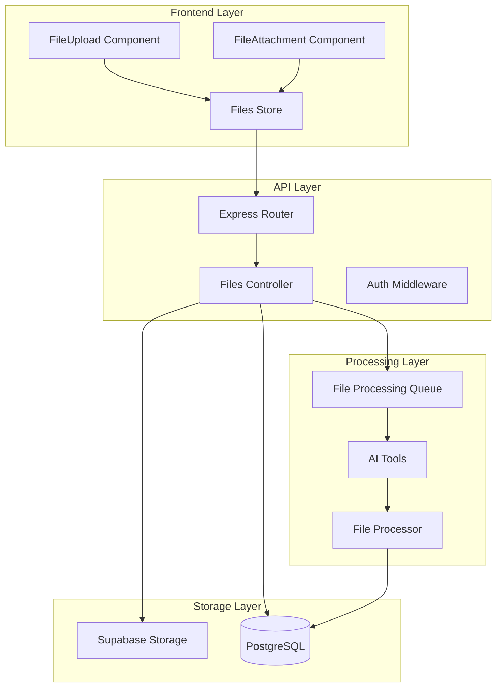
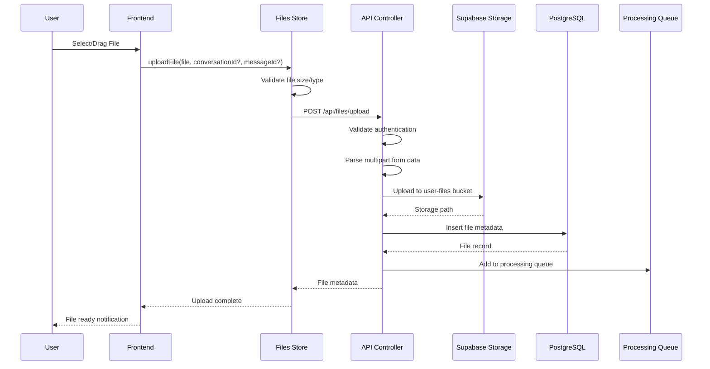
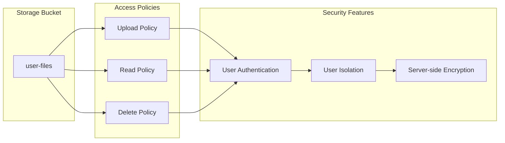
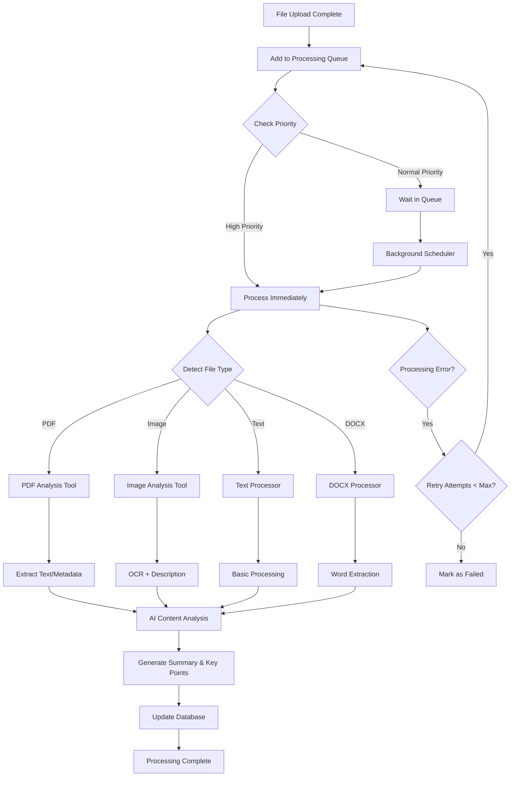
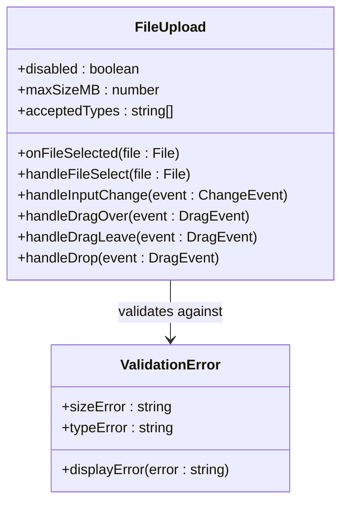
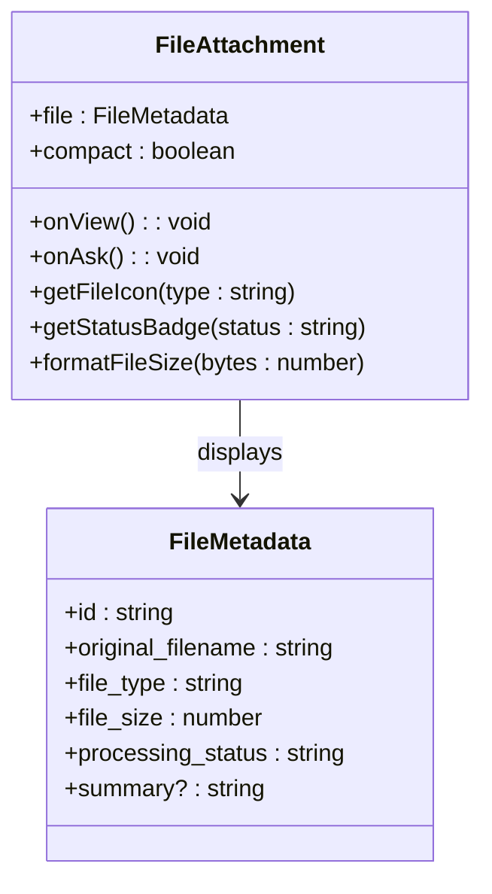
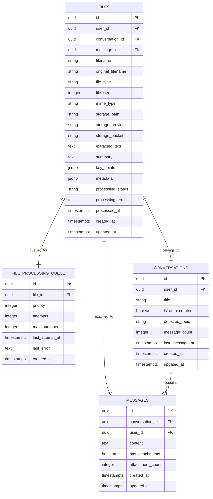
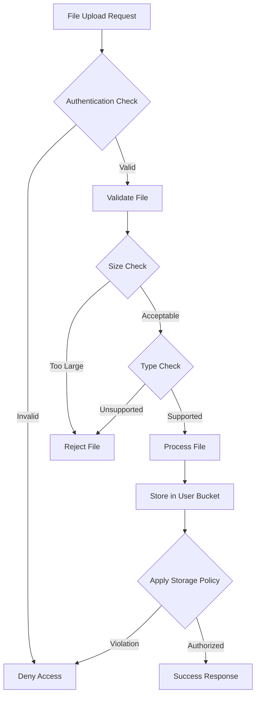
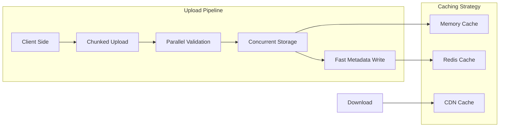

# File Handling System

<cite>
**Referenced Files in This Document**
- [filesController.ts](file://apps/api/src/controllers/filesController.ts)
- [files.ts](file://apps/api/src/routes/files.ts)
- [FileUpload.tsx](file://apps/frontend/src/components/FileUpload.tsx)
- [FileAttachment.tsx](file://apps/frontend/src/components/FileAttachment.tsx)
- [filesStore.ts](file://apps/frontend/src/store/filesStore.ts)
- [supabase.ts](file://apps/api/src/config/supabase.ts)
- [002_files_and_storage.sql](file://apps/api/migrations/002_files_and_storage.sql)
- [api.ts](file://apps/frontend/src/config/api.ts)
- [index.ts](file://apps/api/src/services/ai-tools/index.ts)
- [pdf-tool.ts](file://apps/api/src/services/ai-tools/pdf-tool.ts)
- [image-tool.ts](file://apps/api/src/services/ai-tools/image-tool.ts)
- [zip-tool.ts](file://apps/api/src/services/ai-tools/zip-tool.ts)
</cite>

## Table of Contents
1. [Introduction](#introduction)
2. [System Architecture](#system-architecture)
3. [File Upload Process](#file-upload-process)
4. [Storage Management](#storage-management)
5. [File Processing Workflows](#file-processing-workflows)
6. [Frontend Components](#frontend-components)
7. [Database Schema](#database-schema)
8. [Security Considerations](#security-considerations)
9. [Performance Optimization](#performance-optimization)
10. [Configuration Options](#configuration-options)
11. [Troubleshooting Guide](#troubleshooting-guide)
12. [Best Practices](#best-practices)

## Introduction

WADI's File Handling System provides comprehensive file management capabilities for users to upload, store, process, and manage various file types within the application. Built on a dual-brain architecture with Supabase Storage integration, the system supports PDFs, images, text documents, and other common file formats while maintaining security, performance, and scalability.

The system consists of three main components:
- **Frontend File Upload Interface**: React components for file selection and drag-and-drop
- **Backend File Processing**: Express controllers handling upload, storage, and metadata management
- **Storage Infrastructure**: Supabase Storage with automatic file processing and AI-powered content extraction

## System Architecture

The File Handling System follows a layered architecture with clear separation of concerns:



**Diagram sources**
- [files.ts](file://apps/api/src/routes/files.ts#L1-L28)
- [filesController.ts](file://apps/api/src/controllers/filesController.ts#L1-L314)
- [filesStore.ts](file://apps/frontend/src/store/filesStore.ts#L1-L188)

**Section sources**
- [filesController.ts](file://apps/api/src/controllers/filesController.ts#L1-L314)
- [files.ts](file://apps/api/src/routes/files.ts#L1-L28)

## File Upload Process

The file upload process involves multiple stages from frontend selection to backend storage and database record creation:



**Diagram sources**
- [filesStore.ts](file://apps/frontend/src/store/filesStore.ts#L51-L87)
- [filesController.ts](file://apps/api/src/controllers/filesController.ts#L11-L116)

### Upload Validation

The system performs comprehensive validation during the upload process:

| Validation Type | Implementation | Limits |
|----------------|---------------|---------|
| **File Size** | Client-side and server-side | Configurable maximum (default: 100MB) |
| **File Type** | MIME type checking | Whitelist of supported extensions |
| **Content Type** | Header validation | Must be multipart/form-data |
| **Authentication** | User ID verification | Requires authenticated session |

### Storage Path Generation

Files are organized using a hierarchical structure:
- **Base Path**: `{userId}/{filename}.{extension}`
- **Example**: `user123/abc123-def456-ghi789.pdf`
- **Benefits**: Prevents filename conflicts, enables user isolation

**Section sources**
- [filesController.ts](file://apps/api/src/controllers/filesController.ts#L11-L116)
- [FileUpload.tsx](file://apps/frontend/src/components/FileUpload.tsx#L22-L40)

## Storage Management

WADI uses Supabase Storage as the primary file storage solution, providing secure, scalable, and reliable file management:

### Supabase Storage Configuration



**Diagram sources**
- [supabase.ts](file://apps/api/src/config/supabase.ts#L1-L29)
- [002_files_and_storage.sql](file://apps/api/migrations/002_files_and_storage.sql#L153-L179)

### Storage Features

| Feature | Description | Implementation |
|---------|-------------|----------------|
| **User Isolation** | Files stored in user-specific folders | `{userId}/{filename}` structure |
| **Access Control** | Role-based permissions | Supabase storage policies |
| **Encryption** | Server-side encryption | Supabase managed |
| **Backup** | Automatic backup and replication | Supabase infrastructure |
| **CDN** | Global content delivery | Supabase CDN integration |

### File Metadata Management

Each uploaded file creates a comprehensive metadata record:

| Field | Type | Purpose |
|-------|------|---------|
| `id` | UUID | Unique identifier |
| `user_id` | UUID | Owner reference |
| `filename` | String | Sanitized storage filename |
| `original_filename` | String | Original user filename |
| `file_type` | Enum | Detected file type (pdf, image, text, docx, other) |
| `file_size` | Integer | File size in bytes |
| `mime_type` | String | MIME type for browser handling |
| `storage_path` | String | Supabase storage path |
| `storage_bucket` | String | Storage bucket name |
| `processing_status` | Enum | File processing state |

**Section sources**
- [filesController.ts](file://apps/api/src/controllers/filesController.ts#L78-L96)
- [002_files_and_storage.sql](file://apps/api/migrations/002_files_and_storage.sql#L8-L40)

## File Processing Workflows

WADI implements sophisticated file processing workflows using AI tools to extract content and generate summaries:



**Diagram sources**
- [filesController.ts](file://apps/api/src/controllers/filesController.ts#L106-L110)
- [index.ts](file://apps/api/src/services/ai-tools/index.ts#L1-L23)

### Supported File Types

The system supports multiple file types with specialized processing:

| File Type | Processing Tool | Capabilities |
|-----------|----------------|--------------|
| **PDF** | PDF Analysis Tool | Text extraction, metadata, statistics |
| **Images** | Image Analysis Tool | OCR, object detection, descriptions |
| **Text Files** | Text Processor | Content analysis, summarization |
| **DOCX** | DOCX Processor | Structured content extraction |
| **ZIP Archives** | ZIP Tool | Archive generation and management |

### AI-Powered Content Analysis

The system leverages AI tools for intelligent content processing:

#### PDF Analysis Tool
- **Text Extraction**: Converts PDF to searchable text
- **Metadata Extraction**: Author, title, creation date, page count
- **Statistics Generation**: Word count, character count, page analysis
- **Structure Detection**: Headers, paragraphs, lists

#### Image Analysis Tool
- **Visual Description**: GPT-4 Vision-powered descriptions
- **OCR Processing**: Text extraction from images
- **Object Recognition**: Identifies and labels objects
- **Content Analysis**: Comprehensive visual analysis

#### ZIP Generation Tool
- **Archive Creation**: Combines multiple files into ZIP
- **Compression**: Configurable compression levels (0-9)
- **Download URLs**: Temporary download links with expiration
- **Size Tracking**: File size calculations and ratios

**Section sources**
- [pdf-tool.ts](file://apps/api/src/services/ai-tools/pdf-tool.ts#L1-L43)
- [image-tool.ts](file://apps/api/src/services/ai-tools/image-tool.ts#L1-L100)
- [zip-tool.ts](file://apps/api/src/services/ai-tools/zip-tool.ts#L1-L44)

## Frontend Components

The frontend provides intuitive file management components for seamless user experience:

### FileUpload Component

The FileUpload component handles file selection with comprehensive validation:



**Diagram sources**
- [FileUpload.tsx](file://apps/frontend/src/components/FileUpload.tsx#L5-L158)

#### Key Features
- **Drag-and-Drop Support**: Intuitive file selection interface
- **Real-time Validation**: Immediate feedback on file size and type
- **Progress Tracking**: Visual indication during upload
- **Error Handling**: Clear error messages for invalid files
- **Accessibility**: Screen reader support and keyboard navigation

### FileAttachment Component

The FileAttachment component displays file information and provides action controls:



**Diagram sources**
- [FileAttachment.tsx](file://apps/frontend/src/components/FileAttachment.tsx#L4-L234)

#### Status Indicators
- **Pending**: File queued for processing
- **Processing**: Active content extraction
- **Completed**: Ready for AI interaction
- **Failed**: Processing encountered errors

#### Action Buttons
- **View File**: Download or preview the file
- **Ask WADI**: Send file content to AI for analysis
- **Remove**: Delete file from storage

**Section sources**
- [FileUpload.tsx](file://apps/frontend/src/components/FileUpload.tsx#L1-L158)
- [FileAttachment.tsx](file://apps/frontend/src/components/FileAttachment.tsx#L1-L234)

## Database Schema

The file management system uses a comprehensive database schema optimized for performance and scalability:



**Diagram sources**
- [002_files_and_storage.sql](file://apps/api/migrations/002_files_and_storage.sql#L8-L40)
- [002_files_and_storage.sql](file://apps/api/migrations/002_files_and_storage.sql#L60-L78)

### Database Features

| Feature | Implementation | Benefits |
|---------|---------------|----------|
| **Indexing** | Multi-column indexes on frequently queried fields | Fast search and filtering |
| **Full-text Search** | GIN index on extracted text content | Efficient content-based queries |
| **Cascade Deletion** | Automatic cleanup of related records | Data consistency maintenance |
| **JSONB Fields** | Flexible metadata storage | Scalable schema evolution |
| **Timestamp Tracking** | Automatic creation/update timestamps | Audit trail and performance monitoring |

### Query Optimization

The database schema includes optimized queries for common operations:

#### Conversation File Context
```sql
SELECT get_conversation_file_context(p_conversation_id UUID)
```
Returns formatted file context for AI conversation, limited to 5 most recent files.

#### Attachment Count Updates
Automatic trigger updates message attachment counts when files are added or removed.

**Section sources**
- [002_files_and_storage.sql](file://apps/api/migrations/002_files_and_storage.sql#L1-L180)

## Security Considerations

WADI implements multiple layers of security to protect file uploads and storage:

### Access Control



**Diagram sources**
- [filesController.ts](file://apps/api/src/controllers/filesController.ts#L13-L18)
- [002_files_and_storage.sql](file://apps/api/migrations/002_files_and_storage.sql#L153-L179)

### Security Measures

| Security Layer | Implementation | Protection |
|----------------|---------------|------------|
| **Authentication** | JWT tokens via Supabase Auth | User identity verification |
| **Authorization** | User-isolated storage buckets | Prevent cross-user access |
| **File Validation** | MIME type and size checking | Malicious file prevention |
| **Content Scanning** | AI-powered content analysis | Detect inappropriate content |
| **Rate Limiting** | Request throttling | DDoS protection |
| **HTTPS Only** | SSL/TLS encryption | Data in transit protection |

### File Validation Rules

The system enforces strict validation rules:

#### Size Limits
- **Maximum File Size**: 100MB (configurable)
- **Batch Upload Limit**: 10 files per request
- **Total Quota**: User-specific storage limits

#### Type Restrictions
- **Allowed Extensions**: `.pdf`, `.jpg`, `.jpeg`, `.png`, `.gif`, `.txt`, `.docx`
- **MIME Type Verification**: Server-side validation
- **Magic Number Checking**: Binary signature validation

#### Content Filtering
- **Malware Detection**: AI-powered content analysis
- **Inappropriate Content**: Automated flagging
- **Copyright Violations**: Pattern matching

**Section sources**
- [filesController.ts](file://apps/api/src/controllers/filesController.ts#L25-L40)
- [FileUpload.tsx](file://apps/frontend/src/components/FileUpload.tsx#L25-L37)

## Performance Optimization

WADI implements several performance optimization strategies for efficient file handling:

### Upload Optimization



### Performance Features

| Optimization | Implementation | Impact |
|-------------|---------------|--------|
| **Streaming Uploads** | Chunked file transfer | Reduced memory usage |
| **Parallel Processing** | Concurrent file operations | Faster throughput |
| **Compression** | Automatic compression for text files | Reduced storage costs |
| **CDN Integration** | Global content delivery | Faster downloads |
| **Lazy Loading** | Progressive file loading | Improved UI responsiveness |
| **Background Processing** | Asynchronous file analysis | Non-blocking uploads |

### Caching Strategy

The system implements multi-level caching:

#### Memory Cache
- **Recent Files**: Frequently accessed files cached in memory
- **Processing Status**: Real-time status updates cached
- **Temporary Files**: Upload progress tracking

#### Database Cache
- **Query Results**: Frequently executed queries cached
- **File Metadata**: Static file information cached
- **User Preferences**: Personalized settings cached

#### CDN Cache
- **Static Assets**: Images and processed files cached globally
- **Download Links**: Temporary URLs cached for faster access
- **Generated Content**: AI summaries and processed content cached

### Scalability Considerations

| Aspect | Strategy | Implementation |
|--------|----------|----------------|
| **Horizontal Scaling** | Stateless API design | Load balancer distribution |
| **Vertical Scaling** | Optimized database queries | Index optimization |
| **Storage Scaling** | Supabase auto-scaling | Cloud-native storage |
| **Processing Scaling** | Background worker queues | Distributed processing |

**Section sources**
- [filesStore.ts](file://apps/frontend/src/store/filesStore.ts#L51-L87)
- [filesController.ts](file://apps/api/src/controllers/filesController.ts#L112-L116)

## Configuration Options

WADI provides extensive configuration options for file handling customization:

### Environment Variables

| Variable | Default | Description |
|----------|---------|-------------|
| `SUPABASE_URL` | Required | Supabase project URL |
| `SUPABASE_ANON_KEY` | Required | Supabase anonymous key |
| `FILE_UPLOAD_MAX_SIZE` | 104857600 | Maximum file size (bytes) |
| `FILE_UPLOAD_ACCEPTED_TYPES` | `.pdf,.jpg,.jpeg,.png,.gif,.txt,.docx` | Allowed file extensions |
| `FILE_PROCESSING_PRIORITY` | 5 | Default processing priority |
| `FILE_PROCESSING_MAX_ATTEMPTS` | 3 | Maximum retry attempts |

### Frontend Configuration

```typescript
interface FileUploadConfig {
  maxSizeMB?: number;
  acceptedTypes?: string[];
  showPreview?: boolean;
  compactMode?: boolean;
}
```

### Backend Configuration

```typescript
interface FileProcessingConfig {
  maxFileSize: number;
  supportedTypes: string[];
  processingPriority: number;
  retryAttempts: number;
  queueTimeout: number;
}
```

### Storage Configuration

| Setting | Default | Description |
|---------|---------|-------------|
| **Bucket Name** | `user-files` | Primary storage bucket |
| **Public Access** | `false` | Private file access |
| **Versioning** | `enabled` | File version control |
| **Lifecycle** | `30 days` | Automatic cleanup policy |
| **Replication** | `global` | Multi-region redundancy |

**Section sources**
- [supabase.ts](file://apps/api/src/config/supabase.ts#L1-L29)
- [FileUpload.tsx](file://apps/frontend/src/components/FileUpload.tsx#L12-L17)

## Troubleshooting Guide

Common issues and their solutions for the File Handling System:

### Upload Issues

| Problem | Symptoms | Solution |
|---------|----------|----------|
| **Formidable Not Installed** | 501 error on upload | Install `formidable` package |
| **File Too Large** | Size validation error | Reduce file size or increase limit |
| **Unsupported Type** | Type validation error | Use supported file format |
| **Network Timeout** | Upload fails silently | Check internet connection |

### Storage Issues

| Problem | Symptoms | Solution |
|---------|----------|----------|
| **Storage Quota Exceeded** | Upload rejected | Free up storage space |
| **Permission Denied** | Access denied error | Verify user authentication |
| **Corrupted File** | Processing fails | Re-upload corrupted file |
| **Missing File** | 404 error on download | Check file processing status |

### Processing Issues

| Problem | Symptoms | Solution |
|---------|----------|----------|
| **Processing Stuck** | Status remains "pending" | Check processing queue |
| **AI Analysis Failed** | Content extraction fails | Try different file format |
| **Timeout Error** | Long processing time | Increase timeout settings |
| **Memory Issues** | Out of memory errors | Reduce concurrent processing |

### Debug Information

Enable debug logging for detailed troubleshooting:

```typescript
// Enable debug mode
process.env.DEBUG = 'wadi:files';

// Check file processing logs
console.log('[File Processing]', fileMetadata);

// Monitor queue status
console.log('[Processing Queue]', queueStats);
```

**Section sources**
- [filesController.ts](file://apps/api/src/controllers/filesController.ts#L34-L38)
- [filesStore.ts](file://apps/frontend/src/store/filesStore.ts#L89-L104)

## Best Practices

### For Developers

1. **File Validation**
   - Always validate file size and type on both client and server
   - Implement comprehensive error handling
   - Use streaming for large file uploads

2. **Security**
   - Never trust client-side validation
   - Implement proper access control
   - Scan files for malware and inappropriate content

3. **Performance**
   - Use chunked uploads for large files
   - Implement progressive loading
   - Cache frequently accessed files

4. **Monitoring**
   - Track upload/download metrics
   - Monitor processing queue status
   - Alert on processing failures

### For Users

1. **File Selection**
   - Use supported file formats for best compatibility
   - Keep files under the recommended size limit
   - Avoid sensitive or confidential files

2. **File Management**
   - Regularly clean up unused files
   - Use appropriate file naming conventions
   - Monitor processing status for large files

3. **Security**
   - Never upload malicious or copyrighted material
   - Use strong passwords for account access
   - Report suspicious activity immediately

### For Administrators

1. **System Maintenance**
   - Monitor storage quotas and cleanup old files
   - Regular database maintenance and optimization
   - Update security policies and access controls

2. **Performance Monitoring**
   - Track upload/download speeds
   - Monitor processing queue backlog
   - Optimize database indexes and queries

3. **Capacity Planning**
   - Estimate storage requirements based on usage patterns
   - Plan for seasonal spikes in file uploads
   - Implement auto-scaling for peak loads