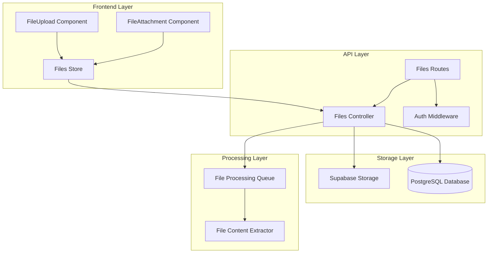
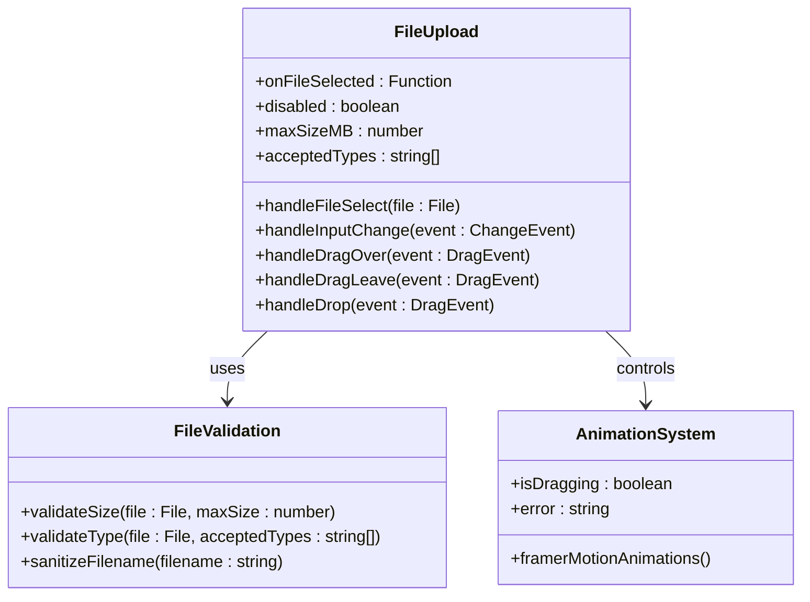
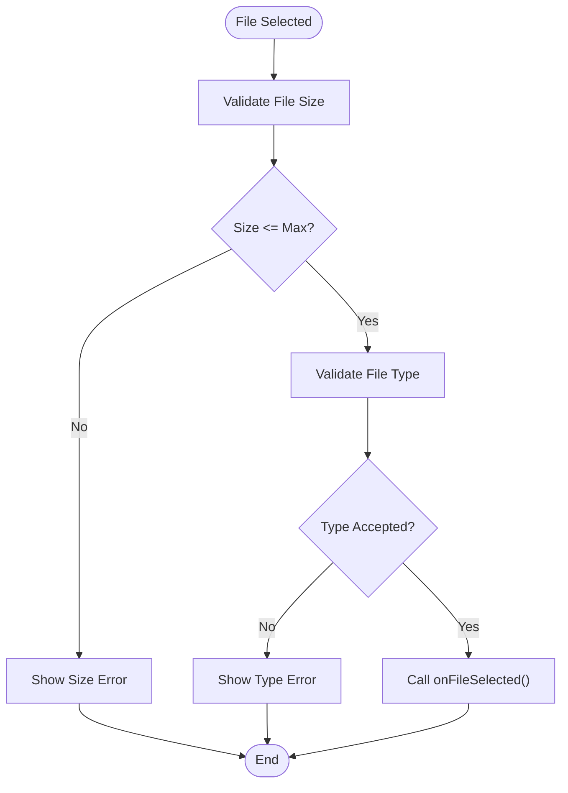
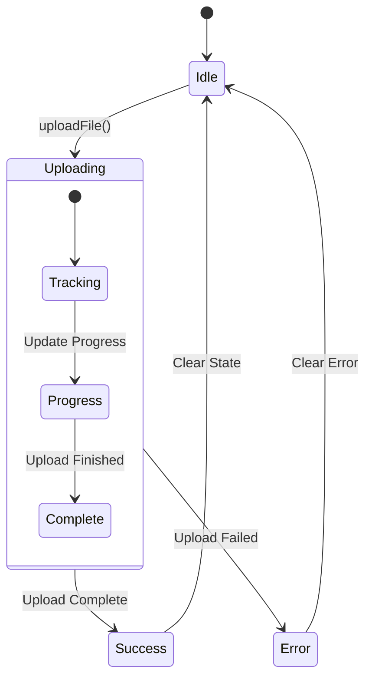
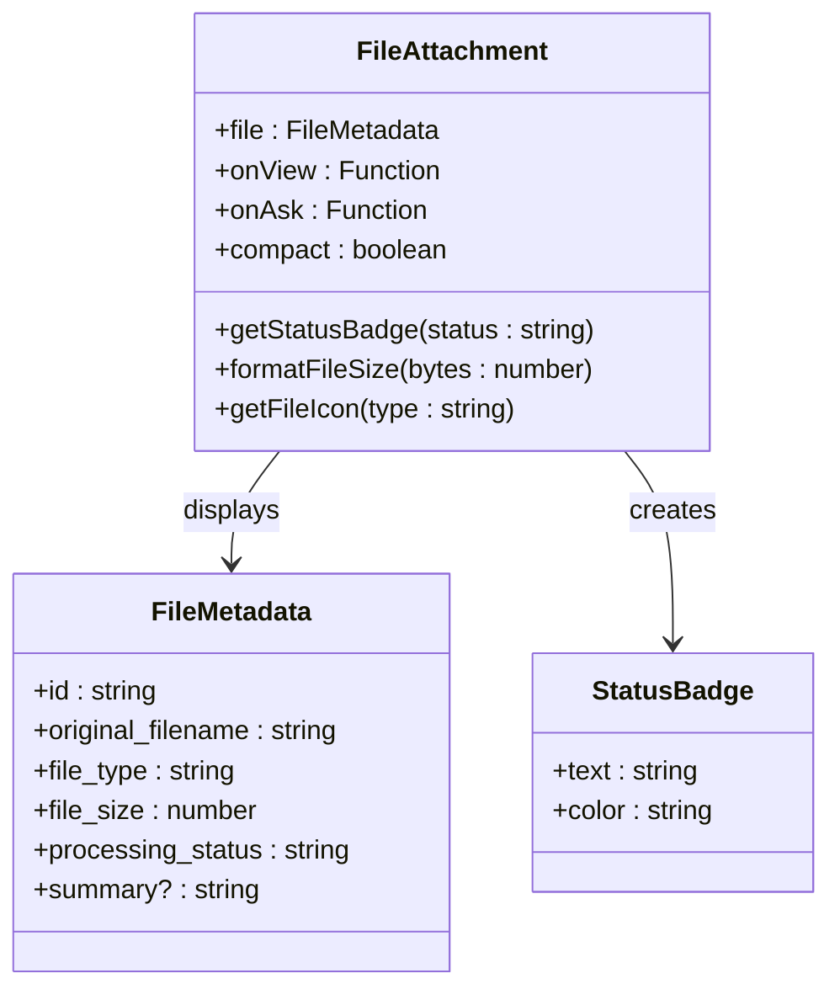
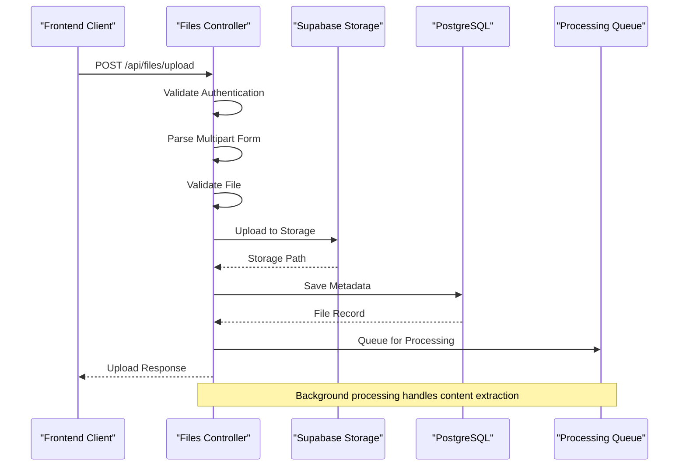
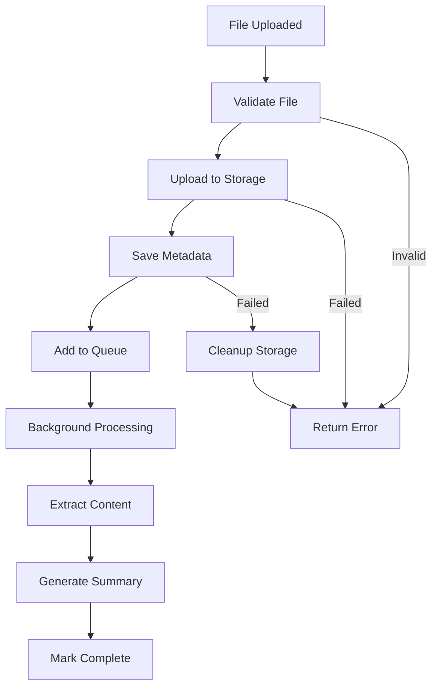
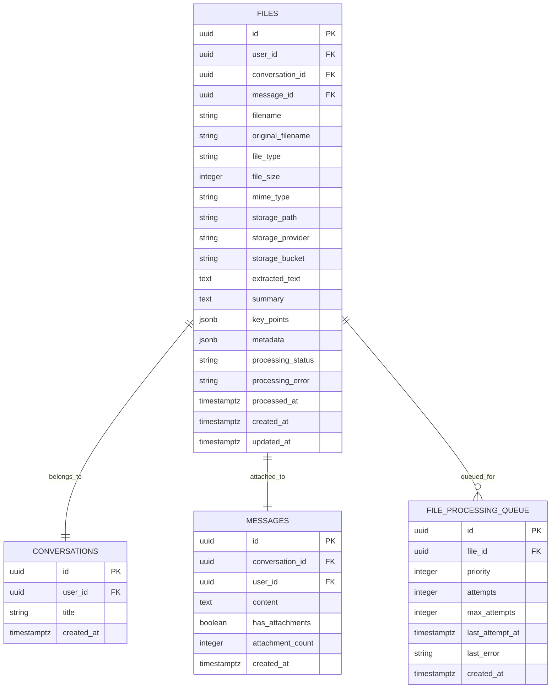
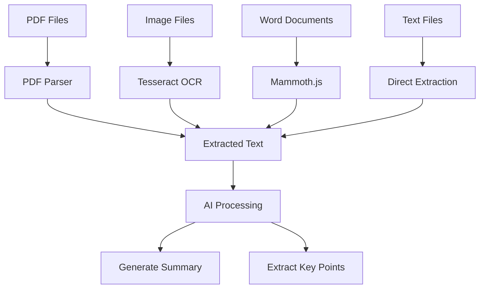
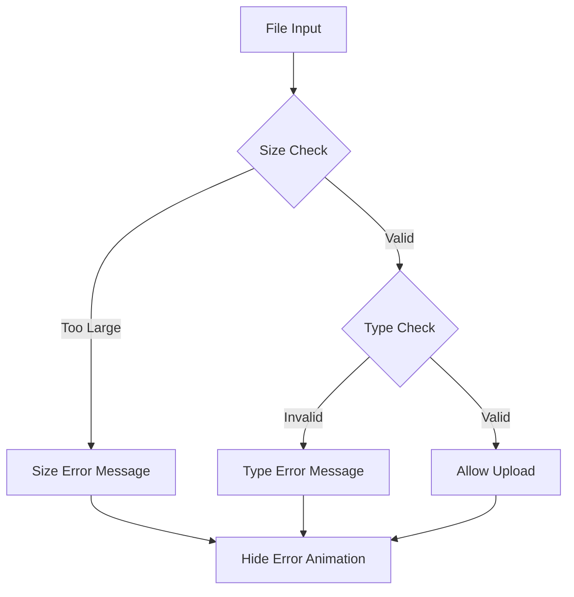

# Upload Process

<cite>
**Referenced Files in This Document**
- [FileUpload.tsx](file://apps/frontend/src/components/FileUpload.tsx)
- [filesController.ts](file://apps/api/src/controllers/filesController.ts)
- [files.ts](file://apps/api/src/routes/files.ts)
- [filesStore.ts](file://apps/frontend/src/store/filesStore.ts)
- [api.ts](file://apps/frontend/src/config/api.ts)
- [FileAttachment.tsx](file://apps/frontend/src/components/FileAttachment.tsx)
- [validation.ts](file://apps/frontend/src/utils/validation.ts)
- [002_files_and_storage.sql](file://apps/api/migrations/002_files_and_storage.sql)
- [package.json](file://apps/api/package.json)
</cite>

## Table of Contents

1. [Introduction](#introduction)
2. [System Architecture](#system-architecture)
3. [Frontend Implementation](#frontend-implementation)
4. [Backend Implementation](#backend-implementation)
5. [Database Schema](#database-schema)
6. [File Processing Workflow](#file-processing-workflow)
7. [Error Handling and Validation](#error-handling-and-validation)
8. [Performance Considerations](#performance-considerations)
9. [Security Aspects](#security-aspects)
10. [Troubleshooting Guide](#troubleshooting-guide)
11. [Best Practices](#best-practices)

## Introduction

The WADI file upload process provides a comprehensive solution for handling file attachments in the application. It supports both drag-and-drop and click-to-upload functionality with robust validation, error handling, and integration with Supabase Storage. The system is designed to handle various file types including PDFs, images, text documents, and office files, with automatic processing capabilities for content extraction and summarization.

The upload process consists of two main components: a React-based frontend component that handles user interaction and visual feedback, and a Node.js backend that manages file processing, storage, and metadata management. Both components work together to provide a seamless user experience with real-time progress tracking and comprehensive error reporting.

## System Architecture

The file upload system follows a layered architecture with clear separation of concerns between frontend and backend components:



**Diagram sources**

- [FileUpload.tsx](file://apps/frontend/src/components/FileUpload.tsx#L1-L158)
- [filesController.ts](file://apps/api/src/controllers/filesController.ts#L1-L314)
- [files.ts](file://apps/api/src/routes/files.ts#L1-L28)

The architecture ensures scalability and maintainability through clear boundaries between presentation, business logic, and data persistence layers.

## Frontend Implementation

### FileUpload Component

The FileUpload component serves as the primary user interface for file selection and upload initiation. It provides both drag-and-drop and traditional file input functionality with comprehensive validation and visual feedback.



**Diagram sources**

- [FileUpload.tsx](file://apps/frontend/src/components/FileUpload.tsx#L5-L17)

#### Component Props and Configuration

The FileUpload component accepts several configuration options:

| Prop             | Type                   | Default                                                      | Description                                      |
| ---------------- | ---------------------- | ------------------------------------------------------------ | ------------------------------------------------ |
| `onFileSelected` | `(file: File) => void` | Required                                                     | Callback triggered when a valid file is selected |
| `disabled`       | `boolean`              | `false`                                                      | Disables the upload functionality                |
| `maxSizeMB`      | `number`               | `100`                                                        | Maximum file size in megabytes                   |
| `acceptedTypes`  | `string[]`             | `[".pdf", ".jpg", ".jpeg", ".png", ".gif", ".txt", ".docx"]` | Allowed file extensions                          |

#### Drag-and-Drop Functionality

The component implements comprehensive drag-and-drop support with visual feedback:

- **Drag Over Detection**: Monitors drag events to provide visual cues
- **Drop Zone Highlighting**: Changes appearance when files are dragged over
- **File Validation**: Validates dropped files against size and type restrictions
- **Cross-Browser Compatibility**: Handles browser-specific drag event behaviors

#### File Validation System

The frontend validation system performs multiple checks before allowing file uploads:



**Diagram sources**

- [FileUpload.tsx](file://apps/frontend/src/components/FileUpload.tsx#L22-L39)

#### Animation and Visual Feedback

The component uses Framer Motion for smooth animations and user feedback:

- **Hover Effects**: Scale animation on hover for interactive feedback
- **Press Effects**: Scale down animation when clicking the button
- **Error Animations**: Smooth entrance and exit animations for error messages
- **Progress Indicators**: Visual feedback during upload process

**Section sources**

- [FileUpload.tsx](file://apps/frontend/src/components/FileUpload.tsx#L1-L158)

### Files Store Management

The files store manages the application state for file operations using Zustand for reactive state management.



**Diagram sources**

- [filesStore.ts](file://apps/frontend/src/store/filesStore.ts#L23-L41)

#### State Management Features

The files store maintains several key pieces of state:

- **File List**: Complete list of uploaded files with metadata
- **Uploading Files**: Real-time tracking of ongoing uploads with progress
- **Loading States**: Indicators for various loading operations
- **Error Handling**: Centralized error state management

**Section sources**

- [filesStore.ts](file://apps/frontend/src/store/filesStore.ts#L1-L188)

### FileAttachment Component

The FileAttachment component displays individual files with their processing status and provides action buttons for file management.



**Diagram sources**

- [FileAttachment.tsx](file://apps/frontend/src/components/FileAttachment.tsx#L4-L23)

**Section sources**

- [FileAttachment.tsx](file://apps/frontend/src/components/FileAttachment.tsx#L1-L234)

## Backend Implementation

### Files Controller

The files controller handles all file-related operations including upload, download, deletion, and metadata management.



**Diagram sources**

- [filesController.ts](file://apps/api/src/controllers/filesController.ts#L11-L121)

#### Upload Endpoint Implementation

The upload endpoint implements comprehensive validation and processing:

1. **Authentication Verification**: Ensures user is authenticated
2. **Content-Type Validation**: Verifies multipart/form-data format
3. **File Validation**: Checks file size and type restrictions
4. **Storage Upload**: Uploads file to Supabase Storage
5. **Metadata Persistence**: Stores file metadata in database
6. **Processing Queue**: Queues file for background processing

#### File Processing Pipeline

The backend implements a sophisticated file processing pipeline:



**Diagram sources**

- [filesController.ts](file://apps/api/src/controllers/filesController.ts#L52-L116)

**Section sources**

- [filesController.ts](file://apps/api/src/controllers/filesController.ts#L1-L314)

### Route Configuration

The routing system provides clean API endpoints for file operations:

| Endpoint                                  | Method | Purpose                | Authentication |
| ----------------------------------------- | ------ | ---------------------- | -------------- |
| `/api/files/upload`                       | POST   | Upload new file        | Yes            |
| `/api/files/:fileId`                      | GET    | Get file metadata      | Yes            |
| `/api/files/:fileId/download`             | GET    | Download file content  | Yes            |
| `/api/files/:fileId`                      | DELETE | Delete file            | Yes            |
| `/api/files/conversation/:conversationId` | GET    | Get conversation files | Yes            |

**Section sources**

- [files.ts](file://apps/api/src/routes/files.ts#L1-L28)

## Database Schema

The database schema supports comprehensive file management with proper indexing and relationships.

### Files Table Structure



**Diagram sources**

- [002_files_and_storage.sql](file://apps/api/migrations/002_files_and_storage.sql#L8-L40)

### Processing Queue System

The processing queue enables asynchronous file handling with priority management:

- **Priority Scheduling**: Higher priority files process first
- **Retry Logic**: Automatic retry with exponential backoff
- **Error Tracking**: Comprehensive error logging and recovery
- **Status Monitoring**: Real-time processing status updates

**Section sources**

- [002_files_and_storage.sql](file://apps/api/migrations/002_files_and_storage.sql#L57-L78)

## File Processing Workflow

### Content Extraction Pipeline

The system supports multiple file types with specialized extraction methods:



### File Type Detection

The system automatically detects file types based on MIME types:

| MIME Type Pattern    | Detected Type | Processing Method      |
| -------------------- | ------------- | ---------------------- |
| `application/pdf`    | `pdf`         | PDF parser             |
| `image/*`            | `image`       | OCR processing         |
| `text/plain`         | `text`        | Direct text extraction |
| `application/msword` | `docx`        | Word document parser   |
| Other                | `other`       | Generic processing     |

**Section sources**

- [filesController.ts](file://apps/api/src/controllers/filesController.ts#L292-L306)

## Error Handling and Validation

### Frontend Validation

The frontend implements comprehensive validation with immediate user feedback:



**Diagram sources**

- [FileUpload.tsx](file://apps/frontend/src/components/FileUpload.tsx#L22-L39)

### Backend Validation

The backend implements multi-layered validation:

1. **Authentication Validation**: Ensures user is properly authenticated
2. **Content-Type Validation**: Verifies multipart/form-data format
3. **File Validation**: Checks size, type, and content restrictions
4. **Storage Validation**: Confirms successful storage operations
5. **Database Validation**: Ensures data integrity and constraints

### Error Recovery Mechanisms

The system implements several error recovery strategies:

- **Automatic Retry**: Failed operations are retried with exponential backoff
- **Graceful Degradation**: Non-critical failures don't prevent core functionality
- **User Feedback**: Clear error messages with actionable guidance
- **Logging**: Comprehensive error logging for debugging and monitoring

**Section sources**

- [filesStore.ts](file://apps/frontend/src/store/filesStore.ts#L89-L104)
- [filesController.ts](file://apps/api/src/controllers/filesController.ts#L117-L120)

## Performance Considerations

### Frontend Performance

The frontend implementation focuses on responsive user experience:

- **Lazy Loading**: File lists are loaded on demand
- **Virtual Scrolling**: Large file lists use virtual scrolling
- **Debounced Validation**: File validation is debounced to prevent excessive API calls
- **Optimized Rendering**: File components use memoization and efficient re-rendering

### Backend Performance

The backend implements several performance optimizations:

- **Connection Pooling**: Database connections are pooled for efficiency
- **Async Processing**: File processing occurs asynchronously
- **Index Optimization**: Strategic indexing on frequently queried columns
- **Caching**: Frequently accessed metadata is cached

### Scalability Features

- **Horizontal Scaling**: Stateless design allows easy horizontal scaling
- **Queue-Based Processing**: Background processing prevents blocking
- **Storage Separation**: File storage is separated from database
- **CDN Integration**: Storage buckets support CDN integration

## Security Aspects

### Authentication and Authorization

All file operations require proper authentication:

- **JWT Validation**: All requests include valid JWT tokens
- **Ownership Verification**: Files can only be accessed by their owners
- **Rate Limiting**: API endpoints are rate-limited to prevent abuse
- **Input Sanitization**: All user inputs are sanitized and validated

### File Security

- **Content Validation**: File content is scanned for malicious content
- **Size Limits**: Configurable size limits prevent resource exhaustion
- **Type Restrictions**: Only approved file types are accepted
- **Storage Isolation**: Each user's files are isolated in separate storage paths

### Data Protection

- **Encryption**: Files are encrypted at rest in Supabase Storage
- **Access Control**: Fine-grained access control through RLS policies
- **Audit Logging**: All file operations are logged for audit purposes
- **Secure Deletion**: Files are securely deleted from storage and database

**Section sources**

- [filesController.ts](file://apps/api/src/controllers/filesController.ts#L13-L19)
- [002_files_and_storage.sql](file://apps/api/migrations/002_files_and_storage.sql#L159-L178)

## Troubleshooting Guide

### Common Issues and Solutions

#### Missing formidable Package

**Problem**: The upload endpoint returns "requires formidable package" error.

**Solution**: Install the required package:

```bash
cd apps/api
npm install formidable
```

**Section sources**

- [filesController.ts](file://apps/api/src/controllers/filesController.ts#L35-L38)

#### File Upload Failures

**Problem**: Files fail to upload with various error messages.

**Diagnostic Steps**:

1. Check file size against configured limits
2. Verify file type is in accepted types list
3. Ensure sufficient disk space on server
4. Check Supabase Storage connectivity
5. Review server logs for detailed error messages

#### Storage Access Issues

**Problem**: Cannot access uploaded files or storage operations fail.

**Solutions**:

1. Verify Supabase Storage bucket configuration
2. Check RLS policies are properly set
3. Confirm user authentication is working
4. Validate storage bucket permissions

#### Processing Delays

**Problem**: Files take too long to process or fail in processing.

**Optimization Steps**:

1. Check background processing queue status
2. Monitor system resources (CPU, memory)
3. Verify processing dependencies are installed
4. Review processing logs for errors

### Debugging Tools

- **Console Logging**: Extensive logging in both frontend and backend
- **Error Boundaries**: Frontend error boundaries capture component errors
- **API Response Logging**: Backend logs all API responses and errors
- **Performance Monitoring**: Built-in performance tracking

**Section sources**

- [api.ts](file://apps/frontend/src/config/api.ts#L110-L128)
- [filesStore.ts](file://apps/frontend/src/store/filesStore.ts#L89-L104)

## Best Practices

### Development Guidelines

1. **Validation First**: Always validate files on the frontend before upload
2. **Error Handling**: Implement comprehensive error handling at all levels
3. **User Feedback**: Provide clear feedback for all user actions
4. **Testing**: Thoroughly test with various file types and sizes
5. **Documentation**: Maintain clear documentation for all file operations

### Security Best Practices

1. **Input Validation**: Validate all user inputs and file metadata
2. **Access Control**: Implement proper authorization checks
3. **Content Scanning**: Scan uploaded files for malicious content
4. **Rate Limiting**: Implement appropriate rate limiting
5. **Secure Storage**: Use secure storage solutions with encryption

### Performance Best Practices

1. **Async Processing**: Use background processing for heavy operations
2. **Caching**: Cache frequently accessed metadata
3. **Compression**: Compress large files when possible
4. **Monitoring**: Monitor performance metrics continuously
5. **Scaling**: Design for horizontal scaling from the beginning

### Maintenance Guidelines

1. **Regular Updates**: Keep dependencies updated for security
2. **Log Monitoring**: Monitor logs for errors and performance issues
3. **Backup Strategy**: Implement proper backup strategies for file metadata
4. **Capacity Planning**: Plan storage capacity based on usage patterns
5. **Disaster Recovery**: Implement disaster recovery procedures
