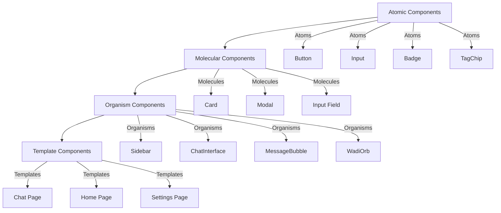
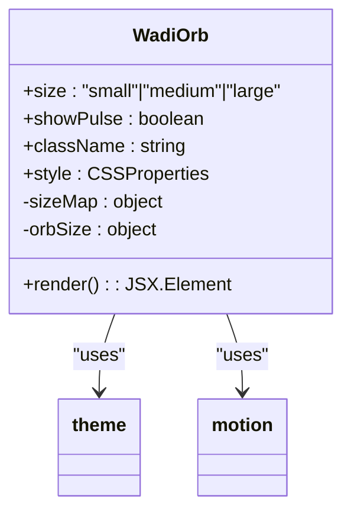
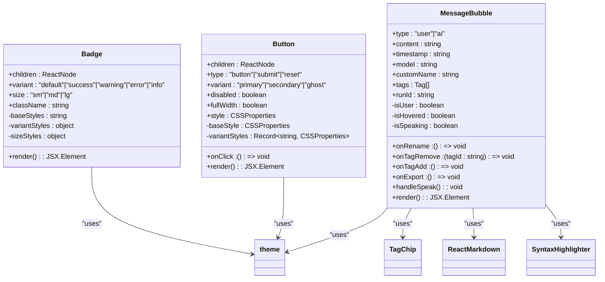
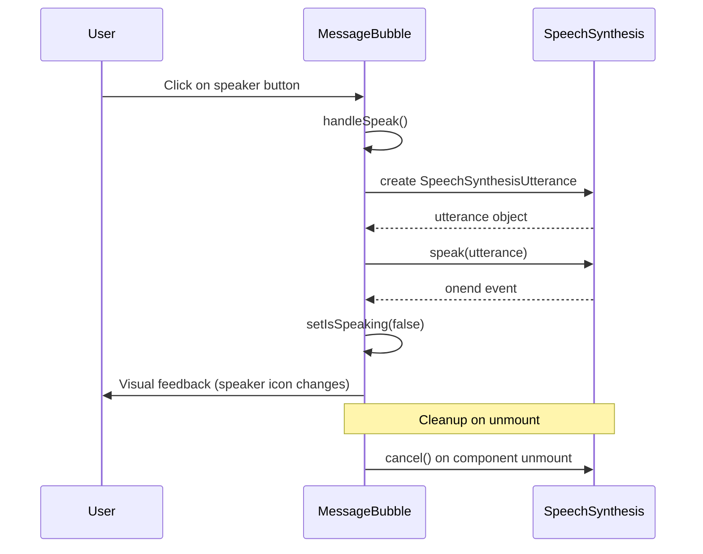
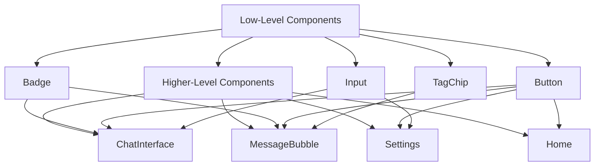
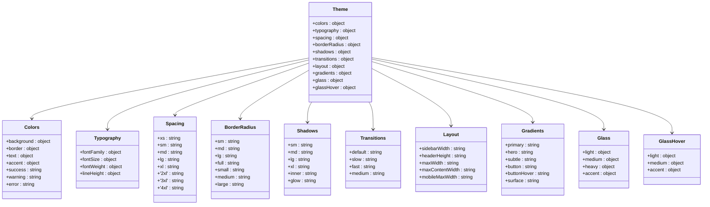

# Component Tree

<cite>
**Referenced Files in This Document**   
- [Badge.tsx](file://apps/frontend/src/components/ui/Badge.tsx)
- [Button.tsx](file://apps/frontend/src/components/Button.tsx)
- [Card.tsx](file://apps/frontend/src/components/Card.tsx)
- [ChatInterface.tsx](file://apps/frontend/src/components/ChatInterface.tsx)
- [Input.tsx](file://apps/frontend/src/components/Input.tsx)
- [MessageBubble.tsx](file://apps/frontend/src/components/MessageBubble.tsx)
- [Modal.tsx](file://apps/frontend/src/components/Modal.tsx)
- [Sidebar.tsx](file://apps/frontend/src/components/Sidebar.tsx)
- [TagChip.tsx](file://apps/frontend/src/components/TagChip.tsx)
- [WadiOrb.tsx](file://apps/frontend/src/components/WadiOrb.tsx)
- [Chat.tsx](file://apps/frontend/src/pages/Chat.tsx)
- [Home.tsx](file://apps/frontend/src/pages/Home.tsx)
- [Settings.tsx](file://apps/frontend/src/pages/Settings.tsx)
- [theme.ts](file://apps/frontend/src/styles/theme.ts)
</cite>

## Table of Contents
1. [Introduction](#introduction)
2. [Component Hierarchy and Atomic Design](#component-hierarchy-and-atomic-design)
3. [Core Component Analysis](#core-component-analysis)
4. [Composition Patterns and Props Interface](#composition-patterns-and-props-interface)
5. [Event Handling Mechanisms](#event-handling-mechanisms)
6. [Usage Examples in Key Pages](#usage-examples-in-key-pages)
7. [Low-Level UI Component Reuse](#low-level-ui-component-reuse)
8. [Accessibility and Responsive Design](#accessibility-and-responsive-design)
9. [Theming Integration](#theming-integration)
10. [Component Customization and Extension](#component-customization-and-extension)
11. [Conclusion](#conclusion)

## Introduction

The WADI frontend component tree represents a well-structured React application that follows atomic design principles to create a cohesive and maintainable UI architecture. This documentation provides a comprehensive analysis of the component hierarchy, focusing on key components such as ChatInterface, MessageBubble, Sidebar, and WadiOrb. The system demonstrates a clear separation of concerns, with components organized by their level of abstraction and reusability.

The application implements a mobile-first design approach with a "phone shell" wrapper that simulates a mobile app experience, while maintaining responsiveness across device sizes. The component tree reveals a thoughtful architecture that balances aesthetic sophistication with functional clarity, incorporating subtle animations, glass morphism effects, and a distinctive Y2K-inspired visual language that enhances the premium feel of the application.

**Section sources**
- [Home.tsx](file://apps/frontend/src/pages/Home.tsx#L1-L372)
- [Chat.tsx](file://apps/frontend/src/pages/Chat.tsx#L1-L402)
- [Settings.tsx](file://apps/frontend/src/pages/Settings.tsx#L1-L235)

## Component Hierarchy and Atomic Design

The WADI frontend follows atomic design principles with a clear hierarchy from atomic elements to organisms and templates. The component structure is organized in the `components` directory with a logical grouping that reflects the atomic design methodology.

At the atomic level, the application includes fundamental UI elements such as Button, Input, Badge, and TagChip. These components are designed to be highly reusable and composable, serving as the building blocks for more complex UI structures. The Button component, for example, supports multiple variants (primary, secondary, ghost) and can be customized with different styles and behaviors while maintaining a consistent visual language.

Molecular components combine these atomic elements to create more complex UI patterns. The Card component, for instance, combines background styling, borders, and spacing to create a container that can hold various content types. Similarly, the Modal component combines header, content, and close button patterns to create a consistent dialog experience across the application.

Organism-level components represent distinct sections of the UI that can be composed of multiple molecules and atoms. The Sidebar, ChatInterface, and MessageBubble components fall into this category, each serving a specific functional purpose within the application. These components are designed to be self-contained while remaining flexible enough to be used in different contexts.

Template-level components are found in the pages directory and represent complete page layouts. The Chat, Home, and Settings pages compose various organisms, molecules, and atoms to create cohesive user experiences. These templates maintain consistency in navigation, layout, and interaction patterns while allowing for page-specific functionality.

**Diagram sources**
- [Button.tsx](file://apps/frontend/src/components/Button.tsx#L1-L87)
- [Input.tsx](file://apps/frontend/src/components/Input.tsx#L1-L145)
- [Badge.tsx](file://apps/frontend/src/components/ui/Badge.tsx#L1-L40)
- [TagChip.tsx](file://apps/frontend/src/components/TagChip.tsx#L1-L104)
- [Card.tsx](file://apps/frontend/src/components/Card.tsx#L1-L43)
- [Modal.tsx](file://apps/frontend/src/components/Modal.tsx#L1-L77)
- [Sidebar.tsx](file://apps/frontend/src/components/Sidebar.tsx#L1-L168)
- [ChatInterface.tsx](file://apps/frontend/src/components/ChatInterface.tsx#L1-L236)
- [MessageBubble.tsx](file://apps/frontend/src/components/MessageBubble.tsx#L1-L316)
- [WadiOrb.tsx](file://apps/frontend/src/components/WadiOrb.tsx#L1-L76)
- [Chat.tsx](file://apps/frontend/src/pages/Chat.tsx#L1-L402)
- [Home.tsx](file://apps/frontend/src/pages/Home.tsx#L1-L372)
- [Settings.tsx](file://apps/frontend/src/pages/Settings.tsx#L1-L235)

**Section sources**
- [Button.tsx](file://apps/frontend/src/components/Button.tsx#L1-L87)
- [Input.tsx](file://apps/frontend/src/components/Input.tsx#L1-L145)
- [Badge.tsx](file://apps/frontend/src/components/ui/Badge.tsx#L1-L40)
- [TagChip.tsx](file://apps/frontend/src/components/TagChip.tsx#L1-L104)
- [Card.tsx](file://apps/frontend/src/components/Card.tsx#L1-L43)
- [Modal.tsx](file://apps/frontend/src/components/Modal.tsx#L1-L77)
- [Sidebar.tsx](file://apps/frontend/src/components/Sidebar.tsx#L1-L168)
- [ChatInterface.tsx](file://apps/frontend/src/components/ChatInterface.tsx#L1-L236)
- [MessageBubble.tsx](file://apps/frontend/src/components/MessageBubble.tsx#L1-L316)
- [WadiOrb.tsx](file://apps/frontend/src/components/WadiOrb.tsx#L1-L76)

## Core Component Analysis

### ChatInterface Component

The ChatInterface component serves as the primary interface for the "Mirror Effect" matching feature, allowing users to connect with others for reflective conversations. This component manages the complete chat lifecycle, from connection establishment to message exchange. It maintains state for messages, input text, anonymous mode, and partner connection status.

The component implements a clean, focused UI with a header that displays connection status, a central chat area that shows message history, and an input section for sending new messages. The design emphasizes clarity and simplicity, with visual cues that indicate connection status through color changes and animated text during the search process.

The component handles the matching workflow by simulating a partner discovery process with a 2-second delay, after which a system message is displayed to guide the conversation. Message sending is implemented with proper form handling, including prevention of empty messages and automatic clearing of the input field after submission. The component also includes a mock reply mechanism that simulates partner responses after a 1.5-second delay.

**Section sources**
- [ChatInterface.tsx](file://apps/frontend/src/components/ChatInterface.tsx#L1-L236)

### MessageBubble Component

The MessageBubble component represents individual messages in the chat interface, with distinct styling for user and AI messages. This component implements rich functionality beyond simple text display, including text-to-speech capabilities, tagging, and export options.

The component supports multiple interaction states, including hover effects that reveal action buttons for exporting content. For AI-generated messages, it includes a text-to-speech feature that allows users to hear the message read aloud, with visual feedback indicating when speech is active. The component also supports custom naming, timestamp display, and model attribution for AI messages.

Message content is rendered using ReactMarkdown with syntax highlighting for code blocks, providing a rich text experience that supports formatting such as bold, italic, and inline code. The component uses framer-motion for entrance animations, creating a smooth, sequential appearance of messages that enhances the conversational flow.

**Section sources**
- [MessageBubble.tsx](file://apps/frontend/src/components/MessageBubble.tsx#L1-L316)

### Sidebar Component

The Sidebar component provides navigation and user management functionality, serving as a persistent interface element in the application. It displays the WADI brand, navigation links, and user information with logout functionality.

The component implements visual feedback for navigation state, highlighting the active route with a colored border and background. Navigation links are disabled for incomplete features, with reduced opacity to indicate their non-functional state. The user section displays the user's email and provides a logout button with hover effects that enhance discoverability.

The Sidebar uses React Router's useLocation hook to determine the current route and update the active state accordingly. It also integrates with the authentication store to access user information and handle logout functionality, redirecting to the login page after sign-out.

**Section sources**
- [Sidebar.tsx](file://apps/frontend/src/components/Sidebar.tsx#L1-L168)

### WadiOrb Component

The WadiOrb component represents a premium web3-inspired design element that serves as a visual brand identifier. This component implements a pulsating orb effect with subtle glow and inner shadow effects that create a high-end, futuristic aesthetic.

The component supports multiple size variants (small, medium, large) and can optionally display a pulsing animation. The animation uses framer-motion to create a smooth scaling effect combined with changing box-shadow properties that simulate a breathing light effect. The orb features a glass-morphism design with backdrop filtering and a radial gradient inner glow that enhances the holographic appearance.

The component is designed to be highly reusable, with support for custom className and style properties that allow for integration into various contexts. The visual design incorporates Y2K-inspired elements while maintaining a professional appearance suitable for a fintech application.

**Diagram sources**
- [WadiOrb.tsx](file://apps/frontend/src/components/WadiOrb.tsx#L1-L76)
- [theme.ts](file://apps/frontend/src/styles/theme.ts#L1-L156)

**Section sources**
- [WadiOrb.tsx](file://apps/frontend/src/components/WadiOrb.tsx#L1-L76)

## Composition Patterns and Props Interface

The WADI frontend demonstrates consistent composition patterns across its component tree, with a clear distinction between presentational and container components. Components are designed with well-defined props interfaces that follow TypeScript best practices, providing type safety and clear documentation of expected inputs.

Atomic components use simple props interfaces that focus on visual customization and basic behavior. The Badge component, for example, accepts children, variant, size, and className props, allowing for flexible styling while maintaining a consistent visual language. The variant prop supports multiple predefined options (default, success, warning, error, info) that map to specific color schemes, while the size prop controls padding and font size.

Molecular components build upon atomic components, composing them into more complex patterns. The Card component, for instance, accepts children, onClick, hoverable, and style props, creating a container that can be interactive and responsive to user input. The component implements hover effects that change the border color and apply a subtle transform, enhancing the tactile feedback.

Organism components use composition to create specialized UI patterns. The MessageBubble component composes the TagChip component to display tags, demonstrating how higher-level components can incorporate lower-level ones to extend functionality. The props interface for MessageBubble is comprehensive, supporting type, content, timestamp, model, customName, and various callback functions for interactive features.

The props interfaces follow a consistent naming convention and pattern, with boolean props typically prefixed with "is" or "on" to indicate their purpose. Optional props are clearly marked, and default values are provided where appropriate to reduce the burden on consumers. The use of TypeScript interfaces ensures that props are type-checked at compile time, reducing runtime errors and improving developer experience.

**Diagram sources**
- [Badge.tsx](file://apps/frontend/src/components/ui/Badge.tsx#L1-L40)
- [Button.tsx](file://apps/frontend/src/components/Button.tsx#L1-L87)
- [MessageBubble.tsx](file://apps/frontend/src/components/MessageBubble.tsx#L1-L316)
- [theme.ts](file://apps/frontend/src/styles/theme.ts#L1-L156)
- [TagChip.tsx](file://apps/frontend/src/components/TagChip.tsx#L1-L104)

**Section sources**
- [Badge.tsx](file://apps/frontend/src/components/ui/Badge.tsx#L1-L40)
- [Button.tsx](file://apps/frontend/src/components/Button.tsx#L1-L87)
- [MessageBubble.tsx](file://apps/frontend/src/components/MessageBubble.tsx#L1-L316)

## Event Handling Mechanisms

The WADI frontend implements a comprehensive event handling system that supports user interaction across all components. Event handlers are implemented as callback functions passed through props, following React best practices for component composition and reusability.

Atomic components implement basic event handling for user interaction. The Button component, for example, handles click events and implements hover effects through onMouseEnter and onMouseLeave handlers. These handlers modify the button's appearance by changing the filter property for primary buttons and the border color and background for secondary and ghost variants.

Molecular components extend event handling to support more complex interactions. The Input component implements focus and blur events to provide visual feedback, changing the border color when the input is active. The Card component supports both onClick and hoverable interactions, with mouse event handlers that modify the border color and apply a subtle transform to indicate interactivity.

Organism components implement sophisticated event handling patterns for rich user experiences. The MessageBubble component, for instance, implements a text-to-speech feature that handles click events on the speaker button, managing the speech synthesis API state and providing visual feedback when speech is active. The component also handles hover events to reveal action buttons and implements tag removal through click events on the remove button.

The ChatInterface component demonstrates event handling for form submission, preventing default form behavior and managing message sending logic. It also handles anonymous mode toggling through a click event on the anonymous button, updating the component state and re-rendering the UI accordingly.

All event handlers are implemented with proper cleanup to prevent memory leaks. The MessageBubble component, for example, implements a useEffect cleanup function that cancels any active speech synthesis when the component unmounts, ensuring that audio playback does not continue after the component is removed from the DOM.

**Diagram sources**
- [MessageBubble.tsx](file://apps/frontend/src/components/MessageBubble.tsx#L1-L316)

**Section sources**
- [Button.tsx](file://apps/frontend/src/components/Button.tsx#L1-L87)
- [Input.tsx](file://apps/frontend/src/components/Input.tsx#L1-L145)
- [Card.tsx](file://apps/frontend/src/components/Card.tsx#L1-L43)
- [MessageBubble.tsx](file://apps/frontend/src/components/MessageBubble.tsx#L1-L316)
- [ChatInterface.tsx](file://apps/frontend/src/components/ChatInterface.tsx#L1-L236)

## Usage Examples in Key Pages

### Chat Page Implementation

The Chat page serves as the primary interface for both AI conversations and the "Mirror Effect" matching feature. It composes multiple components to create a comprehensive chat experience, including the PhoneShell wrapper, ConnectionIndicator, ChatInterface, MessageBubble, and BottomNav components.

The page implements a mode toggle that allows users to switch between AI and mirror chat modes, with visual feedback that highlights the active mode. In AI mode, the page displays a list of MessageBubble components for the conversation history and implements a typing indicator when messages are being processed. In mirror mode, it renders the ChatInterface component for the peer-to-peer conversation experience.

The page manages complex state including message history, input text, and sending status, coordinating between the chat store and UI components. It implements keyboard shortcuts (Enter to send, Shift+Enter for new line, Ctrl+K to clear chat) to enhance user productivity. The page also handles guest user functionality, displaying a nickname modal for unauthenticated users and managing guest conversation history in localStorage.

**Section sources**
- [Chat.tsx](file://apps/frontend/src/pages/Chat.tsx#L1-L402)

### Home Page Implementation

The Home page serves as the application dashboard, providing an overview of user activity and quick access to key features. It composes the PhoneShell wrapper, BottomNav, and various UI components to create a visually rich dashboard experience.

The page implements a hero section with the application title and tagline, followed by statistics cards that display user metrics such as total conversations, projects, and workspaces. These cards use a grid layout with consistent styling and implement hover effects for interactivity.

The page includes a quick actions section with buttons for common tasks like starting a new conversation or searching. It also displays recent conversations with skeleton loading states for asynchronous data loading. The design incorporates subtle background effects including noise texture and floating orbs to create depth and visual interest while maintaining a professional appearance.

**Section sources**
- [Home.tsx](file://apps/frontend/src/pages/Home.tsx#L1-L372)

### Settings Page Implementation

The Settings page provides user configuration options and account management functionality. It composes the PhoneShell wrapper, BottomNav, and various form components to create a structured settings interface.

The page is organized into sections including Profile, Personalization, Preferences, Privacy & Data, and Danger Zone. Each section uses consistent styling with headings, dividers, and grouped controls. The Profile section implements form inputs for user information with a save button, while the Personalization section includes the ThemeCustomizer component.

The Preferences section implements toggle switches for various settings, demonstrating how the application handles boolean configuration options. The Privacy & Data section includes the PrivacyPanel component for data management controls. The Danger Zone section provides logout functionality with appropriate visual styling to indicate the destructive nature of the action.

**Section sources**
- [Settings.tsx](file://apps/frontend/src/pages/Settings.tsx#L1-L235)

## Low-Level UI Component Reuse

The WADI frontend demonstrates extensive reuse of low-level UI components across higher-level components, following the principles of component composition and DRY (Don't Repeat Yourself) design. This approach ensures consistency in visual design and behavior while reducing code duplication and maintenance overhead.

The Badge component is used throughout the application to display status indicators and labels. It supports multiple variants (default, success, warning, error, info) that map to specific color schemes, allowing for semantic meaning in visual presentation. The component's size prop enables consistent sizing across different contexts, from small indicators to larger labels.

The Button component is one of the most widely reused elements, appearing in navigation, forms, dialogs, and inline actions. It supports multiple variants (primary, secondary, ghost) that provide visual hierarchy and affordance for different types of actions. The primary variant uses a gradient background for high-emphasis actions, while secondary and ghost variants provide lower visual weight for less important actions.

The Input component is reused for both text inputs and textareas, providing a consistent interface for user input across the application. It implements proper labeling, placeholder text, and validation attributes while maintaining a consistent visual style. The component handles focus states with visual feedback that enhances usability.

The TagChip component is used in the MessageBubble component to display and manage tags, demonstrating how specialized components can be composed to create rich functionality. The component supports removal functionality through a close button and implements hover effects for interactive feedback.

These low-level components are designed with flexibility in mind, accepting className and style props that allow for customization without modifying the component's core implementation. This approach enables developers to adapt components to specific use cases while maintaining overall design consistency.

**Diagram sources**
- [Badge.tsx](file://apps/frontend/src/components/ui/Badge.tsx#L1-L40)
- [Button.tsx](file://apps/frontend/src/components/Button.tsx#L1-L87)
- [Input.tsx](file://apps/frontend/src/components/Input.tsx#L1-L145)
- [TagChip.tsx](file://apps/frontend/src/components/TagChip.tsx#L1-L104)
- [ChatInterface.tsx](file://apps/frontend/src/components/ChatInterface.tsx#L1-L236)
- [MessageBubble.tsx](file://apps/frontend/src/components/MessageBubble.tsx#L1-L316)
- [Settings.tsx](file://apps/frontend/src/pages/Settings.tsx#L1-L235)
- [Home.tsx](file://apps/frontend/src/pages/Home.tsx#L1-L372)

**Section sources**
- [Badge.tsx](file://apps/frontend/src/components/ui/Badge.tsx#L1-L40)
- [Button.tsx](file://apps/frontend/src/components/Button.tsx#L1-L87)
- [Input.tsx](file://apps/frontend/src/components/Input.tsx#L1-L145)
- [TagChip.tsx](file://apps/frontend/src/components/TagChip.tsx#L1-L104)

## Accessibility and Responsive Design

The WADI frontend implements comprehensive accessibility features and responsive design principles to ensure an inclusive user experience across devices and assistive technologies.

For accessibility, the application uses semantic HTML elements and ARIA attributes to provide proper context for screen readers. Interactive elements include appropriate labels and tooltips to enhance discoverability. Keyboard navigation is supported throughout the application, with focus indicators that are visible and consistent. The application maintains sufficient color contrast between text and background elements to meet WCAG 2.1 AA standards.

The responsive design follows a mobile-first approach, with the PhoneShell component creating a simulated mobile interface that adapts to different screen sizes. The layout uses relative units and flexible grids to ensure content scales appropriately across devices. Media queries are used to adjust spacing, typography, and layout patterns for larger screens while maintaining the core user experience.

Interactive elements implement touch-friendly targets with appropriate sizing for mobile devices. The application handles viewport resizing and orientation changes gracefully, with components that adapt their layout and behavior based on available space. Form elements include proper input types and attributes to enhance mobile usability, such as appropriate keyboard types for different input fields.

The design system incorporates accessibility considerations at the component level, with color palettes that maintain contrast in both light and dark modes. Focus states are implemented with sufficient visual feedback, and interactive elements provide clear affordances for their functionality. The application avoids relying solely on color to convey information, using text labels and icons to ensure comprehension for users with color vision deficiencies.

**Section sources**
- [ChatInterface.tsx](file://apps/frontend/src/components/ChatInterface.tsx#L1-L236)
- [MessageBubble.tsx](file://apps/frontend/src/components/MessageBubble.tsx#L1-L316)
- [Sidebar.tsx](file://apps/frontend/src/components/Sidebar.tsx#L1-L168)
- [WadiOrb.tsx](file://apps/frontend/src/components/WadiOrb.tsx#L1-L76)
- [Chat.tsx](file://apps/frontend/src/pages/Chat.tsx#L1-L402)
- [Home.tsx](file://apps/frontend/src/pages/Home.tsx#L1-L372)
- [Settings.tsx](file://apps/frontend/src/pages/Settings.tsx#L1-L235)

## Theming Integration

The WADI frontend implements a comprehensive theming system that provides a consistent visual language across all components. The theme is defined in the theme.ts file and exported as a const object that includes color palettes, typography settings, spacing scales, border radii, shadows, transitions, layout dimensions, and gradients.

The color system is organized into semantic categories including background, border, text, accent, success, warning, and error. Background colors provide a dark mode aesthetic with multiple levels of depth (primary, secondary, tertiary, overlay, surface). Text colors are defined with primary, secondary, and tertiary variants that provide visual hierarchy. Accent colors include primary, secondary, highlight, y2k, and various border states.

Typography settings include font families, font sizes, font weights, and line heights. The system uses the Inter font family with appropriate fallbacks for consistent rendering across platforms. Font sizes are defined with semantic names (xs, sm, base, lg, xl, 2xl, 3xl) and specific use cases (caption, bodySmall, body, bodyLarge, h3, h2, h1, display).

Spacing is implemented as a scale with named values (xs, sm, md, lg, xl, 2xl, 3xl, 4xl) that correspond to specific pixel values. This approach enables consistent spacing across components while allowing for easy adjustments to the overall design rhythm. Border radii are defined with multiple sizes (sm, md, lg, full, small, medium, large) to support different visual treatments.

The theme is integrated into components through direct import and usage of theme properties in style objects. Components access theme values using dot notation (e.g., theme.colors.background.secondary) to apply consistent styling. The system supports glass morphism effects through the glass object, which defines background, backdropFilter, and border properties for translucent UI elements.

**Diagram sources**
- [theme.ts](file://apps/frontend/src/styles/theme.ts#L1-L156)

**Section sources**
- [theme.ts](file://apps/frontend/src/styles/theme.ts#L1-L156)

## Component Customization and Extension

The WADI frontend components are designed with customization and extension in mind, providing flexible APIs that allow developers to adapt components to new use cases while maintaining design consistency.

Components support customization through props that control visual appearance and behavior. The Badge component, for example, allows customization of variant, size, and className, enabling developers to match specific design requirements without modifying the component's core implementation. The Button component supports variant, disabled, fullWidth, and style props that provide extensive control over appearance and layout.

For more advanced customization, components expose className and style props that allow for additional CSS classes and inline styles. This approach enables developers to extend components with project-specific styling while leveraging the base component's functionality and accessibility features. The use of CSS custom properties and theme-based styling ensures that customizations integrate seamlessly with the overall design system.

Components are designed to be extensible through composition rather than inheritance. Developers can create new components by composing existing ones, adding or modifying functionality as needed. For example, a developer could create a specialized chat input component by composing the Input and Button components with additional features like file attachment or emoji selection.

The component architecture follows the single responsibility principle, with each component focused on a specific UI pattern or interaction. This design makes it easier to understand, test, and modify components independently. The use of TypeScript interfaces provides clear documentation of component APIs and enables type-safe extension and composition.

When extending components, developers should follow the established patterns for props, event handling, and styling. New components should integrate with the theme system and maintain consistency with the existing design language. The use of framer-motion for animations should be consistent with existing patterns to ensure a cohesive user experience.

**Section sources**
- [Badge.tsx](file://apps/frontend/src/components/ui/Badge.tsx#L1-L40)
- [Button.tsx](file://apps/frontend/src/components/Button.tsx#L1-L87)
- [Input.tsx](file://apps/frontend/src/components/Input.tsx#L1-L145)
- [Card.tsx](file://apps/frontend/src/components/Card.tsx#L1-L43)
- [Modal.tsx](file://apps/frontend/src/components/Modal.tsx#L1-L77)

## Conclusion

The WADI frontend component tree demonstrates a well-architected React application that follows modern best practices for component design and organization. The implementation of atomic design principles creates a clear hierarchy from basic UI elements to complex page templates, enabling consistent and maintainable code.

The component system balances aesthetic sophistication with functional clarity, incorporating subtle animations, glass morphism effects, and a distinctive Y2K-inspired visual language that enhances the premium feel of the application. The comprehensive theming system ensures visual consistency across all components while providing flexibility for customization.

Key components such as ChatInterface, MessageBubble, Sidebar, and WadiOrb are designed with clear responsibilities and well-defined APIs, making them reusable and extensible. The extensive use of low-level UI components across higher-level components demonstrates effective composition patterns that reduce code duplication and maintenance overhead.

The application implements comprehensive accessibility features and responsive design principles to ensure an inclusive user experience across devices and assistive technologies. The event handling system supports rich user interactions with proper cleanup to prevent memory leaks.

For developers building new features, the component system provides a solid foundation for extension and customization. By following the established patterns for props, event handling, and styling, new components can be integrated seamlessly into the existing architecture while maintaining design consistency and accessibility standards.