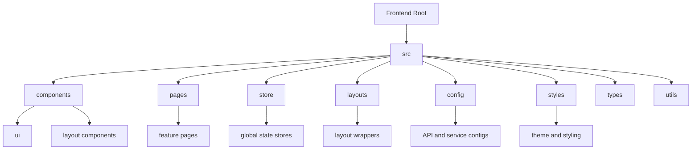
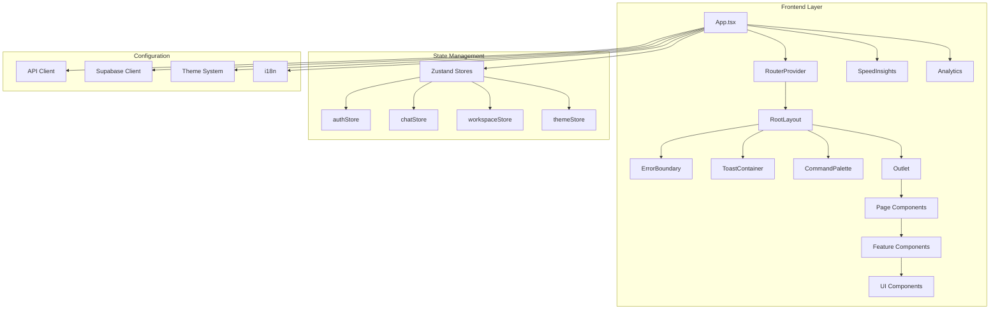
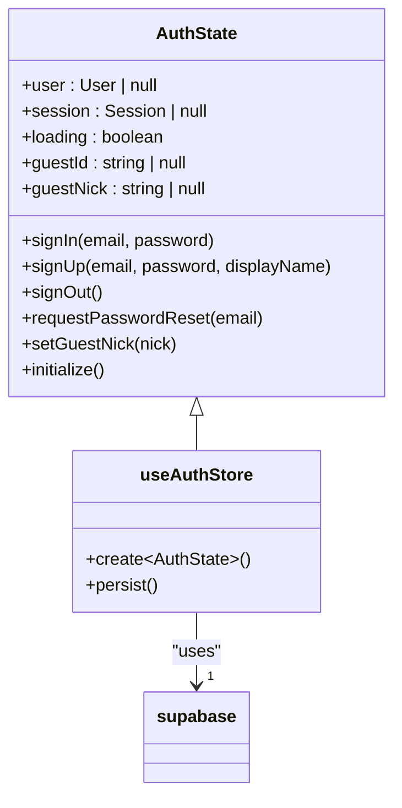
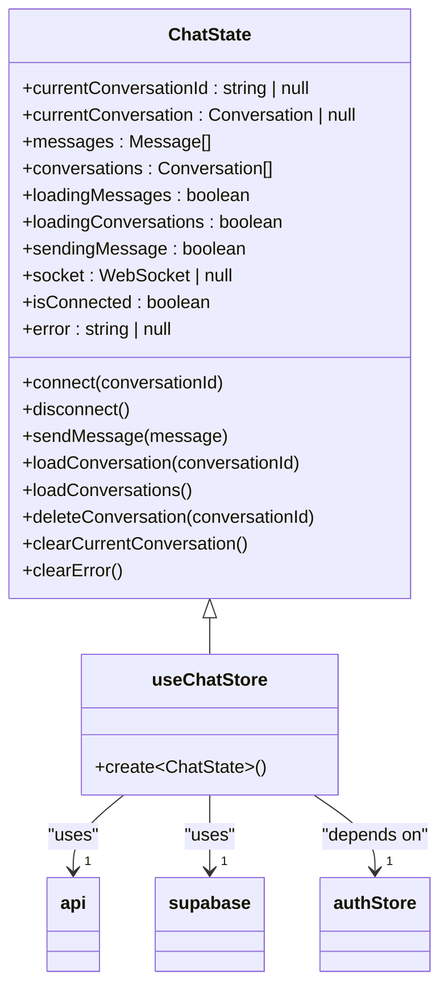
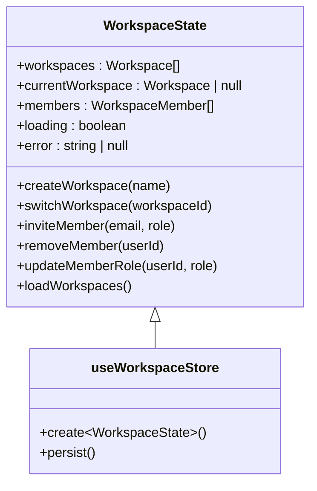
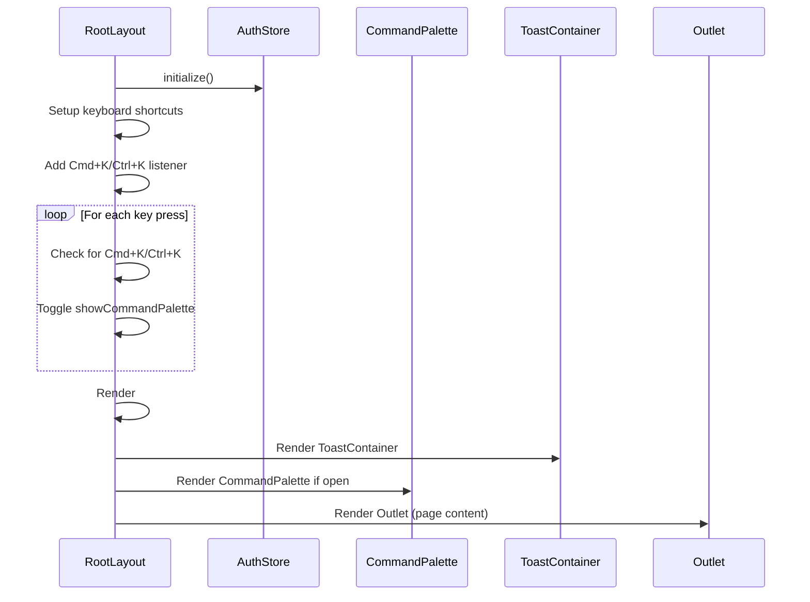
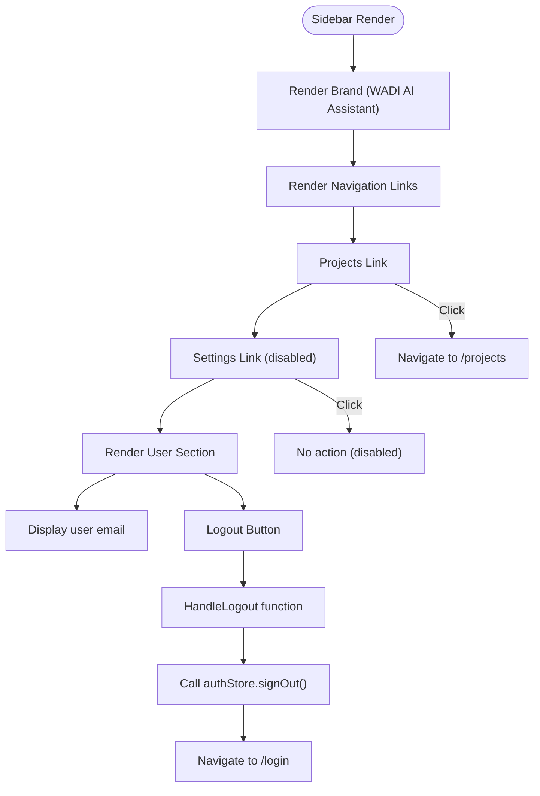
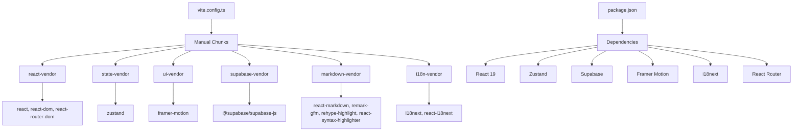

# Frontend Architecture

<cite>
**Referenced Files in This Document**   
- [package.json](file://apps/frontend/package.json)
- [vite.config.ts](file://apps/frontend/vite.config.ts)
- [main.tsx](file://apps/frontend/src/main.tsx)
- [App.tsx](file://apps/frontend/src/App.tsx)
- [router.tsx](file://apps/frontend/src/router.tsx)
- [authStore.ts](file://apps/frontend/src/store/authStore.ts)
- [chatStore.ts](file://apps/frontend/src/store/chatStore.ts)
- [workspaceStore.ts](file://apps/frontend/src/store/workspaceStore.ts)
- [RootLayout.tsx](file://apps/frontend/src/layouts/RootLayout.tsx)
- [Sidebar.tsx](file://apps/frontend/src/components/Sidebar.tsx)
- [api.ts](file://apps/frontend/src/config/api.ts)
- [supabase.ts](file://apps/frontend/src/config/supabase.ts)
- [theme.ts](file://apps/frontend/src/styles/theme.ts)
- [i18n.ts](file://apps/frontend/src/i18n.ts)
- [useTheme.ts](file://apps/frontend/src/hooks/useTheme.ts)
</cite>

## Table of Contents

1. [Introduction](#introduction)
2. [Project Structure](#project-structure)
3. [Core Components](#core-components)
4. [Architecture Overview](#architecture-overview)
5. [Detailed Component Analysis](#detailed-component-analysis)
6. [Dependency Analysis](#dependency-analysis)
7. [Performance Considerations](#performance-considerations)
8. [Troubleshooting Guide](#troubleshooting-guide)
9. [Conclusion](#conclusion)

## Introduction

This document provides comprehensive architectural documentation for the WADI frontend application, a React 18 application built with Vite and TypeScript. The frontend serves as the user interface for an AI assistant platform, featuring authentication, chat functionality, workspace management, and various productivity tools. The architecture emphasizes modularity, state management with Zustand, and seamless integration with backend services through REST and WebSocket APIs.

## Project Structure

The frontend application follows a well-organized directory structure that separates concerns and promotes maintainability. Key directories include components, pages, store, layouts, and configuration files.



**Diagram sources**

- [apps/frontend/src](file://apps/frontend/src)

**Section sources**

- [apps/frontend/package.json](file://apps/frontend/package.json)

## Core Components

The frontend architecture is built around several core components that handle critical application functionality. The component organization follows React best practices with a clear separation between presentational and container components. The application uses React 19 with Vite for fast development and optimized production builds, leveraging modern React features like concurrent rendering and server components.

**Section sources**

- [apps/frontend/src/App.tsx](file://apps/frontend/src/App.tsx)
- [apps/frontend/src/main.tsx](file://apps/frontend/src/main.tsx)
- [apps/frontend/package.json](file://apps/frontend/package.json)

## Architecture Overview

The frontend architecture follows a modular design pattern with clear separation of concerns. The application bootstraps through main.tsx, which initializes the React root and applies global configurations including internationalization. The App component serves as the top-level container, implementing error boundaries and API health checks to ensure application stability.



**Diagram sources**

- [apps/frontend/src/App.tsx](file://apps/frontend/src/App.tsx)
- [apps/frontend/src/main.tsx](file://apps/frontend/src/main.tsx)
- [apps/frontend/src/router.tsx](file://apps/frontend/src/router.tsx)
- [apps/frontend/src/store](file://apps/frontend/src/store)

## Detailed Component Analysis

### State Management with Zustand Stores

The application implements a global state management system using Zustand, providing a lightweight and efficient solution for managing application state across components. The store architecture is modular, with separate stores for different domains of functionality.

#### Auth Store Analysis

The authStore manages user authentication state, including session management, user data, and guest mode functionality. It uses Zustand's persist middleware to maintain state across page reloads.



**Diagram sources**

- [apps/frontend/src/store/authStore.ts](file://apps/frontend/src/store/authStore.ts)

#### Chat Store Analysis

The chatStore manages chat-related state, including conversations, messages, and WebSocket connections. It implements sophisticated logic for handling both authenticated user sessions and guest mode interactions.



**Diagram sources**

- [apps/frontend/src/store/chatStore.ts](file://apps/frontend/src/store/chatStore.ts)

#### Workspace Store Analysis

The workspaceStore manages workspace-related state, including workspace data, members, and permissions. It includes mock data for development purposes and is designed to be easily extended with real API integration.



**Diagram sources**

- [apps/frontend/src/store/workspaceStore.ts](file://apps/frontend/src/store/workspaceStore.ts)

### Routing with React Router

The application implements client-side routing using React Router v6, with a comprehensive routing configuration that handles authentication guards, redirects, and nested layouts.

#### Routing Flow Analysis

The routing system implements role-based access control through the RootGuard component, which protects routes based on authentication status and user roles.

```mermaid
graph TD
A[Root Path /] --> B{RootRedirect}
B --> C[Guest Mode?]
C --> |Yes| D[Navigate to /chat]
C --> |No| E{User Authenticated?}
E --> |Yes| F[Navigate to /home]
E --> |No| G[Navigate to /login]
H[/login] --> I[RootGuard requireGuest]
I --> J[Login Page]
K[/home] --> L[RootGuard requireAuth]
L --> M[Home Page]
N[/chat] --> O[Chat Page]
P[/settings] --> Q[RootGuard requireAuth]
Q --> R[Settings Page]
S[/*] --> T[NotFound Page]
```

**Diagram sources**

- [apps/frontend/src/router.tsx](file://apps/frontend/src/router.tsx)

**Section sources**

- [apps/frontend/src/router.tsx](file://apps/frontend/src/router.tsx)
- [apps/frontend/src/components/RootGuard.tsx](file://apps/frontend/src/components/RootGuard.tsx)

### Component Organization and Layouts

The application follows a component-based architecture with a clear hierarchy and reusable UI elements. The layout system is built around the RootLayout component, which provides a consistent structure across all pages.

#### Root Layout Analysis

The RootLayout component serves as the base layout for the application, initializing authentication and providing global UI elements like the toast container and command palette.



**Diagram sources**

- [apps/frontend/src/layouts/RootLayout.tsx](file://apps/frontend/src/layouts/RootLayout.tsx)

#### Sidebar Component Analysis

The Sidebar component provides navigation and user information, with a fixed position and responsive design.



**Diagram sources**

- [apps/frontend/src/components/Sidebar.tsx](file://apps/frontend/src/components/Sidebar.tsx)

**Section sources**

- [apps/frontend/src/components/Sidebar.tsx](file://apps/frontend/src/components/Sidebar.tsx)

## Dependency Analysis

The frontend application has a well-defined dependency structure that separates concerns and promotes maintainability. The Vite configuration implements code splitting to optimize bundle size and improve load performance.



**Diagram sources**

- [apps/frontend/package.json](file://apps/frontend/package.json)
- [apps/frontend/vite.config.ts](file://apps/frontend/vite.config.ts)

**Section sources**

- [apps/frontend/package.json](file://apps/frontend/package.json)
- [apps/frontend/vite.config.ts](file://apps/frontend/vite.config.ts)

## Performance Considerations

The frontend architecture incorporates several performance optimizations to ensure a responsive user experience. The Vite build configuration implements code splitting with manual chunks to reduce initial load time and improve caching efficiency. The application uses React's concurrent rendering features to maintain responsiveness during state updates and API calls.

The API client implements retry logic with exponential backoff, request timeout handling, and automatic token refresh to improve reliability and user experience in unstable network conditions. WebSocket connections are used for real-time chat functionality, reducing latency for message delivery compared to polling.

## Troubleshooting Guide

The application includes several mechanisms for error handling and troubleshooting. The App component implements a health check on boot to verify API connectivity, displaying a user-friendly error message if the backend is unavailable. The API client logs requests and responses in development mode to aid debugging.

Common issues and their solutions:

- **API connectivity issues**: Verify the VITE_API_URL environment variable is correctly set
- **Authentication failures**: Check Supabase configuration and ensure VITE_SUPABASE_URL and VITE_SUPABASE_ANON_KEY are properly configured
- **WebSocket connection problems**: Ensure the WebSocket endpoint is accessible and CORS is properly configured
- **Internationalization issues**: Verify locale files exist in the correct location and are properly imported in i18n.ts

**Section sources**

- [apps/frontend/src/App.tsx](file://apps/frontend/src/App.tsx)
- [apps/frontend/src/config/api.ts](file://apps/frontend/src/config/api.ts)
- [apps/frontend/src/config/supabase.ts](file://apps/frontend/src/config/supabase.ts)
- [apps/frontend/src/i18n.ts](file://apps/frontend/src/i18n.ts)

## Conclusion

The WADI frontend architecture demonstrates a modern React application design with React 19, Vite, and TypeScript. The architecture emphasizes modularity, maintainability, and user experience through a well-organized component structure, effective state management with Zustand, and robust routing with React Router. The application integrates seamlessly with backend services through a sophisticated API client that handles authentication, error recovery, and real-time communication via WebSockets.

Key architectural strengths include the modular store design, comprehensive error handling, and performance optimizations through code splitting and efficient state management. The application is well-positioned for future enhancements and scaling, with a clear separation of concerns and adherence to React best practices.
