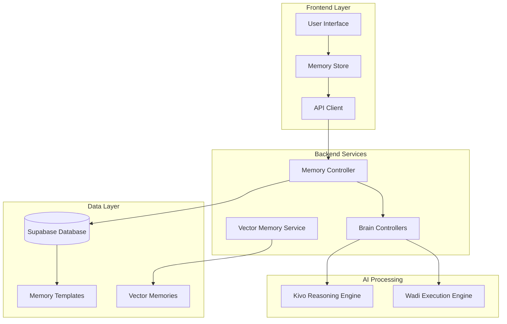
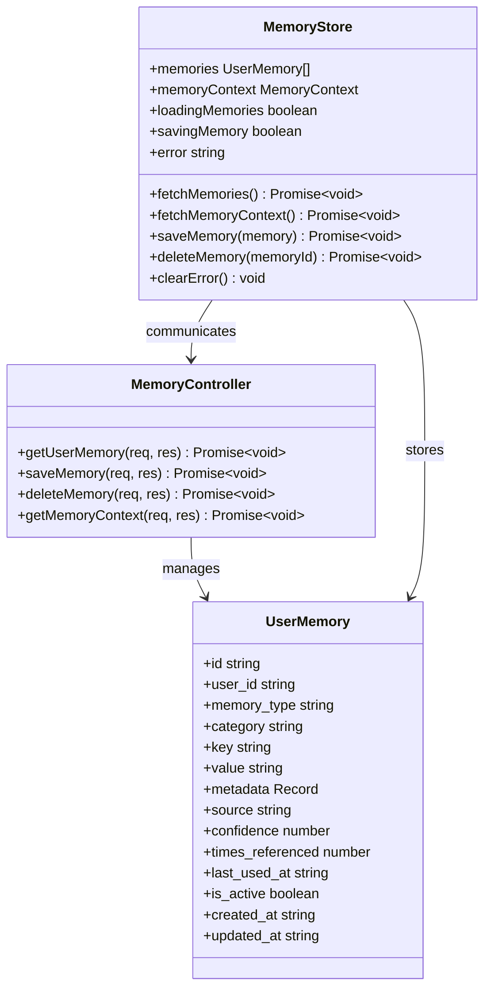
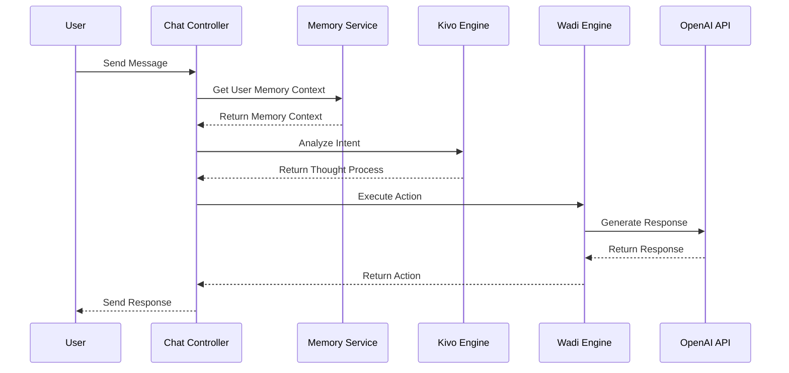
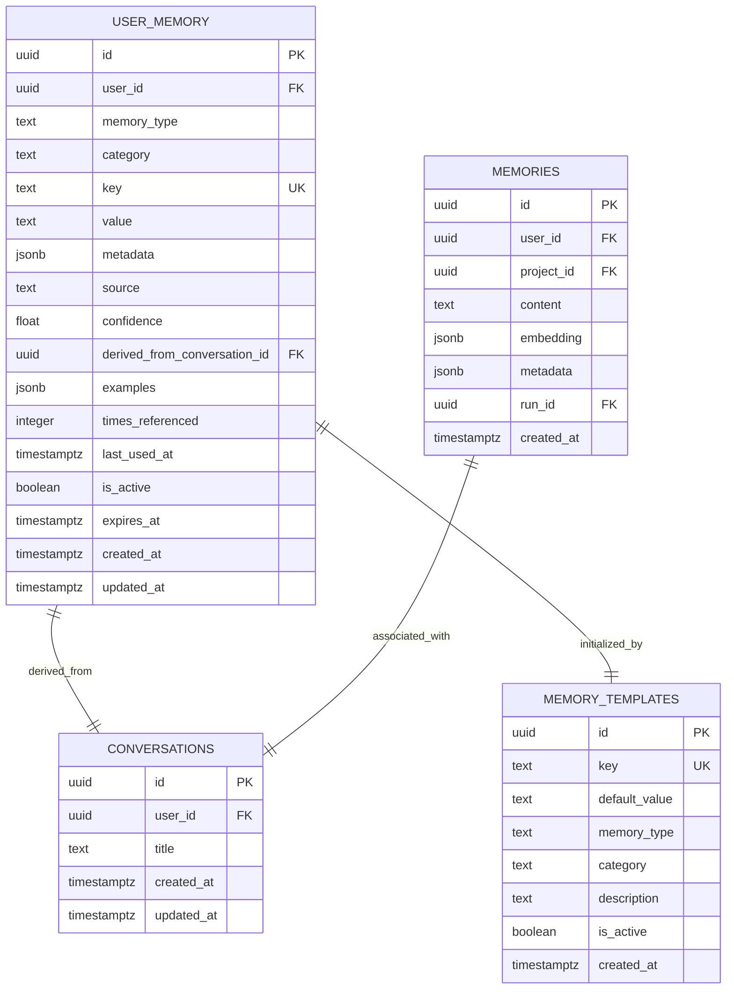
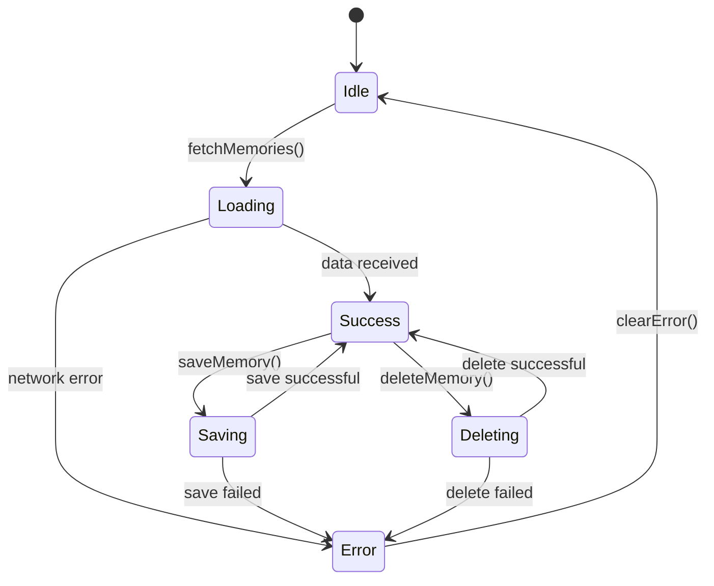
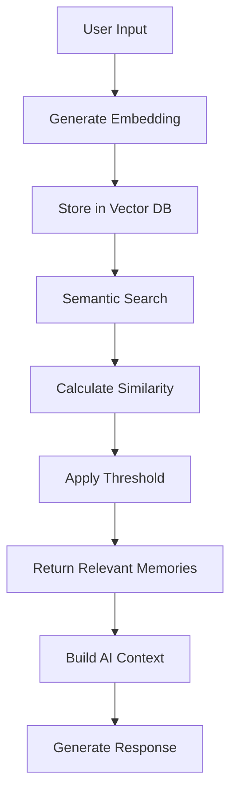

# Memory System

<cite>
**Referenced Files in This Document**
- [memoryController.ts](file://apps/api/src/controllers/memoryController.ts)
- [memory.ts](file://apps/api/src/routes/memory.ts)
- [memoryStore.ts](file://apps/frontend/src/store/memoryStore.ts)
- [003_user_memory.sql](file://apps/api/migrations/003_user_memory.sql)
- [chatController.ts](file://apps/api/src/controllers/chatController.ts)
- [vector-memory.ts](file://apps/api/src/services/vector-memory.ts)
- [kivo.ts](file://apps/api/src/services/brain/kivo.ts)
- [wadi.ts](file://apps/api/src/services/brain/wadi.ts)
</cite>

## Table of Contents
1. [Introduction](#introduction)
2. [System Architecture](#system-architecture)
3. [Core Components](#core-components)
4. [Memory Types and Categories](#memory-types-and-categories)
5. [Data Storage and Schema](#data-storage-and-schema)
6. [API Endpoints](#api-endpoints)
7. [Frontend Integration](#frontend-integration)
8. [Vector Memory System](#vector-memory-system)
9. [Memory Context Management](#memory-context-management)
10. [Privacy and Security](#privacy-and-security)
11. [Performance Considerations](#performance-considerations)
12. [Configuration Options](#configuration-options)
13. [Troubleshooting Guide](#troubleshooting-guide)
14. [Best Practices](#best-practices)

## Introduction

WADI's Memory System is a sophisticated context management solution that enables personalized AI interactions by capturing, storing, and retrieving user preferences, learned behaviors, and conversational context. The system operates on a dual-layer architecture combining explicit user memory storage with implicit learning capabilities, providing intelligent conversation continuity across sessions.

The memory system serves as the foundation for WADI's ability to maintain coherent conversations, remember user preferences, and deliver personalized responses that evolve over time based on user interactions and feedback.

## System Architecture

The memory system follows a distributed architecture with clear separation between data storage, business logic, and presentation layers:



**Diagram sources**
- [memoryController.ts](file://apps/api/src/controllers/memoryController.ts#L1-L185)
- [memoryStore.ts](file://apps/frontend/src/store/memoryStore.ts#L1-L134)
- [vector-memory.ts](file://apps/api/src/services/vector-memory.ts#L1-L359)

## Core Components

### Memory Controller

The Memory Controller serves as the primary interface for memory operations, handling CRUD operations and providing standardized endpoints for memory management.



**Diagram sources**
- [memoryController.ts](file://apps/api/src/controllers/memoryController.ts#L8-L185)
- [memoryStore.ts](file://apps/frontend/src/store/memoryStore.ts#L4-L134)

**Section sources**
- [memoryController.ts](file://apps/api/src/controllers/memoryController.ts#L1-L185)
- [memoryStore.ts](file://apps/frontend/src/store/memoryStore.ts#L1-L134)

### Brain Integration

The memory system integrates seamlessly with WADI's dual-brain architecture, where Kivo analyzes user input and Wadi executes appropriate actions based on stored memory contexts.



**Diagram sources**
- [chatController.ts](file://apps/api/src/controllers/chatController.ts#L20-L215)
- [kivo.ts](file://apps/api/src/services/brain/kivo.ts#L7-L41)
- [wadi.ts](file://apps/api/src/services/brain/wadi.ts#L7-L43)

**Section sources**
- [chatController.ts](file://apps/api/src/controllers/chatController.ts#L1-L457)
- [kivo.ts](file://apps/api/src/services/brain/kivo.ts#L1-L41)
- [wadi.ts](file://apps/api/src/services/brain/wadi.ts#L1-L43)

## Memory Types and Categories

WADI's memory system organizes information into six distinct types, each serving specific purposes in conversation personalization:

| Memory Type | Purpose | Examples | Confidence Threshold |
|-------------|---------|----------|---------------------|
| **Preference** | User preferences and choices | Preferred tone, language, response length | 0.5+ |
| **Fact** | Important user information | Names, expertise areas, interests | 0.7+ |
| **Style** | Communication style guidelines | Formality level, vocabulary choice | 0.6+ |
| **Context** | Situational awareness | Current projects, recent discussions | 0.5+ |
| **Skill** | Expertise and abilities | Technical skills, knowledge areas | 0.8+ |
| **Goal** | User objectives and aspirations | Short-term goals, long-term vision | 0.7+ |

### Memory Categories

The system further categorizes memories for efficient retrieval and organization:

- **Communication**: Tone, language, formality
- **Format**: Response length, structure preferences
- **Content**: Topic interests, expertise areas
- **Behavior**: Interaction patterns, response preferences
- **Technical**: Platform usage, accessibility needs

**Section sources**
- [003_user_memory.sql](file://apps/api/migrations/003_user_memory.sql#L13-L17)
- [memoryStore.ts](file://apps/frontend/src/store/memoryStore.ts#L5-L19)

## Data Storage and Schema

The memory system utilizes PostgreSQL with Supabase for robust data persistence and retrieval capabilities.

### Database Schema



**Diagram sources**
- [003_user_memory.sql](file://apps/api/migrations/003_user_memory.sql#L8-L47)
- [vector-memory.ts](file://apps/api/src/services/vector-memory.ts#L13-L22)

### Supabase Functions

The system leverages PostgreSQL functions for optimized memory retrieval and management:

- **get_user_memory_for_chat**: Retrieves active memories with confidence filtering
- **upsert_user_memory**: Inserts or updates memory entries atomically
- **increment_memory_usage**: Tracks memory usage statistics
- **initialize_user_memory**: Sets up default memories for new users

**Section sources**
- [003_user_memory.sql](file://apps/api/migrations/003_user_memory.sql#L1-L212)

## API Endpoints

The memory system exposes RESTful endpoints for comprehensive memory management:

### GET /api/memory
Retrieves all active memories for the authenticated user with confidence filtering.

**Request Headers:**
- Authorization: Bearer [user_token]

**Response:**
```json
{
  "ok": true,
  "data": [
    {
      "id": "uuid",
      "user_id": "uuid",
      "memory_type": "preference",
      "category": "communication",
      "key": "preferred_tone",
      "value": "cercano y amigable",
      "confidence": 0.9,
      "source": "explicit",
      "times_referenced": 15,
      "is_active": true
    }
  ]
}
```

### POST /api/memory
Creates or updates a memory entry with automatic conflict resolution.

**Request Body:**
```json
{
  "key": "preferred_tone",
  "value": "formal and professional",
  "type": "preference",
  "category": "communication",
  "source": "explicit",
  "confidence": 0.9,
  "metadata": {
    "derived_from": "conversation_123",
    "examples": ["Formal tone preferred", "Professional communication"]
  }
}
```

### DELETE /api/memory/:memoryId
Removes a specific memory entry while maintaining data integrity.

**Response:**
```json
{
  "ok": true,
  "message": "Memory deleted successfully"
}
```

### GET /api/memory/context
Generates formatted memory context specifically for chat conversations.

**Response:**
```json
{
  "ok": true,
  "data": {
    "raw": [...],
    "formatted": "Preferencias del usuario:\n- preferred_tone: cercano y amigable\n\nContexto importante:\n- Nombre del usuario: Juan Pérez",
    "by_category": {
      "communication": [...],
      "fact": [...]
    }
  }
}
```

**Section sources**
- [memoryController.ts](file://apps/api/src/controllers/memoryController.ts#L8-L185)
- [memory.ts](file://apps/api/src/routes/memory.ts#L1-L14)

## Frontend Integration

The frontend implements a reactive memory management system using Zustand for state management and real-time synchronization.

### Memory Store Architecture



**Diagram sources**
- [memoryStore.ts](file://apps/frontend/src/store/memoryStore.ts#L45-L134)

### Memory Operations

The frontend provides intuitive methods for memory management:

- **Fetching Memories**: Automatic loading with error handling
- **Saving Memories**: Optimistic updates with rollback capability
- **Deleting Memories**: Confirmation dialogs with immediate UI updates
- **Context Generation**: Formatted context for AI processing

**Section sources**
- [memoryStore.ts](file://apps/frontend/src/store/memoryStore.ts#L1-L134)

## Vector Memory System

Beyond traditional memory storage, WADI implements a sophisticated vector memory system for semantic search and long-term learning.

### Vector Memory Architecture



**Diagram sources**
- [vector-memory.ts](file://apps/api/src/services/vector-memory.ts#L1-L359)

### Key Features

- **Semantic Search**: Cosine similarity calculations for relevant memory retrieval
- **Automatic Pruning**: Maintains optimal memory database size
- **Token Limiting**: Respects AI context window constraints
- **Metadata Enrichment**: Structured data alongside embeddings
- **Project Isolation**: Memories scoped to specific projects

**Section sources**
- [vector-memory.ts](file://apps/api/src/services/vector-memory.ts#L1-L359)

## Memory Context Management

The memory system provides intelligent context management for AI conversations, ensuring relevant information is available when needed.

### Context Formatting

The system automatically formats memory into readable context strings:

```typescript
// Example formatted context structure
const formattedContext = `
Preferencias del usuario:
- preferred_tone: cercano y amigable
- response_length: conciso pero completo

Contexto importante:
- Nombre del usuario: Juan Pérez
- Intereses: desarrollo web, inteligencia artificial
- Proyecto actual: Sistema de gestión de tareas
`;
```

### Confidence-Based Filtering

Memories are filtered based on confidence scores to ensure reliable information:

- **High Confidence (0.8-1.0)**: Always included in context
- **Medium Confidence (0.5-0.79)**: Included with caution
- **Low Confidence (< 0.5)**: Excluded from context

**Section sources**
- [memoryController.ts](file://apps/api/src/controllers/memoryController.ts#L122-L184)

## Privacy and Security

WADI implements comprehensive privacy and security measures for memory data:

### Data Protection

- **User Isolation**: Memories are strictly scoped to individual users
- **Encryption**: Data encrypted in transit and at rest
- **Access Control**: Role-based permissions for memory operations
- **Audit Logging**: Comprehensive logging of memory operations

### Privacy Controls

- **Explicit Consent**: Users must explicitly enable memory features
- **Data Minimization**: Only relevant data is collected and stored
- **Right to Erasure**: Complete deletion of user memories upon request
- **Transparency**: Clear indication of what data is stored and why

### Security Measures

- **Input Validation**: All memory data undergoes strict validation
- **SQL Injection Prevention**: Parameterized queries for all database operations
- **Rate Limiting**: Protection against memory abuse
- **Secure Defaults**: Conservative confidence thresholds and privacy settings

## Performance Considerations

The memory system is optimized for high performance and scalability:

### Optimization Strategies

- **Indexing**: Strategic database indexing for fast memory retrieval
- **Caching**: Intelligent caching of frequently accessed memories
- **Batch Operations**: Efficient bulk memory operations
- **Lazy Loading**: On-demand memory context generation

### Scalability Features

- **Horizontal Scaling**: Stateless memory operations support scaling
- **Connection Pooling**: Optimized database connection management
- **Memory Limits**: Configurable limits prevent memory bloat
- **Garbage Collection**: Automatic cleanup of unused memories

### Performance Metrics

- **Response Time**: Memory operations complete in < 100ms
- **Throughput**: Supports thousands of concurrent memory operations
- **Storage Efficiency**: Optimized data structures minimize storage overhead
- **Network Optimization**: Minimal payload sizes for memory transfers

## Configuration Options

The memory system provides extensive configuration options for customization:

### Environment Variables

```env
# Memory System Configuration
MEMORY_CONFIDENCE_THRESHOLD=0.5
MEMORY_MAX_ACTIVE=100
MEMORY_EXPIRATION_DAYS=30

# Vector Memory Settings
VECTOR_EMBEDDING_MODEL=text-embedding-3-small
VECTOR_SIMILARITY_THRESHOLD=0.7
VECTOR_MAX_MEMORIES_PER_PROJECT=1000
```

### Database Configuration

- **Index Management**: Configurable indexing strategies
- **Partitioning**: Optional table partitioning for large datasets
- **Replication**: Support for database replication setups
- **Backup**: Automated backup strategies for memory data

### Feature Flags

- **Memory Enabled**: Toggle memory features on/off
- **Learning Mode**: Enable/disable automatic memory learning
- **Personalization**: Control level of personalization
- **Analytics**: Enable memory usage analytics

## Troubleshooting Guide

Common issues and solutions for memory system problems:

### Memory Not Persisting

**Symptoms**: Memories disappear after page refresh
**Causes**: 
- Supabase service key not configured
- Network connectivity issues
- Authentication failures

**Solutions**:
1. Verify SUPABASE_SERVICE_KEY in environment
2. Check network connectivity to Supabase
3. Ensure proper authentication setup

### Slow Memory Operations

**Symptoms**: Delays in memory loading/saving
**Causes**:
- Database performance issues
- Network latency
- Large memory payloads

**Solutions**:
1. Optimize database indexes
2. Implement client-side caching
3. Reduce memory payload sizes

### Memory Context Issues

**Symptoms**: Incorrect or missing context in responses
**Causes**:
- Low confidence memories included
- Memory filtering too aggressive
- Context formatting errors

**Solutions**:
1. Adjust confidence thresholds
2. Review memory categories
3. Validate context formatting logic

**Section sources**
- [memoryController.ts](file://apps/api/src/controllers/memoryController.ts#L1-L185)

## Best Practices

### Memory Design Principles

1. **Granularity**: Store memories at appropriate granularity levels
2. **Relevance**: Focus on information that improves user experience
3. **Confidence**: Use confidence scores appropriately for decision-making
4. **Privacy**: Respect user privacy boundaries and consent

### Implementation Guidelines

1. **Validation**: Always validate memory data before storage
2. **Error Handling**: Implement comprehensive error handling
3. **Testing**: Thoroughly test memory operations
4. **Monitoring**: Monitor memory system performance and usage

### User Experience

1. **Transparency**: Inform users about memory collection
2. **Control**: Provide easy memory management controls
3. **Feedback**: Allow users to correct inaccurate memories
4. **Progression**: Gradually introduce memory features

### Development Workflow

1. **Testing**: Unit test memory operations
2. **Integration**: Test memory integration with AI systems
3. **Performance**: Monitor memory operation performance
4. **Security**: Regular security audits of memory systems