# User Memory Storage

<cite>
**Referenced Files in This Document**
- [003_user_memory.sql](file://apps/api/migrations/003_user_memory.sql)
- [memoryController.ts](file://apps/api/src/controllers/memoryController.ts)
- [memory.ts](file://apps/api/src/routes/memory.ts)
- [memoryStore.ts](file://apps/frontend/src/store/memoryStore.ts)
- [vector-memory.ts](file://apps/api/src/services/vector-memory.ts)
- [supabase.ts](file://apps/api/src/config/supabase.ts)
</cite>

## Table of Contents
1. [Introduction](#introduction)
2. [System Architecture](#system-architecture)
3. [Database Schema Design](#database-schema-design)
4. [Core Functions and Procedures](#core-functions-and-procedures)
5. [Backend API Implementation](#backend-api-implementation)
6. [Frontend Integration](#frontend-integration)
7. [Data Lifecycle Management](#data-lifecycle-management)
8. [Performance Optimization](#performance-optimization)
9. [Security and Access Control](#security-and-access-control)
10. [Common Issues and Solutions](#common-issues-and-solutions)
11. [Best Practices](#best-practices)
12. [Troubleshooting Guide](#troubleshooting-guide)

## Introduction

WADI's User Memory Storage system provides persistent storage for user preferences, learned behaviors, and contextual data to enable personalized AI interactions. The system consists of two primary storage mechanisms: a traditional relational memory system for structured preferences and facts, and a vector memory system for semantic search and long-term learning.

The memory system operates on the principle of storing user interactions as structured data that can be queried, updated, and used to inform future AI responses. It maintains confidence levels for each memory entry to determine when and how to apply learned preferences during conversations.

## System Architecture

The User Memory Storage system follows a layered architecture with clear separation between data persistence, business logic, and presentation layers:

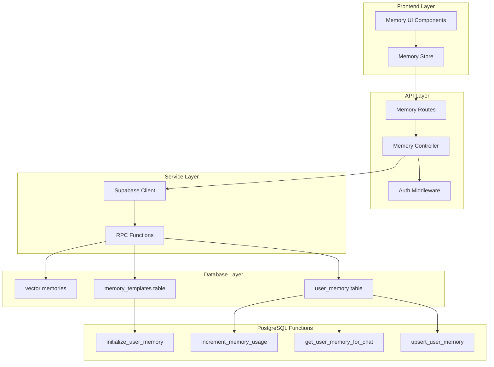

**Diagram sources**
- [memory.ts](file://apps/api/src/routes/memory.ts#L1-L14)
- [memoryController.ts](file://apps/api/src/controllers/memoryController.ts#L1-L185)
- [memoryStore.ts](file://apps/frontend/src/store/memoryStore.ts#L1-L134)

## Database Schema Design

### user_memory Table Structure

The `user_memory` table serves as the core storage mechanism for user preferences and learned behaviors:

| Field | Type | Constraints | Description |
|-------|------|-------------|-------------|
| id | UUID | PRIMARY KEY | Unique identifier for each memory entry |
| user_id | UUID | NOT NULL, FOREIGN KEY | References profiles(user_id) with CASCADE |
| memory_type | TEXT | NOT NULL, CHECK | Type of memory (preference, fact, style, context, skill, goal) |
| category | TEXT | NULLABLE | Classification category (tone, format, recurring_topic, expertise_area) |
| key | TEXT | NOT NULL, UNIQUE(user_id, key) | Unique identifier within user context |
| value | TEXT | NOT NULL | The actual content or preference value |
| metadata | JSONB | DEFAULT '{}' | Structured additional data |
| source | TEXT | DEFAULT 'explicit', CHECK | How memory was acquired (explicit, inferred, feedback, system) |
| confidence | FLOAT | DEFAULT 1.0, CHECK | Confidence level (0-1) affecting usage |
| derived_from_conversation_id | UUID | FOREIGN KEY | Reference to conversation source |
| examples | JSONB | NULLABLE | Example interactions supporting this memory |
| times_referenced | INTEGER | DEFAULT 0 | Usage counter for popularity |
| last_used_at | TIMESTAMPTZ | DEFAULT now() | Last usage timestamp |
| is_active | BOOLEAN | DEFAULT true | Active status indicator |
| expires_at | TIMESTAMPTZ | NULLABLE | Optional expiration timestamp |
| created_at | TIMESTAMPTZ | DEFAULT now() | Creation timestamp |
| updated_at | TIMESTAMPTZ | DEFAULT now() | Last update timestamp |

**Section sources**
- [003_user_memory.sql](file://apps/api/migrations/003_user_memory.sql#L8-L46)

### Index Strategy

The system employs a comprehensive indexing strategy to optimize query performance:

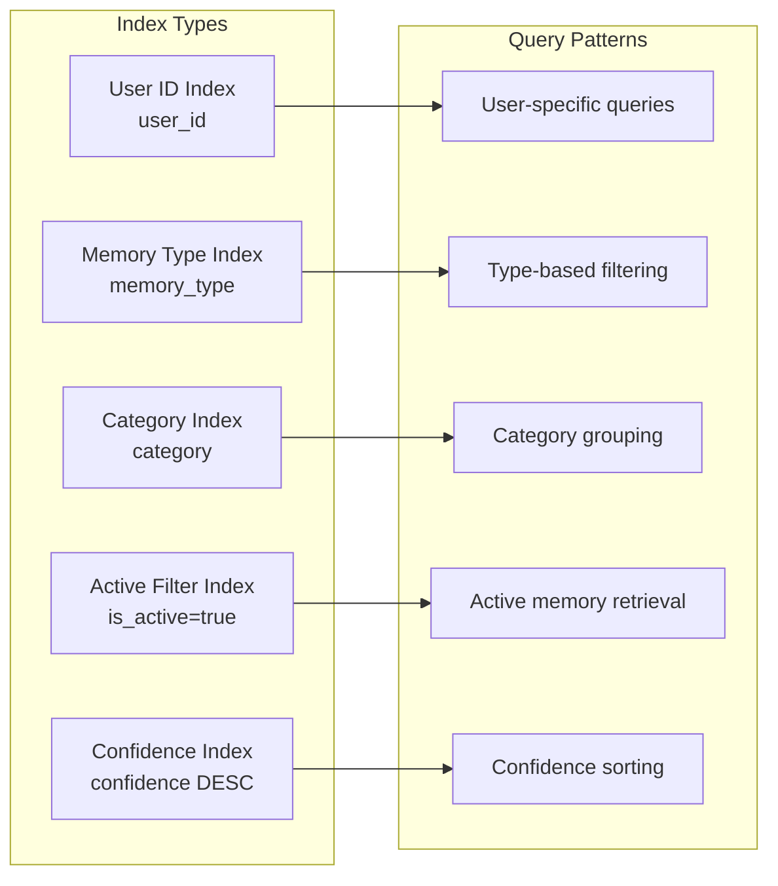

**Diagram sources**
- [003_user_memory.sql](file://apps/api/migrations/003_user_memory.sql#L48-L54)

**Section sources**
- [003_user_memory.sql](file://apps/api/migrations/003_user_memory.sql#L48-L54)

### memory_templates Table

The templates table provides default memory entries for new users:

| Field | Type | Constraints | Description |
|-------|------|-------------|-------------|
| id | UUID | PRIMARY KEY | Template identifier |
| key | TEXT | UNIQUE, NOT NULL | Template key identifier |
| default_value | TEXT | NOT NULL | Default value for template |
| memory_type | TEXT | NOT NULL | Associated memory type |
| category | TEXT | NULLABLE | Template category |
| description | TEXT | NULLABLE | Template description |
| is_active | BOOLEAN | DEFAULT true | Activation status |
| created_at | TIMESTAMPTZ | DEFAULT now() | Creation timestamp |

**Section sources**
- [003_user_memory.sql](file://apps/api/migrations/003_user_memory.sql#L141-L152)

## Core Functions and Procedures

### upsert_user_memory Function

The `upsert_user_memory` function handles both creation and updates with sophisticated conflict resolution:

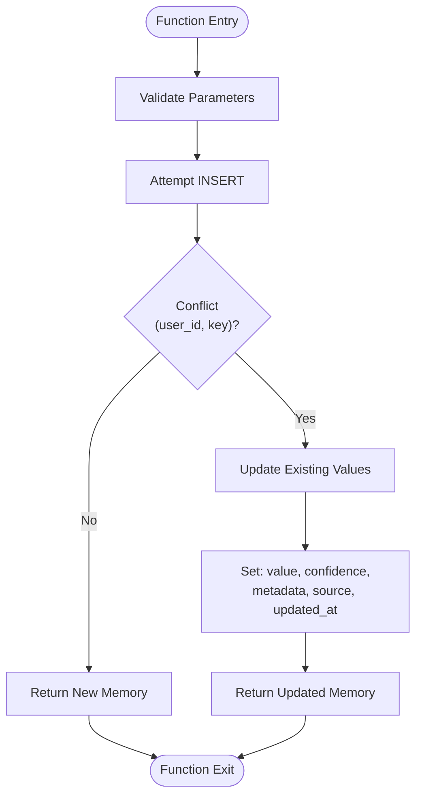

**Diagram sources**
- [003_user_memory.sql](file://apps/api/migrations/003_user_memory.sql#L106-L135)

Key features of the upsert function:
- **Atomic Operation**: Uses PostgreSQL's `ON CONFLICT` clause for atomic updates
- **Selective Updates**: Only updates changed fields to minimize database load
- **Timestamp Management**: Automatically updates `updated_at` on conflicts
- **Return Value**: Returns the complete memory object for immediate use

**Section sources**
- [003_user_memory.sql](file://apps/api/migrations/003_user_memory.sql#L106-L135)

### get_user_memory_for_chat Function

This function retrieves active memories with confidence filtering:

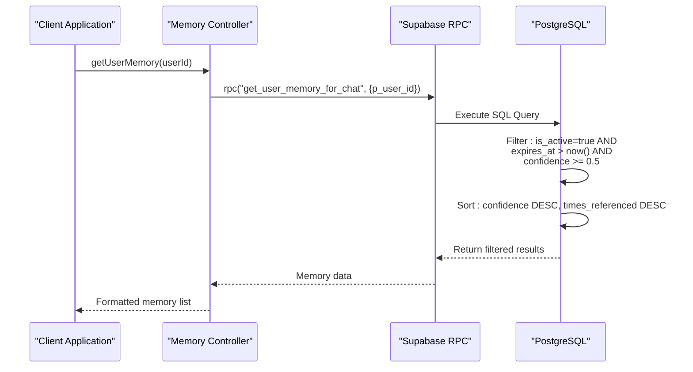

**Diagram sources**
- [memoryController.ts](file://apps/api/src/controllers/memoryController.ts#L8-L29)
- [003_user_memory.sql](file://apps/api/migrations/003_user_memory.sql#L63-L85)

**Section sources**
- [003_user_memory.sql](file://apps/api/migrations/003_user_memory.sql#L63-L85)

### System Initialization Functions

#### initialize_user_memory Function

Automatically creates default memories for new users:

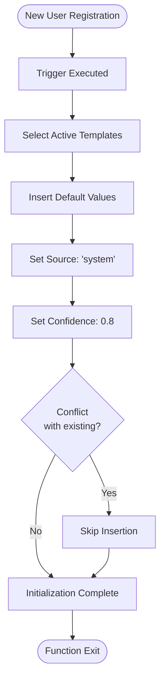

**Diagram sources**
- [003_user_memory.sql](file://apps/api/migrations/003_user_memory.sql#L166-L181)

#### Default Memory Templates

The system initializes users with four essential preferences:

| Key | Default Value | Type | Category | Description |
|-----|---------------|------|----------|-------------|
| preferred_tone | cercano y amigable | preference | communication | Friendly and approachable tone |
| preferred_language | español argentino | preference | communication | Argentine Spanish variant |
| response_length | conciso pero completo | preference | format | Concise but complete responses |
| emoji_usage | moderado | preference | style | Moderate emoji usage |

**Section sources**
- [003_user_memory.sql](file://apps/api/migrations/003_user_memory.sql#L155-L160)
- [003_user_memory.sql](file://apps/api/migrations/003_user_memory.sql#L166-L181)

### Usage Tracking Function

#### increment_memory_usage Function

Tracks memory usage patterns for optimization:

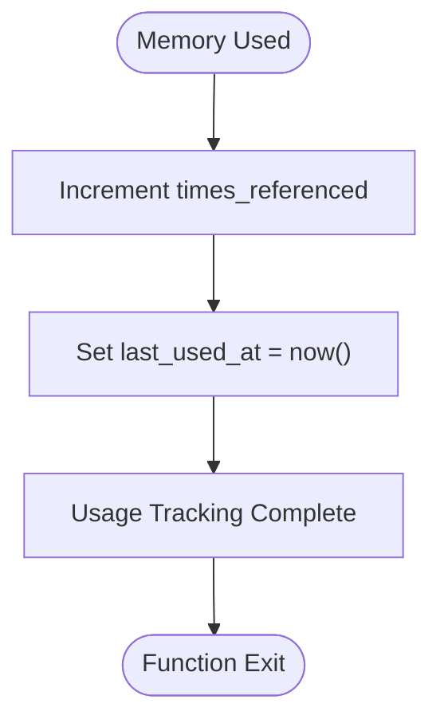

**Diagram sources**
- [003_user_memory.sql](file://apps/api/migrations/003_user_memory.sql#L92-L99)

**Section sources**
- [003_user_memory.sql](file://apps/api/migrations/003_user_memory.sql#L92-L99)

## Backend API Implementation

### Route Structure

The memory API follows RESTful conventions with specialized endpoints:

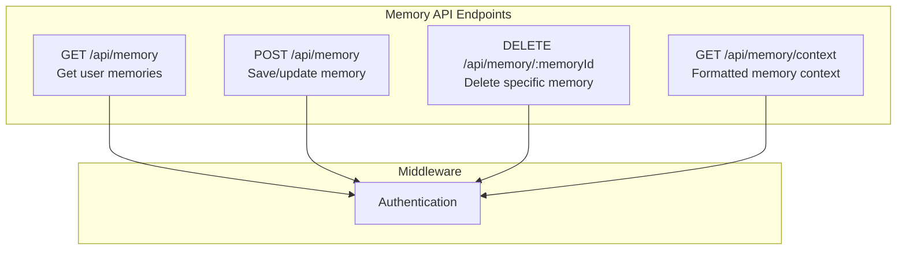

**Diagram sources**
- [memory.ts](file://apps/api/src/routes/memory.ts#L1-L14)

### Controller Implementation

#### getUserMemory Controller

Handles retrieval of user memories with comprehensive error handling:

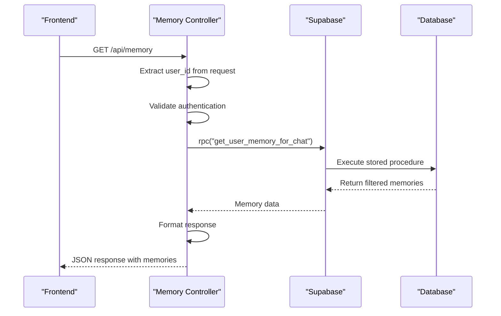

**Diagram sources**
- [memoryController.ts](file://apps/api/src/controllers/memoryController.ts#L8-L29)

#### saveMemory Controller

Implements the upsert operation with input validation:

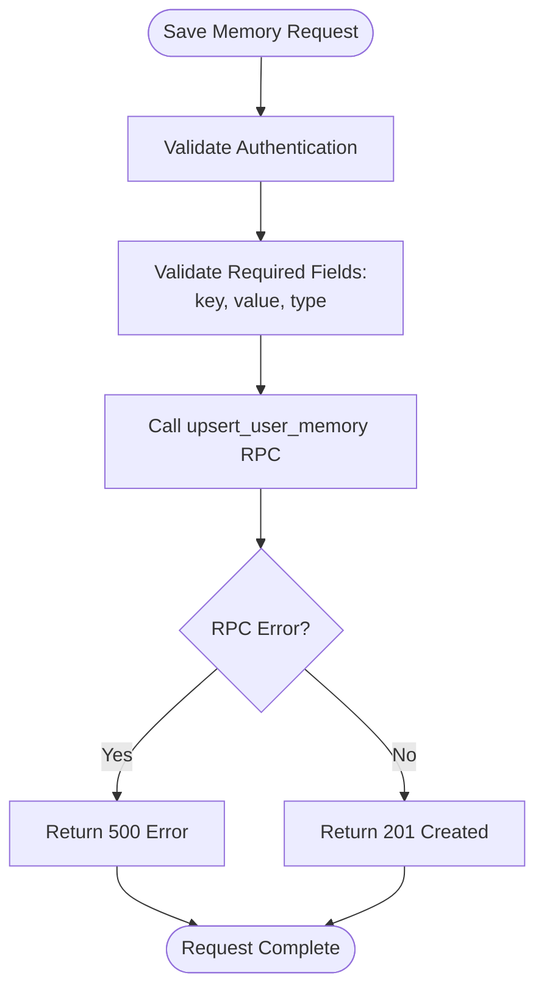

**Diagram sources**
- [memoryController.ts](file://apps/api/src/controllers/memoryController.ts#L39-L76)

**Section sources**
- [memoryController.ts](file://apps/api/src/controllers/memoryController.ts#L1-L185)

### Supabase RPC Integration

The backend communicates with PostgreSQL through Supabase's RPC system:

| RPC Function | Purpose | Parameters | Return Type |
|--------------|---------|------------|-------------|
| get_user_memory_for_chat | Retrieve active memories | p_user_id (UUID) | Table with memory fields |
| upsert_user_memory | Create or update memory | Various parameters | Full memory object |
| increment_memory_usage | Track usage | p_memory_id (UUID) | Void |

**Section sources**
- [memoryController.ts](file://apps/api/src/controllers/memoryController.ts#L18-L76)

## Frontend Integration

### Memory Store Architecture

The frontend uses Zustand for state management with comprehensive memory operations:

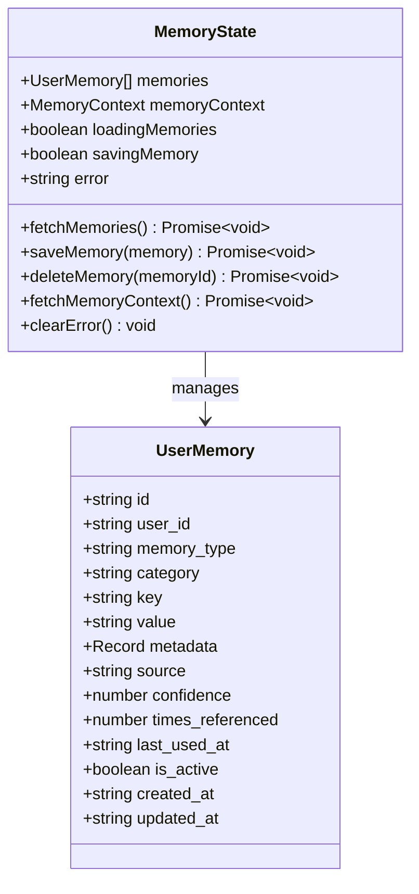

**Diagram sources**
- [memoryStore.ts](file://apps/frontend/src/store/memoryStore.ts#L4-L134)

### Memory Context Formatting

The system provides formatted memory context for AI conversations:

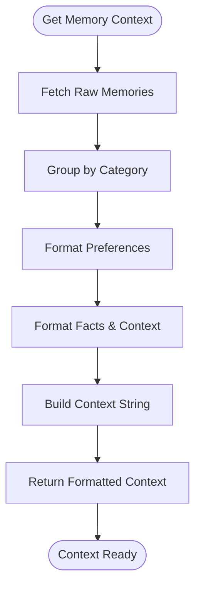

**Diagram sources**
- [memoryController.ts](file://apps/api/src/controllers/memoryController.ts#L122-L184)

**Section sources**
- [memoryStore.ts](file://apps/frontend/src/store/memoryStore.ts#L1-L134)

## Data Lifecycle Management

### Memory Types and Categories

The system organizes memories into distinct categories for different use cases:

| Memory Type | Purpose | Examples |
|-------------|---------|----------|
| preference | User preferences | Preferred tone, language, response length |
| fact | Important facts | User expertise, project context |
| style | Communication style | Emoji usage, formality level |
| context | Conversation context | Recent topics, project details |
| skill | Expertise areas | Technical skills, domains |
| goal | User goals | Project objectives, learning targets |

### Confidence Threshold System

The system uses a confidence-based filtering mechanism:

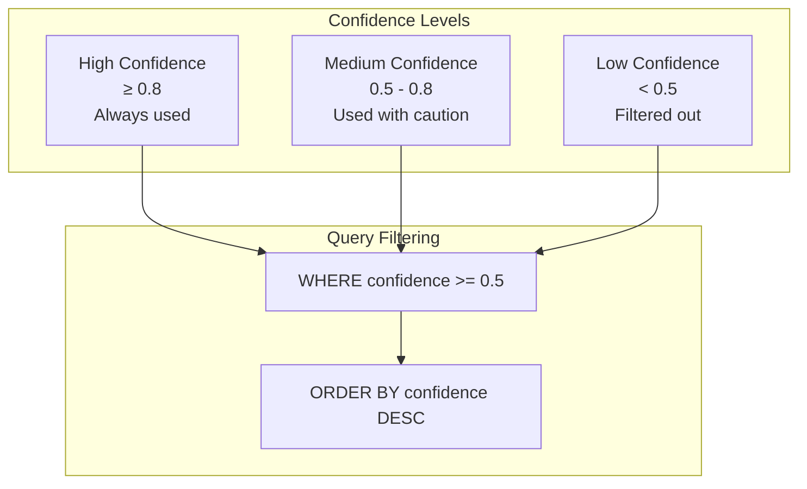

**Diagram sources**
- [003_user_memory.sql](file://apps/api/migrations/003_user_memory.sql#L83-L84)

### Expiration and Cleanup

Memory entries can have expiration dates for temporary context:

- **Permanent Memories**: Stored indefinitely with no expiration
- **Temporary Memories**: Can be set with `expires_at` timestamps
- **Automatic Cleanup**: System periodically removes expired entries

**Section sources**
- [003_user_memory.sql](file://apps/api/migrations/003_user_memory.sql#L80-L83)

## Performance Optimization

### Query Optimization Strategies

#### Index Utilization

The system leverages multiple indexes for optimal performance:

| Index Type | Columns | Query Pattern | Benefit |
|------------|---------|---------------|---------|
| Single Column | user_id | User-specific queries | Fast user isolation |
| Composite | (user_id, key) | Upsert operations | Atomic conflict detection |
| Range | confidence DESC | Confidence sorting | Efficient filtering |
| Conditional | is_active WHERE true | Active memory queries | Reduced result sets |

#### Function Optimization

Stored procedures are optimized for performance:

- **Minimal Data Transfer**: Functions return only necessary data
- **Batch Operations**: Bulk operations reduce round trips
- **Index-Only Scans**: Queries can use indexes without table access

### Caching Strategies

While the system doesn't implement explicit caching, several factors contribute to good performance:

- **Database-Level Caching**: PostgreSQL automatically caches frequently accessed data
- **Connection Pooling**: Supabase manages connection pools efficiently
- **Function Caching**: PostgreSQL caches compiled function plans

**Section sources**
- [003_user_memory.sql](file://apps/api/migrations/003_user_memory.sql#L48-L54)

## Security and Access Control

### Row Level Security (RLS)

The system implements strict access controls:

```mermaid
graph TD
subgraph "Access Control Layers"
Auth[Authentication<br/>JWT Token Validation]
RLS[Row Level Security<br/>User Isolation]
Policies[Access Policies<br/>CRUD Operations]
end
subgraph "Policy Enforcement"
Read[SELECT: user_id = auth.uid()]
Write[INSERT/UPDATE/DELETE:<br/>user_id = auth.uid()]
Admin[Admin Access:<br/>Superuser privileges]
end
Auth --> RLS
RLS --> Policies
Policies --> Read
Policies --> Write
Policies --> Admin
```

### Data Isolation

Each user can only access their own memory data:

- **Read Operations**: Automatically filtered by `user_id`
- **Write Operations**: Enforced at database level
- **Cross-User Protection**: Impossible to access another user's memories

### Audit Trail

The system maintains comprehensive audit information:

- **Created At**: Automatic timestamp tracking
- **Updated At**: Modification timestamp
- **Last Used At**: Usage tracking for optimization
- **Times Referenced**: Popularity metrics

**Section sources**
- [supabase.ts](file://apps/api/src/config/supabase.ts#L1-L29)

## Common Issues and Solutions

### Data Consistency During Concurrent Updates

**Problem**: Multiple simultaneous updates to the same memory entry

**Solution**: PostgreSQL's `ON CONFLICT` clause ensures atomic updates:

```sql
-- Atomic upsert operation prevents race conditions
INSERT INTO user_memory (...) VALUES (...)
ON CONFLICT (user_id, key) DO UPDATE SET ...
```

### Memory Initialization Failures

**Problem**: New users not receiving default memories

**Solution**: The system includes robust initialization:

- **Trigger-based**: Automatic initialization on user creation
- **Batch processing**: Backfill existing users during migration
- **Conflict handling**: `ON CONFLICT (user_id, key) DO NOTHING`

### Performance Degradation

**Problem**: Slow memory retrieval for users with many memories

**Solution**: Multiple optimization strategies:

- **Confidence filtering**: `confidence >= 0.5` reduces result set
- **Index utilization**: Proper indexes prevent full table scans
- **Function optimization**: Stored procedures minimize data transfer

### Memory Context Formatting Issues

**Problem**: Poorly formatted memory context for AI

**Solution**: Structured formatting approach:

```typescript
// Categories are grouped and formatted consistently
const contextStrings = [
  "Preferencias del usuario:",
  ...preferences.map(p => `- ${p.key}: ${p.value}`),
  "\nContexto importante:",
  ...facts.map(f => `- ${f.value}`)
];
```

**Section sources**
- [memoryController.ts](file://apps/api/src/controllers/memoryController.ts#L140-L170)

## Best Practices

### Memory Design Guidelines

1. **Unique Keys**: Ensure memory keys are unique within user context
2. **Meaningful Categories**: Use descriptive categories for easy organization
3. **Appropriate Confidence**: Set realistic confidence levels based on data source
4. **Regular Cleanup**: Implement cleanup policies for temporary memories

### API Usage Patterns

1. **Batch Operations**: Group related memory updates
2. **Error Handling**: Implement comprehensive error handling
3. **Validation**: Validate input data before database operations
4. **Caching**: Consider client-side caching for frequently accessed data

### Security Considerations

1. **Input Validation**: Sanitize all user inputs
2. **Access Control**: Verify user ownership for all operations
3. **Audit Logging**: Monitor memory access patterns
4. **Rate Limiting**: Implement rate limits for memory operations

### Performance Optimization

1. **Index Usage**: Leverage appropriate indexes for query patterns
2. **Query Optimization**: Use efficient query patterns
3. **Connection Management**: Optimize database connections
4. **Monitoring**: Track performance metrics

## Troubleshooting Guide

### Common Error Scenarios

#### Authentication Failures

**Symptoms**: 401 Unauthorized responses
**Causes**: Invalid or missing JWT tokens
**Solutions**: 
- Verify authentication middleware is configured
- Check JWT token validity and expiration
- Ensure proper header formatting

#### Memory Upsert Failures

**Symptoms**: 500 Internal Server errors on save
**Causes**: Database constraint violations, network issues
**Solutions**:
- Check database connectivity
- Verify memory key uniqueness
- Review database logs for specific errors

#### Slow Memory Retrieval

**Symptoms**: High latency on memory requests
**Causes**: Missing indexes, large result sets
**Solutions**:
- Verify index creation
- Check query execution plans
- Consider result set pagination

### Diagnostic Steps

1. **Check Database Connectivity**: Verify Supabase connection
2. **Review Logs**: Examine application and database logs
3. **Test Queries**: Run database queries manually
4. **Monitor Performance**: Use monitoring tools
5. **Validate Data**: Check data integrity and constraints

### Recovery Procedures

#### Database Recovery

1. **Backup Verification**: Ensure recent backups are available
2. **Rollback Planning**: Prepare rollback procedures
3. **Data Validation**: Verify data integrity after recovery
4. **Service Restoration**: Gradually restore services

#### Application Recovery

1. **Service Restart**: Restart affected services
2. **Cache Clearing**: Clear application caches
3. **Health Checks**: Verify system health
4. **Monitoring**: Monitor for issues

**Section sources**
- [memoryController.ts](file://apps/api/src/controllers/memoryController.ts#L21-L32)
- [memoryController.ts](file://apps/api/src/controllers/memoryController.ts#L69-L72)