# Onboarding System

<cite>
**Referenced Files in This Document**   
- [Onboarding.tsx](file://apps/frontend/src/pages/Onboarding.tsx)
- [onboardingStore.ts](file://apps/frontend/src/store/onboardingStore.ts)
- [004_onboarding.sql](file://apps/api/migrations/004_onboarding.sql)
- [authStore.ts](file://apps/frontend/src/store/authStore.ts)
- [Register.tsx](file://apps/frontend/src/pages/Register.tsx)
- [Login.tsx](file://apps/frontend/src/pages/Login.tsx)
- [RootGuard.tsx](file://apps/frontend/src/components/RootGuard.tsx)
</cite>

## Table of Contents

1. [Introduction](#introduction)
2. [Onboarding Workflow](#onboarding-workflow)
3. [User Progress Tracking](#user-progress-tracking)
4. [Interactive Tips Management](#interactive-tips-management)
5. [Permission Handling](#permission-handling)
6. [Technical Architecture](#technical-architecture)
7. [Configuration Options](#configuration-options)
8. [Accessibility Considerations](#accessibility-considerations)
9. [Best Practices](#best-practices)
10. [Troubleshooting Guide](#troubleshooting-guide)

## Introduction

The WADI onboarding system provides a comprehensive user experience for new users, guiding them through account creation, initial configuration, and first interactions with the AI assistant. The system is designed to be intuitive and informative, helping users understand WADI's key features and capabilities from the moment they sign up. The onboarding process combines user progress tracking, interactive tips, and permission handling to create a seamless introduction to the platform.

The system is fully implemented and documented, with a complete database schema for tracking, an event system for analytics, and a well-defined user interface flow. The onboarding experience is designed to be accessible and engaging, using animations and clear messaging to guide users through the initial setup process.

## Onboarding Workflow

The WADI onboarding workflow begins when a new user creates an account and progresses through a series of guided steps designed to introduce key features and functionality. The workflow starts with account creation through the Register page, where users provide their email, password, and display name. After successful registration, users are automatically logged in and directed to the onboarding flow.

The onboarding process consists of multiple steps that highlight WADI's core capabilities, including AI interaction, workspace organization, and productivity features. Users can complete the onboarding by clicking the "Get Started" button, which marks the onboarding as complete and redirects them to the projects page. Users also have the option to skip the onboarding process if they prefer to explore the platform immediately.

The workflow is protected by authentication guards that ensure users are properly authenticated before accessing protected routes. The RootGuard component handles route protection, redirecting unauthenticated users to the login page and authenticated users to the appropriate destination based on their onboarding status.

**Section sources**

- [Register.tsx](file://apps/frontend/src/pages/Register.tsx#L1-L207)
- [Onboarding.tsx](file://apps/frontend/src/pages/Onboarding.tsx#L1-L163)
- [RootGuard.tsx](file://apps/frontend/src/components/RootGuard.tsx#L1-L76)

## User Progress Tracking

WADI's user progress tracking system monitors and records users' completion of the onboarding process through a combination of client-side state management and server-side database tracking. The system uses a dedicated onboarding store implemented with Zustand and persisted to local storage, which maintains the user's onboarding completion status.

The frontend onboarding store contains a simple state interface with a boolean flag `hasCompletedOnboarding` and methods to complete or reset the onboarding process. When a user completes the onboarding flow, the `completeOnboarding` method updates the local state and persists this change to storage, ensuring the user won't see the onboarding flow on subsequent visits.

On the server side, the system extends the profiles table with onboarding-specific columns including `onboarding_completed`, `onboarding_step`, `onboarding_completed_at`, `first_login_at`, `last_login_at`, and `login_count`. These fields provide comprehensive tracking of user progress through the onboarding process and overall engagement with the platform.

Additionally, the system implements an onboarding_events table that records detailed analytics about user interactions during onboarding. This table captures events such as 'onboarding_started', 'step_viewed', 'step_completed', 'onboarding_completed', 'onboarding_skipped', 'permission_requested', 'permission_granted', and 'permission_denied', allowing for detailed analysis of user behavior and onboarding effectiveness.

**Section sources**

- [onboardingStore.ts](file://apps/frontend/src/store/onboardingStore.ts#L1-L28)
- [004_onboarding.sql](file://apps/api/migrations/004_onboarding.sql#L8-L21)

## Interactive Tips Management

The interactive tips management system in WADI provides users with contextual guidance and suggestions during their initial experience with the platform. The system is designed to help users discover key features and best practices for interacting with the AI assistant.

The backend implements a first_time_tips table that stores predefined tips with attributes including tip_key, title, description, example_prompt, display_order, is_active, and created_at. These tips cover essential aspects of using WADI, such as using natural language for communication, understanding the dynamic workspace creation, and upcoming features like file uploads and voice input.

To track which tips users have seen, the system includes a user_tips_seen table that records when a user has viewed a specific tip. This prevents redundant tip displays and allows the system to prioritize showing new or unseen tips to users. The table establishes a relationship between users and tips with a composite unique constraint on user_id and tip_id.

The frontend can query these tips and display them to users at appropriate times, such as when they first access certain features or when they reach specific milestones in their usage. The tips are designed to be non-intrusive but informative, helping users get the most value from WADI without overwhelming them with information.

**Diagram sources**

- [004_onboarding.sql](file://apps/api/migrations/004_onboarding.sql#L119-L155)

**Section sources**

- [004_onboarding.sql](file://apps/api/migrations/004_onboarding.sql#L119-L155)

## Permission Handling

WADI's permission handling system manages user consent for accessing device features such as microphone, camera, notifications, and location. The system is designed to request permissions at appropriate times during the user journey, providing clear explanations of why each permission is needed and how it will enhance the user experience.

The backend implements a user_permissions table that tracks the status of various permissions for each user. The table includes fields for permission_type (restricted to 'microphone', 'camera', 'notifications', 'location'), status (with values 'pending', 'granted', 'denied', 'revoked'), timestamps for when permissions were requested, granted, or denied, and metadata for additional context.

This structured approach allows the system to:

- Track the current status of each permission
- Remember user decisions across sessions
- Provide appropriate UI prompts based on permission status
- Respect user privacy by only requesting necessary permissions
- Handle permission changes and revocations appropriately

The system also logs permission-related events in the onboarding_events table, capturing 'permission_requested', 'permission_granted', and 'permission_denied' events with relevant metadata. This provides valuable analytics for understanding user behavior regarding permissions and identifying potential friction points in the onboarding flow.

**Diagram sources**

- [004_onboarding.sql](file://apps/api/migrations/004_onboarding.sql#L56-L81)

**Section sources**

- [004_onboarding.sql](file://apps/api/migrations/004_onboarding.sql#L56-L81)

## Technical Architecture

The WADI onboarding system is built on a robust technical architecture that integrates frontend and backend components to create a seamless user experience. The system follows a client-server model with React-based frontend components communicating with a Node.js/Express backend through API endpoints, with data persisted in a PostgreSQL database via Supabase.

The frontend architecture uses React with TypeScript, leveraging React Router for navigation and Zustand for state management. The onboarding flow is implemented as a dedicated page component (Onboarding.tsx) that guides users through the initial setup process. State persistence is handled by Zustand's middleware, which stores onboarding completion status in the browser's local storage.

The backend architecture extends the existing Supabase database with onboarding-specific tables and functions. The system uses database migrations to ensure schema consistency across environments, with the 004_onboarding.sql migration file containing all necessary database changes. The backend also implements helper functions like complete_user_onboarding and record_user_login to encapsulate common operations and maintain data integrity.

Authentication is handled through Supabase Auth, with the system creating user profiles and associated data when new users register. The authStore.ts file manages authentication state on the frontend, handling sign-in, sign-up, and sign-out operations while maintaining user session information.

```mermaid
graph TD
A[User] --> B[Frontend]
B --> C[Onboarding UI]
C --> D[Zustand Store]
D --> E[Local Storage]
B --> F[API Calls]
F --> G[Backend]
G --> H[Supabase Auth]
G --> I[PostgreSQL Database]
I --> J[profiles Table]
I --> K[onboarding_events Table]
I --> L[user_permissions Table]
I --> M[first_time_tips Table]
I --> N[user_tips_seen Table]
H --> J
G --> H
F --> G
```

**Diagram sources**

- [Onboarding.tsx](file://apps/frontend/src/pages/Onboarding.tsx#L1-L163)
- [onboardingStore.ts](file://apps/frontend/src/store/onboardingStore.ts#L1-L28)
- [004_onboarding.sql](file://apps/api/migrations/004_onboarding.sql#L1-L156)
- [authStore.ts](file://apps/frontend/src/store/authStore.ts#L1-L151)

**Section sources**

- [Onboarding.tsx](file://apps/frontend/src/pages/Onboarding.tsx#L1-L163)
- [onboardingStore.ts](file://apps/frontend/src/store/onboardingStore.ts#L1-L28)
- [004_onboarding.sql](file://apps/api/migrations/004_onboarding.sql#L1-L156)
- [authStore.ts](file://apps/frontend/src/store/authStore.ts#L1-L151)

## Configuration Options

The WADI onboarding system provides several configuration options that can be adjusted to customize the user experience. These options are primarily controlled through environment variables and feature flags, allowing for flexible deployment across different environments.

The system supports guest mode, which can be enabled through the VITE_GUEST_MODE environment variable. When guest mode is active, users are directed to the chat interface without requiring authentication, allowing for immediate interaction with the AI assistant.

Feature flags are used to control the availability of certain features during onboarding. For example, the commandPalette flag determines whether the command palette functionality is available to users. These flags can be managed through the getFlag function in the featureFlags utility, allowing for gradual feature rollouts and A/B testing.

The onboarding flow itself can be configured through the database, with the ability to modify tips, their display order, and activation status without requiring code changes. This allows product managers and designers to iterate on the onboarding content and sequence based on user feedback and analytics.

Additionally, the system supports internationalization through the i18n configuration, with language files for different locales stored in the locales directory. This enables the onboarding content to be presented in multiple languages, improving accessibility for non-English speakers.

**Section sources**

- [RootLayout.tsx](file://apps/frontend/src/layouts/RootLayout.tsx#L1-L42)
- [featureFlags.ts](file://apps/frontend/src/utils/featureFlags.ts)
- [i18n.ts](file://apps/frontend/src/i18n.ts)

## Accessibility Considerations

The WADI onboarding system incorporates several accessibility features to ensure an inclusive user experience. The design follows accessibility best practices, with appropriate color contrast ratios, focus states, and touch target sizes.

The system maintains high color contrast ratios, with primary text on white backgrounds achieving 15.8:1 (AAA compliant) and secondary text achieving 4.6:1 (AA compliant). These ratios ensure readability for users with visual impairments.

Focus states are clearly defined with a 2px solid outline of the primary blue color (#255FF5) and a 2px offset, making it easy for keyboard users to track their position in the interface. This is particularly important during the onboarding flow, where users need to navigate between form fields and action buttons.

Touch target sizes are optimized for mobile devices, with minimum sizes of 44px × 44px for interactive elements. Bottom navigation items are sized at 48px × 56px, and workspace cards provide a minimum touch area of 80px × 80px, reducing the likelihood of mis-taps on smaller screens.

The onboarding interface uses semantic HTML and ARIA attributes where appropriate, with proper labeling of form fields and buttons. The use of motion and animations is implemented with user preferences in mind, following the reduce motion principle for users who have indicated a preference for reduced motion in their operating system settings.

**Section sources**

- [DESIGN_SPECS.md](file://DESIGN_SPECS.md#L572-L598)

## Best Practices

To create an effective onboarding experience in WADI, several best practices should be followed:

1. **Progressive Disclosure**: Present information and features gradually, avoiding overwhelming users with too much information at once. The current three-step onboarding flow exemplifies this principle by focusing on key features sequentially.

2. **Clear Value Proposition**: Immediately communicate the core benefits of WADI, as demonstrated by the feature highlights in the onboarding interface that emphasize AI intelligence, workspace organization, and productivity enhancements.

3. **Contextual Guidance**: Provide tips and suggestions at the appropriate moment in the user journey, rather than presenting all information upfront. The first_time_tips system supports this by allowing tips to be shown when relevant.

4. **Permission Timing**: Request permissions at the point of need, with clear explanations of why the permission is required and how it will improve the user experience. This builds trust and increases the likelihood of users granting permissions.

5. **User Control**: Allow users to skip or exit the onboarding process if they prefer to explore the platform independently. The "Skip for now" option in the onboarding flow respects user autonomy.

6. **Consistent Design Language**: Maintain a consistent visual design and interaction pattern throughout the onboarding process, using the same color scheme, typography, and component styles as the rest of the application.

7. **Performance Optimization**: Ensure the onboarding process is fast and responsive, minimizing loading times and providing feedback during asynchronous operations.

8. **Analytics-Driven Iteration**: Use the onboarding_events data to analyze user behavior, identify drop-off points, and continuously improve the onboarding flow based on real user data.

## Troubleshooting Guide

When troubleshooting issues with the WADI onboarding system, consider the following common scenarios and solutions:

1. **Users not progressing past onboarding**: Verify that the onboarding completion state is being properly persisted in local storage. Check the browser's developer tools to confirm that the Zustand store is updating correctly when the completeOnboarding method is called.

2. **Permission requests not appearing**: Ensure that the user_permissions table is properly populated and that the frontend logic for requesting permissions is triggered at the appropriate time. Check that the permission_type values match exactly with those defined in the database schema.

3. **Tips not displaying**: Verify that the first_time_tips table contains active tips and that the user_tips_seen table is correctly tracking which tips users have seen. Check that the display_order values are set appropriately to control the sequence of tip presentation.

4. **Authentication issues during onboarding**: Confirm that the Supabase authentication flow is working correctly and that user profiles are being created in the database. Check the network tab in developer tools to verify that API calls are succeeding and that authentication tokens are being properly handled.

5. **Localization problems**: Ensure that the appropriate language files are present in the locales directory and that the i18n configuration is correctly set up. Verify that translation keys used in the onboarding interface match those defined in the language files.

6. **Analytics data not recording**: Check that the onboarding_events table is receiving data and that the event_type values match the expected enumeration. Verify that the database functions for recording events are properly implemented and accessible.

**Section sources**

- [onboardingStore.ts](file://apps/frontend/src/store/onboardingStore.ts#L1-L28)
- [004_onboarding.sql](file://apps/api/migrations/004_onboarding.sql#L1-L156)
- [authStore.ts](file://apps/frontend/src/store/authStore.ts#L1-L151)
