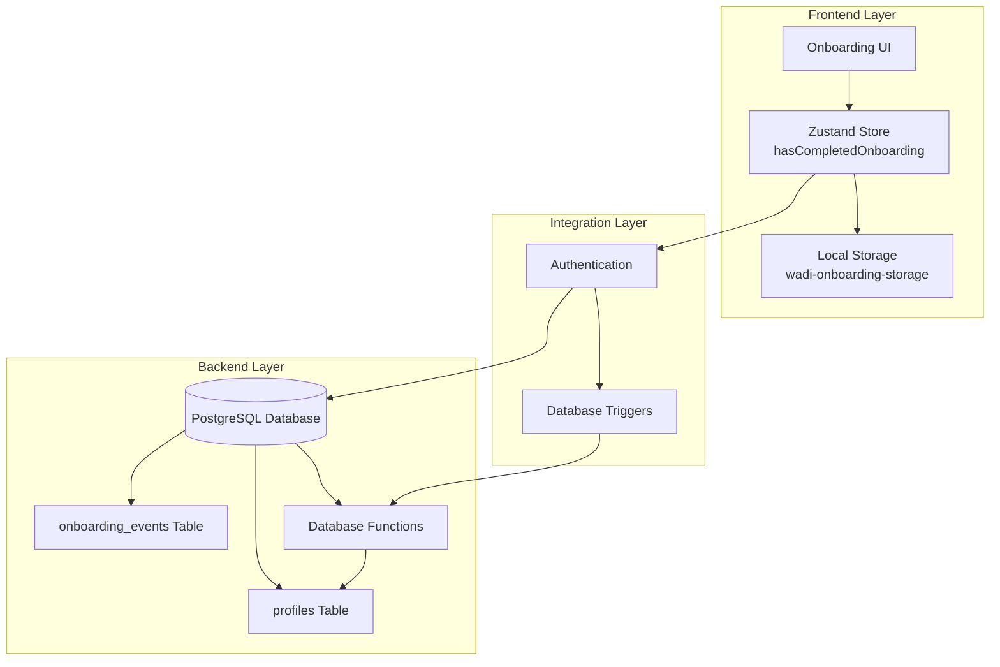
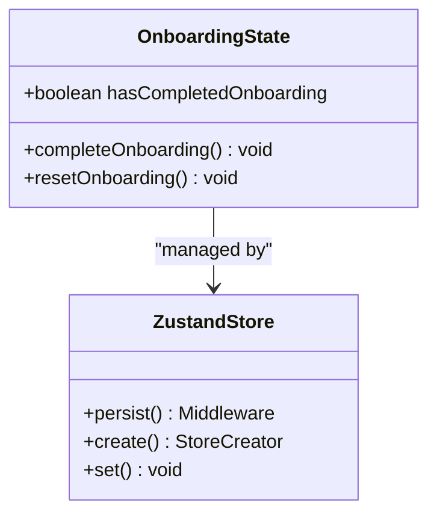
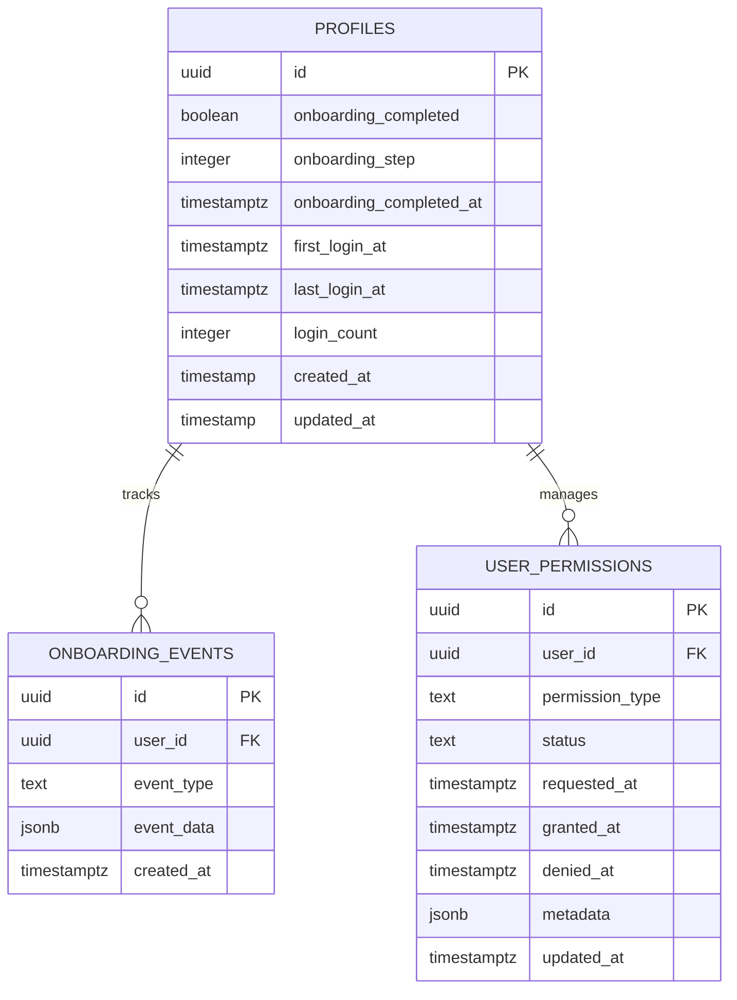
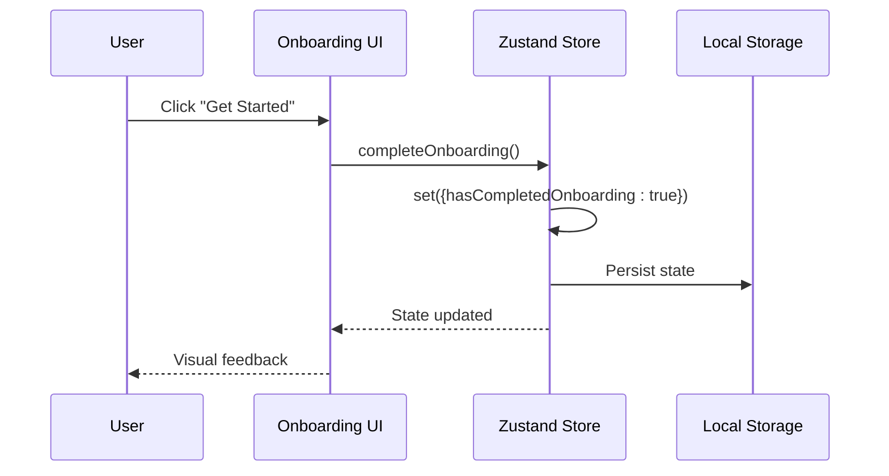
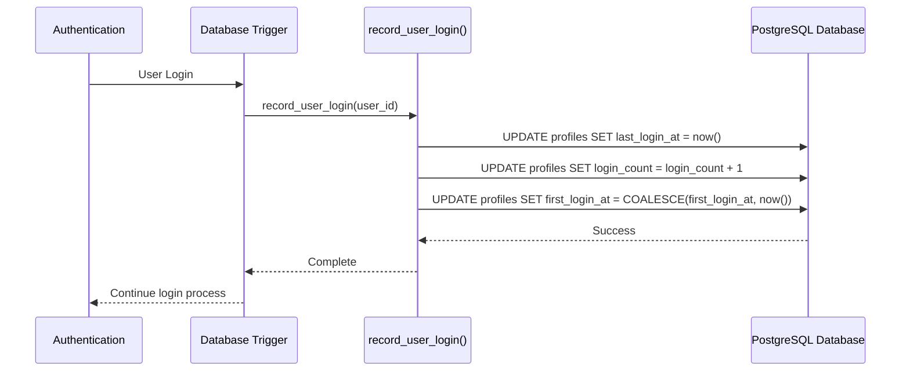
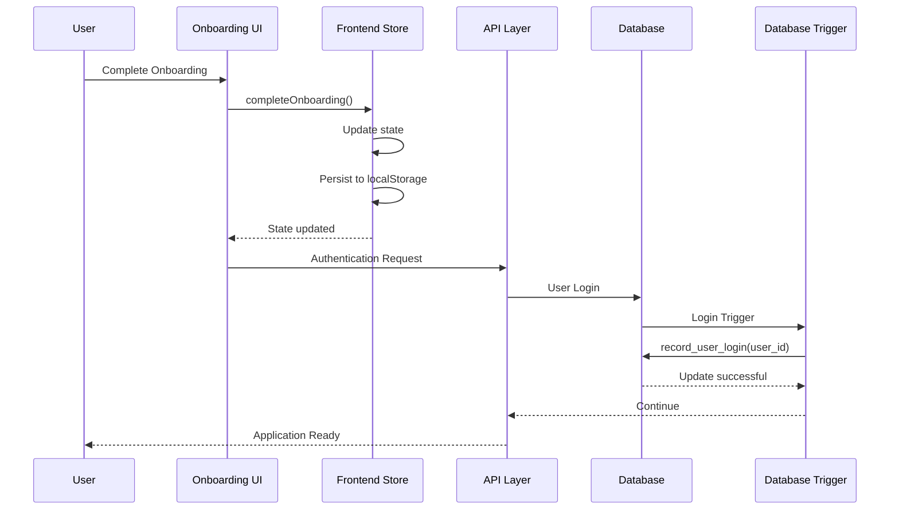

# User Progress Tracking

<cite>
**Referenced Files in This Document**
- [onboardingStore.ts](file://apps/frontend/src/store/onboardingStore.ts)
- [Onboarding.tsx](file://apps/frontend/src/pages/Onboarding.tsx)
- [004_onboarding.sql](file://apps/api/migrations/004_onboarding.sql)
- [authStore.ts](file://apps/frontend/src/store/authStore.ts)
- [RootGuard.tsx](file://apps/frontend/src/components/RootGuard.tsx)
- [userController.ts](file://apps/api/src/controllers/userController.ts)
- [P5_P9_IMPLEMENTATION_PLAN.md](file://P5_P9_IMPLEMENTATION_PLAN.md)
- [COMPLETE_IMPLEMENTATION_REPORT.md](file://COMPLETE_IMPLEMENTATION_REPORT.md)
</cite>

## Table of Contents

1. [Introduction](#introduction)
2. [System Architecture Overview](#system-architecture-overview)
3. [Frontend State Management](#frontend-state-management)
4. [Backend Database Schema](#backend-database-schema)
5. [Dual-Layer Persistence Strategy](#dual-layer-persistence-strategy)
6. [Complete Onboarding Flow](#complete-onboarding-flow)
7. [Database Functions and Triggers](#database-functions-and-triggers)
8. [Data Flow Analysis](#data-flow-analysis)
9. [Common Issues and Solutions](#common-issues-and-solutions)
10. [Implementation Best Practices](#implementation-best-practices)
11. [Troubleshooting Guide](#troubleshooting-guide)
12. [Conclusion](#conclusion)

## Introduction

The User Progress Tracking system in WADI implements a sophisticated dual-layer persistence strategy for onboarding completion tracking. This system ensures seamless synchronization between frontend state management and backend database persistence, providing reliable user progress tracking across the entire onboarding experience.

The system consists of two primary components: a Zustand-powered persistent store for immediate frontend state management and a PostgreSQL database schema with specialized tracking columns and functions for long-term persistence and analytics. This architecture enables real-time user feedback while maintaining data integrity and enabling comprehensive onboarding analytics.

## System Architecture Overview

The User Progress Tracking system follows a layered architecture that separates concerns between immediate user interface responsiveness and long-term data persistence.



**Diagram sources**

- [onboardingStore.ts](file://apps/frontend/src/store/onboardingStore.ts#L1-L28)
- [004_onboarding.sql](file://apps/api/migrations/004_onboarding.sql#L1-L156)

## Frontend State Management

### Zustand Store Implementation

The frontend state management utilizes Zustand with persistence middleware to maintain onboarding completion status across browser sessions.



**Diagram sources**

- [onboardingStore.ts](file://apps/frontend/src/store/onboardingStore.ts#L4-L8)

The store defines three core properties:

- **hasCompletedOnboarding**: Boolean flag indicating whether the user has completed the onboarding process
- **completeOnboarding()**: Action that sets the completion flag to true
- **resetOnboarding()**: Action that resets the completion flag to false

**Section sources**

- [onboardingStore.ts](file://apps/frontend/src/store/onboardingStore.ts#L1-L28)

### Complete Onboarding Action

The `completeOnboarding()` action represents the core functionality for marking onboarding as complete. This action performs an immediate state update that triggers UI re-rendering and persists the change to local storage.

**Section sources**

- [onboardingStore.ts](file://apps/frontend/src/store/onboardingStore.ts#L15-L17)
- [Onboarding.tsx](file://apps/frontend/src/pages/Onboarding.tsx#L28-L30)

## Backend Database Schema

### Enhanced Profiles Table

The database schema enhancement adds several columns to track onboarding progress comprehensively:

| Column                    | Type        | Default | Purpose                                 |
| ------------------------- | ----------- | ------- | --------------------------------------- |
| `onboarding_completed`    | BOOLEAN     | false   | Tracks final onboarding completion      |
| `onboarding_step`         | INTEGER     | 0       | Current step in onboarding (0-based)    |
| `onboarding_completed_at` | TIMESTAMPTZ | NULL    | Timestamp when onboarding was completed |
| `first_login_at`          | TIMESTAMPTZ | NULL    | First login timestamp                   |
| `last_login_at`           | TIMESTAMPTZ | NULL    | Most recent login timestamp             |
| `login_count`             | INTEGER     | 0       | Total number of logins                  |



**Diagram sources**

- [004_onboarding.sql](file://apps/api/migrations/004_onboarding.sql#L8-L14)
- [004_onboarding.sql](file://apps/api/migrations/004_onboarding.sql#L26-L46)

**Section sources**

- [004_onboarding.sql](file://apps/api/migrations/004_onboarding.sql#L8-L14)

### Onboarding Events Table

The onboarding_events table captures detailed analytics about the onboarding process:

| Event Type             | Description                | Data Structure       |
| ---------------------- | -------------------------- | -------------------- |
| `onboarding_started`   | User begins onboarding     | `{}`                 |
| `step_viewed`          | User views a specific step | `{step_number: int}` |
| `step_completed`       | User completes a step      | `{step_number: int}` |
| `onboarding_completed` | User finishes onboarding   | `{}`                 |
| `onboarding_skipped`   | User skips onboarding      | `{}`                 |
| `permission_requested` | Permission requested       | `{type: string}`     |
| `permission_granted`   | Permission granted         | `{type: string}`     |
| `permission_denied`    | Permission denied          | `{type: string}`     |

**Section sources**

- [004_onboarding.sql](file://apps/api/migrations/004_onboarding.sql#L26-L46)

## Dual-Layer Persistence Strategy

### Frontend Persistence Layer

The frontend uses Zustand's persistence middleware to maintain state in localStorage, providing immediate feedback and offline capability:



**Diagram sources**

- [onboardingStore.ts](file://apps/frontend/src/store/onboardingStore.ts#L15-L17)
- [Onboarding.tsx](file://apps/frontend/src/pages/Onboarding.tsx#L28-L30)

### Backend Persistence Layer

The backend maintains persistent state through database updates triggered by various system events:



**Diagram sources**

- [004_onboarding.sql](file://apps/api/migrations/004_onboarding.sql#L104-L113)

**Section sources**

- [004_onboarding.sql](file://apps/api/migrations/004_onboarding.sql#L104-L113)

## Complete Onboarding Flow

### UI Interaction Flow

The onboarding completion process follows a specific sequence from user interaction to state persistence:

```mermaid
flowchart TD
Start([User Clicks "Get Started"]) --> CallAction["Call completeOnboarding()"]
CallAction --> UpdateState["Update Zustand State"]
UpdateState --> PersistLocal["Persist to Local Storage"]
PersistLocal --> Navigate["Navigate to /projects"]
Navigate --> CheckAuth["Check Authentication Status"]
CheckAuth --> Authenticated{"Authenticated?"}
Authenticated --> |Yes| LoadApp["Load Application"]
Authenticated --> |No| Redirect["Redirect to Login"]
LoadApp --> Complete([Onboarding Complete])
Redirect --> Complete
```

**Diagram sources**

- [Onboarding.tsx](file://apps/frontend/src/pages/Onboarding.tsx#L28-L31)

**Section sources**

- [Onboarding.tsx](file://apps/frontend/src/pages/Onboarding.tsx#L1-L163)

### State Synchronization Mechanism

The system ensures synchronization between frontend and backend states through multiple mechanisms:

1. **Immediate Frontend Updates**: Zustand state updates are immediate and trigger UI re-rendering
2. **Persistence Layer**: Local storage ensures state survives browser refreshes
3. **Authentication Integration**: The RootGuard component checks authentication state
4. **Database Triggers**: Automatic database updates on user actions

**Section sources**

- [RootGuard.tsx](file://apps/frontend/src/components/RootGuard.tsx#L1-L76)

## Database Functions and Triggers

### record_user_login Function

The `record_user_login()` function handles automatic login tracking and user state updates:

```sql
CREATE OR REPLACE FUNCTION record_user_login(p_user_id UUID)
RETURNS void AS $$
BEGIN
  UPDATE profiles SET
    last_login_at = now(),
    login_count = login_count + 1,
    first_login_at = COALESCE(first_login_at, now())
  WHERE user_id = p_user_id;
END;
$$ LANGUAGE plpgsql;
```

This function performs three critical updates:

- Sets the `last_login_at` timestamp to the current time
- Increments the `login_count` by 1
- Sets `first_login_at` only if it's currently NULL (ensures first login is captured)

**Section sources**

- [004_onboarding.sql](file://apps/api/migrations/004_onboarding.sql#L104-L113)

### complete_user_onboarding Function

The `complete_user_onboarding()` function marks a user's onboarding as complete:

```sql
CREATE OR REPLACE FUNCTION complete_user_onboarding(p_user_id UUID)
RETURNS void AS $$
BEGIN
  UPDATE profiles SET
    onboarding_completed = true,
    onboarding_completed_at = now()
  WHERE user_id = p_user_id;

  -- Log event
  INSERT INTO onboarding_events (user_id, event_type, event_data)
  VALUES (p_user_id, 'onboarding_completed', '{}');
END;
$$ LANGUAGE plpgsql;
```

This function performs two operations:

1. Updates the `profiles` table to mark onboarding as complete
2. Creates an event record in the `onboarding_events` table for analytics

**Section sources**

- [004_onboarding.sql](file://apps/api/migrations/004_onboarding.sql#L86-L97)

## Data Flow Analysis

### Complete Data Flow from UI to Database

The complete data flow demonstrates how user interactions propagate through the system:



**Diagram sources**

- [onboardingStore.ts](file://apps/frontend/src/store/onboardingStore.ts#L15-L17)
- [authStore.ts](file://apps/frontend/src/store/authStore.ts#L34-L46)
- [004_onboarding.sql](file://apps/api/migrations/004_onboarding.sql#L104-L113)

### State Consistency Validation

The system implements several mechanisms to ensure state consistency:

1. **Frontend Validation**: Zustand validates state transitions
2. **Backend Validation**: Database constraints prevent invalid states
3. **Event Logging**: Comprehensive event tracking for audit trails
4. **Transaction Safety**: Database functions use atomic operations

**Section sources**

- [004_onboarding.sql](file://apps/api/migrations/004_onboarding.sql#L86-L97)

## Common Issues and Solutions

### State Desynchronization Issues

**Problem**: Frontend state doesn't match backend database state

**Causes**:

- Network failures during state synchronization
- Browser cache issues
- Concurrent user modifications

**Solutions**:

1. **Implement State Validation**: Compare frontend and backend states on critical operations
2. **Add Retry Logic**: Implement exponential backoff for failed state updates
3. **Use Optimistic Updates**: Update frontend immediately, rollback on failure
4. **Server-Side Validation**: Verify state consistency on each request

### Database Constraint Violations

**Problem**: Database constraints prevent state updates

**Causes**:

- Race conditions in concurrent updates
- Invalid data types or formats
- Missing required field validations

**Solutions**:

1. **Implement Proper Error Handling**: Catch and handle constraint violations gracefully
2. **Add Defensive Programming**: Validate data before database operations
3. **Use Transactions**: Wrap related operations in database transactions
4. **Implement Retry Logic**: Automatically retry failed operations with backoff

### Performance Optimization

**Problem**: Slow state updates affecting user experience

**Solutions**:

1. **Optimize Database Queries**: Use appropriate indexes and query patterns
2. **Implement Caching**: Cache frequently accessed state data
3. **Batch Operations**: Group related state updates together
4. **Lazy Loading**: Load state data only when needed

## Implementation Best Practices

### Frontend Implementation Guidelines

1. **Use Immutable State Updates**: Always create new state objects rather than modifying existing ones
2. **Implement Proper Cleanup**: Remove event listeners and subscriptions when components unmount
3. **Add Loading States**: Show appropriate loading indicators during state transitions
4. **Handle Edge Cases**: Account for network failures and invalid user input

### Backend Implementation Guidelines

1. **Use Transaction Safety**: Wrap related database operations in transactions
2. **Implement Proper Error Handling**: Catch and log database errors appropriately
3. **Add Validation Layers**: Validate data at multiple levels (frontend, API, database)
4. **Monitor Performance**: Track database query performance and optimize as needed

### Security Considerations

1. **Validate User Permissions**: Ensure users can only modify their own onboarding state
2. **Implement Rate Limiting**: Prevent abuse of onboarding-related endpoints
3. **Log Sensitive Actions**: Maintain audit trails for onboarding completion events
4. **Secure State Persistence**: Protect sensitive state data in local storage

## Troubleshooting Guide

### Issue: Onboarding State Not Persisting

**Symptoms**: User completes onboarding but appears to be in onboarding flow on subsequent visits

**Diagnosis Steps**:

1. Check local storage for the `wadi-onboarding-storage` key
2. Verify Zustand store state in browser developer tools
3. Inspect network requests for state synchronization failures
4. Review browser console for JavaScript errors

**Resolution**:

- Clear browser cache and cookies
- Check for Content Security Policy restrictions
- Verify localStorage permissions
- Review frontend state management code

### Issue: Database State Out of Sync

**Symptoms**: Backend database shows different onboarding state than frontend

**Diagnosis Steps**:

1. Query the `profiles` table for the specific user's onboarding state
2. Check the `onboarding_events` table for recent activity
3. Review database logs for constraint violations
4. Verify database trigger execution

**Resolution**:

- Implement state reconciliation logic
- Add database state validation
- Review trigger implementation
- Add comprehensive logging

### Issue: Performance Problems

**Symptoms**: Slow onboarding completion or state updates

**Diagnosis Steps**:

1. Profile database query performance
2. Monitor frontend performance metrics
3. Check network latency and bandwidth
4. Review concurrent user impact

**Resolution**:

- Optimize database indexes
- Implement client-side caching
- Reduce unnecessary state updates
- Add pagination for large datasets

## Conclusion

The User Progress Tracking system in WADI demonstrates a sophisticated approach to onboarding completion tracking that balances immediate user feedback with reliable long-term persistence. The dual-layer architecture ensures that users receive instant visual confirmation of their progress while maintaining data integrity through robust database operations.

Key strengths of this implementation include:

- **Real-time Feedback**: Immediate state updates provide excellent user experience
- **Data Integrity**: Database constraints and validation ensure reliable state persistence
- **Scalability**: Well-designed database schema supports future enhancements
- **Analytics Capability**: Comprehensive event tracking enables detailed onboarding analytics
- **Error Resilience**: Multiple layers of validation and error handling improve system reliability

The system serves as an excellent example of how modern web applications can implement sophisticated state management while maintaining simplicity for developers and optimal user experience. Future enhancements could include expanded analytics capabilities, multi-step onboarding support, and integration with external analytics platforms.
