# Real-time Communication

<cite>
**Referenced Files in This Document**
- [websocket.ts](file://apps/api/src/services/websocket.ts)
- [chatStore.ts](file://apps/frontend/src/store/chatStore.ts)
- [ChatInterface.tsx](file://apps/frontend/src/components/ChatInterface.tsx)
- [chat.ts](file://apps/api/src/routes/chat.ts)
- [api.ts](file://apps/frontend/src/config/api.ts)
- [chat.ts](file://apps/frontend/src/types/chat.ts)
- [rateLimit.ts](file://apps/api/src/middleware/rateLimit.ts)
- [env.ts](file://apps/api/src/config/env.ts)
- [PERFORMANCE_OPTIMIZATION.md](file://PERFORMANCE_OPTIMIZATION.md)
- [GUEST_MODE_IMPLEMENTATION.md](file://GUEST_MODE_IMPLEMENTATION.md)
- [README_GUEST_MODE.md](file://README_GUEST_MODE.md)
</cite>

## Table of Contents

1. [Introduction](#introduction)
2. [WebSocket Architecture Overview](#websocket-architecture-overview)
3. [Connection Management](#connection-management)
4. [Message Formats and Types](#message-formats-and-types)
5. [Event Handling System](#event-handling-system)
6. [Authentication and Security](#authentication-and-security)
7. [Error Recovery Mechanisms](#error-recovery-mechanisms)
8. [Guest Mode Implementation](#guest-mode-implementation)
9. [Performance Optimization](#performance-optimization)
10. [Scalability Considerations](#scalability-considerations)
11. [Best Practices](#best-practices)
12. [Troubleshooting Guide](#troubleshooting-guide)

## Introduction

WADI implements a sophisticated real-time communication system built on WebSocket technology, enabling seamless bidirectional messaging between clients and servers. This system forms the backbone of WADI's interactive chat interface, providing instant message delivery, real-time AI responses, and dynamic conversation management.

The real-time communication system supports both authenticated users and guest users, with intelligent fallback mechanisms and robust error handling. It seamlessly integrates with WADI's AI capabilities to deliver streaming responses while maintaining optimal performance under various network conditions.

## WebSocket Architecture Overview

The WebSocket implementation follows a layered architecture that separates concerns between connection management, message routing, and business logic processing.

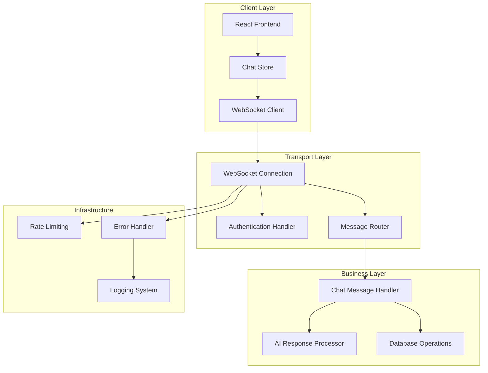

**Diagram sources**

- [websocket.ts](file://apps/api/src/services/websocket.ts#L20-L80)
- [chatStore.ts](file://apps/frontend/src/store/chatStore.ts#L52-L144)

**Section sources**

- [websocket.ts](file://apps/api/src/services/websocket.ts#L20-L80)
- [chatStore.ts](file://apps/frontend/src/store/chatStore.ts#L52-L144)

## Connection Management

### Server-Side Connection Lifecycle

The WebSocket server manages client connections through a comprehensive lifecycle system that handles connection establishment, authentication, message processing, and graceful disconnection.

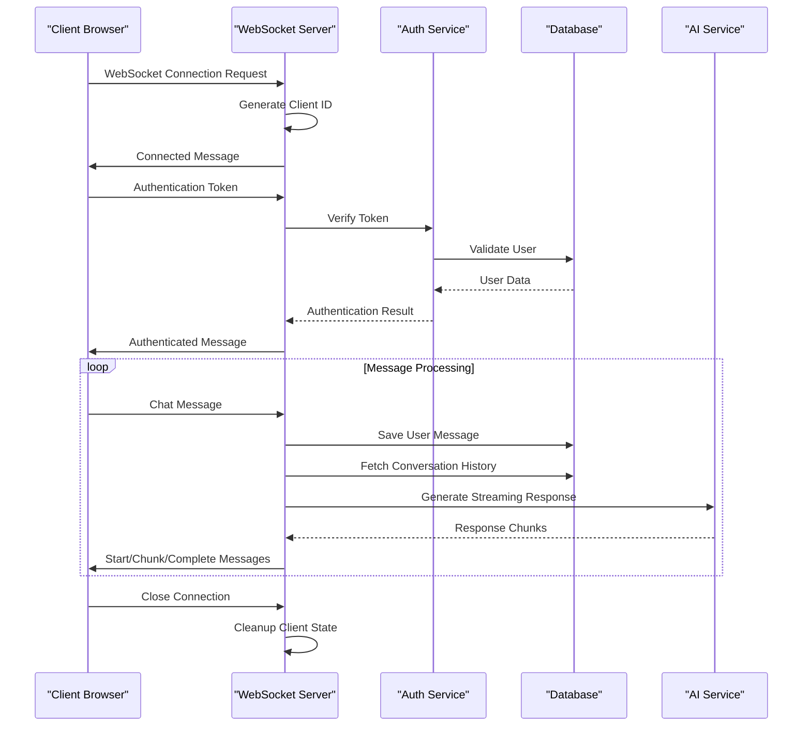

**Diagram sources**

- [websocket.ts](file://apps/api/src/services/websocket.ts#L28-L77)
- [websocket.ts](file://apps/api/src/services/websocket.ts#L82-L102)

### Client-Side Connection Management

The frontend implements a reactive connection management system that automatically handles connection states, reconnections, and state synchronization.

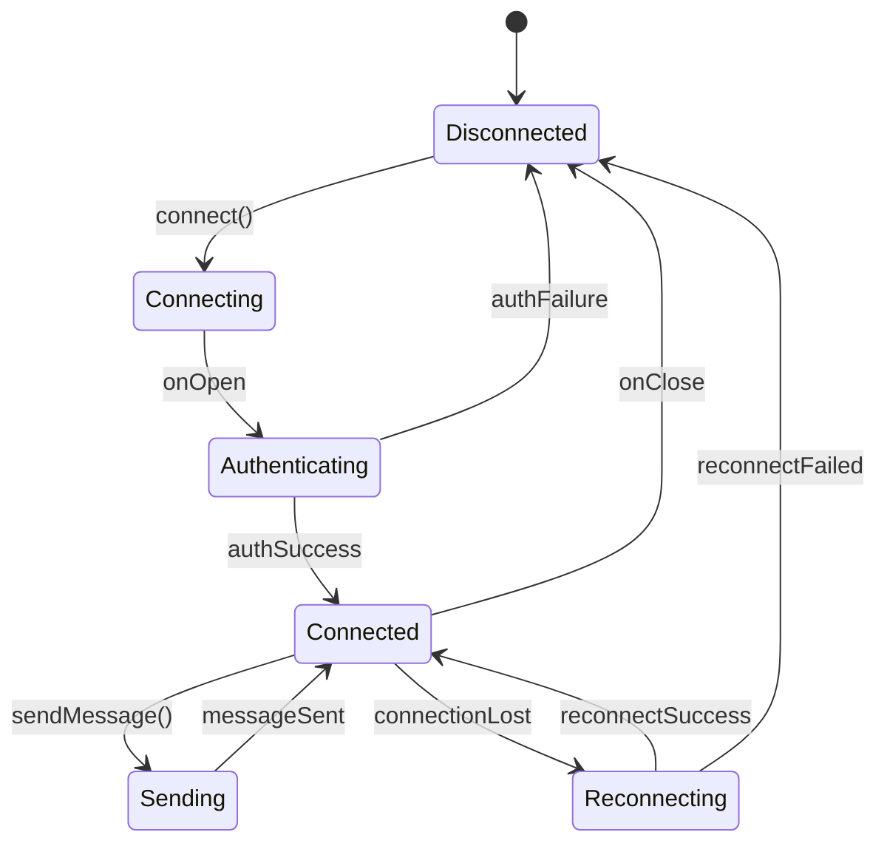

**Diagram sources**

- [chatStore.ts](file://apps/frontend/src/store/chatStore.ts#L52-L144)
- [chatStore.ts](file://apps/frontend/src/store/chatStore.ts#L131-L137)

**Section sources**

- [websocket.ts](file://apps/api/src/services/websocket.ts#L28-L77)
- [chatStore.ts](file://apps/frontend/src/store/chatStore.ts#L52-L144)

## Message Formats and Types

### WebSocket Message Types

WADI defines a comprehensive set of message types for different communication scenarios:

| Message Type    | Purpose                  | Payload Structure                           | Direction       |
| --------------- | ------------------------ | ------------------------------------------- | --------------- |
| `connected`     | Connection establishment | `{ type: "connected", clientId: string }`   | Server → Client |
| `auth`          | Authentication request   | `{ type: "auth", token: string }`           | Client → Server |
| `authenticated` | Authentication success   | `{ type: "authenticated", userId: string }` | Server → Client |
| `message`       | Chat message content     | `{ type: "message", content: string }`      | Client → Server |
| `start`         | AI response start        | `{ type: "start", conversationId: string }` | Server → Client |
| `chunk`         | AI response chunk        | `{ type: "chunk", content: string }`        | Server → Client |
| `complete`      | AI response complete     | `{ type: "complete", fullOutput: string }`  | Server → Client |
| `error`         | Error notification       | `{ type: "error", message: string }`        | Bidirectional   |

### Message Flow Patterns

The system implements several distinct message flow patterns for different use cases:

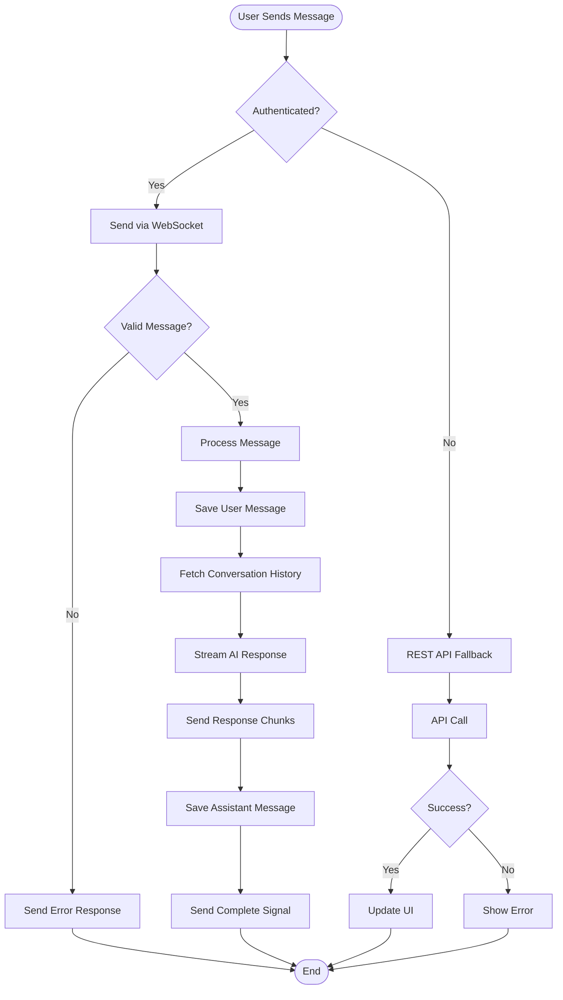

**Diagram sources**

- [websocket.ts](file://apps/api/src/services/websocket.ts#L105-L167)
- [chatStore.ts](file://apps/frontend/src/store/chatStore.ts#L140-L288)

**Section sources**

- [chat.ts](file://apps/frontend/src/types/chat.ts#L19-L25)
- [websocket.ts](file://apps/api/src/services/websocket.ts#L47-L61)

## Event Handling System

### Server-Side Event Processing

The server implements a robust event handling system that processes incoming WebSocket messages and routes them to appropriate handlers based on message type.

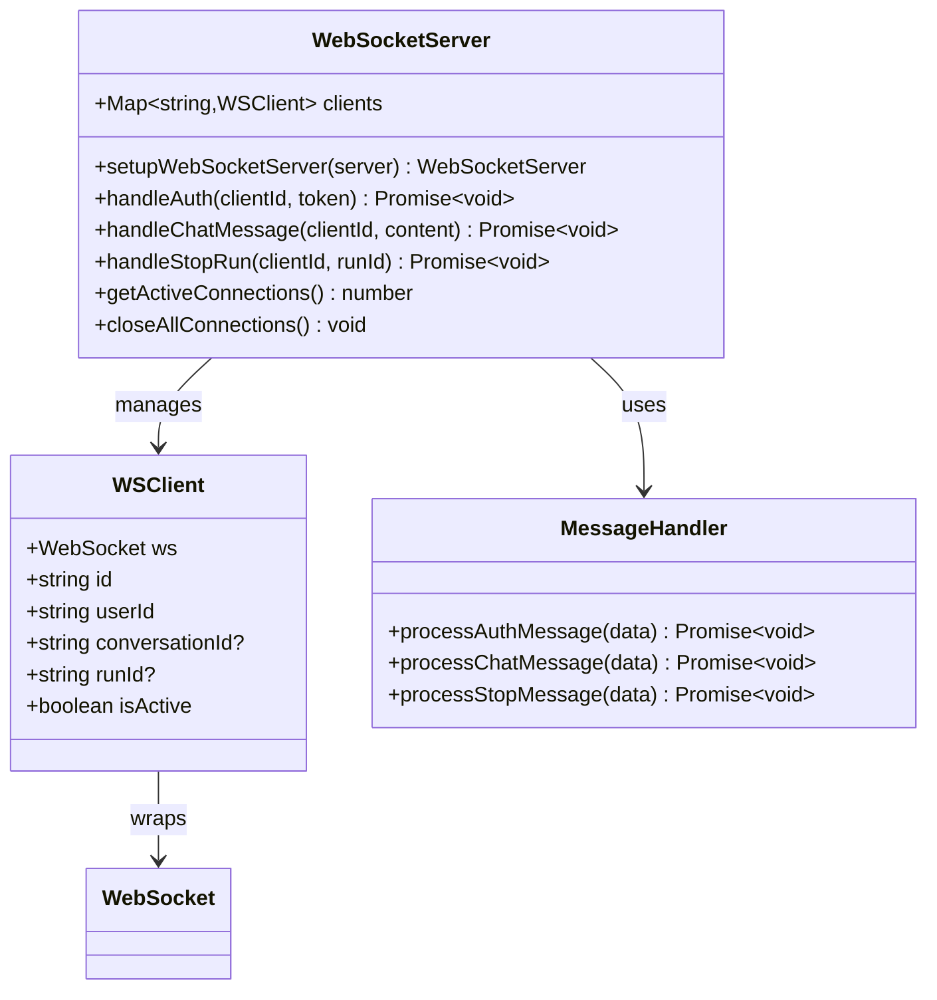

**Diagram sources**

- [websocket.ts](file://apps/api/src/services/websocket.ts#L9-L18)
- [websocket.ts](file://apps/api/src/services/websocket.ts#L47-L61)

### Client-Side Event Handling

The frontend implements a comprehensive event handling system that manages WebSocket events and updates the UI accordingly.

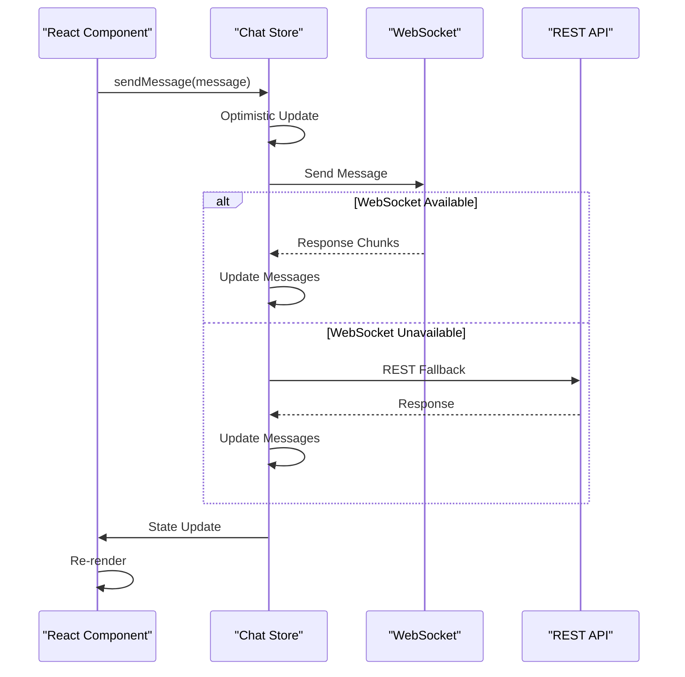

**Diagram sources**

- [chatStore.ts](file://apps/frontend/src/store/chatStore.ts#L140-L288)
- [chatStore.ts](file://apps/frontend/src/store/chatStore.ts#L76-L120)

**Section sources**

- [websocket.ts](file://apps/api/src/services/websocket.ts#L47-L61)
- [chatStore.ts](file://apps/frontend/src/store/chatStore.ts#L76-L120)

## Authentication and Security

### Authentication Flow

WADI implements a secure authentication system that validates user credentials and establishes secure WebSocket connections.

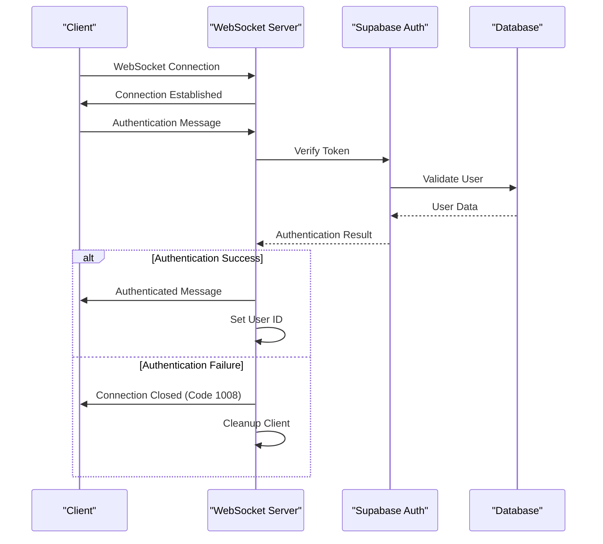

**Diagram sources**

- [websocket.ts](file://apps/api/src/services/websocket.ts#L82-L102)

### Security Measures

The system implements multiple security layers to protect against unauthorized access and malicious activity:

| Security Layer       | Implementation                 | Purpose                                           |
| -------------------- | ------------------------------ | ------------------------------------------------- |
| Token Validation     | JWT verification via Supabase  | Ensures valid user authentication                 |
| Rate Limiting        | Per-user request throttling    | Prevents abuse and DDoS attacks                   |
| Connection Limits    | Maximum concurrent connections | Controls server resource usage                    |
| Message Validation   | JSON schema validation         | Prevents malformed message attacks                |
| Graceful Degradation | REST API fallback              | Maintains functionality during WebSocket failures |

**Section sources**

- [websocket.ts](file://apps/api/src/services/websocket.ts#L82-L102)
- [rateLimit.ts](file://apps/api/src/middleware/rateLimit.ts#L32-L38)

## Error Recovery Mechanisms

### Automatic Reconnection Strategy

The system implements intelligent error recovery mechanisms that handle various failure scenarios gracefully.

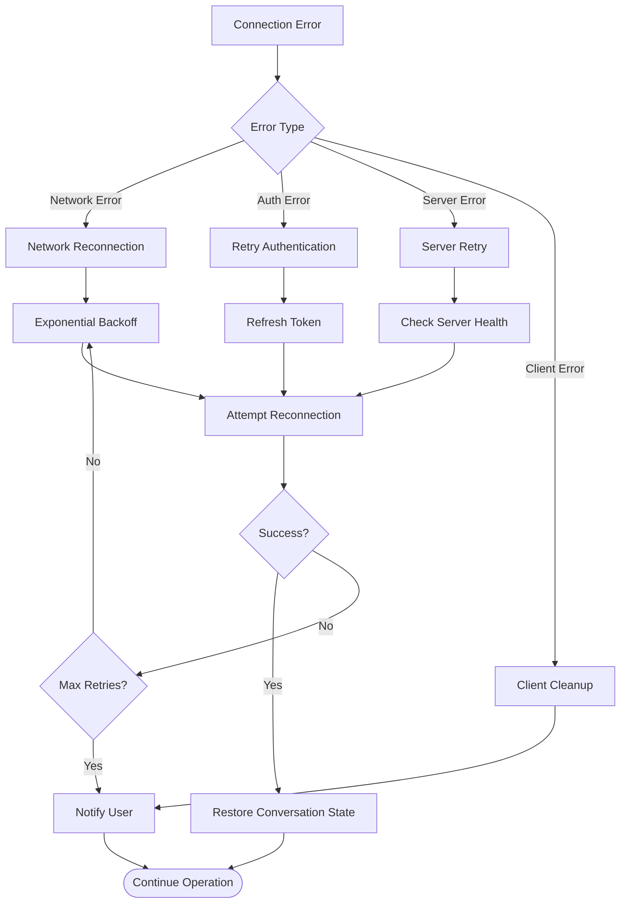

**Diagram sources**

- [chatStore.ts](file://apps/frontend/src/store/chatStore.ts#L131-L137)
- [api.ts](file://apps/frontend/src/config/api.ts#L195-L200)

### Error Classification and Handling

The system categorizes errors into different types and applies appropriate recovery strategies:

| Error Category        | Examples                                | Recovery Strategy                          |
| --------------------- | --------------------------------------- | ------------------------------------------ |
| Network Errors        | Connection timeouts, DNS failures       | Automatic retry with exponential backoff   |
| Authentication Errors | Expired tokens, invalid credentials     | Token refresh and re-authentication        |
| Server Errors         | 5xx HTTP responses, service unavailable | Circuit breaker pattern with fallback      |
| Client Errors         | Malformed messages, invalid state       | Graceful degradation and user notification |
| Rate Limiting         | Too many requests                       | Queue management and user feedback         |

**Section sources**

- [chatStore.ts](file://apps/frontend/src/store/chatStore.ts#L131-L137)
- [api.ts](file://apps/frontend/src/config/api.ts#L195-L200)

## Guest Mode Implementation

### Guest Mode Architecture

WADI provides a comprehensive guest mode that allows users to interact with the system without authentication, using REST APIs as the primary communication mechanism.

```mermaid
graph TB
subgraph "Guest Mode Flow"
GuestStart[Guest User Access]
GenGuestId[Generate Guest ID]
NickModal[Nickname Modal]
LocalStorage[Local Storage]
RESTChat[REST Chat API]
GuestConv[Guest Conversation]
end
subgraph "Authenticated Mode Flow"
AuthUser[Authenticated User]
WebSocket[WebSocket Connection]
Supabase[Supabase Auth]
RealTime[Real-time Features]
Persistent[Persistent Storage]
end
GuestStart --> GenGuestId
GenGuestId --> NickModal
NickModal --> LocalStorage
LocalStorage --> RESTChat
RESTChat --> GuestConv
AuthUser --> WebSocket
WebSocket --> Supabase
Supabase --> RealTime
RealTime --> Persistent
```

**Diagram sources**

- [GUEST_MODE_IMPLEMENTATION.md](file://GUEST_MODE_IMPLEMENTATION.md#L22-L40)
- [README_GUEST_MODE.md](file://README_GUEST_MODE.md#L131-L198)

### Guest Mode Features

Guest mode provides essential functionality while maintaining simplicity and performance:

| Feature                       | Implementation                             | Benefits                       |
| ----------------------------- | ------------------------------------------ | ------------------------------ |
| Automatic Guest ID Generation | `crypto.randomUUID()`                      | Unique user identification     |
| Local Storage Persistence     | `localStorage` with `wadi_conv_${guestId}` | Conversation history retention |
| REST API Fallback             | Automatic fallback from WebSocket          | Reliable message delivery      |
| Nickname Management           | Modal prompt on first visit                | Personalized experience        |
| Rate Limiting                 | Same limits as authenticated users         | Fair usage enforcement         |

**Section sources**

- [GUEST_MODE_IMPLEMENTATION.md](file://GUEST_MODE_IMPLEMENTATION.md#L22-L40)
- [README_GUEST_MODE.md](file://README_GUEST_MODE.md#L131-L198)

## Performance Optimization

### Frontend Optimizations

WADI implements several frontend optimizations to ensure smooth real-time communication even with large conversation histories.

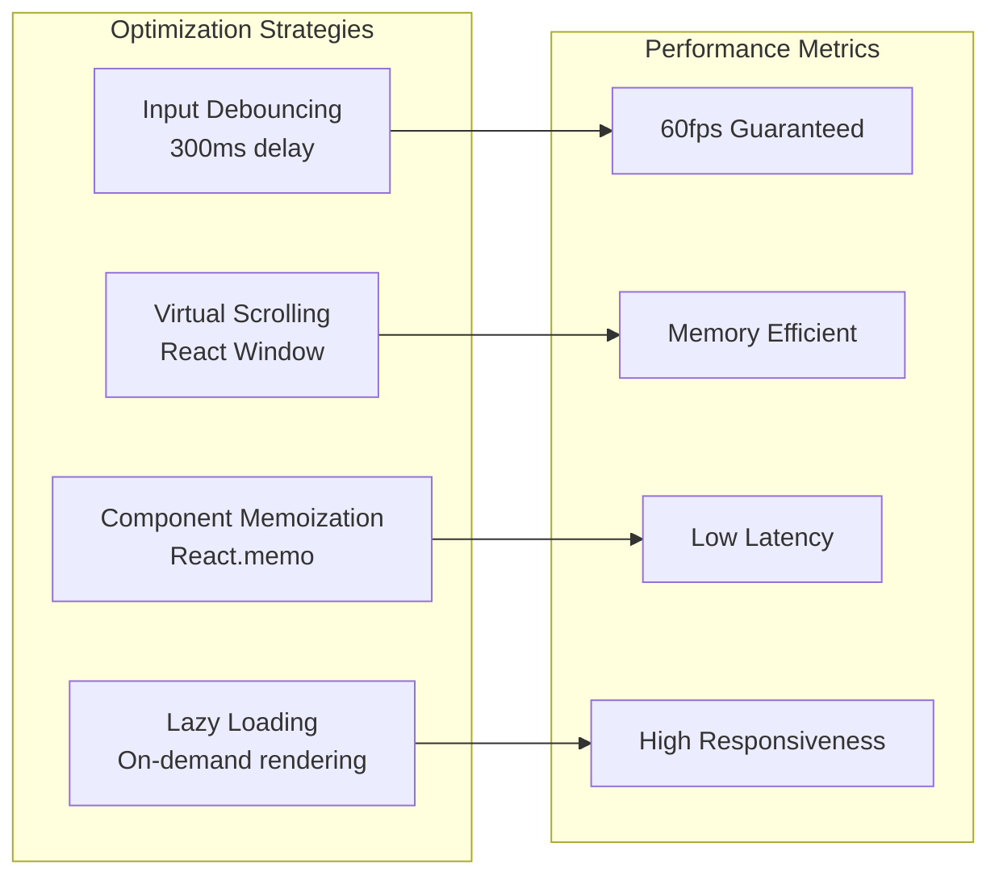

**Diagram sources**

- [PERFORMANCE_OPTIMIZATION.md](file://PERFORMANCE_OPTIMIZATION.md#L351-L431)

### Backend Performance Features

The server-side implementation includes several performance optimization techniques:

| Optimization       | Implementation                            | Impact              |
| ------------------ | ----------------------------------------- | ------------------- |
| Connection Pooling | WebSocket connection reuse                | Reduced overhead    |
| Message Chunking   | Streaming AI responses                    | Lower latency       |
| Database Indexing  | Conversation history indexing             | Faster queries      |
| Rate Limiting      | Per-user request throttling               | Resource protection |
| Memory Management  | Automatic cleanup of inactive connections | Stable memory usage |

**Section sources**

- [PERFORMANCE_OPTIMIZATION.md](file://PERFORMANCE_OPTIMIZATION.md#L323-L431)
- [websocket.ts](file://apps/api/src/services/websocket.ts#L178-L185)

## Scalability Considerations

### Horizontal Scaling Architecture

WADI's WebSocket implementation supports horizontal scaling through load balancing and connection affinity strategies.

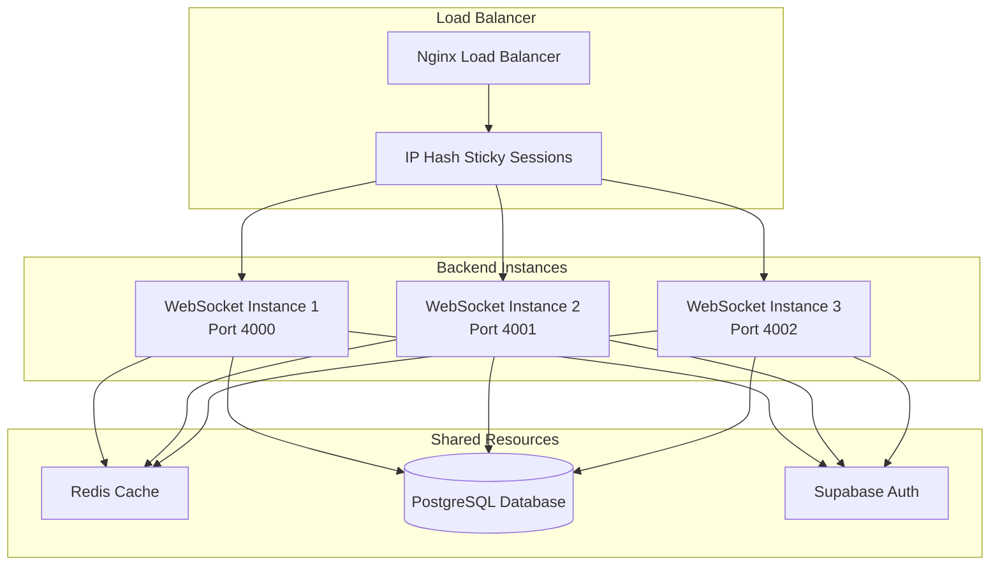

**Diagram sources**

- [PERFORMANCE_OPTIMIZATION.md](file://PERFORMANCE_OPTIMIZATION.md#L405-L431)

### Connection Scaling Limits

The system implements configurable limits to manage resource consumption:

| Resource               | Default Limit  | Configurable | Purpose                    |
| ---------------------- | -------------- | ------------ | -------------------------- |
| Concurrent Connections | Unlimited      | Yes          | Server capacity management |
| Message Rate           | 20/min (guest) | Yes          | Abuse prevention           |
| Conversation History   | 10 messages    | Yes          | Memory optimization        |
| Connection Timeout     | 30 minutes     | Yes          | Resource cleanup           |

**Section sources**

- [PERFORMANCE_OPTIMIZATION.md](file://PERFORMANCE_OPTIMIZATION.md#L405-L431)
- [rateLimit.ts](file://apps/api/src/middleware/rateLimit.ts#L32-L38)

## Best Practices

### Development Guidelines

1. **Connection Management**
   - Always implement proper connection cleanup
   - Use connection pooling for high-traffic scenarios
   - Monitor active connection counts

2. **Message Handling**
   - Validate all incoming messages
   - Implement proper error boundaries
   - Use structured logging for debugging

3. **Security**
   - Never expose sensitive data in logs
   - Implement proper authentication checks
   - Use HTTPS for production deployments

4. **Performance**
   - Implement message batching for bulk operations
   - Use virtual scrolling for large conversation histories
   - Optimize database queries with proper indexing

### Production Deployment

1. **Environment Configuration**

   ```bash
   # Production environment variables
   VITE_API_URL=https://api.wadi.ai
   NODE_ENV=production
   ```

2. **Monitoring and Logging**
   - Implement comprehensive error tracking
   - Monitor connection metrics
   - Track message throughput

3. **Backup and Recovery**
   - Implement connection state persistence
   - Provide graceful degradation
   - Maintain service health checks

## Troubleshooting Guide

### Common Issues and Solutions

| Issue                   | Symptoms                             | Solution                                                      |
| ----------------------- | ------------------------------------ | ------------------------------------------------------------- |
| Connection Drops        | Frequent disconnections              | Check network stability, implement reconnection logic         |
| Slow Message Delivery   | Delays in message display            | Optimize database queries, reduce message payload size        |
| Authentication Failures | Cannot connect as authenticated user | Verify token validity, check Supabase configuration           |
| Guest Mode Issues       | Cannot send messages as guest        | Verify guest mode configuration, check REST API accessibility |
| Rate Limiting           | Getting 429 errors                   | Implement exponential backoff, reduce message frequency       |

### Diagnostic Commands

```bash
# Check WebSocket connectivity
curl -i -N -H "Connection: Upgrade" \
     -H "Upgrade: websocket" \
     -H "Sec-WebSocket-Key: SGVsbG8sIHdvcmxkIQ==" \
     -H "Sec-WebSocket-Version: 13" \
     http://localhost:4000/ws/chat/test-conversation

# Monitor connection statistics
node -e "
const ws = new WebSocket('ws://localhost:4000/ws/chat/test');
ws.on('open', () => console.log('Connected'));
ws.on('close', () => console.log('Disconnected'));
ws.on('error', err => console.error('Error:', err));
"
```

### Debugging Tools

1. **Browser Developer Tools**
   - WebSocket tab for connection monitoring
   - Network tab for message inspection
   - Console for error logging

2. **Server Logs**
   - Connection establishment events
   - Authentication attempts
   - Error occurrences

3. **Performance Monitoring**
   - Connection count metrics
   - Message throughput statistics
   - Response time measurements

**Section sources**

- [websocket.ts](file://apps/api/src/services/websocket.ts#L28-L77)
- [chatStore.ts](file://apps/frontend/src/store/chatStore.ts#L52-L144)
