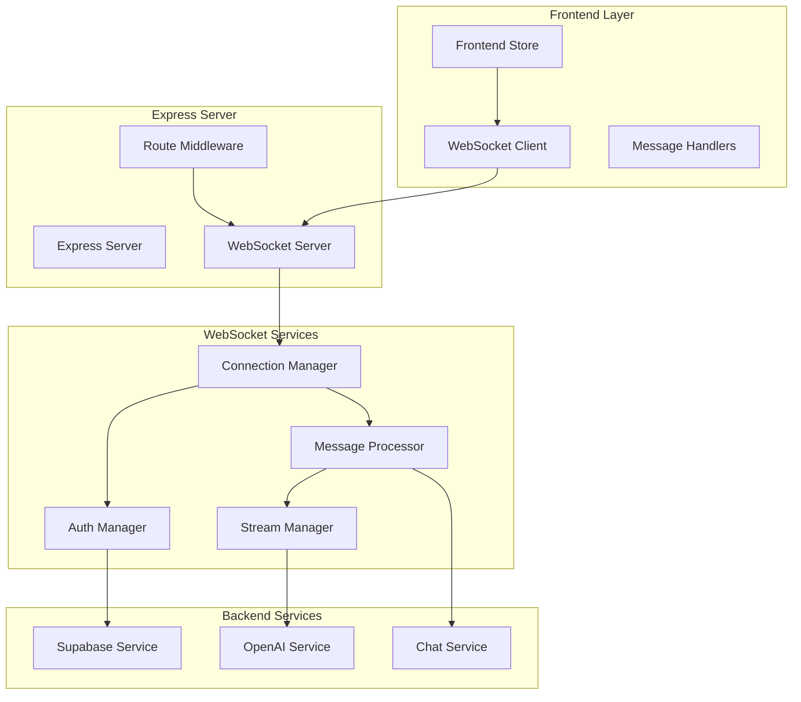
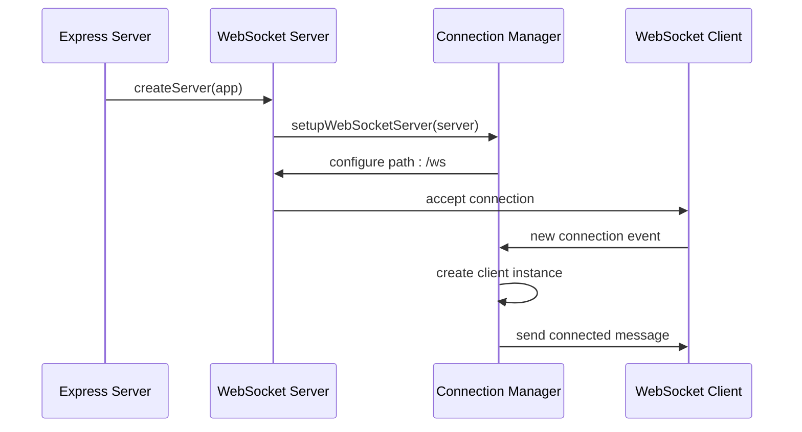
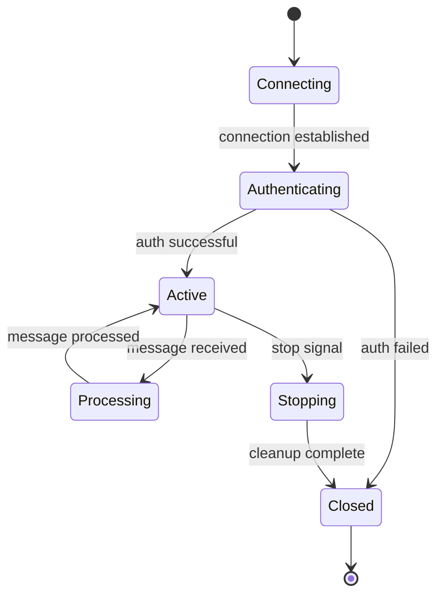
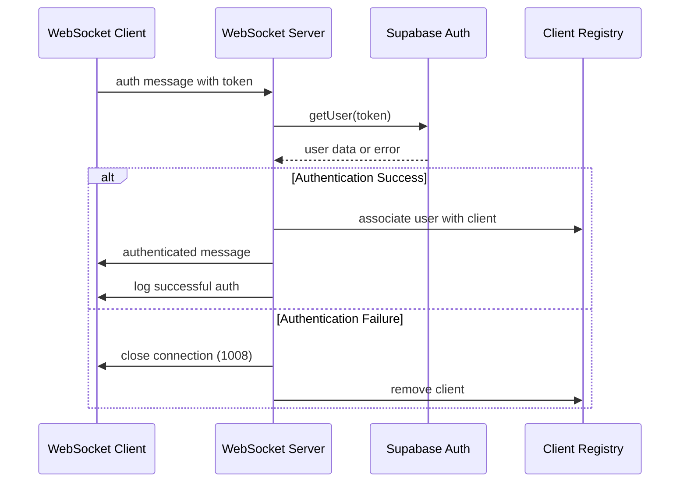
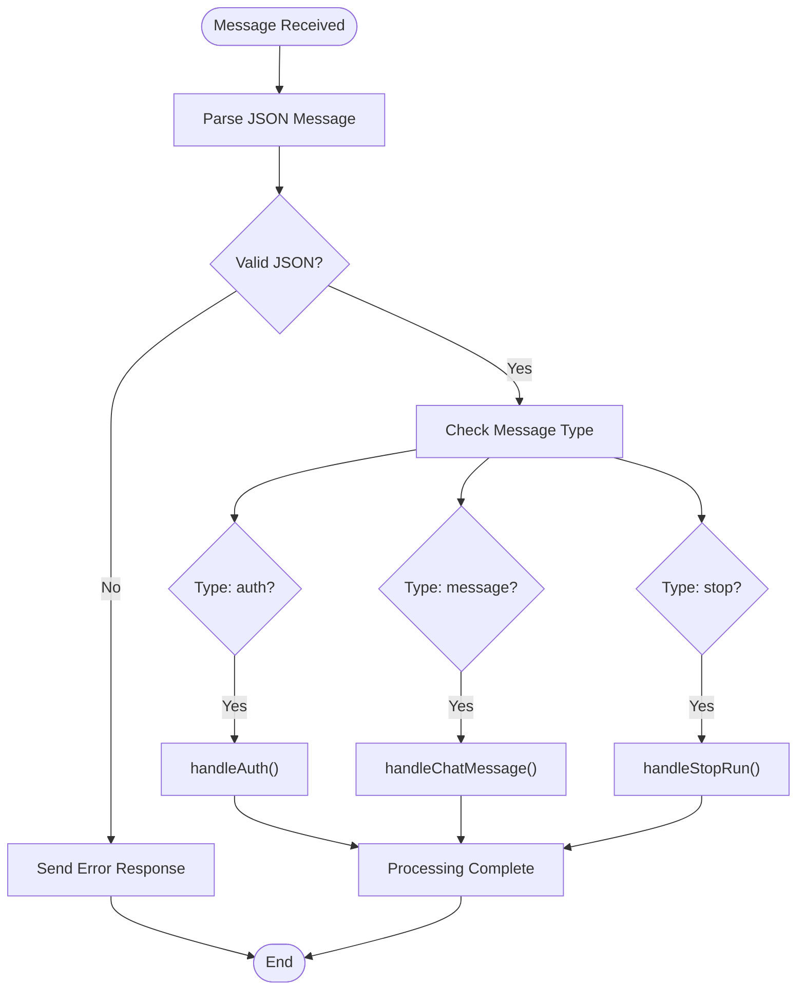
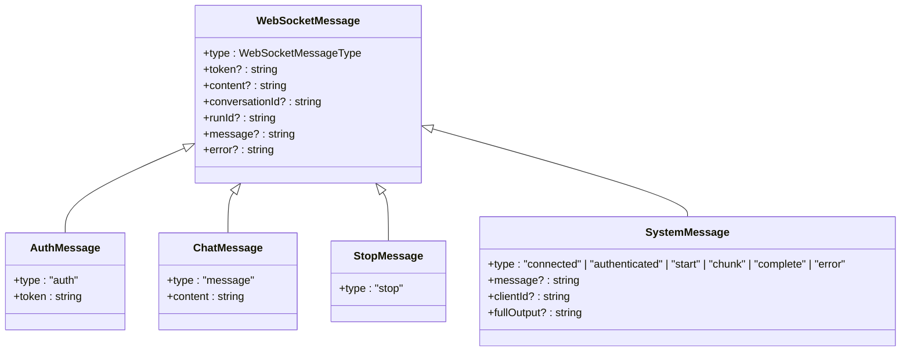
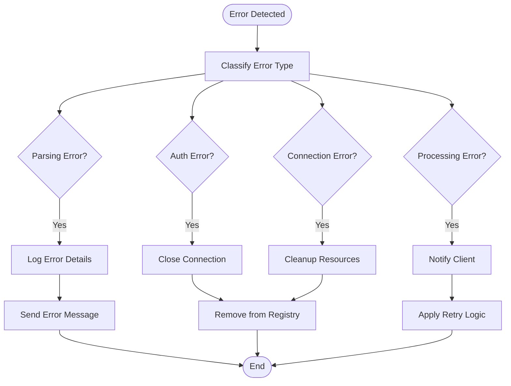
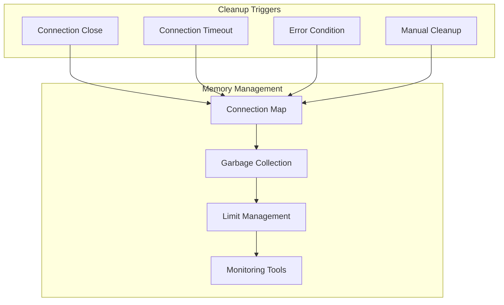
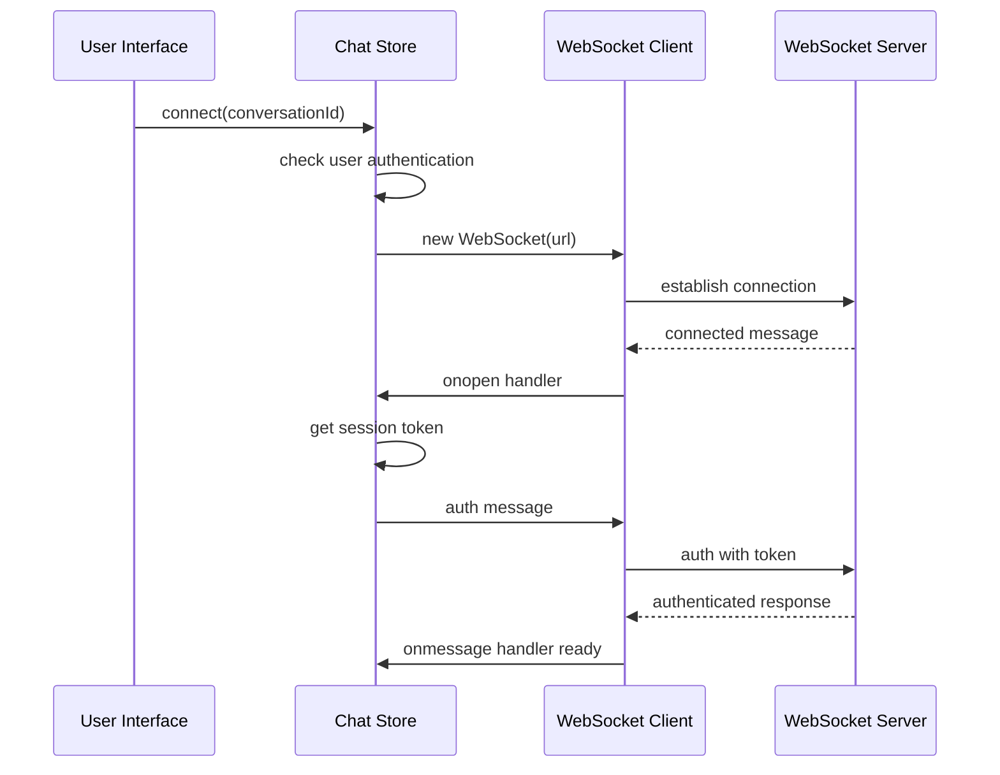

# WebSocket Implementation

<cite>
**Referenced Files in This Document**
- [websocket.ts](file://apps/api/src/services/websocket.ts)
- [index.ts](file://apps/api/src/index.ts)
- [types.ts](file://apps/api/src/services/brain/types.ts)
- [chatStore.ts](file://apps/frontend/src/store/chatStore.ts)
- [supabase.ts](file://apps/api/src/config/supabase.ts)
- [openai.ts](file://apps/api/src/services/openai.ts)
- [chat.ts](file://apps/api/src/routes/chat.ts)
- [auth.ts](file://apps/api/src/middleware/auth.ts)
</cite>

## Table of Contents

1. [Introduction](#introduction)
2. [Architecture Overview](#architecture-overview)
3. [WebSocket Server Setup](#websocket-server-setup)
4. [Client Connection Management](#client-connection-management)
5. [Authentication System](#authentication-system)
6. [Message Processing Pipeline](#message-processing-pipeline)
7. [Supported Message Types](#supported-message-types)
8. [Error Handling and Recovery](#error-handling-and-recovery)
9. [Scalability and Memory Management](#scalability-and-memory-management)
10. [Frontend Integration](#frontend-integration)
11. [Extending the Protocol](#extending-the-protocol)
12. [Performance Considerations](#performance-considerations)
13. [Troubleshooting Guide](#troubleshooting-guide)

## Introduction

The WADI WebSocket implementation provides real-time bidirectional communication between the frontend and backend systems, enabling seamless chat interactions with AI-powered responses. Built on the `ws` library and integrated with Express HTTP server, this system handles authentication, message routing, streaming responses, and connection lifecycle management.

The WebSocket server operates on the `/ws` path and supports two primary resource types: chat conversations and AI run streams. It implements a robust authentication mechanism using Supabase JWT tokens and provides comprehensive error handling with graceful degradation capabilities.

## Architecture Overview

The WebSocket implementation follows a layered architecture that separates concerns between connection management, authentication, message processing, and response streaming.



**Diagram sources**

- [websocket.ts](file://apps/api/src/services/websocket.ts#L20-L80)
- [index.ts](file://apps/api/src/index.ts#L133-L137)

## WebSocket Server Setup

The WebSocket server is initialized through the `setupWebSocketServer` function, which creates a WebSocketServer instance attached to the existing Express HTTP server.

### Server Initialization

The server setup process involves several key steps:

1. **HTTP Server Integration**: The WebSocket server is bound to the existing Express HTTP server
2. **Path Configuration**: All WebSocket connections are served under the `/ws` path
3. **Connection Event Handling**: The server listens for new connections and manages client lifecycle



**Diagram sources**

- [websocket.ts](file://apps/api/src/services/websocket.ts#L20-L80)
- [index.ts](file://apps/api/src/index.ts#L133-L137)

### Path Configuration

The WebSocket server uses a standardized path structure that supports both chat and run streaming scenarios:

- **Chat Connections**: `/ws/chat/{conversationId}`
- **Run Streams**: `/ws/runs/{runId}/stream`

The path parsing logic automatically determines the resource type and extracts the appropriate identifier for connection management.

**Section sources**

- [websocket.ts](file://apps/api/src/services/websocket.ts#L20-L80)
- [index.ts](file://apps/api/src/index.ts#L133-L137)

## Client Connection Management

The system maintains a centralized registry of active WebSocket connections using a Map data structure, enabling efficient client state tracking and resource management.

### Client State Structure

Each WebSocket connection is represented by a `WSClient` interface containing essential metadata:

```typescript
interface WSClient {
  ws: WebSocket; // WebSocket instance
  id: string; // Unique client identifier
  userId: string; // Authenticated user ID
  conversationId?: string; // Chat conversation reference
  runId?: string; // AI run reference
  isActive: boolean; // Connection status flag
}
```

### Connection Lifecycle

The connection management system handles three primary events:

1. **Connection Establishment**: Creates client instance and adds to registry
2. **Message Processing**: Handles incoming WebSocket messages
3. **Connection Closure**: Removes client from registry and cleans resources



**Diagram sources**

- [websocket.ts](file://apps/api/src/services/websocket.ts#L37-L70)

### Resource Type Detection

The system automatically detects whether a connection is for chat or run streaming based on the URL path structure, enabling appropriate client state initialization.

**Section sources**

- [websocket.ts](file://apps/api/src/services/websocket.ts#L9-L18)
- [websocket.ts](file://apps/api/src/services/websocket.ts#L37-L70)

## Authentication System

The authentication system ensures secure access to WebSocket resources through Supabase JWT token validation, providing both user identification and permission management.

### Authentication Flow

The authentication process follows a structured approach:

1. **Token Reception**: The client sends an authentication message with JWT token
2. **Token Validation**: The server validates the token against Supabase
3. **User Identification**: Extracts user information from validated token
4. **Session Establishment**: Associates user identity with WebSocket connection



**Diagram sources**

- [websocket.ts](file://apps/api/src/services/websocket.ts#L82-L102)
- [auth.ts](file://apps/api/src/middleware/auth.ts#L18-L81)

### Error Handling

The authentication system implements comprehensive error handling for various failure scenarios:

- **Invalid Tokens**: Immediate connection closure with unauthorized status
- **Network Errors**: Graceful degradation with error logging
- **Supabase Failures**: Fallback mechanisms and user notification

### Security Considerations

The authentication system incorporates several security measures:

- **Token Validation**: Real-time verification with Supabase
- **Session Binding**: Direct association between tokens and WebSocket connections
- **Access Control**: Resource-level permissions based on user identity

**Section sources**

- [websocket.ts](file://apps/api/src/services/websocket.ts#L82-L102)
- [auth.ts](file://apps/api/src/middleware/auth.ts#L18-L81)

## Message Processing Pipeline

The message processing pipeline handles incoming WebSocket messages through a structured flow that validates message format, routes to appropriate handlers, and manages response streaming.

### Message Parsing Logic

The system implements robust JSON parsing with comprehensive error handling:

1. **Format Validation**: Ensures message is valid JSON
2. **Type Identification**: Determines message type for routing
3. **Parameter Extraction**: Retrieves required data from message payload
4. **Error Recovery**: Provides meaningful error responses for malformed messages



**Diagram sources**

- [websocket.ts](file://apps/api/src/services/websocket.ts#L47-L61)

### Handler Routing

The message processor routes messages to specialized handlers based on type:

- **Authentication Messages**: Validate and establish user sessions
- **Chat Messages**: Process user input and generate AI responses
- **Stop Messages**: Terminate ongoing AI runs and clean resources

**Section sources**

- [websocket.ts](file://apps/api/src/services/websocket.ts#L47-L61)

## Supported Message Types

The WebSocket protocol supports four primary message types, each serving distinct purposes in the chat and AI interaction workflow.

### Authentication Messages

Authentication messages enable secure client identification:

```typescript
interface AuthMessage {
  type: "auth";
  token: string; // Supabase JWT token
}
```

### Chat Messages

Chat messages represent user input and trigger AI response generation:

```typescript
interface ChatMessage {
  type: "message";
  content: string; // User's message text
}
```

### Stop Messages

Stop messages terminate ongoing AI processing operations:

```typescript
interface StopMessage {
  type: "stop";
}
```

### System Messages

The system generates several internal message types for client communication:

- **Connected**: Initial connection acknowledgment
- **Authenticated**: Successful authentication confirmation
- **Start**: AI response streaming initiation
- **Chunk**: Individual text chunks during streaming
- **Complete**: Full response completion notification
- **Error**: Error condition reporting



**Diagram sources**

- [types.ts](file://apps/api/src/services/brain/types.ts#L22-L44)

**Section sources**

- [types.ts](file://apps/api/src/services/brain/types.ts#L22-L44)
- [websocket.ts](file://apps/api/src/services/websocket.ts#L51-L57)

## Error Handling and Recovery

The WebSocket implementation includes comprehensive error handling mechanisms that ensure system stability and provide meaningful feedback to clients.

### Error Classification

The system categorizes errors into several types:

1. **Parsing Errors**: Invalid JSON format or malformed messages
2. **Authentication Errors**: Invalid or expired tokens
3. **Processing Errors**: Issues during message handling or AI generation
4. **Connection Errors**: Network or WebSocket connectivity problems

### Error Response Strategy

When errors occur, the system responds with structured error messages:

```typescript
interface ErrorMessage {
  type: "error";
  message: string; // Human-readable error description
}
```

### Recovery Mechanisms

The implementation provides several recovery strategies:

- **Graceful Degradation**: Continue operation despite individual connection failures
- **Automatic Cleanup**: Remove failed connections from registry
- **Resource Management**: Prevent memory leaks from abandoned connections
- **Client Notification**: Inform clients of recoverable vs. unrecoverable errors



**Diagram sources**

- [websocket.ts](file://apps/api/src/services/websocket.ts#L58-L61)

**Section sources**

- [websocket.ts](file://apps/api/src/services/websocket.ts#L58-L61)

## Scalability and Memory Management

The WebSocket implementation incorporates several strategies for managing scalability and preventing memory leaks in long-running server environments.

### Client State Tracking

The system maintains active client connections in a centralized Map structure:

```typescript
const clients = new Map<string, WSClient>();
```

This approach provides:

- **O(1) Lookup**: Efficient client access by ID
- **Memory Efficiency**: Automatic garbage collection when clients disconnect
- **Scalability**: Handles thousands of concurrent connections

### Connection Metadata Management

Each client maintains comprehensive metadata for resource tracking:

- **User Identification**: Links connections to authenticated users
- **Resource Association**: Tracks conversation and run associations
- **Status Monitoring**: Real-time connection state tracking
- **Lifecycle Management**: Automatic cleanup on disconnection

### Memory Management Strategies

The implementation includes several memory management features:

1. **Automatic Cleanup**: Clients are removed from registry on close
2. **Resource Limits**: Configurable limits on message history
3. **Garbage Collection**: Regular cleanup of inactive connections
4. **Monitoring**: Active connection count tracking for capacity planning



**Diagram sources**

- [websocket.ts](file://apps/api/src/services/websocket.ts#L17-L18)
- [websocket.ts](file://apps/api/src/services/websocket.ts#L64-L70)

### Performance Metrics

The system exposes utility functions for monitoring connection health:

- **Active Connections**: Current number of open WebSocket connections
- **Connection Statistics**: Historical connection patterns
- **Resource Utilization**: Memory and CPU usage tracking

**Section sources**

- [websocket.ts](file://apps/api/src/services/websocket.ts#L17-L18)
- [websocket.ts](file://apps/api/src/services/websocket.ts#L64-L70)
- [websocket.ts](file://apps/api/src/services/websocket.ts#L177-L186)

## Frontend Integration

The frontend WebSocket integration provides seamless real-time communication with comprehensive state management and error handling.

### Connection Establishment

The frontend establishes WebSocket connections through a structured process:

1. **URL Construction**: Builds WebSocket URL from API base and conversation ID
2. **Connection Creation**: Instantiates WebSocket with constructed URL
3. **Authentication**: Sends authentication token upon connection establishment
4. **State Management**: Updates application state with connection status



**Diagram sources**

- [chatStore.ts](file://apps/frontend/src/store/chatStore.ts#L52-L94)

### Message Handling

The frontend implements comprehensive message handling for different WebSocket message types:

- **Start Messages**: Initialize AI response display
- **Chunk Messages**: Append streaming text to current response
- **Complete Messages**: Finalize AI response and update conversation
- **Error Messages**: Display error conditions to users

### Error Recovery

The frontend includes robust error recovery mechanisms:

- **Connection Loss**: Automatic reconnection attempts
- **Authentication Expiration**: Token refresh and re-authentication
- **Network Issues**: Graceful degradation to REST API
- **Server Errors**: User-friendly error messaging

**Section sources**

- [chatStore.ts](file://apps/frontend/src/store/chatStore.ts#L52-L94)

## Extending the Protocol

The WebSocket protocol is designed for extensibility, allowing developers to add new message types and functionality while maintaining backward compatibility.

### Adding New Message Types

To add a new message type:

1. **Extend WebSocketMessageType**: Add the new type to the union type
2. **Update WebSocketMessage Interface**: Add optional properties for the new type
3. **Implement Handler**: Create a handler function for processing the message
4. **Add Route**: Include the new type in the message routing logic
5. **Update Frontend**: Add support for the new message type in the frontend

### Protocol Extension Example

```typescript
// Step 1: Extend message types
export type WebSocketMessageType =
  | "auth"
  | "message"
  | "stop"
  | "custom-action"; // New type

// Step 2: Update message interface
export interface WebSocketMessage {
  type: WebSocketMessageType;
  // ... existing properties
  customData?: any; // New property
}

// Step 3: Implement handler
async function handleCustomAction(clientId: string, data: any) {
  const client = clients.get(clientId);
  if (!client) return;

  try {
    // Process custom action
    // ...

    // Send response if needed
    client.ws.send(
      JSON.stringify({
        type: "custom-response",
        result: "success",
      }),
    );
  } catch (error) {
    client.ws.send(
      JSON.stringify({
        type: "error",
        message: "Custom action failed",
      }),
    );
  }
}

// Step 4: Add to routing
if (data.type === "custom-action") {
  await handleCustomAction(clientId, data.customData);
}
```

### Best Practices for Extensions

When extending the WebSocket protocol:

- **Backward Compatibility**: Ensure new types don't break existing clients
- **Documentation**: Update protocol documentation with new types
- **Validation**: Implement strict validation for new message formats
- **Error Handling**: Provide comprehensive error handling for new types
- **Testing**: Thoroughly test new functionality with various scenarios

**Section sources**

- [types.ts](file://apps/api/src/services/brain/types.ts#L22-L44)

## Performance Considerations

The WebSocket implementation includes several performance optimizations and considerations for high-throughput scenarios.

### Streaming Optimization

The AI response streaming implementation uses efficient chunk-based delivery:

- **Real-time Delivery**: Text chunks are sent as soon as they become available
- **Buffer Management**: Minimal buffering to reduce latency
- **Connection Monitoring**: Checks connection status before sending chunks
- **Resource Cleanup**: Proper cleanup of streaming resources

### Connection Pooling

The system supports horizontal scaling through connection pooling:

- **Load Balancing**: Distributes connections across multiple server instances
- **Sticky Sessions**: Maintains client connections to specific servers
- **Health Monitoring**: Tracks server health and connection distribution

### Memory Optimization

Several strategies optimize memory usage:

- **Lazy Loading**: Messages loaded on demand rather than preloaded
- **Garbage Collection**: Automatic cleanup of disconnected clients
- **Resource Limits**: Configurable limits on message history and connections
- **Compression**: Optional compression for large message payloads

### Rate Limiting

The system implements rate limiting to prevent abuse:

- **Per-Connection Limits**: Limits on message frequency per client
- **Global Limits**: System-wide rate limiting for protection
- **Intelligent Throttling**: Adaptive throttling based on server load

**Section sources**

- [websocket.ts](file://apps/api/src/services/websocket.ts#L142-L167)
- [PERFORMANCE_OPTIMIZATION.md](file://PERFORMANCE_OPTIMIZATION.md#L351-L431)

## Troubleshooting Guide

Common issues and their solutions for WebSocket implementation troubleshooting.

### Connection Issues

**Problem**: WebSocket connections fail to establish
**Solutions**:

- Verify server is running and listening on correct port
- Check CORS configuration allows WebSocket connections
- Validate SSL/TLS certificates for secure connections
- Confirm firewall allows WebSocket traffic (ports 80/443)

**Problem**: Authentication failures
**Solutions**:

- Verify Supabase configuration and API keys
- Check token validity and expiration
- Ensure user account is active and verified
- Validate authentication middleware configuration

### Performance Issues

**Problem**: Slow message delivery
**Solutions**:

- Monitor server CPU and memory usage
- Check network latency between client and server
- Optimize AI model selection for response speed
- Implement connection pooling for high load

**Problem**: Memory leaks
**Solutions**:

- Monitor active connection count
- Check for unclosed WebSocket connections
- Review client cleanup logic
- Implement periodic garbage collection

### Message Processing Issues

**Problem**: Messages not being processed
**Solutions**:

- Check message format and required fields
- Verify message type routing logic
- Review error handling and logging
- Test with simplified message payloads

**Problem**: Streaming interruptions
**Solutions**:

- Monitor connection stability
- Check for network interruptions
- Implement automatic reconnection logic
- Validate AI service availability

### Debugging Tools

The system includes several debugging utilities:

- **Console Logging**: Comprehensive logging of connection events
- **Error Tracking**: Structured error reporting with stack traces
- **Performance Metrics**: Connection statistics and timing data
- **Health Checks**: Automated system health monitoring

**Section sources**

- [websocket.ts](file://apps/api/src/services/websocket.ts#L58-L61)
- [DEBUGGING_GUIDE.md](file://apps/frontend/src/utils/debug.ts#L84-L136)
