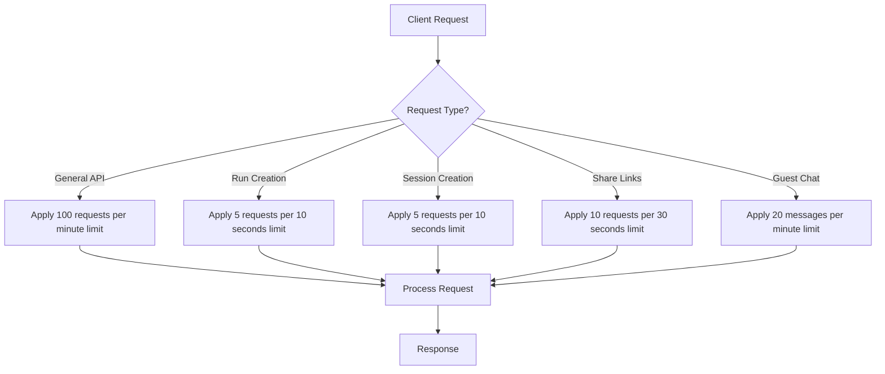
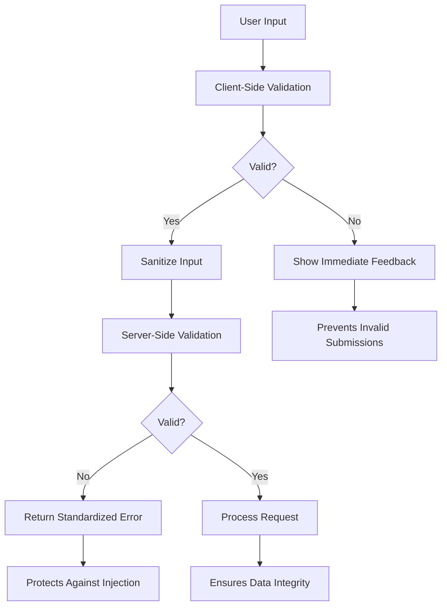
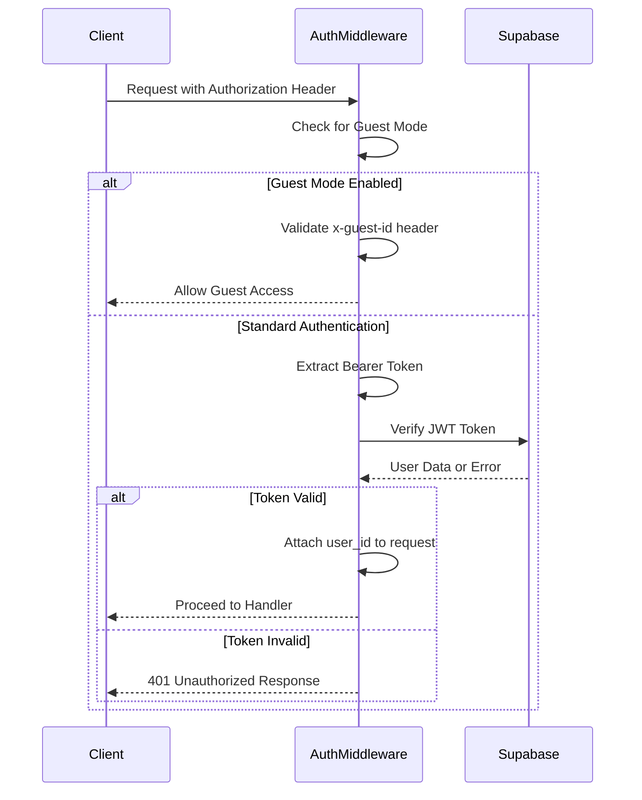
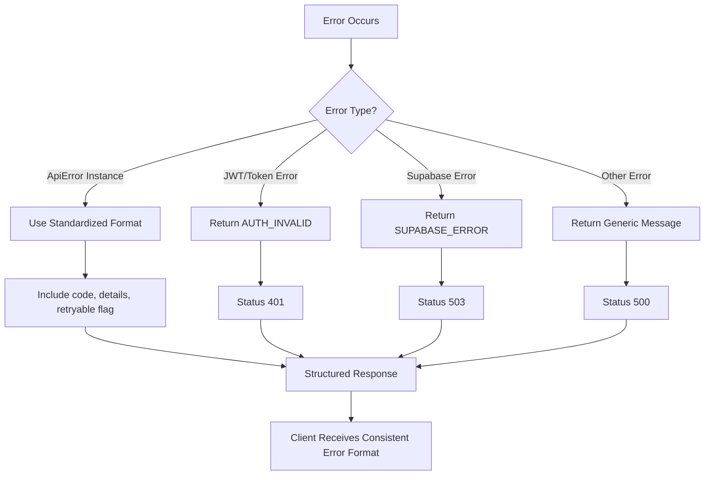
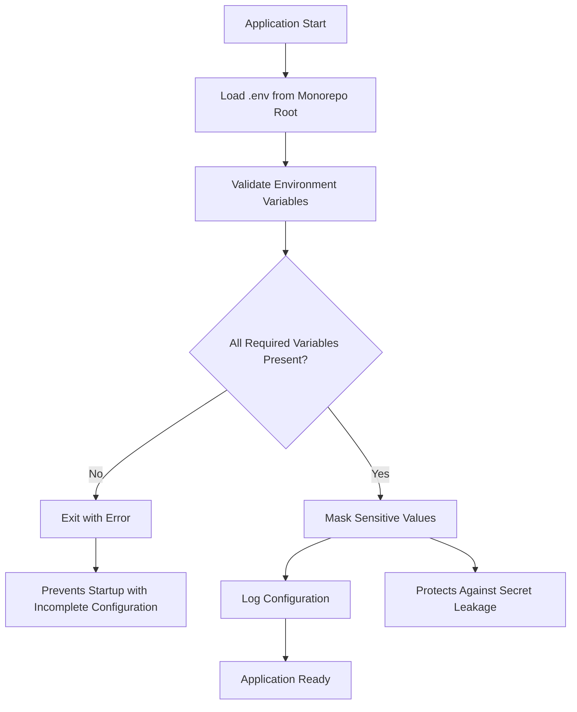

# Security Considerations

<cite>
**Referenced Files in This Document**   
- [rateLimit.ts](file://apps/api/src/middleware/rateLimit.ts)
- [auth.ts](file://apps/api/src/middleware/auth.ts)
- [errorHandler.ts](file://apps/api/src/middleware/errorHandler.ts)
- [limit-check.ts](file://apps/api/src/middleware/limit-check.ts)
- [usage-tracking.ts](file://apps/api/src/middleware/usage-tracking.ts)
- [env.ts](file://apps/api/src/config/env.ts)
- [env-validator.ts](file://apps/api/src/config/env-validator.ts)
- [supabase.ts](file://apps/api/src/config/supabase.ts)
- [security_hardening.sql](file://security_hardening.sql)
- [chatController.ts](file://apps/api/src/controllers/chatController.ts)
- [userController.ts](file://apps/api/src/controllers/userController.ts)
- [validation.ts](file://apps/frontend/src/utils/validation.ts)
</cite>

## Table of Contents
1. [Introduction](#introduction)
2. [Rate Limiting](#rate-limiting)
3. [Input Validation](#input-validation)
4. [Authentication Middleware](#authentication-middleware)
5. [Error Handling](#error-handling)
6. [Security Headers and Environment Protection](#security-headers-and-environment-protection)
7. [Database Security Policies](#database-security-policies)
8. [Monitoring and Best Practices](#monitoring-and-best-practices)

## Introduction
WADI implements a comprehensive security framework to protect against common vulnerabilities such as brute force attacks, injection attempts, and data leakage. The system employs multiple layers of protection including rate limiting, input validation, authentication middleware, and structured error handling. Security is enforced at both the application and database levels, with additional protections for environment variables and sensitive configuration data. This document details the implementation of these security measures, providing both conceptual overviews for beginners and technical details for experienced developers.

## Rate Limiting

WADI implements granular rate limiting to prevent abuse and protect against brute force attacks. The system uses Express Rate Limit middleware to enforce different limits based on endpoint functionality and user type.



**Diagram sources**
- [rateLimit.ts](file://apps/api/src/middleware/rateLimit.ts#L4-L38)

The rate limiting configuration includes:
- General API limit: 100 requests per minute
- Run creation limit: 5 requests per 10 seconds
- Session creation limit: 5 requests per 10 seconds
- Share link creation limit: 10 requests per 30 seconds
- Guest chat limit: 20 messages per minute with localized error messages

Guest users are subject to stricter rate limits to prevent abuse of the free tier while authenticated users benefit from higher limits appropriate to their subscription level.

**Section sources**
- [rateLimit.ts](file://apps/api/src/middleware/rateLimit.ts#L1-L39)
- [chat.ts](file://apps/api/src/routes/chat.ts#L19)

## Input Validation

WADI implements input validation at both the client and server levels to prevent injection attacks and ensure data integrity. The validation strategy includes type checking, format validation, and content sanitization.



**Diagram sources**
- [validation.ts](file://apps/frontend/src/utils/validation.ts#L47-L74)
- [chatController.ts](file://apps/api/src/controllers/chatController.ts#L35-L38)

Client-side validation includes:
- Email validation using regex pattern matching
- Password validation requiring minimum 6 characters
- Input sanitization that removes HTML tags and limits length to 1000 characters
- HTML content sanitization using DOM textContent to prevent XSS

Server-side validation in the chat controller verifies:
- Message presence and non-empty content
- Proper data types for all input parameters
- Authorization before processing any request
- Conversation ownership verification for data access

The system uses a layered approach where client-side validation improves user experience with immediate feedback, while server-side validation provides the definitive security check that cannot be bypassed.

**Section sources**
- [validation.ts](file://apps/frontend/src/utils/validation.ts#L47-L74)
- [chatController.ts](file://apps/api/src/controllers/chatController.ts#L35-L38)

## Authentication Middleware

WADI's authentication system supports both traditional user authentication and guest mode access, providing flexibility while maintaining security. The middleware validates Supabase JWT tokens and manages user sessions securely.



**Diagram sources**
- [auth.ts](file://apps/api/src/middleware/auth.ts#L18-L82)
- [chat.ts](file://apps/api/src/routes/chat.ts#L15)

The authentication flow:
1. Checks for guest mode configuration and guest ID header
2. For guest access, validates the x-guest-id header and attaches guest_id to the request
3. For standard authentication, extracts the Bearer token from the Authorization header
4. Verifies the token with Supabase auth service
5. Attaches the user_id to the request object for downstream handlers
6. Returns appropriate error responses for missing, invalid, or expired tokens

The system distinguishes between different authentication error types, returning specific error codes like "AUTH_EXPIRED" for expired tokens and "AUTH_INVALID" for invalid tokens, enabling appropriate client-side handling.

**Section sources**
- [auth.ts](file://apps/api/src/middleware/auth.ts#L18-L82)
- [chat.ts](file://apps/api/src/routes/chat.ts#L15)

## Error Handling

WADI implements a centralized error handling system that provides consistent, secure error responses while protecting sensitive information in production environments.



**Diagram sources**
- [errorHandler.ts](file://apps/api/src/middleware/errorHandler.ts#L78-L201)

The error handling system features:
- Custom ApiError class with standardized properties (statusCode, code, details, retryable)
- Centralized errorHandler middleware that catches and processes all errors
- Specific error creators for common scenarios (notFound, unauthorized, forbidden, etc.)
- Environment-aware error messages that show detailed information in development but generic messages in production
- Structured error response format with error code, message, details, and retryable flag

Error codes follow a consistent naming convention (e.g., "AUTH_MISSING", "PROJECT_NOT_FOUND") and are documented in the ErrorCodes constant. The system logs full error details including stack traces for debugging while returning sanitized responses to clients to prevent information leakage.

**Section sources**
- [errorHandler.ts](file://apps/api/src/middleware/errorHandler.ts#L6-L201)

## Security Headers and Environment Protection

WADI protects sensitive configuration through environment variable validation and secure loading practices, preventing configuration-related vulnerabilities.



**Diagram sources**
- [env.ts](file://apps/api/src/config/env.ts#L1-L34)
- [env-validator.ts](file://apps/api/src/config/env-validator.ts#L47-L180)

Key security features:
- Environment variables loaded from the monorepo root .env file using resolved paths
- Comprehensive validation of required variables (SUPABASE_URL, SUPABASE_ANON_KEY, SUPABASE_SERVICE_KEY, GROQ_API_KEY)
- URL format validation requiring HTTPS for production endpoints
- Port number validation within acceptable ranges (1024-65535)
- Sensitive value masking in logs using asterisks
- Production environment warnings for potentially insecure configurations

The env-validator performs strict validation, exiting the application if required variables are missing or invalid, which prevents running with insecure or incomplete configurations. Sensitive values like API keys are masked in logs to prevent accidental exposure.

**Section sources**
- [env.ts](file://apps/api/src/config/env.ts#L1-L34)
- [env-validator.ts](file://apps/api/src/config/env-validator.ts#L47-L180)

## Database Security Policies

WADI implements robust database security through Row Level Security (RLS) policies in Supabase, ensuring data isolation between users and workspaces.

```mermaid
erDiagram
USER ||--o{ WORKSPACE : "owns"
USER ||--o{ CONVERSATION : "creates"
USER ||--o{ MESSAGE : "sends"
WORKSPACE ||--o{ PROJECT : "contains"
WORKSPACE ||--o{ FOLDER : "contains"
WORKSPACE ||--o{ workspace_members : "has"
workspace_members }|--|| USER : "references"
workspace_members }|--|| WORKSPACE : "references"
class USER "Sensitive Data\n- Protected by RLS\n- User can only access own data"
class WORKSPACE "Access Control\n- Members can view\n- Owners can manage"
class CONVERSATION "Ownership\n- User-specific\n- Verified in controllers"
```

**Diagram sources**
- [security_hardening.sql](file://security_hardening.sql#L1-L91)
- [chatController.ts](file://apps/api/src/controllers/chatController.ts#L63-L74)

Database security measures include:
- Row Level Security enabled on all sensitive tables (folders, tags, projects, user_usage, etc.)
- Workspace membership policies that allow members to view other members and owners to manage membership
- Project access policies requiring workspace membership for viewing or modifying projects
- Folder access policies tied to workspace membership
- User usage data accessible only to the respective user
- AI presets accessible to users if they are system presets or belong to a workspace the user can access

The RLS policies ensure that even if an attacker gains partial access to the database, they cannot access data outside their authorized scope. Application code reinforces these policies by verifying ownership in controllers before processing requests.

**Section sources**
- [security_hardening.sql](file://security_hardening.sql#L1-L91)
- [chatController.ts](file://apps/api/src/controllers/chatController.ts#L63-L74)

## Monitoring and Best Practices

WADI incorporates usage tracking and monitoring to detect potential abuse and ensure system integrity while following security best practices.

The system implements:
- Usage tracking for key operations (messages sent, files uploaded, workspaces created)
- Message limit checking that integrates with the billing system
- File size validation based on user subscription level
- Comprehensive logging of security-relevant events
- Regular security policy reviews and updates

Usage tracking functions record events like message sending, file uploads, and workspace creation, which are used to enforce subscription limits and detect abnormal patterns. The limit-check middleware verifies that users remain within their plan limits before allowing operations to proceed.

Security best practices followed by WADI:
- Principle of least privilege in database access
- Input validation on all external inputs
- Proper error handling without information leakage
- Secure storage and handling of API keys
- Regular dependency updates and vulnerability scanning
- Separation of concerns between authentication and authorization
- Defense in depth with multiple security layers

These measures work together to create a secure environment that protects user data, prevents abuse, and maintains system availability.

**Section sources**
- [limit-check.ts](file://apps/api/src/middleware/limit-check.ts#L7-L172)
- [usage-tracking.ts](file://apps/api/src/middleware/usage-tracking.ts#L6-L108)
- [userController.ts](file://apps/api/src/controllers/userController.ts#L4-L67)