# State Management

<cite>
**Referenced Files in This Document**   
- [authStore.ts](file://apps/frontend/src/store/authStore.ts)
- [chatStore.ts](file://apps/frontend/src/store/chatStore.ts)
- [workspaceStore.ts](file://apps/frontend/src/store/workspaceStore.ts)
- [sessionsStore.ts](file://apps/frontend/src/store/sessionsStore.ts)
- [themeStore.ts](file://apps/frontend/src/store/themeStore.ts)
- [toastStore.ts](file://apps/frontend/src/store/toastStore.ts)
- [favoritesStore.ts](file://apps/frontend/src/store/favoritesStore.ts)
- [memoryStore.ts](file://apps/frontend/src/store/memoryStore.ts)
- [filesStore.ts](file://apps/frontend/src/store/filesStore.ts)
- [tagsStore.ts](file://apps/frontend/src/store/tagsStore.ts)
- [presetsStore.ts](file://apps/frontend/src/store/presetsStore.ts)
- [runsStore.ts](file://apps/frontend/src/store/runsStore.ts)
- [chatController.ts](file://apps/api/src/controllers/chatController.ts)
- [settingsStore.ts](file://_archived_root_src/store/settingsStore.ts)
</cite>

## Table of Contents

1. [Introduction](#introduction)
2. [Zustand Store Architecture](#zustand-store-architecture)
3. [Global State Management](#global-state-management)
4. [Local Component State](#local-component-state)
5. [Server State Synchronization](#server-state-synchronization)
6. [Data Persistence Patterns](#data-persistence-patterns)
7. [Optimistic Updates](#optimistic-updates)
8. [Loading States and Error Handling](#loading-states-and-error-handling)
9. [State Management Best Practices](#state-management-best-practices)

## Introduction

The WADI application implements a comprehensive state management system using Zustand stores on the frontend and service layers on the backend. This documentation details the patterns for managing global state, local component state, and server state synchronization across the application. The system is designed to provide a seamless user experience while maintaining data consistency and integrity across different components and user sessions.

## Zustand Store Architecture

The frontend state management in WADI is built on Zustand, a lightweight state management solution for React applications. The architecture follows a modular approach with dedicated stores for different domains of the application.

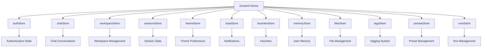

**Diagram sources**

- [authStore.ts](file://apps/frontend/src/store/authStore.ts)
- [chatStore.ts](file://apps/frontend/src/store/chatStore.ts)
- [workspaceStore.ts](file://apps/frontend/src/store/workspaceStore.ts)
- [sessionsStore.ts](file://apps/frontend/src/store/sessionsStore.ts)
- [themeStore.ts](file://apps/frontend/src/store/themeStore.ts)
- [toastStore.ts](file://apps/frontend/src/store/toastStore.ts)
- [favoritesStore.ts](file://apps/frontend/src/store/favoritesStore.ts)
- [memoryStore.ts](file://apps/frontend/src/store/memoryStore.ts)
- [filesStore.ts](file://apps/frontend/src/store/filesStore.ts)
- [tagsStore.ts](file://apps/frontend/src/store/tagsStore.ts)
- [presetsStore.ts](file://apps/frontend/src/store/presetsStore.ts)
- [runsStore.ts](file://apps/frontend/src/store/runsStore.ts)

**Section sources**

- [authStore.ts](file://apps/frontend/src/store/authStore.ts#L1-L151)
- [chatStore.ts](file://apps/frontend/src/store/chatStore.ts#L1-L415)
- [workspaceStore.ts](file://apps/frontend/src/store/workspaceStore.ts#L1-L126)

## Global State Management

WADI implements global state management through specialized Zustand stores that maintain application-wide state. These stores are designed to be accessed from any component in the application hierarchy.

### Authentication State

The `authStore` manages user authentication state including session information, user profile, and guest mode functionality. It uses Zustand's persist middleware to maintain state across page reloads.

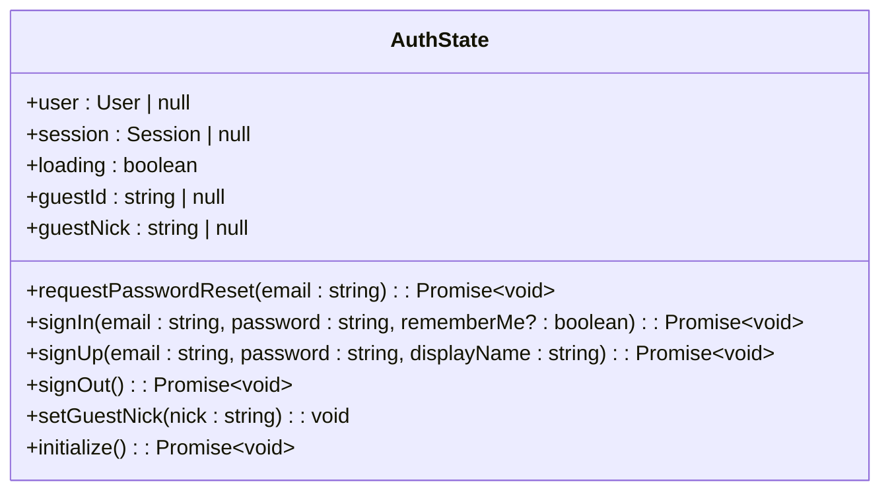

**Diagram sources**

- [authStore.ts](file://apps/frontend/src/store/authStore.ts#L6-L21)

### Theme and UI State

The `themeStore` manages application-wide theme preferences, including accent colors and other visual settings. This store demonstrates the use of Zustand's persist middleware for maintaining user preferences.

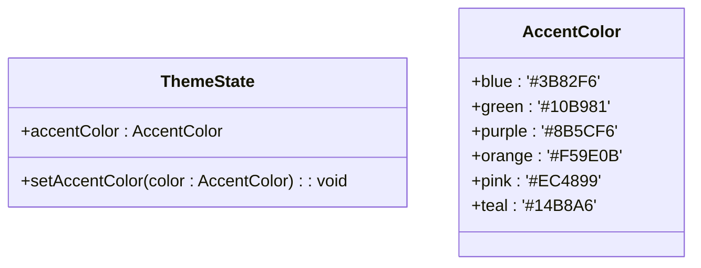

**Diagram sources**

- [themeStore.ts](file://apps/frontend/src/store/themeStore.ts#L6-L9)

### Workspace and Project State

The `workspaceStore` manages workspace-related state, including current workspace selection, member management, and workspace creation. This store maintains state for workspace operations and provides actions for workspace manipulation.

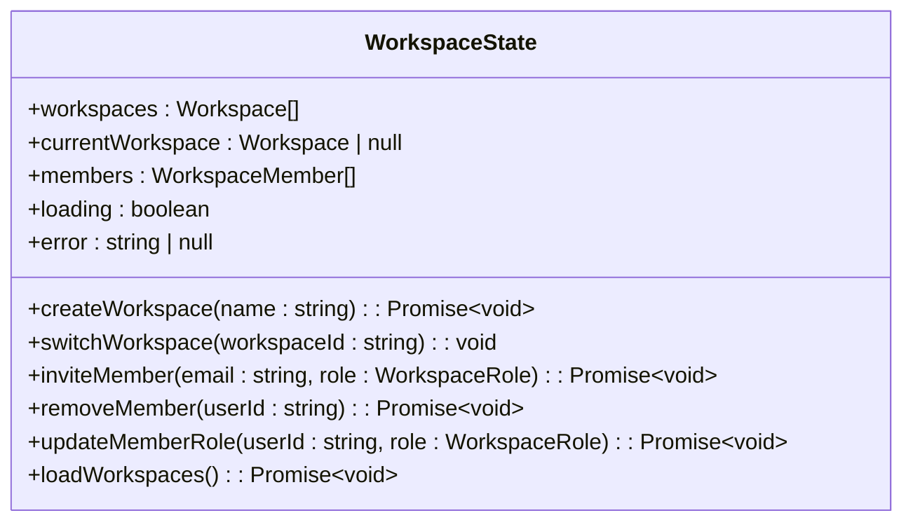

**Diagram sources**

- [workspaceStore.ts](file://apps/frontend/src/store/workspaceStore.ts#L5-L19)

**Section sources**

- [workspaceStore.ts](file://apps/frontend/src/store/workspaceStore.ts#L1-L126)
- [themeStore.ts](file://apps/frontend/src/store/themeStore.ts#L1-L31)

## Local Component State

While global state is managed through dedicated stores, WADI also implements local component state for UI-specific functionality and temporary data.

### Toast Notifications

The `toastStore` manages transient UI notifications that provide feedback to users about application events. This store demonstrates a pattern for managing ephemeral state that doesn't require persistence.

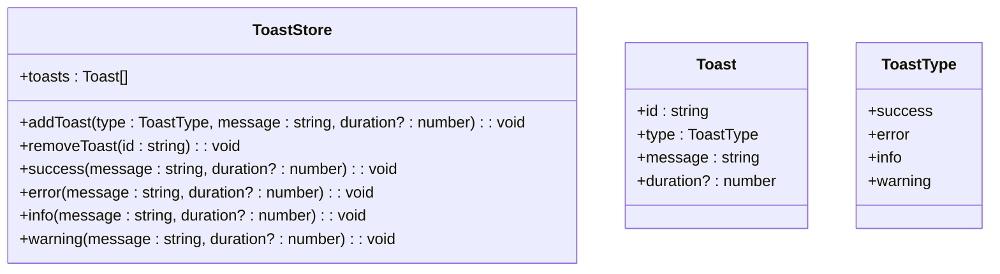

**Diagram sources**

- [toastStore.ts](file://apps/frontend/src/store/toastStore.ts#L12-L20)

### Form and Input State

Components in WADI manage their own local state for form inputs and temporary data that doesn't need to be shared across the application. This approach reduces unnecessary re-renders and keeps the global state focused on shared data.

**Section sources**

- [toastStore.ts](file://apps/frontend/src/store/toastStore.ts#L1-L65)
- [settingsStore.ts](file://_archived_root_src/store/settingsStore.ts)

## Server State Synchronization

WADI implements robust patterns for synchronizing client state with server state, ensuring data consistency across different clients and sessions.

### Chat State Synchronization

The `chatStore` manages the synchronization of chat conversations between the client and server, handling both authenticated users and guest mode interactions.

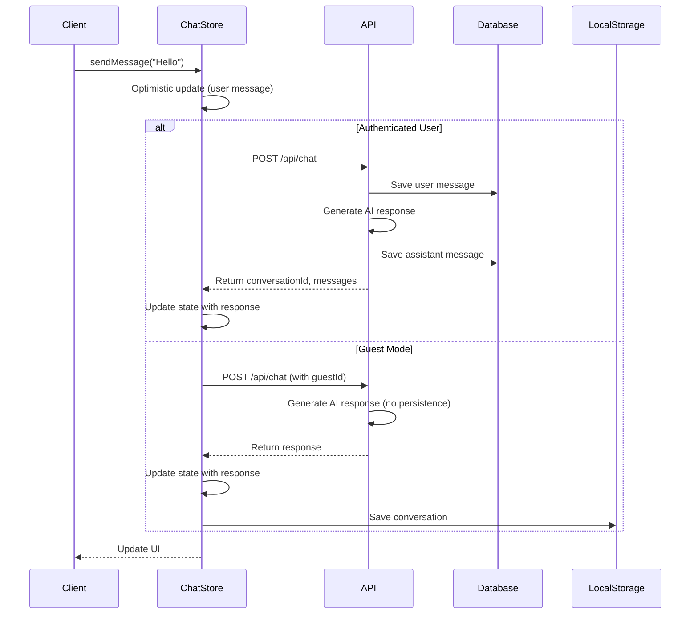

**Diagram sources**

- [chatStore.ts](file://apps/frontend/src/store/chatStore.ts#L7-L37)
- [chatController.ts](file://apps/api/src/controllers/chatController.ts#L20-L215)

### Real-time Updates with WebSockets

For authenticated users, WADI uses WebSockets to provide real-time updates for chat conversations, reducing latency and improving the user experience.

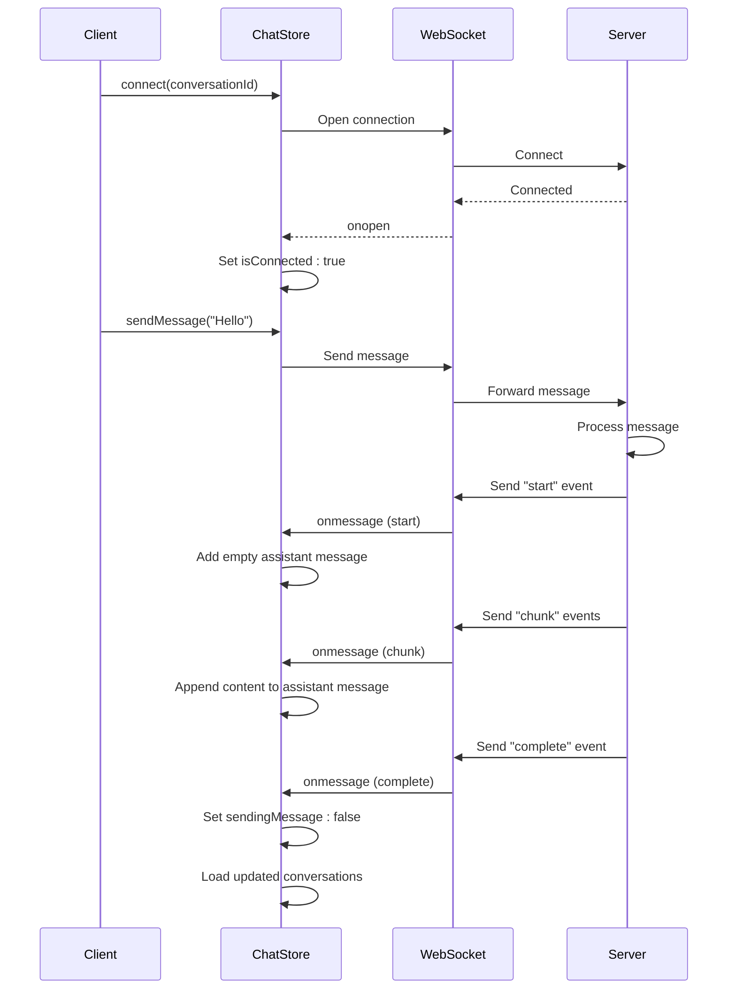

**Diagram sources**

- [chatStore.ts](file://apps/frontend/src/store/chatStore.ts#L53-L129)
- [chatController.ts](file://apps/api/src/controllers/chatController.ts#L20-L215)

**Section sources**

- [chatStore.ts](file://apps/frontend/src/store/chatStore.ts#L1-L415)
- [chatController.ts](file://apps/api/src/controllers/chatController.ts#L1-L457)

## Data Persistence Patterns

WADI implements different data persistence strategies based on user authentication status and data sensitivity.

### Persistent State for Authenticated Users

For authenticated users, application state is persisted to the Supabase database, ensuring data is available across devices and sessions.

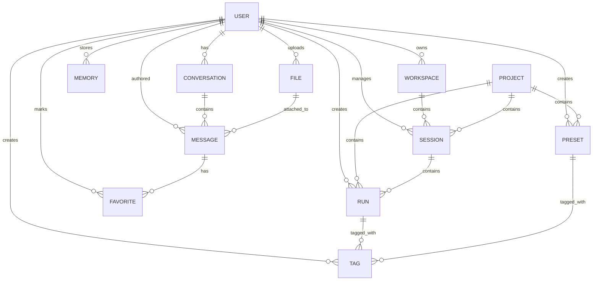

**Diagram sources**

- [chatController.ts](file://apps/api/src/controllers/chatController.ts#L48-L201)
- [chatStore.ts](file://apps/frontend/src/store/chatStore.ts#L342-L371)

### Transient State for Guest Users

For guest users, state is stored in the browser's localStorage, providing a temporary persistence mechanism that doesn't require authentication.

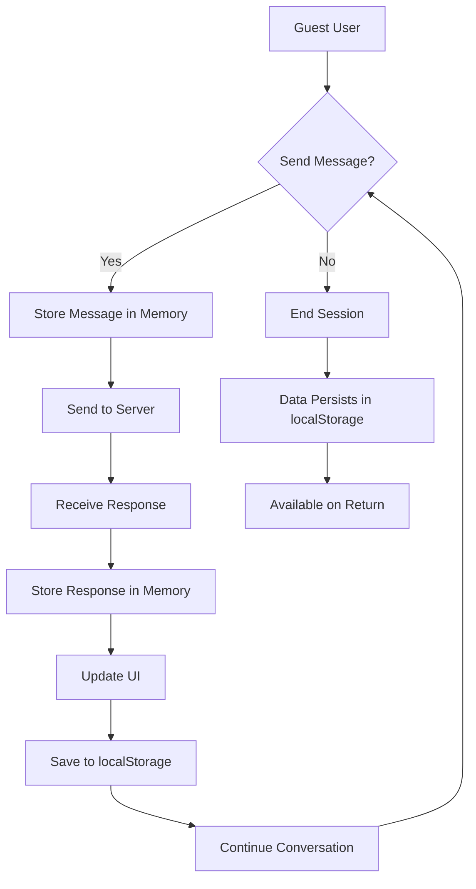

**Diagram sources**

- [chatStore.ts](file://apps/frontend/src/store/chatStore.ts#L163-L209)
- [chatController.ts](file://apps/api/src/controllers/chatController.ts#L111-L116)

**Section sources**

- [chatStore.ts](file://apps/frontend/src/store/chatStore.ts#L1-L415)
- [chatController.ts](file://apps/api/src/controllers/chatController.ts#L1-L457)

## Optimistic Updates

WADI implements optimistic updates to improve perceived performance and provide immediate feedback to users.

### Message Sending Optimization

When sending a message, the chat interface immediately updates with the user's message before receiving confirmation from the server.

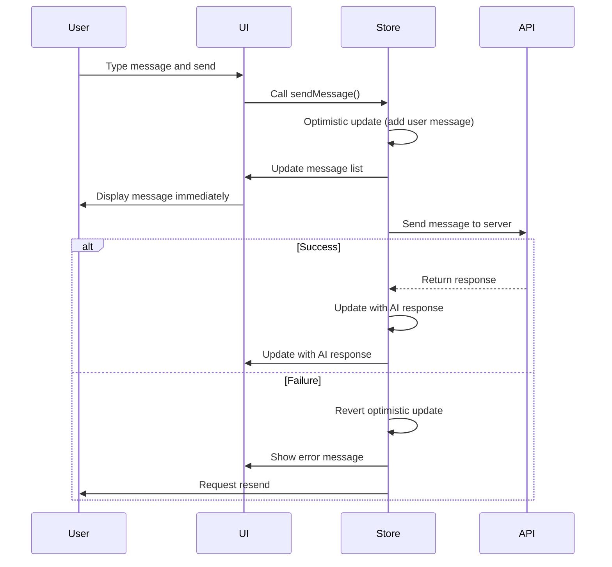

**Diagram sources**

- [chatStore.ts](file://apps/frontend/src/store/chatStore.ts#L148-L161)
- [sessionsStore.ts](file://apps/frontend/src/store/sessionsStore.ts#L156-L162)

### Session Management Optimization

When updating session state, WADI applies optimistic updates to provide immediate feedback while the server processes the request.

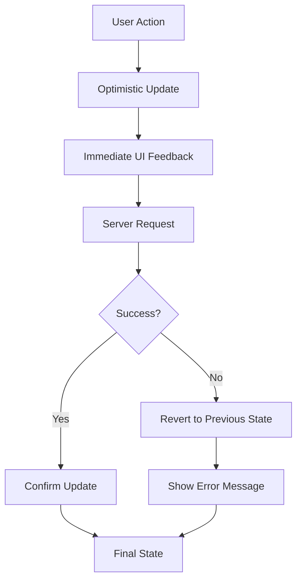

**Diagram sources**

- [sessionsStore.ts](file://apps/frontend/src/store/sessionsStore.ts#L156-L177)
- [tagsStore.ts](file://apps/frontend/src/store/tagsStore.ts#L137-L154)

**Section sources**

- [chatStore.ts](file://apps/frontend/src/store/chatStore.ts#L1-L415)
- [sessionsStore.ts](file://apps/frontend/src/store/sessionsStore.ts#L1-L251)
- [tagsStore.ts](file://apps/frontend/src/store/tagsStore.ts#L1-L291)

## Loading States and Error Handling

WADI implements comprehensive loading states and error handling to provide users with clear feedback about application status.

### Granular Loading States

Stores implement detailed loading states to provide specific feedback about ongoing operations.

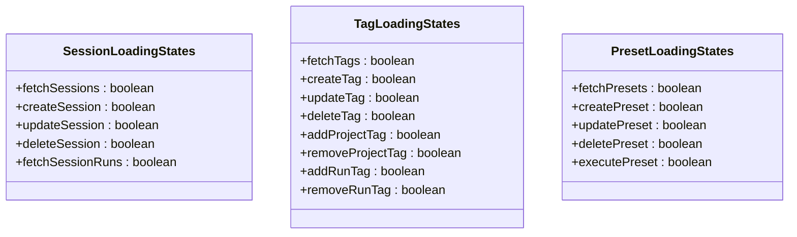

**Diagram sources**

- [sessionsStore.ts](file://apps/frontend/src/store/sessionsStore.ts#L17-L23)
- [tagsStore.ts](file://apps/frontend/src/store/tagsStore.ts#L13-L22)
- [presetsStore.ts](file://apps/frontend/src/store/presetsStore.ts#L21-L27)

### Structured Error Handling

The application implements structured error handling with retry capabilities and user-friendly error messages.

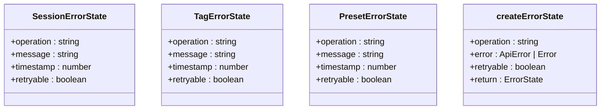

**Diagram sources**

- [sessionsStore.ts](file://apps/frontend/src/store/sessionsStore.ts#L25-L30)
- [tagsStore.ts](file://apps/frontend/src/store/tagsStore.ts#L24-L29)
- [presetsStore.ts](file://apps/frontend/src/store/presetsStore.ts#L29-L34)
- [sessionsStore.ts](file://apps/frontend/src/store/sessionsStore.ts#L64-L72)
- [tagsStore.ts](file://apps/frontend/src/store/tagsStore.ts#L67-L75)
- [presetsStore.ts](file://apps/frontend/src/store/presetsStore.ts#L83-L91)

**Section sources**

- [sessionsStore.ts](file://apps/frontend/src/store/sessionsStore.ts#L1-L251)
- [tagsStore.ts](file://apps/frontend/src/store/tagsStore.ts#L1-L291)
- [presetsStore.ts](file://apps/frontend/src/store/presetsStore.ts#L1-L256)

## State Management Best Practices

WADI follows several best practices for state management to ensure maintainability, performance, and user experience.

### Store Organization Principles

- **Single Responsibility**: Each store manages a specific domain of application state
- **State Colocation**: State is kept close to where it's used, with global state reserved for truly shared data
- **Immutability**: State updates use immutable patterns to prevent unintended side effects
- **Type Safety**: All stores use TypeScript interfaces to ensure type safety

### Performance Considerations

- **Selective Re-renders**: Components subscribe only to the specific state they need
- **Batched Updates**: Related state changes are batched to minimize re-renders
- **Memoization**: Computed values are memoized to avoid unnecessary calculations
- **Cleanup**: Stores implement cleanup methods to prevent memory leaks

### Data Synchronization Strategies

- **Immediate Feedback**: Optimistic updates provide immediate UI feedback
- **Error Recovery**: Failed operations revert to previous state with clear error messages
- **Conflict Resolution**: Server state takes precedence in case of conflicts
- **Offline Support**: Local state persists during network outages and syncs when connection is restored

**Section sources**

- [authStore.ts](file://apps/frontend/src/store/authStore.ts#L1-L151)
- [chatStore.ts](file://apps/frontend/src/store/chatStore.ts#L1-L415)
- [workspaceStore.ts](file://apps/frontend/src/store/workspaceStore.ts#L1-L126)
- [sessionsStore.ts](file://apps/frontend/src/store/sessionsStore.ts#L1-L251)
- [themeStore.ts](file://apps/frontend/src/store/themeStore.ts#L1-L31)
- [toastStore.ts](file://apps/frontend/src/store/toastStore.ts#L1-L65)
- [favoritesStore.ts](file://apps/frontend/src/store/favoritesStore.ts#L1-L134)
- [memoryStore.ts](file://apps/frontend/src/store/memoryStore.ts#L1-L134)
- [filesStore.ts](file://apps/frontend/src/store/filesStore.ts#L1-L188)
- [tagsStore.ts](file://apps/frontend/src/store/tagsStore.ts#L1-L291)
- [presetsStore.ts](file://apps/frontend/src/store/presetsStore.ts#L1-L256)
- [runsStore.ts](file://apps/frontend/src/store/runsStore.ts#L1-L234)
- [chatController.ts](file://apps/api/src/controllers/chatController.ts#L1-L457)
