# System Overview

<cite>
**Referenced Files in This Document**
- [README.md](file://README.md)
- [ARCHITECTURE_DEEP_DIVE.md](file://ARCHITECTURE_DEEP_DIVE.md)
- [apps/api/src/services/brain/kivo.ts](file://apps/api/src/services/brain/kivo.ts)
- [apps/api/src/services/brain/wadi.ts](file://apps/api/src/services/brain/wadi.ts)
- [apps/api/src/services/brain/types.ts](file://apps/api/src/services/brain/types.ts)
- [apps/api/src/controllers/chatController.ts](file://apps/api/src/controllers/chatController.ts)
- [apps/frontend/src/store/chatStore.ts](file://apps/frontend/src/store/chatStore.ts)
- [apps/frontend/src/pages/Chat.tsx](file://apps/frontend/src/pages/Chat.tsx)
- [apps/api/src/services/openai.ts](file://apps/api/src/services/openai.ts)
- [apps/api/package.json](file://apps/api/package.json)
- [apps/frontend/package.json](file://apps/frontend/package.json)
- [pnpm-workspace.yaml](file://pnpm-workspace.yaml)
- [apps/api/src/routes/chat.ts](file://apps/api/src/routes/chat.ts)
- [apps/frontend/src/config/api.ts](file://apps/frontend/src/config/api.ts)
</cite>

## Table of Contents
1. [Introduction](#introduction)
2. [Dual-Brain Architecture](#dual-brain-architecture)
3. [System Architecture Overview](#system-architecture-overview)
4. [Core Components](#core-components)
5. [Data Flow and Communication](#data-flow-and-communication)
6. [Frontend Architecture](#frontend-architecture)
7. [Backend Architecture](#backend-architecture)
8. [Shared Packages](#shared-packages)
9. [User Experience Flows](#user-experience-flows)
10. [Technical Implementation Details](#technical-implementation-details)
11. [Common Onboarding Questions](#common-onboarding-questions)
12. [Conclusion](#conclusion)

## Introduction

WADI is a modern, open-source AI conversational assistant built with a revolutionary **dual-brain architecture** that provides intelligent, context-aware conversations. The platform combines the power of artificial intelligence with a beautifully designed user interface, offering both guest mode accessibility and robust user authentication capabilities.

### Key Features

- **Dual-Brain Architecture**: Kivo (reasoning) + Wadi (execution)
- **Modern Dark UI**: Beautiful, accessible design with mobile responsiveness
- **Guest Mode**: No registration required for immediate use
- **Local Persistence**: Chat history saved in browser storage
- **Production Ready**: Complete deployment guides and monitoring
- **Real-time Communication**: WebSocket support for authenticated users

### Target Audience

WADI serves two primary user groups:
- **Beginners**: Users who want immediate access to AI assistance without registration
- **Advanced Users**: Power users requiring persistent conversations, sharing capabilities, and team collaboration features

## Dual-Brain Architecture

The heart of WADI's intelligence lies in its innovative dual-brain architecture, inspired by human cognitive processes. This design separates reasoning and execution into distinct but interconnected systems.

### Kivo: The Reasoning Engine

Kivo serves as the analytical component, responsible for understanding user intent and planning appropriate actions.

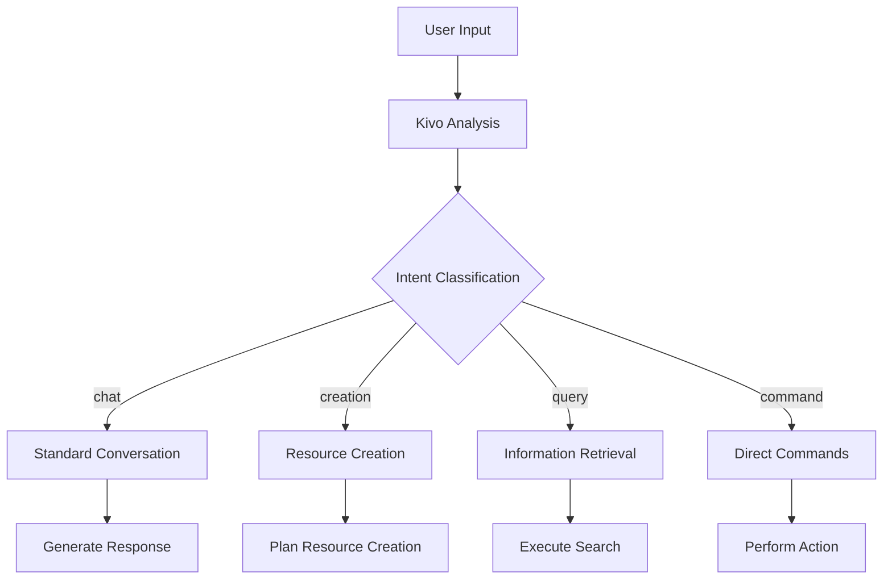

**Diagram sources**
- [apps/api/src/services/brain/kivo.ts](file://apps/api/src/services/brain/kivo.ts#L7-L41)
- [apps/api/src/services/brain/types.ts](file://apps/api/src/services/brain/types.ts#L54-L60)

#### Key Responsibilities:
- **Intent Analysis**: Classifies user requests into categories (chat, creation, query, command)
- **Context Evaluation**: Determines what additional information is needed
- **Confidence Scoring**: Evaluates certainty in analysis decisions
- **Action Planning**: Creates step-by-step execution plans

#### Current Implementation:
The current Kivo implementation uses heuristic-based pattern matching for intent detection. Future enhancements will incorporate LLM-powered analysis for improved accuracy.

### Wadi: The Execution Engine

Wadi handles the practical implementation of Kivo's plans, coordinating with external services and generating final responses.

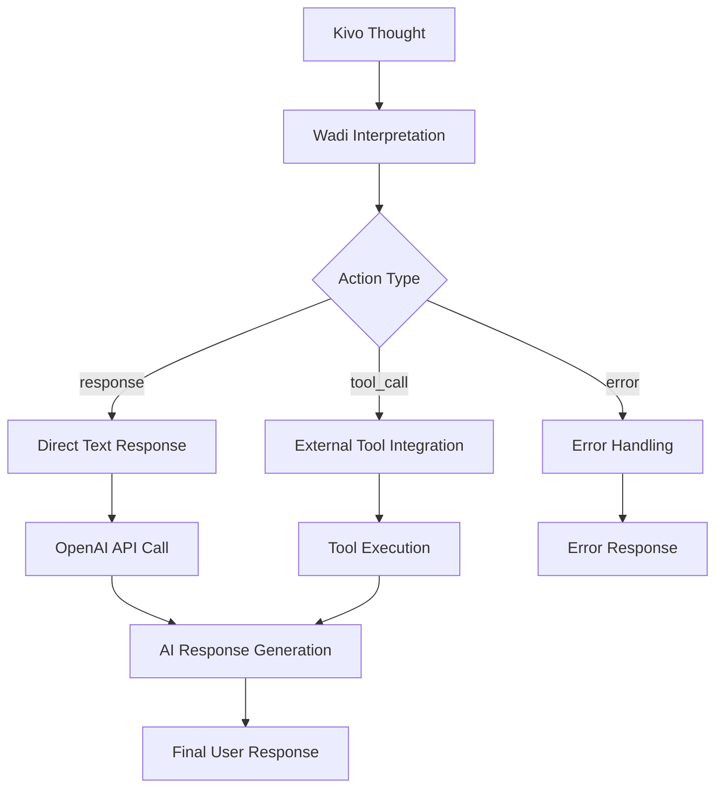

**Diagram sources**
- [apps/api/src/services/brain/wadi.ts](file://apps/api/src/services/brain/wadi.ts#L7-L43)
- [apps/api/src/services/brain/types.ts](file://apps/api/src/services/brain/types.ts#L62-L66)

#### Key Responsibilities:
- **Thought Processing**: Interprets Kivo's analytical output
- **Action Coordination**: Executes appropriate response mechanisms
- **Tool Management**: Interfaces with external services and APIs
- **Response Generation**: Creates final user-facing content

**Section sources**
- [ARCHITECTURE_DEEP_DIVE.md](file://ARCHITECTURE_DEEP_DIVE.md#L38-L132)
- [apps/api/src/services/brain/kivo.ts](file://apps/api/src/services/brain/kivo.ts#L1-L41)
- [apps/api/src/services/brain/wadi.ts](file://apps/api/src/services/brain/wadi.ts#L1-L43)

## System Architecture Overview

WADI follows a modern microservice architecture with clear separation of concerns across frontend, backend, and shared components.

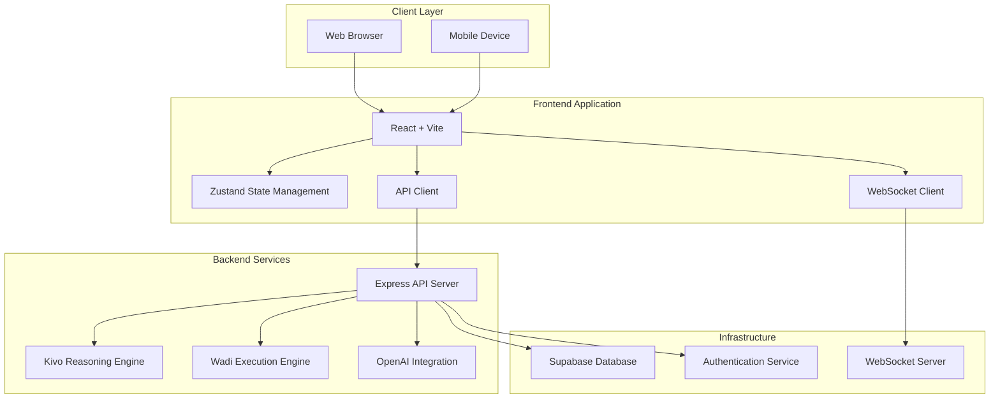

**Diagram sources**
- [apps/frontend/package.json](file://apps/frontend/package.json#L16-L32)
- [apps/api/package.json](file://apps/api/package.json#L14-L31)
- [pnpm-workspace.yaml](file://pnpm-workspace.yaml#L1-L7)

### Architectural Principles

1. **Separation of Concerns**: Clear boundaries between presentation, business logic, and data layers
2. **Microservice Design**: Independent, focused services that communicate through well-defined APIs
3. **Scalability**: Horizontal scaling capabilities through stateless service design
4. **Resilience**: Fault tolerance through circuit breakers, retries, and graceful degradation
5. **Observability**: Comprehensive logging, monitoring, and debugging capabilities

**Section sources**
- [README.md](file://README.md#L123-L150)
- [pnpm-workspace.yaml](file://pnpm-workspace.yaml#L1-L7)

## Core Components

### Frontend Components

The frontend is built with React 18 and Vite, utilizing modern web technologies for optimal performance and developer experience.

#### Chat Interface
The primary user interaction point featuring:
- **Message Bubbles**: Distinct styling for user and AI messages
- **Input Controls**: Rich text editing with character limits
- **Real-time Updates**: WebSocket-based live messaging
- **Mobile Responsiveness**: Adaptive layout for various screen sizes

#### State Management
Uses Zustand for lightweight, performant state management:
- **Chat State**: Conversation history and current session data
- **Auth State**: User authentication and session management
- **UI State**: Theme preferences, modal visibility, and loading states

#### WebSocket Integration
Real-time communication for authenticated users:
- **Connection Management**: Automatic reconnection with exponential backoff
- **Message Streaming**: Live response generation with incremental updates
- **Error Handling**: Graceful degradation when connections fail

### Backend Components

#### Express API Server
Handles all HTTP requests with comprehensive middleware:
- **Authentication Middleware**: Validates user sessions and guest tokens
- **Rate Limiting**: Protects against abuse with configurable limits
- **Error Handling**: Structured error responses with detailed logging
- **CORS Configuration**: Secure cross-origin resource sharing

#### Brain Services
The core AI processing engines:
- **Kivo Service**: Intent analysis and planning
- **Wadi Service**: Action execution and response generation
- **OpenAI Integration**: Seamless LLM interactions with multiple providers

#### Database Layer
Powered by Supabase for robust data management:
- **Conversations**: Persistent chat histories with metadata
- **Users**: Authentication and profile management
- **Files**: Attachment and media storage capabilities
- **Analytics**: Usage tracking and performance metrics

### Shared Package

The `@wadi/chat-core` package provides common functionality across the application:

#### Type Definitions
Consistent interfaces for:
- **Message Objects**: Standardized message structures
- **Conversation Models**: Conversation metadata and relationships
- **WebSocket Messages**: Real-time communication protocols
- **Brain Types**: Kivo and Wadi operation schemas

#### Utility Functions
Reusable helpers for:
- **API Communication**: Standardized HTTP client configuration
- **Data Validation**: Input sanitization and type checking
- **Error Handling**: Consistent error response formatting

**Section sources**
- [apps/frontend/src/store/chatStore.ts](file://apps/frontend/src/store/chatStore.ts#L1-L415)
- [apps/api/src/controllers/chatController.ts](file://apps/api/src/controllers/chatController.ts#L1-L457)
- [apps/api/src/services/openai.ts](file://apps/api/src/services/openai.ts#L1-L309)

## Data Flow and Communication

Understanding the complete data flow is crucial for grasping how WADI processes user interactions and generates responses.

### Guest Mode Flow

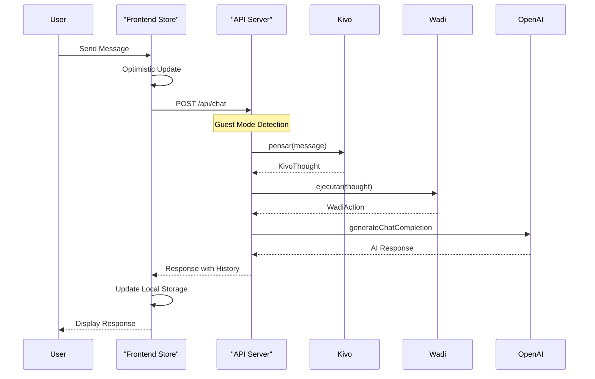

**Diagram sources**
- [apps/frontend/src/store/chatStore.ts](file://apps/frontend/src/store/chatStore.ts#L140-L209)
- [apps/api/src/controllers/chatController.ts](file://apps/api/src/controllers/chatController.ts#L20-L215)

### Authenticated User Flow

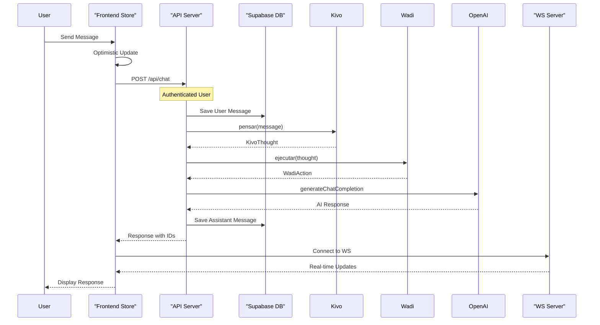

**Diagram sources**
- [apps/frontend/src/store/chatStore.ts](file://apps/frontend/src/store/chatStore.ts#L212-L287)
- [apps/api/src/controllers/chatController.ts](file://apps/api/src/controllers/chatController.ts#L45-L215)

### Error Handling and Recovery

Both flows include comprehensive error handling:

#### Network Errors
- **Retry Logic**: Automatic retry with exponential backoff
- **Timeout Handling**: Configurable timeouts with user feedback
- **Graceful Degradation**: Fallback to cached data when offline

#### Authentication Errors
- **Token Refresh**: Automatic session renewal
- **Redirect Handling**: Seamless re-authentication flow
- **Access Control**: Proper permission validation

#### API Errors
- **Structured Responses**: Consistent error formatting
- **User-Friendly Messages**: Translated error descriptions
- **Debug Information**: Developer-friendly logs in development

**Section sources**
- [apps/frontend/src/config/api.ts](file://apps/frontend/src/config/api.ts#L130-L287)
- [apps/api/src/controllers/chatController.ts](file://apps/api/src/controllers/chatController.ts#L215-L252)

## Frontend Architecture

The frontend employs a modern React architecture with performance optimization and user experience prioritization.

### Technology Stack

- **Framework**: React 18 with concurrent features
- **Build Tool**: Vite for fast development and builds
- **State Management**: Zustand for lightweight, performant state
- **Routing**: React Router for SPA navigation
- **Styling**: Inline styles with theme system
- **Animations**: Framer Motion for smooth transitions

### Component Architecture

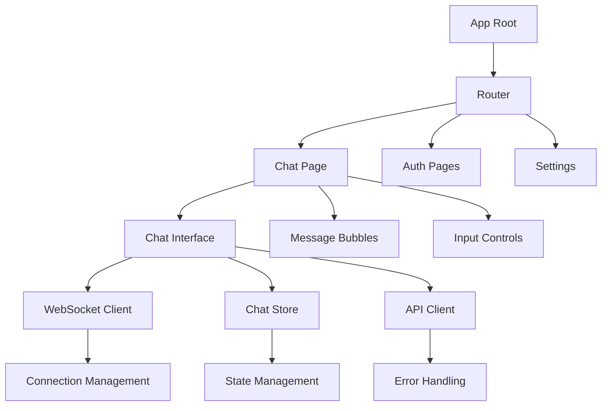

**Diagram sources**
- [apps/frontend/src/pages/Chat.tsx](file://apps/frontend/src/pages/Chat.tsx#L1-L402)
- [apps/frontend/src/store/chatStore.ts](file://apps/frontend/src/store/chatStore.ts#L39-L415)

### Performance Optimizations

#### Lazy Loading
- **Route-based Splitting**: Code splitting for different pages
- **Component Splitting**: Dynamic imports for heavy components
- **Asset Optimization**: Efficient bundling and compression

#### Memory Management
- **State Cleanup**: Automatic cleanup of unused state
- **Event Listener Management**: Proper cleanup of event handlers
- **WebSocket Connections**: Efficient connection lifecycle management

#### User Experience Enhancements
- **Optimistic Updates**: Immediate UI feedback before server confirmation
- **Loading States**: Clear indication of ongoing operations
- **Error Boundaries**: Preventing application crashes from component failures

**Section sources**
- [apps/frontend/package.json](file://apps/frontend/package.json#L16-L48)
- [apps/frontend/src/pages/Chat.tsx](file://apps/frontend/src/pages/Chat.tsx#L1-L402)

## Backend Architecture

The backend follows a layered architecture with clear separation between presentation, business logic, and data access layers.

### Technology Stack

- **Runtime**: Node.js 20+ for modern JavaScript features
- **Framework**: Express 5.x for robust HTTP server capabilities
- **Database**: Supabase (PostgreSQL) for reliable data persistence
- **Authentication**: Supabase Auth for secure user management
- **Real-time**: WebSocket support for live communication
- **Monitoring**: Winston for structured logging

### Service Layer Design

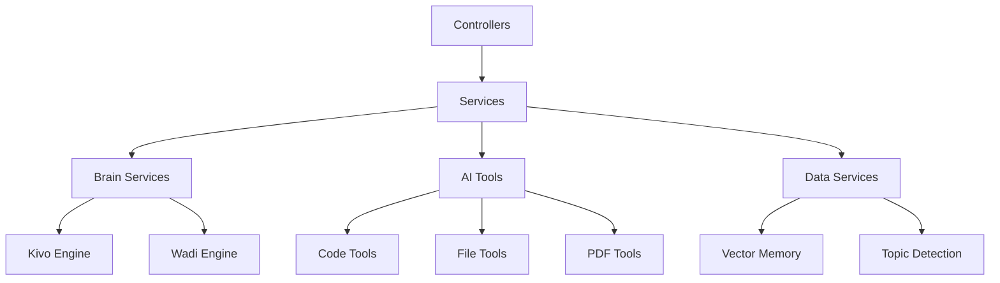

**Diagram sources**
- [apps/api/src/controllers/chatController.ts](file://apps/api/src/controllers/chatController.ts#L1-L457)
- [apps/api/src/services/brain/kivo.ts](file://apps/api/src/services/brain/kivo.ts#L1-L41)

### Middleware Architecture

#### Authentication Middleware
- **Session Validation**: JWT token verification
- **Guest Mode Support**: Alternative authentication for anonymous users
- **Permission Checking**: Role-based access control

#### Rate Limiting
- **Configurable Limits**: Adjustable thresholds per user type
- **Sliding Window**: Fair distribution of requests over time
- **Bypass Mechanisms**: Special handling for authenticated users

#### Error Handling
- **Centralized Error Processing**: Consistent error response formatting
- **Logging Integration**: Structured logging with correlation IDs
- **Health Monitoring**: Endpoint availability checks

### API Design

RESTful API with comprehensive documentation:
- **Resource-Oriented**: Clear URL structure following REST principles
- **Versioning**: Semantic versioning for API stability
- **Documentation**: OpenAPI specification for easy integration
- **Validation**: Input sanitization and type checking

**Section sources**
- [apps/api/package.json](file://apps/api/package.json#L14-L42)
- [apps/api/src/controllers/chatController.ts](file://apps/api/src/controllers/chatController.ts#L1-L457)

## Shared Packages

The shared package system ensures consistency and reduces duplication across the monorepo.

### Package Structure

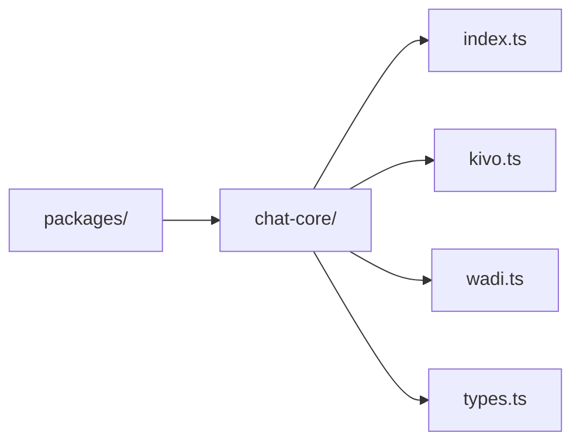

**Diagram sources**
- [packages/chat-core/index.ts](file://packages/chat-core/index.ts)
- [packages/chat-core/types.ts](file://packages/chat-core/types.ts#L1-L67)

### Benefits of Shared Packages

#### Type Safety
- **Consistent Interfaces**: Uniform type definitions across applications
- **Compile-Time Validation**: Early detection of type mismatches
- **Documentation**: Self-documenting code through TypeScript definitions

#### Code Reusability
- **Utility Functions**: Common helper methods
- **Configuration**: Shared environment and feature flags
- **Constants**: Centralized configuration values

#### Maintenance Efficiency
- **Single Source of Truth**: Changes propagate automatically
- **Testing Coverage**: Shared tests ensure consistent behavior
- **Version Control**: Coordinated releases across dependent packages

**Section sources**
- [packages/chat-core/types.ts](file://packages/chat-core/types.ts#L1-L67)
- [pnpm-workspace.yaml](file://pnpm-workspace.yaml#L1-L7)

## User Experience Flows

Understanding the complete user journey helps in designing intuitive interfaces and optimizing performance.

### First-Time Guest Experience

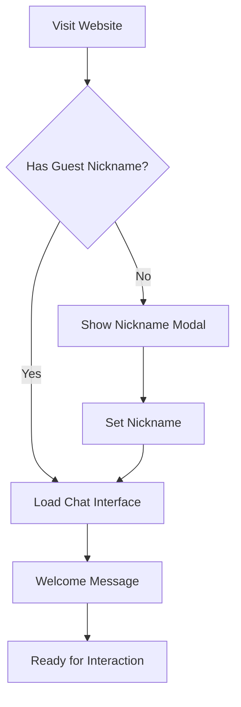

**Diagram sources**
- [apps/frontend/src/pages/Chat.tsx](file://apps/frontend/src/pages/Chat.tsx#L61-L86)

### Authenticated User Journey

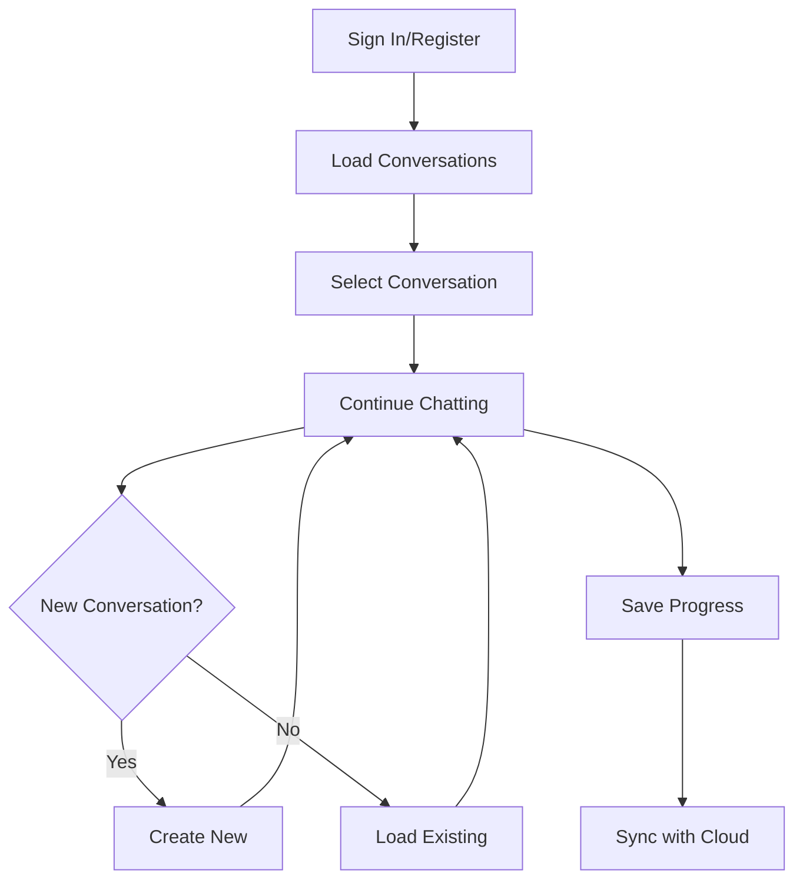

### Mobile Experience

The platform provides excellent mobile support with responsive design principles:

#### Touch Optimization
- **Large Tap Targets**: Minimum 44px touch areas
- **Gesture Support**: Swipe gestures for navigation
- **Keyboard Handling**: Adaptive layouts for virtual keyboards

#### Performance Considerations
- **Battery Optimization**: Efficient resource usage
- **Network Awareness**: Adaptive behavior for different connection types
- **Offline Capability**: Basic functionality without internet

**Section sources**
- [apps/frontend/src/pages/Chat.tsx](file://apps/frontend/src/pages/Chat.tsx#L61-L86)
- [apps/frontend/src/store/chatStore.ts](file://apps/frontend/src/store/chatStore.ts#L290-L341)

## Technical Implementation Details

### AI Integration

WADI integrates with multiple LLM providers for flexibility and reliability.

#### Provider Abstraction
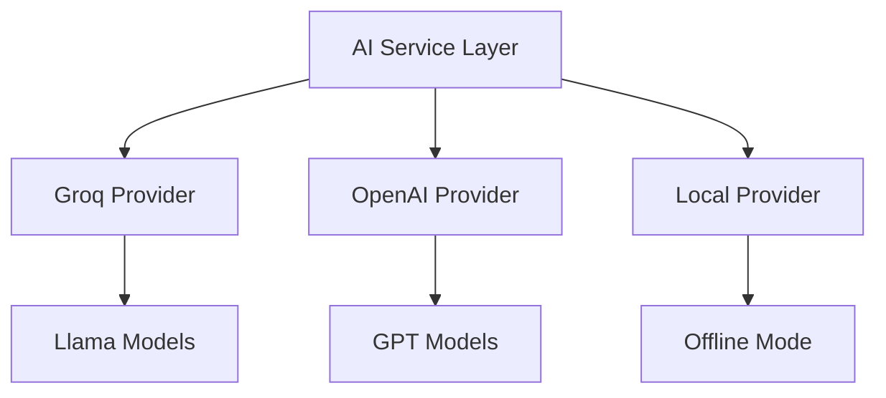

**Diagram sources**
- [apps/api/src/services/openai.ts](file://apps/api/src/services/openai.ts#L1-L309)

#### Model Management
- **Automatic Selection**: Intelligent model choice based on use case
- **Fallback Mechanisms**: Redundant providers for reliability
- **Performance Monitoring**: Model-specific performance tracking

### Database Schema

The Supabase schema supports comprehensive conversation management:

#### Core Tables
- **conversations**: Chat session metadata and organization
- **messages**: Individual message content and metadata
- **users**: User profiles and authentication data
- **files**: Attachment and media storage

#### Relationship Patterns
- **One-to-Many**: Conversations contain multiple messages
- **Many-to-Many**: Users can participate in multiple conversations
- **Hierarchical**: Nested conversations for thread-like discussions

### Security Implementation

#### Authentication Security
- **JWT Tokens**: Secure session management
- **Refresh Tokens**: Automatic token renewal
- **CSRF Protection**: Cross-site request forgery prevention
- **Rate Limiting**: Protection against brute force attacks

#### Data Protection
- **Encryption**: Data at rest and in transit encryption
- **Sanitization**: Input validation and XSS prevention
- **Audit Logging**: Comprehensive audit trails for compliance

**Section sources**
- [apps/api/src/services/openai.ts](file://apps/api/src/services/openai.ts#L1-L309)
- [apps/api/src/controllers/chatController.ts](file://apps/api/src/controllers/chatController.ts#L20-L215)

## Common Onboarding Questions

### Getting Started

**Q: How do I set up WADI locally?**
A: Follow the quick start guide in the README. You'll need Node.js 20+, pnpm, and API keys for OpenAI/Groq.

**Q: What's the difference between guest mode and authenticated mode?**
A: Guest mode allows immediate use without registration but stores data locally. Authenticated mode provides cloud synchronization and additional features.

### Architecture Questions

**Q: Why use a dual-brain architecture instead of a single LLM?**
A: The dual-brain approach enables more sophisticated reasoning and action planning, leading to better user experiences and more reliable outcomes.

**Q: How does WADI handle context in long conversations?**
A: The system maintains conversation context through message history management and intelligent summarization techniques.

### Technical Questions

**Q: Can I use my own LLM provider?**
A: Yes, the architecture supports multiple providers through the AI service abstraction layer.

**Q: How is data persisted?**
A: Authenticated users' data is stored in Supabase, while guests use local browser storage with automatic backup to the cloud upon sign-in.

### Deployment Questions

**Q: What are the deployment requirements?**
A: WADI can be deployed on Vercel for the frontend and Railway for the backend, with minimal configuration needed.

**Q: How do I scale WADI?**
A: The microservice architecture allows horizontal scaling of individual components based on demand.

## Conclusion

WADI represents a significant advancement in conversational AI platforms, combining cutting-edge dual-brain architecture with practical usability. The system's modular design, comprehensive feature set, and thoughtful user experience make it suitable for both casual users and enterprise applications.

### Key Strengths

1. **Innovative Architecture**: The dual-brain approach provides superior reasoning capabilities
2. **User-Centric Design**: Both guest and authenticated modes cater to different user needs
3. **Technical Excellence**: Modern technology stack with performance optimization
4. **Developer Experience**: Well-structured codebase with comprehensive documentation
5. **Scalability**: Microservice architecture supports growth and customization

### Future Roadmap

The platform continues evolving with planned enhancements including:
- **Streaming Responses**: Real-time message generation
- **Voice Interface**: Audio input and output capabilities
- **Plugin System**: Extensible functionality through third-party integrations
- **Team Collaboration**: Multi-user conversation features
- **Advanced Analytics**: Usage insights and performance metrics

WADI demonstrates that sophisticated AI capabilities can be delivered through clean, maintainable code while providing exceptional user experiences across multiple deployment scenarios.