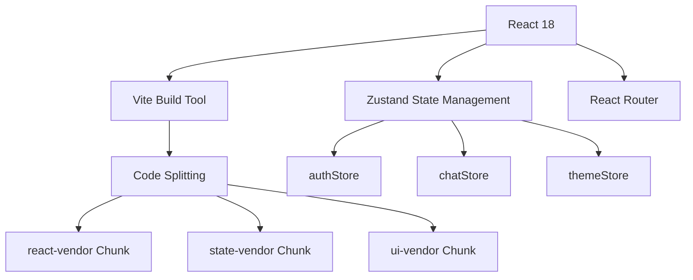
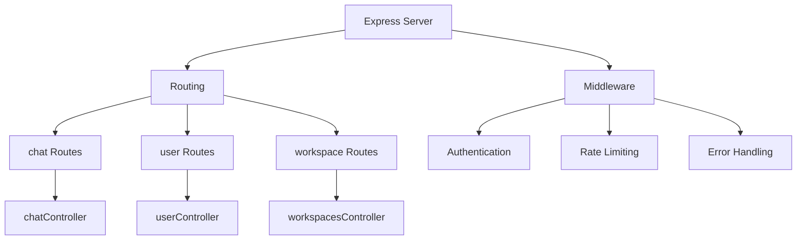
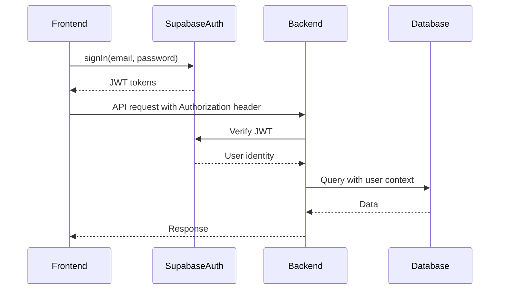
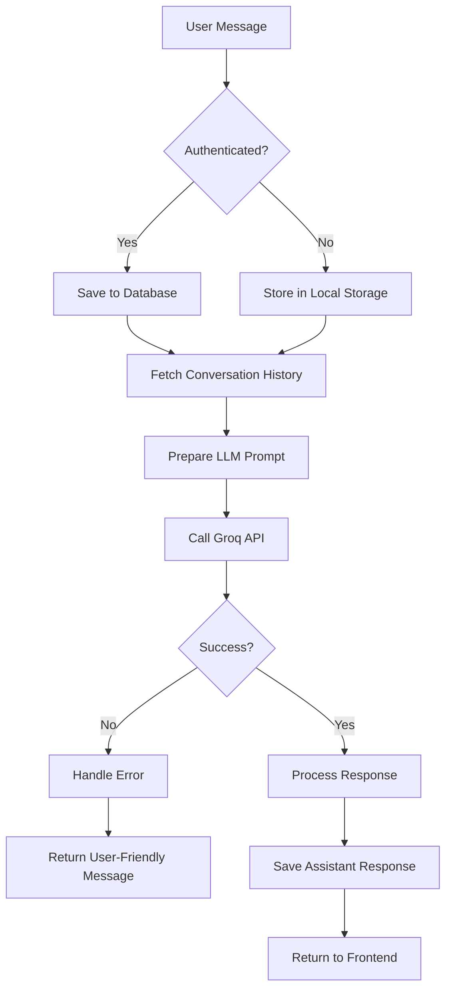
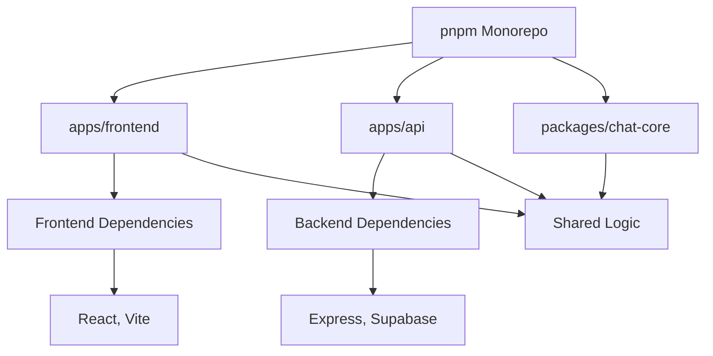
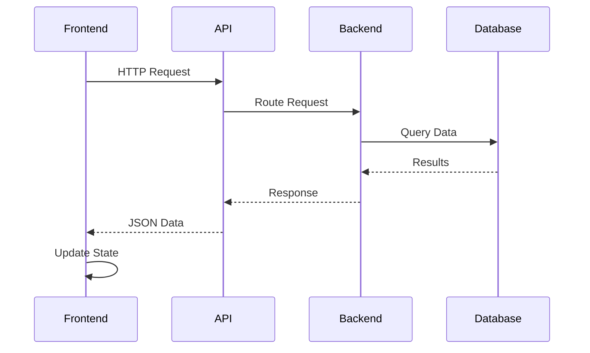

# Technology Stack

<cite>
**Referenced Files in This Document**   
- [package.json](file://package.json)
- [apps/frontend/package.json](file://apps/frontend/package.json)
- [apps/api/package.json](file://apps/api/package.json)
- [pnpm-workspace.yaml](file://pnpm-workspace.yaml)
- [apps/frontend/vite.config.ts](file://apps/frontend/vite.config.ts)
- [apps/api/src/config/supabase.ts](file://apps/api/src/config/supabase.ts)
- [apps/frontend/src/config/supabase.ts](file://apps/frontend/src/config/supabase.ts)
- [apps/api/src/services/openai.ts](file://apps/api/src/services/openai.ts)
- [apps/frontend/src/config/api.ts](file://apps/frontend/src/config/api.ts)
- [apps/api/tsconfig.json](file://apps/api/tsconfig.json)
- [packages/chat-core/package.json](file://packages/chat-core/package.json)
- [apps/frontend/src/store/authStore.ts](file://apps/frontend/src/store/authStore.ts)
- [apps/api/src/controllers/chatController.ts](file://apps/api/src/controllers/chatController.ts)
- [apps/frontend/src/pages/Chat.tsx](file://apps/frontend/src/pages/Chat.tsx)
- [apps/api/src/routes/chat.ts](file://apps/api/src/routes/chat.ts)
</cite>

## Table of Contents
1. [Introduction](#introduction)
2. [Core Technology Choices](#core-technology-choices)
3. [Frontend Architecture](#frontend-architecture)
4. [Backend Architecture](#backend-architecture)
5. [Database and Authentication](#database-and-authentication)
6. [AI Integration](#ai-integration)
7. [Monorepo Management](#monorepo-management)
8. [Integration Patterns](#integration-patterns)
9. [Performance Considerations](#performance-considerations)
10. [Best Practices](#best-practices)

## Introduction
The WADI application is built on a modern technology stack designed for scalability, maintainability, and developer productivity. This document provides a comprehensive overview of the technical foundation, explaining the rationale behind each technology choice and how they work together to create a cohesive ecosystem. The stack leverages TypeScript for type safety across both frontend and backend, React 18 with Vite for a fast and responsive user interface, Express for a robust API layer, Supabase for real-time database and authentication services, and OpenAI (via Groq) for advanced language generation capabilities. The entire codebase is managed as a monorepo using pnpm workspaces, enabling efficient code sharing and dependency management.

## Core Technology Choices
WADI's architecture is built around several key technology decisions that form the foundation of the application. TypeScript serves as the primary language for both frontend and backend development, providing strong typing, enhanced developer tooling, and improved code maintainability. The choice of TypeScript reduces runtime errors and makes the codebase more accessible to new developers by providing clear interfaces and type definitions. For the frontend, React 18 is used with the Vite build tool, offering a modern development experience with fast hot module replacement and optimized production builds. On the backend, Express provides a minimal and flexible framework for building the REST API, allowing for straightforward routing and middleware integration. These choices create a consistent development experience across the stack while leveraging the strengths of each technology.

**Section sources**
- [package.json](file://package.json)
- [apps/frontend/package.json](file://apps/frontend/package.json)
- [apps/api/package.json](file://apps/api/package.json)

## Frontend Architecture
The frontend of WADI is built using React 18, taking advantage of its concurrent rendering features for improved user experience. The application is structured as a single-page application with client-side routing managed by React Router. State management is handled using Zustand, a lightweight store solution that provides a simple API for managing global state without the complexity of larger frameworks. The UI components are organized in a modular fashion, with reusable components in the `components` directory and page-level components in the `pages` directory. Theming is implemented through a centralized theme configuration that supports both light and dark modes. The Vite build tool is configured with code splitting to optimize load times, creating separate chunks for major dependencies like React, state management, and UI libraries.

**Diagram sources**
- [apps/frontend/package.json](file://apps/frontend/package.json)
- [apps/frontend/vite.config.ts](file://apps/frontend/vite.config.ts)
- [apps/frontend/src/store/authStore.ts](file://apps/frontend/src/store/authStore.ts)

**Section sources**
- [apps/frontend/package.json](file://apps/frontend/package.json)
- [apps/frontend/vite.config.ts](file://apps/frontend/vite.config.ts)
- [apps/frontend/src/store/authStore.ts](file://apps/frontend/src/store/authStore.ts)

## Backend Architecture
The backend API is implemented using Express, a minimalist web framework for Node.js that provides a robust set of features for building web applications and APIs. The server is written in TypeScript and transpiled using ts-node-dev during development, enabling hot reloading and faster iteration. The API follows a RESTful design pattern with routes organized by resource type, such as chat, user, and workspace operations. Middleware functions handle cross-cutting concerns like authentication, rate limiting, and error handling. The controller pattern is used to separate route handling logic from business logic, with each route mapped to a specific controller function. The server is configured to run on Node.js 20 or higher, ensuring compatibility with modern JavaScript features and improved performance.

**Diagram sources**
- [apps/api/package.json](file://apps/api/package.json)
- [apps/api/src/routes/chat.ts](file://apps/api/src/routes/chat.ts)
- [apps/api/src/controllers/chatController.ts](file://apps/api/src/controllers/chatController.ts)

**Section sources**
- [apps/api/package.json](file://apps/api/package.json)
- [apps/api/tsconfig.json](file://apps/api/tsconfig.json)
- [apps/api/src/controllers/chatController.ts](file://apps/api/src/controllers/chatController.ts)

## Database and Authentication
WADI uses Supabase as its backend-as-a-service solution, providing both database and authentication capabilities. Supabase offers a PostgreSQL database with real-time capabilities, allowing for instant updates to be pushed to clients when data changes. The authentication system is built on Supabase Auth, which supports email/password login, password reset functionality, and guest mode access. User sessions are managed through JWT tokens, with refresh tokens used to maintain long-lived sessions. The frontend and backend both include Supabase client libraries, with the frontend using the official `@supabase/supabase-js` package and the backend using the same library to interact with the database directly. Environment variables are used to store configuration details, with separate variables for the frontend (prefixed with VITE_) and backend.

**Diagram sources**
- [apps/api/src/config/supabase.ts](file://apps/api/src/config/supabase.ts)
- [apps/frontend/src/config/supabase.ts](file://apps/frontend/src/config/supabase.ts)
- [apps/frontend/src/store/authStore.ts](file://apps/frontend/src/store/authStore.ts)

**Section sources**
- [apps/api/src/config/supabase.ts](file://apps/api/src/config/supabase.ts)
- [apps/frontend/src/config/supabase.ts](file://apps/frontend/src/config/supabase.ts)
- [apps/frontend/src/store/authStore.ts](file://apps/frontend/src/store/authStore.ts)

## AI Integration
The AI capabilities in WADI are powered by language models accessed through the Groq API, with an OpenAI-compatible interface. The backend includes a dedicated service module that abstracts the LLM interactions, providing functions for generating chat completions, handling streaming responses, and managing model selection. The system supports multiple models, with fallback mechanisms and model mapping to ensure compatibility. The AI service includes comprehensive error handling for common issues like rate limiting, authentication failures, and network connectivity problems. For authenticated users, the chat history is stored in the database and used as context for subsequent interactions, while guest users have their conversation history maintained in the client's local storage. The AI integration is designed to be modular, allowing for easy switching between different LLM providers if needed.

**Diagram sources**
- [apps/api/src/services/openai.ts](file://apps/api/src/services/openai.ts)
- [apps/api/src/controllers/chatController.ts](file://apps/api/src/controllers/chatController.ts)
- [apps/frontend/src/pages/Chat.tsx](file://apps/frontend/src/pages/Chat.tsx)

**Section sources**
- [apps/api/src/services/openai.ts](file://apps/api/src/services/openai.ts)
- [apps/api/src/controllers/chatController.ts](file://apps/api/src/controllers/chatController.ts)
- [apps/frontend/src/pages/Chat.tsx](file://apps/frontend/src/pages/Chat.tsx)

## Monorepo Management
WADI is structured as a monorepo using pnpm workspaces, which allows multiple packages and applications to be managed within a single repository. The workspace configuration defines the package structure, with applications in the `apps` directory and shared packages in the `packages` directory. This approach enables code sharing between the frontend and backend, such as the `chat-core` package that can be used by both applications. pnpm's efficient dependency management reduces disk usage and installation time by using hard links and a central store. The monorepo setup simplifies versioning and release management, as all packages can be updated and deployed together. Scripts in the root `package.json` file provide commands for running, building, and testing all applications simultaneously, streamlining the development workflow.

**Diagram sources**
- [package.json](file://package.json)
- [pnpm-workspace.yaml](file://pnpm-workspace.yaml)
- [packages/chat-core/package.json](file://packages/chat-core/package.json)

**Section sources**
- [package.json](file://package.json)
- [pnpm-workspace.yaml](file://pnpm-workspace.yaml)
- [packages/chat-core/package.json](file://packages/chat-core/package.json)

## Integration Patterns
The various components of WADI are integrated through well-defined patterns that ensure loose coupling and maintainability. The frontend communicates with the backend through a REST API, with all requests authenticated using JWT tokens. The API client in the frontend includes built-in retry logic, timeout handling, and automatic token refresh to provide a resilient user experience. Cross-cutting concerns like logging and error handling are implemented through middleware on both the frontend and backend. The state management system uses a store pattern with persistence, allowing user preferences and session data to survive page reloads. Environment-specific configuration is managed through environment variables, with different values for development, staging, and production environments. This layered approach to integration ensures that changes in one part of the system have minimal impact on other parts.

**Diagram sources**
- [apps/frontend/src/config/api.ts](file://apps/frontend/src/config/api.ts)
- [apps/api/src/routes/chat.ts](file://apps/api/src/routes/chat.ts)
- [apps/api/src/controllers/chatController.ts](file://apps/api/src/controllers/chatController.ts)

**Section sources**
- [apps/frontend/src/config/api.ts](file://apps/frontend/src/config/api.ts)
- [apps/api/src/routes/chat.ts](file://apps/api/src/routes/chat.ts)

## Performance Considerations
The WADI technology stack includes several performance optimizations to ensure a responsive user experience. On the frontend, Vite's build system implements code splitting to reduce initial load times, with critical code loaded first and non-essential components loaded on demand. The API client includes request batching, caching, and retry mechanisms to handle network variability gracefully. On the backend, Express middleware is used to implement rate limiting and request validation, preventing abuse and ensuring system stability. Database queries are optimized through indexing and the use of stored procedures for complex operations. The AI service includes streaming capabilities to provide incremental responses, reducing perceived latency for users. Monitoring and logging are implemented throughout the stack to identify performance bottlenecks and track system health.

**Section sources**
- [apps/frontend/vite.config.ts](file://apps/frontend/vite.config.ts)
- [apps/api/src/middleware/rateLimit.ts](file://apps/api/src/middleware/rateLimit)
- [apps/api/src/services/openai.ts](file://apps/api/src/services/openai.ts)

## Best Practices
The WADI codebase follows several best practices to ensure code quality and maintainability. TypeScript is used throughout the stack with strict mode enabled, catching potential errors at compile time. Code formatting is standardized using Prettier, and linting rules are enforced with ESLint to maintain consistent code style. The monorepo structure encourages code reuse and reduces duplication, with shared utilities and types extracted into dedicated packages. Comprehensive error handling is implemented at all levels of the application, with user-friendly messages returned for common issues. Security best practices are followed, including input validation, parameterized database queries, and secure storage of sensitive information. Documentation is maintained for key components and workflows, making it easier for new developers to understand the system architecture and contribute effectively.

**Section sources**
- [package.json](file://package.json)
- [apps/frontend/package.json](file://apps/frontend/package.json)
- [apps/api/package.json](file://apps/api/package.json)
- [apps/api/tsconfig.json](file://apps/api/tsconfig.json)