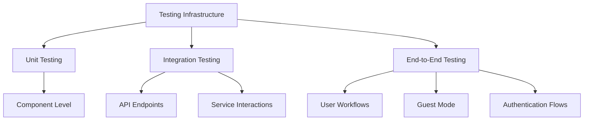
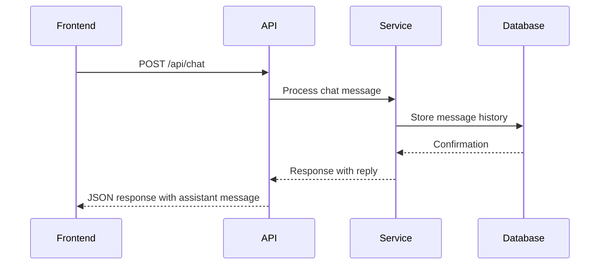
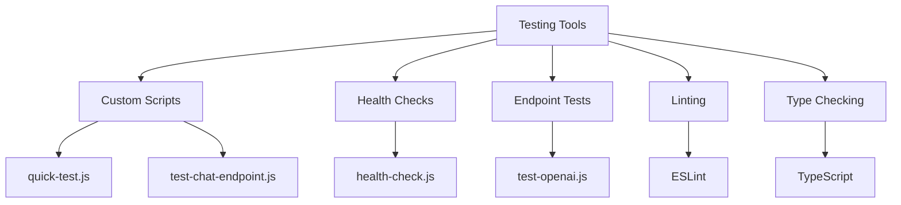
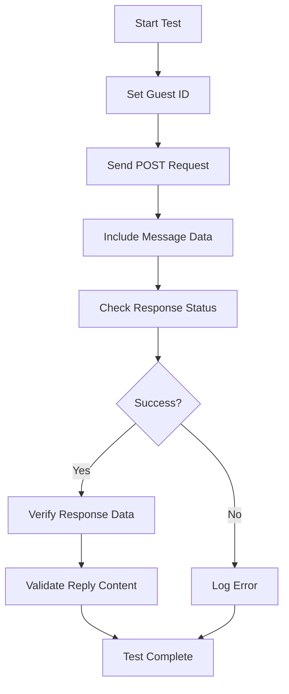

# Testing Strategy

<cite>
**Referenced Files in This Document**   
- [TESTING_GUIDE.md](file://TESTING_GUIDE.md)
- [package.json](file://package.json)
- [scripts/quick-test.js](file://scripts/quick-test.js)
- [scripts/test-chat-endpoint.js](file://scripts/test-chat-endpoint.js)
- [scripts/test-openai.js](file://scripts/test-openai.js)
- [scripts/test-run-creation.js](file://scripts/test-run-creation.js)
- [apps/frontend/package.json](file://apps/frontend/package.json)
- [apps/api/package.json](file://apps/api/package.json)
- [apps/frontend/vite.config.ts](file://apps/frontend/vite.config.ts)
- [apps/frontend/eslint.config.js](file://apps/frontend/eslint.config.js)
- [apps/api/tsconfig.json](file://apps/api/tsconfig.json)
</cite>

## Table of Contents

1. [Introduction](#introduction)
2. [Testing Infrastructure Overview](#testing-infrastructure-overview)
3. [Unit Testing Strategy](#unit-testing-strategy)
4. [Integration Testing Approach](#integration-testing-approach)
5. [End-to-End Testing Methodology](#end-to-end-testing-methodology)
6. [Testing Frameworks and Tools](#testing-frameworks-and-tools)
7. [Configuration and Setup](#configuration-and-setup)
8. [Test Coverage Requirements](#test-coverage-requirements)
9. [Best Practices for Test Maintenance](#best-practices-for-test-maintenance)
10. [Practical Testing Examples](#practical-testing-examples)
11. [Troubleshooting Common Issues](#troubleshooting-common-issues)

## Introduction

WADI implements a comprehensive quality assurance strategy that encompasses unit testing, integration testing, and end-to-end testing across both frontend and backend components. The testing approach is designed to ensure application reliability, maintain code quality, and facilitate continuous integration and deployment. This document outlines the testing frameworks, tools, methodologies, and best practices used in the WADI project, providing guidance for both beginners and experienced developers.

## Testing Infrastructure Overview

The WADI testing infrastructure consists of a combination of manual test scripts, automated verification tools, and configuration files that support a robust quality assurance process. The system includes dedicated test scripts for verifying core functionality, health checks, and specific endpoint behaviors. These tests are designed to validate both the frontend and backend components of the application, ensuring that all features work as expected in various scenarios.

**Diagram sources**

- [TESTING_GUIDE.md](file://TESTING_GUIDE.md)
- [scripts/quick-test.js](file://scripts/quick-test.js)

**Section sources**

- [TESTING_GUIDE.md](file://TESTING_GUIDE.md)
- [package.json](file://package.json)

## Unit Testing Strategy

While the current implementation primarily relies on integration and end-to-end tests, the foundation for unit testing is established through the project's modular architecture. The codebase is organized into discrete components and services that can be tested in isolation. The TypeScript configuration and linting rules support type safety and code quality, which are essential for effective unit testing. Future enhancements could include dedicated unit tests for individual functions, components, and utility methods to ensure their correctness in isolation.

**Section sources**

- [apps/frontend/eslint.config.js](file://apps/frontend/eslint.config.js)
- [apps/api/tsconfig.json](file://apps/api/tsconfig.json)

## Integration Testing Approach

WADI employs a robust integration testing strategy focused on verifying the interactions between different components and services. The testing suite includes specific scripts for testing API endpoints, service integrations, and data flow between frontend and backend systems. These tests validate that components work together as expected and that data is correctly processed and transmitted across the application layers.

**Diagram sources**

- [scripts/test-chat-endpoint.js](file://scripts/test-chat-endpoint.js)
- [apps/api/package.json](file://apps/api/package.json)

**Section sources**

- [scripts/test-chat-endpoint.js](file://scripts/test-chat-endpoint.js)
- [scripts/test-openai.js](file://scripts/test-openai.js)

## End-to-End Testing Methodology

The end-to-end testing methodology in WADI focuses on validating complete user workflows and application scenarios. The TESTING_GUIDE.md document provides a comprehensive manual testing protocol that covers various aspects of the application, including guest mode functionality, chat interface behavior, message persistence, and error handling. These tests simulate real user interactions and verify that the application behaves correctly from the user's perspective.

### Guest Mode Testing

The end-to-end tests for guest mode verify the complete user journey from initial visit to message persistence. This includes:

- Modal display for nickname input
- Local storage management for guest data
- Chat interface rendering with correct styling
- Message sending and receiving functionality
- History persistence across page reloads

### Chat Functionality Testing

The chat functionality tests validate the core messaging features of WADI, including:

- Message input validation and submission
- Real-time response rendering
- Loading state management
- Error handling for failed requests
- Conversation history maintenance

**Section sources**

- [TESTING_GUIDE.md](file://TESTING_GUIDE.md)
- [scripts/quick-test.js](file://scripts/quick-test.js)

## Testing Frameworks and Tools

WADI leverages a combination of testing frameworks and tools to ensure comprehensive test coverage. While the current implementation primarily uses custom test scripts, the project dependencies indicate support for industry-standard testing tools. The testing ecosystem includes:

- **Custom Test Scripts**: JavaScript-based test scripts for specific functionality verification
- **Health Check Tools**: Scripts for verifying backend and API health
- **Endpoint Testing**: Dedicated scripts for testing specific API endpoints
- **Linting and Type Checking**: ESLint and TypeScript for code quality and type safety

The project's package.json files reveal dependencies on modern JavaScript libraries and frameworks that support testing, including React, Express, and Supabase, which have extensive testing ecosystems.

**Diagram sources**

- [package.json](file://package.json)
- [scripts/quick-test.js](file://scripts/quick-test.js)

**Section sources**

- [package.json](file://package.json)
- [apps/frontend/package.json](file://apps/frontend/package.json)
- [apps/api/package.json](file://apps/api/package.json)

## Configuration and Setup

The testing configuration in WADI is managed through various configuration files and scripts that define the testing environment and execution parameters. The project uses Vite for frontend development, which includes built-in support for testing, and ts-node-dev for backend development with TypeScript. The eslint.config.js file contains rules that support code quality, while the tsconfig.json files configure TypeScript compilation for both frontend and backend components.

**Section sources**

- [apps/frontend/vite.config.ts](file://apps/frontend/vite.config.ts)
- [apps/frontend/eslint.config.js](file://apps/frontend/eslint.config.js)
- [apps/api/tsconfig.json](file://apps/api/tsconfig.json)

## Test Coverage Requirements

While explicit test coverage requirements are not defined in the current configuration files, the testing strategy emphasizes comprehensive validation of core functionality. The quick-test.js script verifies three critical aspects of the application:

1. Backend health and connectivity
2. API health endpoint accessibility
3. Guest message sending functionality

These tests serve as a minimum viability check for the application, ensuring that essential features are working before deployment. Additional manual tests in the TESTING_GUIDE.md document cover a broader range of functionality, including UI components, user interactions, and edge cases.

**Section sources**

- [scripts/quick-test.js](file://scripts/quick-test.js)
- [TESTING_GUIDE.md](file://TESTING_GUIDE.md)

## Best Practices for Test Maintenance

WADI follows several best practices for maintaining a robust test suite:

1. **Modular Test Scripts**: Each test script focuses on a specific aspect of functionality, making them easier to maintain and update.
2. **Clear Test Output**: Test scripts provide detailed output with color-coded results to quickly identify success or failure.
3. **Environment Independence**: Tests are designed to work with the local development environment, making them accessible to all team members.
4. **Comprehensive Documentation**: The TESTING_GUIDE.md document provides detailed instructions for manual testing, ensuring consistency across test executions.
5. **Error Handling**: Test scripts include robust error handling to provide meaningful feedback when tests fail.

These practices ensure that the test suite remains effective and maintainable as the application evolves.

**Section sources**

- [scripts/quick-test.js](file://scripts/quick-test.js)
- [TESTING_GUIDE.md](file://TESTING_GUIDE.md)

## Practical Testing Examples

The WADI codebase includes several practical examples of testing implementations that demonstrate how to verify key features:

### Chat Functionality Testing

The test-chat-endpoint.js script provides a complete example of how to test the chat functionality:

**Diagram sources**

- [scripts/test-chat-endpoint.js](file://scripts/test-chat-endpoint.js)

### User Authentication Testing

While not explicitly implemented in the current test scripts, the authentication flow can be tested by:

1. Simulating guest user creation
2. Verifying localStorage storage of guest data
3. Testing message persistence across sessions
4. Validating authentication headers in API requests

**Section sources**

- [scripts/test-chat-endpoint.js](file://scripts/test-chat-endpoint.js)
- [TESTING_GUIDE.md](file://TESTING_GUIDE.md)

## Troubleshooting Common Issues

The WADI testing documentation includes guidance for troubleshooting common issues that may arise during testing:

### Backend Connectivity Issues

When the backend is not responding:

- Verify that the backend is running using `pnpm dev:api`
- Check that port 4000 is available
- Ensure the OPENAI_API_KEY is correctly configured in the .env file

### Frontend Loading Problems

When the frontend fails to load:

- Verify that the frontend is running using `pnpm dev:front`
- Check that port 5173 is available
- Clear the browser cache using Ctrl+Shift+R

### CORS Errors

When encountering CORS errors:

- Verify that FRONTEND_URL=http://localhost:5173 is set in the backend .env file
- Restart the backend server to apply configuration changes

### OpenAI Integration Issues

When OpenAI is not responding:

- Verify the API key in apps/api/.env
- Check that the OpenAI account has sufficient credits
- Monitor the backend console for error messages

**Section sources**

- [TESTING_GUIDE.md](file://TESTING_GUIDE.md)
- [scripts/quick-test.js](file://scripts/quick-test.js)
